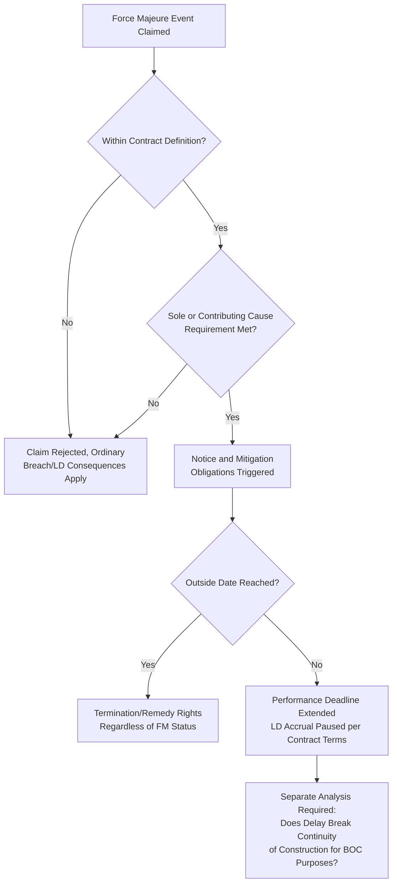
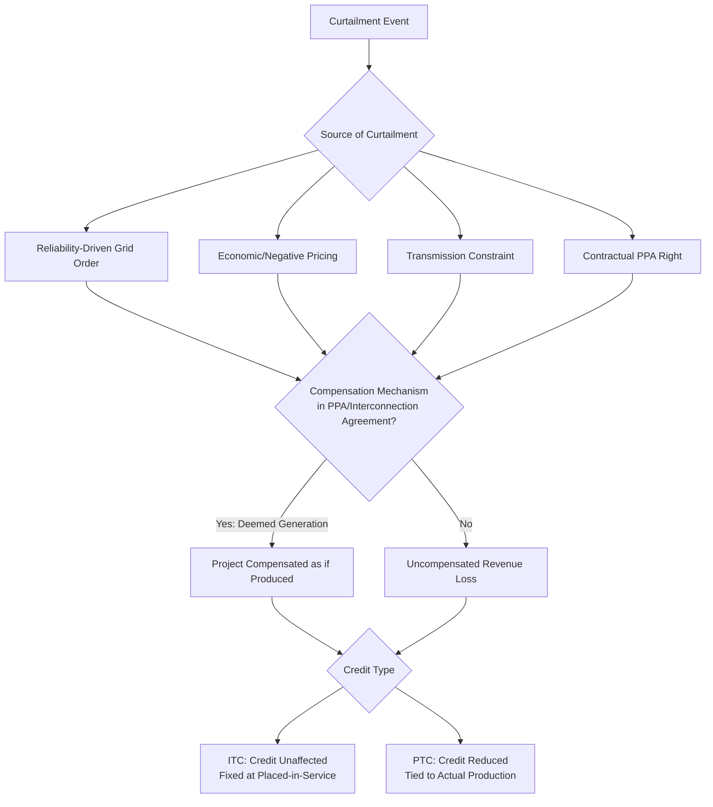

## Force Majeure and Curtailment Risk

### Overview and Position Within the Risk Allocation Chapter

Force majeure and curtailment risk addresses two related but distinct categories of exposure in a tax equity transaction: **force majeure** (an unforeseen, uncontrollable event that prevents or delays contractual performance — construction completion, interconnection, or operation) and **curtailment** (the reduction or suspension of a project's electricity output or delivery, typically directed by a grid operator, transmission owner, or off-taker for grid reliability, congestion, or economic dispatch reasons, without the project itself being physically incapable of producing). Both risks threaten the revenue and, in some cases, the tax-qualification assumptions underlying the deal, but they operate through different mechanisms and are allocated through different contractual tools. This topic connects directly to Construction and Completion Risk (force majeure during the construction period) and to the broader indemnification and insurance framework covered elsewhere in this chapter, since neither force majeure nor curtailment losses are typically addressed through indemnities alone.

---

### Force Majeure Risk

**Definition and Typical Triggering Events**

A force majeure clause excuses a party's non-performance (or extends its performance deadline) when performance is prevented by an event outside that party's reasonable control. Commonly enumerated categories include:

- Natural events (severe weather, earthquake, flood, wildfire)
- Acts of government (new law, regulation, permitting denial, expropriation)
- War, terrorism, civil unrest
- Labor disputes/strikes (often narrowed to those not caused by the claiming party)
- Epidemic/pandemic (a category that gained significant drafting attention and specificity following COVID-19-era disputes)
- Equipment or supply chain failures beyond the claiming party's control (increasingly scrutinized for overlap with ordinary supply chain/procurement risk, discussed below)

**Key Drafting Variables Diligence Should Confirm**

- **Breadth of the definition** — an overly broad, non-exhaustive force majeure clause (e.g., "any event beyond the party's reasonable control") can effectively convert a fixed completion date or performance obligation into a soft target, undermining the risk-transfer value of a guaranteed completion date discussed in Construction and Completion Risk.
- **Causation requirement** — whether the clause requires the event to be the *sole* cause of non-performance, or merely *a* contributing cause, materially affects how easily a party can invoke it.
- **Notice and mitigation obligations** — most well-drafted clauses require prompt notice of the claimed event and an ongoing obligation to use commercially reasonable efforts to mitigate and resume performance; diligence should confirm these obligations are not merely aspirational but tied to specific timeframes.
- **Carve-outs for foreseeable or self-inflicted events** — confirm the clause excludes events that were reasonably foreseeable at contract signing or that resulted from the claiming party's own action or inaction (e.g., failure to timely order long-lead-time equipment).
- **Interaction with liquidated damages** — confirm whether a valid force majeure claim merely extends the completion deadline (pausing LD accrual) or eliminates LD exposure entirely for the delay period, since these produce very different economic outcomes for the investor.
- **Outside date / long-stop provisions** — even a valid, ongoing force majeure event typically should not extend a completion deadline indefinitely; diligence should confirm an ultimate outside date exists beyond which the investor (or a lender) may terminate or exercise remedies regardless of the continuing force majeure event.

**Interaction With Tax Qualification Timing**

Force majeure delay during construction directly threatens the beginning-of-construction continuity requirement discussed in Construction and Completion Risk: a force majeure event that halts construction activity for an extended period risks breaking the continuity of construction (or continuity safe harbor) needed to preserve the project's original BOC vintage. [Inference] Because IRS continuity guidance generally evaluates the facts and circumstances of a delay rather than applying a bright-line automatic excuse for any force majeure event, sponsors should not assume that a force majeure clause in a commercial contract automatically preserves the tax-side continuity position — the two determinations are governed by different bodies of law and should be diligenced separately, with contemporaneous documentation maintained specifically to support the continuity argument regardless of what the commercial contract's force majeure clause says.

---

### Curtailment Risk

**Definition and Sources**

Curtailment occurs when a grid operator, transmission provider, or off-taker directs a project to reduce or cease output despite the project being physically capable of producing at full capacity. Common curtailment drivers include:

- **Reliability-driven curtailment** — grid operator action to maintain system stability (e.g., during oversupply conditions, particularly common for solar and wind given their variable, often coincident generation profiles)
- **Economic curtailment** — negative or near-zero locally marginal pricing conditions that make dispatch uneconomic, directed or incentivized through market mechanisms rather than a formal reliability order
- **Transmission constraint curtailment** — insufficient transmission capacity to deliver output from the point of interconnection to load, particularly acute for projects in high-penetration renewable regions or those awaiting network upgrades
- **Contractual curtailment** — an off-taker exercising a contractual right to reduce or suspend purchase obligations under specified conditions in the power purchase agreement (PPA)

**Revenue Impact and Risk Allocation Mechanisms**

Curtailment risk allocation is primarily a PPA and interconnection agreement drafting issue, not a tax equity partnership agreement issue directly, but it flows through to tax equity economics because curtailment affects the revenue base the investor's return model relies on:

- **Curtailment compensation provisions** in a PPA may require the off-taker or grid operator to compensate the project for curtailed energy (common in some jurisdictions/market structures, absent in others) — diligence should confirm whether the specific PPA and market structure include such compensation and, if so, under what conditions it applies or is capped.
- **"Deemed generation" or "deemed output" clauses** — mechanisms crediting the project as if it had generated and been paid for curtailed energy, shifting the economic burden of curtailment to the off-taker or grid operator rather than the project.
- **Interconnection agreement curtailment provisions** — confirm whether the interconnecting utility bears any compensation obligation for transmission-constraint curtailment, or whether this risk is borne entirely by the project.
- **Revenue model sensitivity** — diligence should confirm the investor's underwriting model incorporates a realistic curtailment assumption (based on historical grid data for the specific interconnection point/zone) rather than assuming zero curtailment, since underestimating curtailment risk directly overstates projected revenue used to size the tax equity investment.

**Distinction From Production Tax Credit Mechanics**

For PTC-eligible projects (§45, §45Y), curtailment has a direct and important interaction with credit generation: because the PTC is earned based on electricity actually produced and sold (or, under certain program design, metered), curtailed energy that is never generated or sold generally does not generate PTC value, unlike ITC-eligible projects where the credit is fixed at placed-in-service based on cost basis and is not sensitive to ongoing output levels. [Inference] This means curtailment risk is likely to be underwritten more conservatively for PTC-heavy deals than for ITC-heavy deals, since curtailment in a PTC structure directly reduces the credit stream itself and not merely the cash revenue stream, though the specific modeling approach used by any given tax equity investor should be confirmed directly rather than assumed uniform across the market.

---

### Illustrative Risk Comparison (svg_diagram)

<svg xmlns="http://www.w3.org/2000/svg" viewBox="0 0 800 340">
<text x="400" y="26" text-anchor="middle" font-size="18" font-weight="bold" fill="#1a1a1a">Force Majeure vs. Curtailment Risk Comparison (svg_diagram)</text>
<rect x="40" y="55" width="340" height="240" rx="6" fill="#e8f0fe" stroke="#4a6fa5" />
<text x="210" y="80" text-anchor="middle" font-size="14" font-weight="bold" fill="#1a1a1a">Force Majeure</text>
<text x="210" y="105" text-anchor="middle" font-size="11" fill="#333">Prevents performance entirely</text>
<text x="210" y="123" text-anchor="middle" font-size="11" fill="#333">Governed by commercial contract clause</text>
<text x="210" y="141" text-anchor="middle" font-size="11" fill="#333">Primarily construction-phase concern</text>
<text x="210" y="159" text-anchor="middle" font-size="11" fill="#333">Threatens BOC continuity separately</text>
<text x="210" y="177" text-anchor="middle" font-size="11" fill="#333">Mitigant: outside dates, notice/mitigation duties</text>
<text x="210" y="200" text-anchor="middle" font-size="11" fill="#333" font-style="italic">Affects: schedule, LD exposure,</text>
<text x="210" y="216" text-anchor="middle" font-size="11" fill="#333" font-style="italic">continuity-of-construction position</text>
<rect x="420" y="55" width="340" height="240" rx="6" fill="#fff4e5" stroke="#c98a2c" />
<text x="590" y="80" text-anchor="middle" font-size="14" font-weight="bold" fill="#1a1a1a">Curtailment</text>
<text x="590" y="105" text-anchor="middle" font-size="11" fill="#333">Project capable but directed to reduce output</text>
<text x="590" y="123" text-anchor="middle" font-size="11" fill="#333">Governed by PPA/interconnection agreement</text>
<text x="590" y="141" text-anchor="middle" font-size="11" fill="#333">Primarily operational-phase concern</text>
<text x="590" y="159" text-anchor="middle" font-size="11" fill="#333">Directly reduces PTC value if uncompensated</text>
<text x="590" y="177" text-anchor="middle" font-size="11" fill="#333">Mitigant: deemed generation clauses</text>
<text x="590" y="200" text-anchor="middle" font-size="11" fill="#333" font-style="italic">Affects: revenue model, PTC stream;</text>
<text x="590" y="216" text-anchor="middle" font-size="11" fill="#333" font-style="italic">generally does not affect ITC amount</text>
</svg>

---

### Diligence Checklist

| Diligence Area | Key Question |
| --- | --- |
| Force majeure breadth | Is the definition an exhaustive list or an open-ended catch-all? |
| Causation standard | Does the clause require sole cause or merely a contributing cause? |
| Mitigation obligation | Is there a concrete, time-bound duty to mitigate and resume performance? |
| Outside date | Does an ultimate long-stop date exist regardless of continuing force majeure? |
| LD interaction | Does force majeure pause LD accrual or eliminate LD exposure entirely for the delay period? |
| Continuity-of-construction impact | Is contemporaneous documentation maintained independent of the commercial force majeure claim? |
| Curtailment compensation | Does the PPA or interconnection agreement include a deemed generation or compensation mechanism? |
| Revenue model curtailment assumption | Is the underwriting model based on actual historical curtailment data for the specific interconnection point? |
| Credit-type sensitivity | Has the diligence team distinguished ITC exposure (largely insensitive to curtailment) from PTC exposure (directly reduced by curtailment)? |

---

**Related Topics**

- Construction and Completion Risk (Force Majeure Interaction With EPC Completion Guarantees)
- Beginning of Construction Safe Harbors and Continuity of Construction Requirements
- Indemnification Structures Between Sponsor and Investor (Force Majeure Carve-Outs From Indemnity Triggers)
- Power Purchase Agreement Structuring and Deemed Generation Clauses
- Interconnection Agreement Risk Allocation and Transmission Constraint Management
- Revenue Model Sensitivity Analysis for PTC-Eligible Projects
- Insurance and Credit Support Review (Business Interruption Coverage as a Curtailment-Adjacent Mitigant)
- Change-in-Law Risk and Legislative Uncertainty (Government Action as a Force Majeure Trigger)