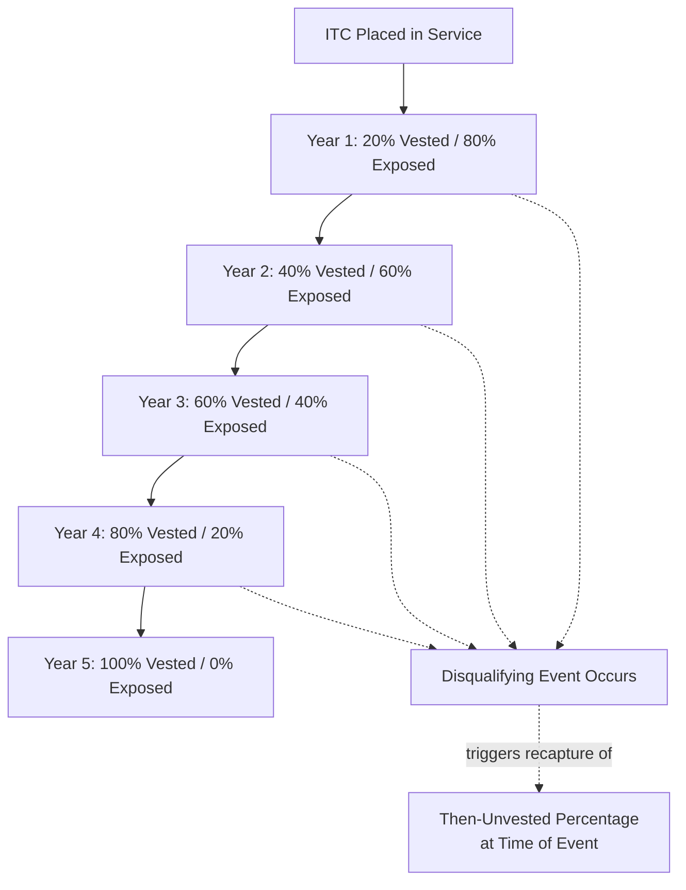
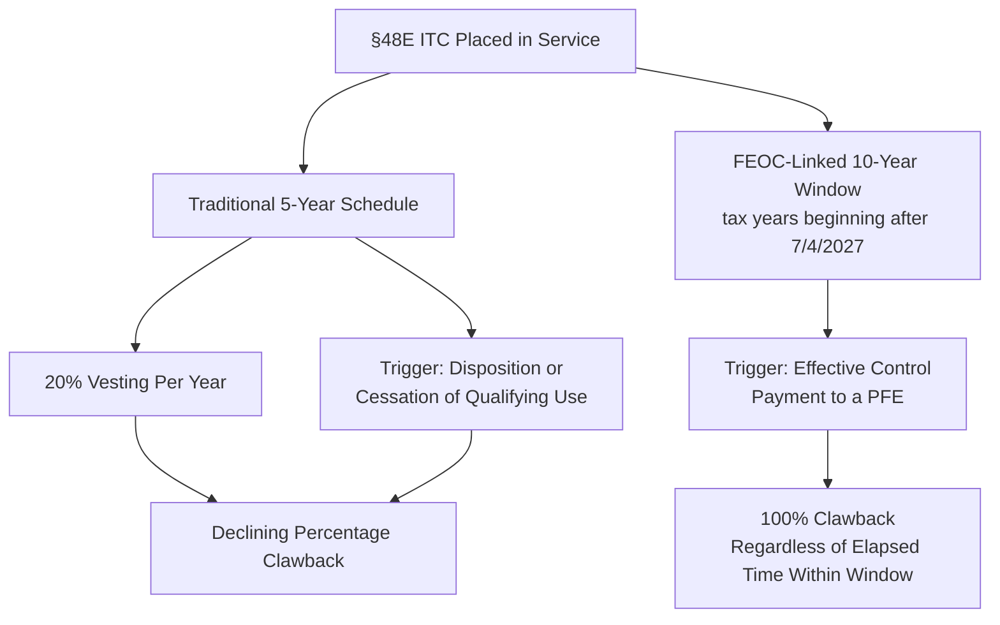

## The Five-Year Recapture Schedule

### Overview and Statutory Basis

The five-year recapture schedule is the vesting and clawback mechanism under §50 of the Internal Revenue Code that governs Investment Tax Credits (ITCs claimed under §48 and §48E). Investment tax credits, including both legacy credits under §48 and tech-neutral credits under §48E, are subject to a five-year recapture period if the facility earning the ITC ceases to be "investment credit property." This mechanism directly shapes tax equity deal structuring, indemnity survival periods (see Indemnification Structures Between Sponsor and Investor), and tax insurance policy terms (see Tax Insurance for Recapture and Qualification Risk), because it defines the precise ongoing compliance window during which a claimed ITC remains at risk of partial or total clawback.

The schedule applies exclusively to investment-basis credits. Unlike ITCs, §45 and §45Y PTCs are not subject to recapture risk, because PTCs are earned incrementally as electricity is actually produced and sold rather than as a lump-sum credit fixed at a point in time — there is no "vested" amount to claw back since the credit is never advanced against future, unearned production.

---

### Vesting Mechanics — The 20% Per Year Structure

The core mechanic of the five-year schedule is straightforward: ITCs vest at 20% per year over five years; if the underlying asset is disposed of or ceases to qualify during this period, the unvested portion must be repaid. This creates a declining recapture exposure over the five-year period following the placed-in-service date:

| Year Since Placed in Service | Vested Percentage | Recapture-Exposed (Unvested) Percentage |
| --- | --- | --- |
| Year 1 (0–12 months) | 20% | 80% |
| Year 2 (12–24 months) | 40% | 60% |
| Year 3 (24–36 months) | 60% | 40% |
| Year 4 (36–48 months) | 80% | 20% |
| Year 5 (48–60 months) | 100% | 0% |

A disqualifying event occurring at any point during a given year triggers recapture of the then-unvested percentage. For example, a disqualifying disposition occurring 30 months after placed-in-service (partway through Year 3) would generally trigger recapture of the 40% unvested amount corresponding to that point in the schedule, since only 60% has vested by that stage.

---

### Events That Trigger Recapture

**Disposition of Investment Credit Property**

The most straightforward trigger — the sale, transfer, or other disposition of the underlying facility to a party that either does not continue the qualifying use or otherwise does not preserve the property's status as investment credit property during the remainder of the five-year window.

**Cessation of Qualifying Use**

The facility ceases to be "investment credit property" — for example, if the property is converted to a non-qualifying use, permanently taken out of service, or otherwise no longer meets the statutory definition of energy property under §48 or a qualified facility/energy storage technology under §48E.

**FEOC-Linked Effective Control Payments (New, §48E-Specific)**

The OBBBA introduced a materially different and longer recapture trigger tied to prohibited foreign entity relationships, distinct from the traditional disposition/cessation triggers above: for §48E ITCs claimed in tax years beginning after July 4, 2027 (i.e., 2028 for calendar-year taxpayers), the IRS may claw back 100% of the credit if the project makes effective control payments to a PFE within 10 years of being placed in service. This creates two structurally different recapture regimes now running in parallel for §48E projects:

- The traditional five-year, declining-percentage schedule described above, tied to disposition/cessation events
- A separate ten-year, all-or-nothing clawback tied specifically to post-placed-in-service payments constituting "effective control" by a prohibited foreign entity

[Inference] Because these two recapture regimes have different durations (5 years vs. 10 years), different triggering conduct (disposition/cessation vs. ongoing payment relationships), and different clawback magnitudes (declining percentage vs. full 100%), diligence and compliance monitoring frameworks built solely around the traditional five-year schedule are likely to be insufficient for §48E projects going forward, and should be extended to separately track FEOC-linked payment relationships across the full ten-year window — though the precise definition of a triggering "effective control payment" remains subject to forthcoming guidance, as discussed further in Foreign Entity of Concern Supply Chain Diligence.

---

### Interaction With Deal Structuring and Documentation

**Indemnity Survival Alignment**

As discussed in Indemnification Structures Between Sponsor and Investor, tax representations typically survive through the relevant statute of limitations for the tax positions at issue. For traditional five-year recapture exposure, this generally means indemnity survival periods for recapture-related representations should be drafted to extend at least through the full five-year vesting window (and often longer, to capture the IRS's assessment statute of limitations running from the return reporting the credit). For §48E projects also carrying FEOC-linked exposure, survival period drafting should separately account for the longer ten-year window described above, since a survival period calibrated only to the traditional five-year schedule would leave a multi-year gap in indemnity coverage for the FEOC-specific trigger.

**Tax Insurance Policy Term Alignment**

As discussed in Tax Insurance for Recapture and Qualification Risk, recapture coverage under a tax insurance policy is subject to enumerated triggering events and a defined policy term. Diligence on any given policy should confirm the policy term is long enough to cover the applicable recapture window — five years for standard recapture exposure, or the full ten-year window for FEOC-linked §48E exposure if that risk is intended to be covered by the same or a supplemental policy.

**Ongoing Covenant Monitoring**

Because recapture is triggered by post-closing conduct (disposition, cessation of use, or FEOC-linked payments) rather than by a defect existing at closing, tax equity partnership agreements typically include ongoing covenants restricting the sponsor's (or operating partner's) ability to take recapture-triggering actions without investor consent during the exposure window — for example, restrictions on selling or refinancing the project, converting its use, or (for §48E projects) entering into new arrangements with foreign counterparties that could constitute effective control payments.

---

### Illustrative Recapture Exposure Timeline (svg_diagram)

<svg xmlns="http://www.w3.org/2000/svg" viewBox="0 0 800 380">
<text x="400" y="26" text-anchor="middle" font-size="18" font-weight="bold" fill="#1a1a1a">Five-Year Recapture Exposure Timeline (svg_diagram)</text>
<line x1="60" y1="140" x2="740" y2="140" stroke="#333" stroke-width="2" />
<circle cx="80" cy="140" r="6" fill="#c0392b" />
<text x="80" y="120" text-anchor="middle" font-size="10" font-weight="bold">PIS</text>
<text x="80" y="165" text-anchor="middle" font-size="10" fill="#333">80% exposed</text>
<circle cx="210" cy="140" r="6" fill="#e07b39" />
<text x="210" y="120" text-anchor="middle" font-size="10" font-weight="bold">Year 1</text>
<text x="210" y="165" text-anchor="middle" font-size="10" fill="#333">60% exposed</text>
<circle cx="340" cy="140" r="6" fill="#d4a017" />
<text x="340" y="120" text-anchor="middle" font-size="10" font-weight="bold">Year 2</text>
<text x="340" y="165" text-anchor="middle" font-size="10" fill="#333">40% exposed</text>
<circle cx="470" cy="140" r="6" fill="#7a9e3f" />
<text x="470" y="120" text-anchor="middle" font-size="10" font-weight="bold">Year 3</text>
<text x="470" y="165" text-anchor="middle" font-size="10" fill="#333">20% exposed</text>
<circle cx="600" cy="140" r="6" fill="#3a8a52" />
<text x="600" y="120" text-anchor="middle" font-size="10" font-weight="bold">Year 4</text>
<text x="600" y="165" text-anchor="middle" font-size="10" fill="#333">0% exposed</text>
<circle cx="730" cy="140" r="6" fill="#2d6b3f" />
<text x="730" y="120" text-anchor="middle" font-size="10" font-weight="bold">Year 5</text>
<text x="730" y="165" text-anchor="middle" font-size="10" fill="#333">Fully vested</text>
<rect x="60" y="200" width="680" height="60" rx="6" fill="#fdecec" stroke="#c0392b" />
<text x="400" y="222" text-anchor="middle" font-size="12" font-weight="bold" fill="#1a1a1a">Traditional §50 Recapture Window (5 Years)</text>
<text x="400" y="240" text-anchor="middle" font-size="10" fill="#333">Applies to §48 and §48E; triggered by disposition or cessation of qualifying use</text>
<text x="400" y="253" text-anchor="middle" font-size="10" fill="#333">Declining percentage clawback per schedule above</text>
<rect x="60" y="280" width="680" height="60" rx="6" fill="#e8f0fe" stroke="#4a6fa5" />
<text x="400" y="302" text-anchor="middle" font-size="12" font-weight="bold" fill="#1a1a1a">FEOC-Linked Recapture Window (10 Years, §48E only)</text>
<text x="400" y="320" text-anchor="middle" font-size="10" fill="#333">Runs concurrently and extends 5 years beyond the traditional window's end</text>
<text x="400" y="333" text-anchor="middle" font-size="10" fill="#333">Triggered by effective control payments to a PFE; 100% clawback if triggered</text>
</svg>

---

### Diligence and Compliance Checklist

| Checklist Area | Key Question |
| --- | --- |
| Credit type confirmation | Is the credit an ITC (§48/§48E, recapture-exposed) or a PTC (§45/§45Y, not recapture-exposed)? |
| Vesting stage tracking | What is the current vested percentage, and how is it tracked internally through the five-year window? |
| Disposition restrictions | Do transaction documents restrict sale, transfer, or use conversion without investor consent during the exposure window? |
| FEOC exposure applicability | For §48E projects, is the ten-year FEOC-linked window separately tracked from the standard five-year schedule? |
| Indemnity survival alignment | Does the indemnity survival period for recapture representations cover the full applicable window (5 or 10 years, as relevant)? |
| Tax insurance policy term | Does the bound tax insurance policy's term extend through the full applicable recapture window? |
| Ongoing covenant compliance | Are covenants in place to flag/prohibit sponsor actions that could constitute a recapture-triggering event? |

---

**Next Steps**

- Foreign Entity of Concern Supply Chain Diligence (Effective Control Payment Definitions Feeding the 10-Year Window)
- Tax Insurance for Recapture and Qualification Risk (Policy Term Alignment With Recapture Windows)
- Indemnification Structures Between Sponsor and Investor (Survival Period Drafting for Recapture Representations)
- Section 50 Recapture Computation Mechanics and Partner-Level Allocation Issues
- Placed-in-Service Determination as the Recapture Clock Start Date
- Disposition and Change-of-Use Definitions Under Investment Credit Property Rules
- Ongoing Compliance Monitoring Systems for Multi-Year Tax Credit Exposure
- Comparing ITC Recapture Risk to PTC's Absence of Recapture Exposure in Deal Pricing