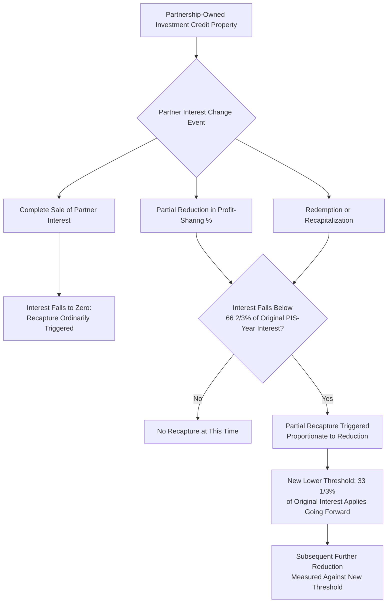
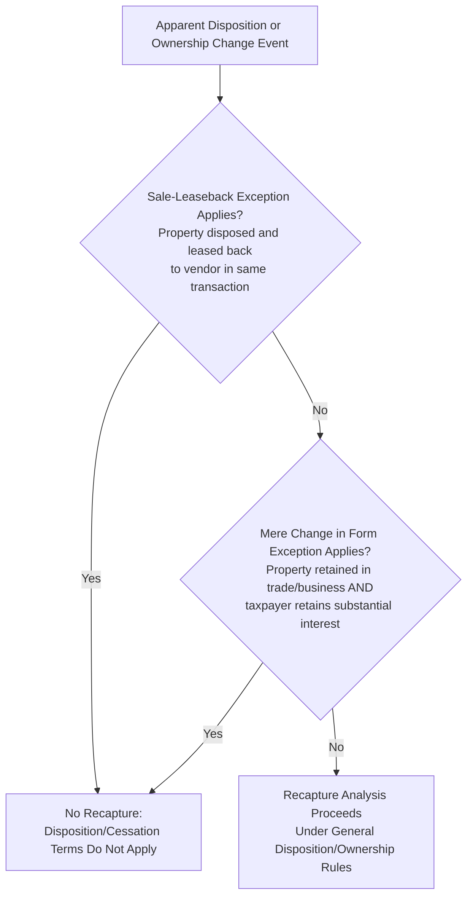

## Recapture-Triggering Events and Ownership Changes

### Overview and Statutory Framework

Recapture-triggering events are the specific occurrences that cause a taxpayer to lose some or all of the vested ITC benefit under the five-year schedule described in The Five-Year Recapture Schedule. To trigger recapture, an ITC-eligible property must experience a disqualifying change during the five-year recapture period. Section 47(a)(1) requires investment tax credit to be recaptured if property is disposed of, or otherwise ceases to be section 38 property during a taxable year, and because §50 does not have its own comprehensive regulations, the interpretive framework governing what actually counts as a triggering event draws heavily on decades-old, still-operative regulatory guidance: absent Treasury regulations under Sec. 50, the IRS generally looks to Sec. 47 regulations to interpret the Sec. 50 recapture rules. This makes recapture diligence unusually dependent on a body of older regulatory text (originally developed for the pre-1986 general investment tax credit) that has been layered onto modern renewable energy credits by cross-reference rather than fresh drafting.

This topic connects directly to The Five-Year Recapture Schedule (the timing/vesting mechanics), Indemnification Structures Between Sponsor and Investor (the contractual allocation of recapture risk), and Tax Insurance for Recapture and Qualification Risk (the insurance-based transfer of this risk).

---

### Category 1: Direct Disposition of the Property

**Sale, Transfer, or Casualty Loss**

Potential triggers include disposition of the property: the project owner sells, transfers, or otherwise disposes of the investment credit property during the recapture period. Disposition is construed broadly and is not limited to voluntary sales: loss of property due to destruction or damage by fire, storm, shipwreck, or other casualty or by reason of its theft triggers recapture, and other recapture events include the exchange or trade-in of the ITC property for other property, or a conversion of the ITC property to personal use.

**The Six-Month Replacement Rule**

A narrow but important mitigant exists for casualty losses and certain other dispositions: the six month rule also applies to avoid recapture from dispositions generally (i.e., whether a sale or a casualty). However, this rule cuts both ways and can be a trap: if a taxpayer disposes of property that qualified for investment credit and replaces that property within six months with property similar or related in service or use to the property disposed of, the Six Month Regulation does not prevent recapture of investment credit — meaning the replacement-property mechanism does not automatically avoid recapture merely because a like-kind replacement occurs within six months; the specific regulatory conditions must be independently satisfied. [Inference] Given this counterintuitive interaction, diligence teams evaluating a casualty event and planned replacement should not assume the six-month rule provides automatic recapture protection without confirming the specific regulatory requirements are met, since the underlying guidance appears designed to prevent recapture avoidance through superficial replacement transactions rather than to create a blanket safe harbor.

**Vintage Implications of Replacement Property**

Beyond the recapture question itself, replacement property raises a separate credit-sizing issue: the ITC on the replacement property will likely be calculated based on the vintage of the "safe harbor equipment" included as the replacement property and the placed-in-service date of the replacement property — meaning a casualty-driven replacement can shift the applicable credit rate and compliance requirements (including FEOC threshold vintage, per Foreign Entity of Concern Supply Chain Diligence) to whatever regime applies at the replacement property's actual placed-in-service date, not the original project's vintage.

---

### Category 2: Ownership Changes Below the Partnership Level

This is the most operationally significant and frequently overlooked category for tax equity transactions, because recapture exposure can arise even when the underlying project itself is never sold or physically altered.

**The Partner-Level Look-Through Rule**

When investment credit property is owned by a partnership, the recapture analysis does not stop at the partnership level. A direct sale of the property by the partnership may trigger recapture, but a reduction in a partner's interest can also matter. Treasury Regulation § 1.47-6 provides rules for partnership-owned section 38 property, under which:

If a partner took into account the basis or cost of partnership section 38 property in computing qualified investment, and that partner's proportionate interest in the partnership's general profits is reduced below the regulatory threshold during the recapture period, then the property is treated as ceasing to be section 38 property with respect to that partner to the extent of the reduction. This can result in recapture, even though the partnership still owns and operates the property.

**The Specific Threshold Test**

The regulation measures whether the partner's interest falls below 66 2/3% of the partner's proportionate interest in general profits for the year the property was placed in service. Critically, this threshold is not static after a first reduction: after a prior partial cessation, the later threshold becomes 33 1/3% of that original interest — meaning a partner who has already experienced a partial recapture event faces a lower bar for a subsequent triggering reduction, requiring ongoing tracking rather than a single point-in-time check.

**Complete Exit**

A complete sale of a partner's interest will ordinarily trigger recapture because the partner's interest falls to zero — the most straightforward application of the look-through rule, but one that is easy to miss if diligence focuses only on entity-level transactions and not on individual partner-level transfers, redemptions, or dilutive events.

**Practical Structuring Implication**

For partnerships with investment credit property, this means partner exits, redemptions, recapitalizations and shifts in profit-sharing percentages should be reviewed before they occur — framing recapture diligence as a forward-looking, transaction-gating exercise rather than a retrospective compliance check, since a proportionate-interest reduction crossing the threshold is itself the triggering event regardless of the business rationale behind the underlying restructuring.

---

### Category 3: Statutory Exceptions That Avoid Recapture Despite an Apparent Trigger

Not every transfer or restructuring that looks like a disposition actually triggers recapture. Two well-established exceptions matter most in tax equity practice:

**Mere Change in Form of Conducting a Trade or Business**

Recapture is not required if there is a "mere change in the form of conducting a trade or business," meaning that the ITC property is retained in the trade or business and the taxpayer retains a substantial interest in the trade or business. A partnership-to-corporation restructuring does not automatically trigger recapture — IRC § 50 contains an important exception for a mere change in the form of conducting a trade or business, and recapture generally does not apply merely because of the change in form, provided the property remains in the trade or business as investment credit property and the taxpayer retains a substantial interest in that trade or business.

The "substantial interest" threshold has been addressed in guidance and case law with specific percentage benchmarks: a 45% interest has been treated as substantial, and a 50% partnership interest has similarly been treated as substantial in this context — though these are illustrative benchmarks from specific factual determinations rather than a fixed bright-line percentage applicable in all cases, and each restructuring should be independently assessed against the regulatory standard.

**Sale-Leaseback Exception**

An exception exists for sale-leaseback transactions, specifically, for ITC property that is disposed of and then leased back to the vendor in the same transaction. In such cases, the terms "disposition" and "cessation" do not apply and will not require credit recapture — a structurally important carve-out given how common sale-leaseback and inverted lease structures are in tax equity financing generally.

---

### Category 4: Financing-Driven and Involuntary Ownership Changes

Recapture risk is not limited to voluntary sponsor or investor decisions. Diligence should specifically evaluate involuntary triggers arising from the project's capital structure: buyers, investors, and their advisors should analyze the project's debt structure, lender covenants, and overall capitalization to assess the risk of a forced disposition, since a loan default or foreclosure, for example, could result in a change of ownership that triggers recapture. This makes lender covenant review a component of recapture diligence, not merely a separate credit-risk exercise — a project with thin equity cushion or restrictive lender remedies carries meaningfully elevated involuntary-disposition risk relative to a comparably-sited project with conservative leverage.

---

### Market Practice: Contractual Protections Against Recapture-Triggering Events

Because the underlying legal rules are complex and partly outside either party's real-time visibility (particularly partner-level interest changes at other levels of a multi-tier structure), market practice has converged on standardized contractual protections:

**Notification Covenants**

Ninety-three percent of ITC deals include a covenant requiring the seller to notify the buyer of a potential recapture event — reflecting that timely notice is treated as a baseline, near-universal deal term rather than a negotiated enhancement.

**Indemnification as the Default Risk-Transfer Mechanism**

No-fault indemnities, which protect against credit loss, are an expected baseline in tax credit transactions, with near-identical prevalence across ITC and production tax credit (PTC) transactions. In direct transfers, buyers often require sellers to fully indemnify them for any recapture liability, including associated penalties and interest, regardless of fault. Where the seller is a project-level entity with limited creditworthiness, buyers may also require a parent guarantee from the project sponsor — directly connecting recapture-event indemnification to the credit support review discussed in Insurance and Credit Support Review. For tax equity investors specifically (as distinct from tax credit transfer buyers), the same logic applies at the partnership level: tax equity investors should similarly ensure that the partnership agreement includes indemnification from the developer or sponsor for recapture events, particularly those arising from voluntary dispositions or changes in use that the investor does not control.

**Growth of External Credit Support**

The market has shifted meaningfully toward third-party risk transfer for this specific exposure: external credit support — tax credit insurance, a seller guaranty, or both — has grown from roughly 50% of deals in early 2024 to roughly 82% today, a substantial and rapid increase reflecting growing market comfort with (and reliance on) tax insurance products specifically for recapture risk, consistent with the broader tax insurance market trends discussed in Tax Insurance for Recapture and Qualification Risk.

---

### Illustrative Recapture-Triggering Event Decision Framework (svg_diagram)

<svg xmlns="http://www.w3.org/2000/svg" viewBox="0 0 800 460">
<text x="400" y="26" text-anchor="middle" font-size="17" font-weight="bold" fill="#1a1a1a">Recapture-Triggering Event Decision Framework (svg_diagram)</text>
<rect x="300" y="50" width="200" height="50" rx="6" fill="#f5f5f5" stroke="#666" />
<text x="400" y="80" text-anchor="middle" font-size="12" font-weight="bold" fill="#1a1a1a">Candidate Event Occurs</text>
<line x1="400" y1="100" x2="400" y2="125" stroke="#666" stroke-width="1.5" marker-end="url(#a4)" />
<rect x="270" y="125" width="260" height="55" rx="6" fill="#e8f0fe" stroke="#4a6fa5" />
<text x="400" y="148" text-anchor="middle" font-size="12" font-weight="bold" fill="#1a1a1a">Direct Disposition?</text>
<text x="400" y="165" text-anchor="middle" font-size="10" fill="#333">Sale, casualty, exchange, conversion</text>
<line x1="270" y1="152" x2="150" y2="200" stroke="#666" stroke-width="1.5" />
<line x1="530" y1="152" x2="650" y2="200" stroke="#666" stroke-width="1.5" />
<rect x="40" y="200" width="220" height="60" rx="6" fill="#fff4e5" stroke="#c98a2c" />
<text x="150" y="222" text-anchor="middle" font-size="11" font-weight="bold" fill="#1a1a1a">No: Check Partner-Level</text>
<text x="150" y="238" text-anchor="middle" font-size="10" fill="#333">Interest reduced below</text>
<text x="150" y="252" text-anchor="middle" font-size="10" fill="#333">66 2/3% (or 33 1/3% if prior event)?</text>
<rect x="540" y="200" width="220" height="60" rx="6" fill="#fdecec" stroke="#c0392b" />
<text x="650" y="222" text-anchor="middle" font-size="11" font-weight="bold" fill="#1a1a1a">Yes: Check Exceptions</text>
<text x="650" y="238" text-anchor="middle" font-size="10" fill="#333">Sale-leaseback? Mere change</text>
<text x="650" y="252" text-anchor="middle" font-size="10" fill="#333">in form + substantial interest retained?</text>
<line x1="150" y1="260" x2="150" y2="290" stroke="#666" stroke-width="1.5" marker-end="url(#a4)" />
<line x1="650" y1="260" x2="650" y2="290" stroke="#666" stroke-width="1.5" marker-end="url(#a4)" />
<rect x="40" y="290" width="220" height="55" rx="6" fill="#e6f4ea" stroke="#3a8a52" />
<text x="150" y="312" text-anchor="middle" font-size="10" fill="#333">Yes → Partial recapture triggered,</text>
<text x="150" y="326" text-anchor="middle" font-size="10" fill="#333">new lower threshold applies going forward</text>
<rect x="540" y="290" width="220" height="55" rx="6" fill="#e6f4ea" stroke="#3a8a52" />
<text x="650" y="312" text-anchor="middle" font-size="10" fill="#333">Exception met → No recapture</text>
<text x="650" y="326" text-anchor="middle" font-size="10" fill="#333">despite apparent triggering event</text>
<rect x="270" y="370" width="260" height="70" rx="6" fill="#fdecec" stroke="#c0392b" />
<text x="400" y="392" text-anchor="middle" font-size="11" font-weight="bold" fill="#1a1a1a">If Recapture Confirmed:</text>
<text x="400" y="408" text-anchor="middle" font-size="10" fill="#333">Apply five-year vesting schedule,</text>
<text x="400" y="422" text-anchor="middle" font-size="10" fill="#333">trigger indemnity/insurance claim process</text>
</svg>

---

### Diligence Checklist

| Diligence Area | Key Question |
| --- | --- |
| Direct disposition history | Has the property been sold, exchanged, converted to personal use, or suffered casualty loss during the recapture window? |
| Six-month replacement rule | If casualty replacement occurred, were the specific regulatory conditions actually satisfied, or merely assumed? |
| Partner-level interest tracking | Has any partner's proportionate profit interest been reduced below 66 2/3% (or 33 1/3% post-prior-event) of its placed-in-service-year interest? |
| Mere-change-in-form exception | If a restructuring occurred, was the property retained in the trade/business and was the taxpayer's retained interest "substantial"? |
| Sale-leaseback exception | If a sale-leaseback occurred, was it structured within the same transaction to qualify for the exception? |
| Lender covenant and leverage review | Does the debt structure create meaningful forced-disposition risk via default or foreclosure? |
| Notification covenant | Does the transaction document include a seller notification obligation for potential recapture events? |
| Indemnification scope | Does the indemnity cover recapture regardless of fault, and is it backed by adequate credit support? |
| External credit support | Is tax credit insurance, a seller guaranty, or both in place, consistent with current market practice? |

---

**Related Topics**

- The Five-Year Recapture Schedule (Vesting Percentages Applied Once a Triggering Event Is Confirmed)
- Tax Insurance for Recapture and Qualification Risk (Insuring Specifically Against Ownership-Change Triggers)
- Indemnification Structures Between Sponsor and Investor (No-Fault Recapture Indemnities and Parent Guarantees)
- Partnership Flip Structuring and Capital Account/Profit-Interest Mechanics
- Foreign Entity of Concern Supply Chain Diligence (Interaction With the 10-Year §48E Effective Control Clawback)
- Lender Covenant Review and Forced Disposition Risk in Leveraged Tax Equity Transactions
- Sale-Leaseback and Inverted Lease Structuring in Renewable Energy Finance
- Treasury Regulation § 1.47-6 and § 1.47-3 as Interpretive Sources for Modern ITC Recapture