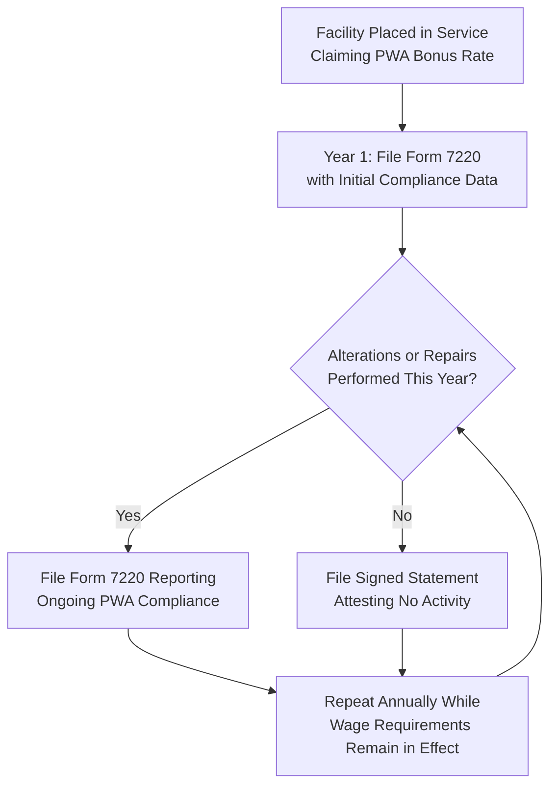

## Ongoing Ownership and Reporting Rules

### Overview and Purpose

Ongoing ownership and reporting rules are the annual, post-placed-in-service compliance obligations that a taxpayer must satisfy throughout the applicable recapture or compliance window to preserve a claimed investment tax credit or production tax credit. These rules exist because many of the modern IRA/OBBBA-era credit enhancements — prevailing wage and apprenticeship (PWA), domestic content, and (for §48/§48E) recapture eligibility itself — are not one-time determinations made only at placed-in-service, but conditions that must be actively monitored, documented, and in some cases affirmatively re-certified to the IRS year after year. This topic sits downstream of Recapture-Triggering Events and Ownership Changes (the substantive events that can cause a credit to be clawed back) and connects directly to Indemnification Structures Between Sponsor and Investor, since a failure of ongoing reporting obligations is itself frequently a defined indemnifiable event in tax equity partnership agreements.

---

### The Form 7220 Regime for Prevailing Wage and Apprenticeship Compliance

**Purpose and Recent Standardization**

In January 2026, the IRS released Form 7220, Prevailing Wage and Apprenticeship (PWA) Verification and Corrections, which finally creates a standardized way to document PW&A compliance on tax returns. The 2025 tax year is the first filing season in which it applies, making this largely uncharted territory for developers and their advisors. Prior to this, taxpayers subject to the PWA requirements attached a detailed statement for each facility or property at the time of filing the return; Form 7220 largely replaces the previously required detailed statements, streamlining how taxpayers verify and report PWA data for each facility or property.

**Filing Mechanics**

A separate Form 7220 is required for each facility claiming an increased credit or deduction — meaning a sponsor or investor with a multi-project portfolio faces a proportional multiplication of filing obligations, not a single consolidated filing. The form attaches to the return on which the underlying credit is claimed, including Form 3468 for ITC and Form 7211 for PTC, among others.

**Critical Point: The Obligation Does Not End at Placed-in-Service**

This is the single most important compliance-design feature of the modern PWA regime for ongoing ownership diligence: the obligation to file Form 7220 doesn't end at placed-in-service. For facilities placed in service in a prior year that claimed the bonus rate, developers must continue to file Form 7220 annually to report ongoing PW&A compliance during alterations or repairs for as long as the wage requirements remain in effect. Even in years with no qualifying activity, an affirmative filing obligation persists: if no alterations or repairs were performed during the year, the developer must attach a signed statement attesting to that fact — meaning silence or non-filing is not a compliant default; an active attestation is required every year regardless of activity level.

**Underlying Documentation Content**

Part I — Facility/Project Information collects basic details: project description, address, coordinates, construction start date, and placed-in-service date, establishing the baseline facility identification that subsequent annual filings reference. The substantive compliance obligation requires ongoing labor recordkeeping: documentation must substantiate proper labor classifications, applicable wage rates, and comprehensive apprenticeship records (requests, hours worked, ratios).

---

### Recordkeeping Standards Supporting PWA Reporting

To substantiate claims made on Form 7220 and the respective credit forms (Form 3468, Form 7205, Form 8835, etc.), taxpayers should maintain a defined set of underlying records:

- **Certified Payroll Records** — while federal WH-347 forms are used for government contracts, private taxpayers should maintain similar detailed payroll records for all contractors and subcontractors; these records must show worker names, classifications, hours worked, hourly rates and fringe benefit contributions.
- **Wage Determinations** — copies of the sam.gov wage determinations applicable to the specific project location and construction timeline.
- **Apprenticeship Agreements** — documentation verifying the registration of the apprenticeship program and the specific enrollment of apprentices working on the project.
- **Correction Calculations** — if errors were found and fixed, detailed calculations of the underpayments and proof of payment to workers (cancelled checks or direct deposit records) and the IRS.

This recordkeeping burden is not solely the taxpayer's internal concern; it directly feeds transaction diligence. PWA compliance heavily influences the due diligence process for transferable tax credit transactions: buyers must ensure sellers maintain extensive records, including payroll records for all laborers and mechanics (including apprentices), and tax credit sellers often engage third parties to provide additional analysis with respect to PWA compliance, reflecting that PWA recordkeeping has become specialized enough to routinely warrant third-party verification rather than being handled solely in-house.

---

### The Annual PWA Compliance Report During the Five-Year Recapture Period (§48 ITC)

A distinct and specific ongoing obligation applies to §48 ITC claimants who relied on the PWA bonus rate: for §48 ITCs, the seller must provide an annual prevailing wage compliance report during the five-year recapture period. This creates direct integration between the ongoing PWA reporting regime and the recapture framework covered in The Five-Year Recapture Schedule — the annual PWA compliance report runs concurrently with, and is a distinct obligation from, the five-year vesting/recapture tracking described in that entry. In the transfer context specifically, buyers should ensure sellers (or a contracted third party) have properly collected, maintained, and reviewed payroll records to ensure that prevailing wages were paid and sufficient apprentice labor was utilized, and should also review the covenants, representations, and warranties in contracts with the primary EPC (and potentially with their subcontractors) to validate that all parties have agreed to comply with PWA requirements — extending the diligence obligation contractually upstream to the EPC relationship, not merely to the taxpayer's own recordkeeping.

---

### Interaction With Credit Transfer and Elective Payment Mechanics

**Pre-Filing Registration**

Before a taxpayer can elect payment or transfer of certain investment credits, a separate administrative gate applies: the IRS established a pre-filing registration process that must be completed prior to electing payment or transfer of the investment credit figured in Parts III, IV, V, and VI of Form 3468 — an ownership/reporting prerequisite that must be satisfied before the credit can even be monetized via transfer or elective payment, independent of the substantive PWA and recapture obligations described above.

**Section 48C-Specific DOE Confirmation Requirements**

For advanced manufacturing investment credits under §48C(e), an additional, agency-specific ongoing certification regime applies: as part of a Section 48C(e) application, an applicant must confirm that it intends to meet the prevailing wage and apprenticeship requirements by filing the "Initial PWA Confirmation" statement with the Department of Energy (DOE). When the taxpayer notifies the DOE that it has placed the project in service, the taxpayer must also confirm that it met the prevailing wage and apprenticeship requirements by filing the "Final PWA Confirmation" statement with the DOE. The consequence of non-compliance with this specific dual-confirmation requirement is a defined, mechanical rate reduction rather than a discretionary IRS determination: if a taxpayer doesn't provide an Initial and Final PWA Confirmation statement to the DOE, the IRS will require the taxpayer to claim the Section 48C credit at the 6% credit rate and forfeit the remainder of the Section 48C credits allocated to the project — illustrating that for this specific credit category, the ongoing reporting failure itself (not a separate recapture-triggering event) is what causes the value reduction.

---

### Illustrative Ongoing Compliance Timeline Across Credit Types (svg_diagram)

<svg xmlns="http://www.w3.org/2000/svg" viewBox="0 0 800 400">
<text x="400" y="26" text-anchor="middle" font-size="17" font-weight="bold" fill="#1a1a1a">Ongoing Ownership and Reporting Timeline (svg_diagram)</text>
<line x1="60" y1="200" x2="740" y2="200" stroke="#333" stroke-width="2" />
<circle cx="90" cy="200" r="7" fill="#4a6fa5" />
<text x="90" y="180" text-anchor="middle" font-size="11" font-weight="bold">Placed in Service</text>
<circle cx="230" cy="200" r="7" fill="#c98a2c" />
<text x="230" y="180" text-anchor="middle" font-size="11" font-weight="bold">Year 1</text>
<circle cx="370" cy="200" r="7" fill="#c98a2c" />
<text x="370" y="180" text-anchor="middle" font-size="11" font-weight="bold">Year 2</text>
<circle cx="510" cy="200" r="7" fill="#c98a2c" />
<text x="510" y="180" text-anchor="middle" font-size="11" font-weight="bold">Year 3</text>
<circle cx="650" cy="200" r="7" fill="#c98a2c" />
<text x="650" y="180" text-anchor="middle" font-size="11" font-weight="bold">Year 4-5</text>
<rect x="60" y="230" width="680" height="55" rx="6" fill="#e8f0fe" stroke="#4a6fa5" />
<text x="400" y="252" text-anchor="middle" font-size="12" font-weight="bold" fill="#1a1a1a">Form 7220: Annual PWA Filing or No-Activity Attestation</text>
<text x="400" y="270" text-anchor="middle" font-size="10" fill="#333">Continues every year "for as long as the wage requirements remain in effect" — not time-limited to 5 years</text>
<rect x="60" y="295" width="680" height="55" rx="6" fill="#fdecec" stroke="#c0392b" />
<text x="400" y="317" text-anchor="middle" font-size="12" font-weight="bold" fill="#1a1a1a">§48 ITC: Annual Compliance Report Through 5-Year Recapture Period</text>
<text x="400" y="335" text-anchor="middle" font-size="10" fill="#333">Runs concurrently with, but distinct from, PWA Form 7220 obligation above</text>
<line x1="90" y1="207" x2="90" y2="230" stroke="#999" stroke-width="1" stroke-dasharray="3,2" />
<line x1="650" y1="207" x2="650" y2="350" stroke="#999" stroke-width="1" stroke-dasharray="3,2" />
</svg>

---

### Diligence and Compliance Checklist

| Checklist Area | Key Question |
| --- | --- |
| Form 7220 filing history | Has Form 7220 (or the prior detailed statement equivalent) been filed for every applicable year since placed-in-service, including no-activity years? |
| Underlying payroll records | Are certified payroll records, wage determinations, and apprenticeship documentation maintained and readily producible? |
| §48 annual compliance report | Has the annual prevailing wage compliance report been filed for every year within the five-year recapture period? |
| EPC contractual flow-down | Do EPC and subcontractor agreements include explicit PWA compliance covenants supporting the taxpayer's own certifications? |
| §48C DOE confirmations | For §48C credits, were both the Initial and Final PWA Confirmation statements timely filed with DOE? |
| Pre-filing registration | Was the IRS pre-filing registration process completed before any elective payment or transfer election was made? |
| Multi-facility filing completeness | For portfolio owners, is a separate Form 7220 confirmed filed for each individual facility, not a consolidated filing? |
| Third-party verification | Has a qualified third party reviewed PWA compliance documentation, consistent with market practice for transfer transactions? |

---

**Related Topics**

- The Five-Year Recapture Schedule (Concurrent Annual Compliance Reporting Obligation)
- Recapture-Triggering Events and Ownership Changes (Reporting Failure as a Distinct Risk From Substantive Recapture Events)
- Indemnification Structures Between Sponsor and Investor (Reporting Covenant Breach as an Indemnifiable Event)
- Prevailing Wage and Apprenticeship Bonus Credit Qualification Standards
- Domestic Content Bonus Credit Annual Substantiation Requirements
- Pre-Filing Registration Process for Elective Payment and Transfer Elections
- Section 48C Advanced Manufacturing Credit DOE Confirmation Process
- Third-Party PWA Compliance Verification Providers and Market Practice