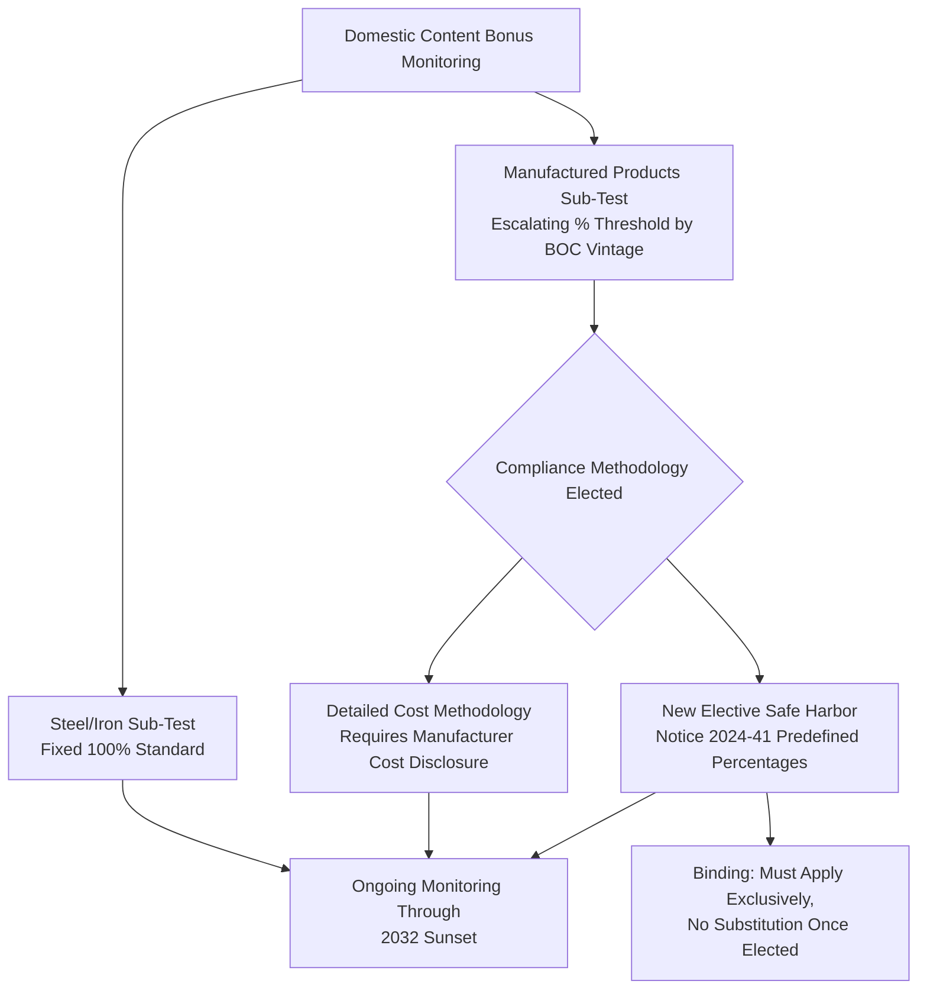
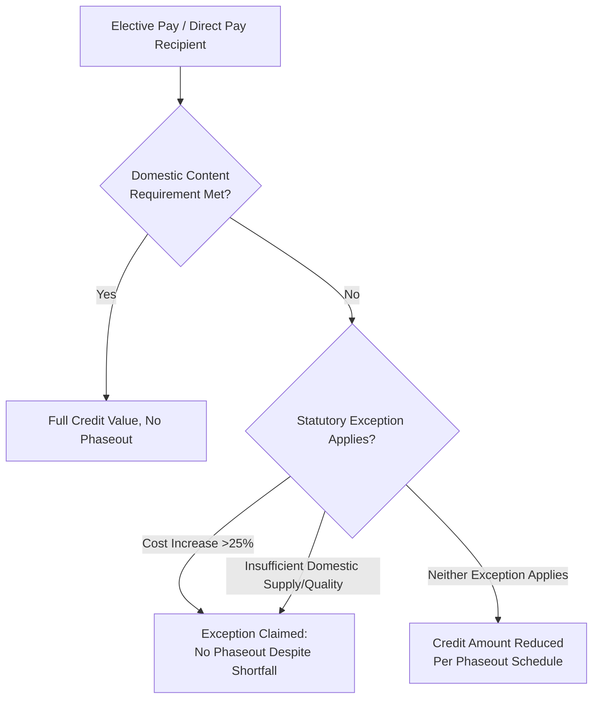

## Monitoring Bonus Adder Compliance Over Time

### Overview and Purpose

Monitoring bonus adder compliance over time is the ongoing diligence discipline of confirming that a project continues to satisfy the eligibility requirements for the various tax credit bonus adders — domestic content, energy community, prevailing wage and apprenticeship (PWA), and (for elective pay recipients) the associated phaseout exceptions — not merely at the point the bonus was originally claimed, but throughout the period the bonus rate remains relevant to the credit's economics and compliance posture. This topic is a direct companion to Ongoing Ownership and Reporting Rules (the annual filing mechanics) and The Five-Year Recapture Schedule / Recapture-Triggering Events and Ownership Changes (since a bonus adder compliance failure can itself function as, or contribute to, a recapture-adjacent risk). Where those entries address the *procedural filing obligations*, this entry addresses the *substantive compliance monitoring* question: what must actually remain true about the project, and for how long, for each bonus category.

---

### The Domestic Content Bonus Adder

**Bonus Structure and Magnitude**

The domestic content bonus credit provision increases the available investment tax credit by increasing the applicable percentage by either 10 percentage points or 2 percentage points depending on whether other conditions are also met: energy projects that meet the domestic content requirement receive a 10-percentage point increase to the applicable "energy percentage" if any one of three conditions is met — the project has a maximum net output of less than 1 megawatt, construction began before January 29, 2023, or the project satisfies the prevailing wage and apprenticeship requirements; absent any of those three conditions, the increase is only 2 percentage points. This creates a compounding compliance structure: the size of the domestic content benefit itself depends on separately monitored PWA compliance status.

**Escalating Thresholds Requiring Vintage Tracking**

The domestic content percentage threshold is not fixed — it escalates by construction-start year, requiring ongoing awareness of which threshold vintage applies to a given project long after the compliance determination was first made: for projects which begin construction prior to 2025, this percentage threshold is 40% (20% in the case of an offshore wind facility), and the percentage increases by 5% annually up to 55% in the case of projects which begin construction after 2026. [Note: some sources describe the ceiling and interim milestones somewhat differently — treat exact percentage figures for any specific project as requiring direct confirmation against the applicable-year Treasury notice rather than a single universal table, since guidance has been updated iteratively (Notice 2023-38, as modified by Notice 2024-41).]

**Steel/Iron vs. Manufactured Products — Different Compliance Standards**

Monitoring must track two structurally different sub-tests: 100% of structural steel and iron is domestically sourced (a fixed, non-escalating standard), while the Manufactured Products Requirement uses the escalating percentage-of-cost threshold described above. This bifurcation matters for ongoing monitoring because a steel/iron shortfall and a manufactured-products shortfall are evaluated against entirely different standards and remedied through different sourcing decisions.

**Compliance Methodology Options**

Compliance with the domestic content bonus credit rules is determined by analyzing components of an Applicable Project, beginning with identification of the Applicable Project Component — any article, material, or supply, whether manufactured or unmanufactured, that is directly incorporated into an Applicable Project. Two distinct compliance pathways exist:

- **Detailed cost methodology** — the original approach requiring detailed cost information from manufacturers, including wages, payroll taxes, and parts supplied directly to the factory, which manufacturers were often reluctant to disclose, creating a persistent practical friction point for ongoing verification.
- **New Elective Safe Harbor** — a simplified alternative that allows developers to use a table of percentages for various project components made in the United States as an alternative to the methodology set out in the 2023 guidance, eliminating the need for granular manufacturer cost disclosure. Critically for ongoing monitoring purposes, this election is binding and exclusive: once a taxpayer elects to use the New Elective Safe Harbor, the taxpayer must apply the percentages in Notice 2024-41 exclusively and without substitutions — meaning a monitoring program must track which methodology was elected for a given project and cannot mix-and-match approaches component-by-component after the election is made.

**Duration of Required Monitoring**

The compliance monitoring horizon for domestic content is unusually long relative to other bonus categories: the credits authorized by the IRA, which includes the domestic content bonus credit, are slated to sunset on Dec. 31, 2032, with nearly a decade of required compliance monitoring for customers — reflecting that manufacturers and project owners alike must sustain domestic content documentation and verification processes over a multi-year horizon, not merely at the point of initial claim.

---

### The Energy Community Bonus Adder

The energy community bonus adder provides an additional percentage-point increase for projects sited in statutorily-defined energy community categories (brownfield sites, statistical areas with historical fossil fuel employment/tax revenue dependence, or areas with recently closed coal facilities). [Inference] Because energy community designations for the statistical-area and coal-closure categories are tied to periodically-updated government data sets (employment statistics, facility closure lists) rather than to a fixed, one-time site characteristic, ongoing monitoring should confirm which vintage of the underlying designation list applied at the time the project's eligibility was locked in, since site-level eligibility can be sensitive to data updates occurring after the original determination — though the specific "locking" mechanics (i.e., whether eligibility is fixed permanently at BOC or is subject to redetermination) should be confirmed against the applicable-year Treasury guidance for the specific census tract or statistical area at issue, as this determination is fact- and geography-specific.

---

### PWA Compliance as an Ongoing Monitoring Input to Bonus Adders

PWA compliance status is not a standalone bonus category in isolation for domestic content purposes — it is a structural input that determines *which* domestic content bonus tier applies (10 points vs. 2 points, as described above). This makes PWA monitoring (covered in detail in Ongoing Ownership and Reporting Rules via the Form 7220 regime) a dependency of domestic content bonus monitoring as well, not merely a separate compliance track running in parallel. A monitoring program that tracks domestic content compliance without cross-referencing current PWA compliance status risks misstating the applicable bonus percentage tier.

---

### Elective Pay (Direct Pay) Phaseout Interaction

For applicable entities using elective pay (direct payment in lieu of a nonrefundable credit), domestic content compliance carries a distinct, higher-stakes consequence beyond simply forfeiting a bonus adder: applicable entities making an elective pay election with respect to a production tax credit or investment tax credit may be subject to a reduced credit amount ("phaseouts") if the qualified facility or energy project does not satisfy the domestic content requirement or does not have maximum net output of less than 1 megawatt. This converts domestic content monitoring from a bonus-optimization exercise into a base-credit-value-protection exercise for direct-pay recipients specifically.

**Statutory Exceptions to Phaseout**

Two narrow statutory exceptions can excuse an applicable entity from the phaseout despite a domestic content shortfall: the inclusion of steel, iron or manufactured products that are produced in the United States increases the overall costs of construction of qualified facilities by more than 25 percent, or relevant steel, iron or manufactured products are not produced in the United States in sufficient and reasonably available quantities or of a satisfactory quality. Ongoing monitoring for direct-pay recipients should therefore include tracking whether either exception applies and whether the associated transition process (extended by Notice 2024-84) has been properly followed, since claiming an exception requires its own substantiation and filing process distinct from simply meeting the underlying domestic content percentage.

**Forward Applicability for Direct Pay**

For the ITC, the PTC, and the CEPTC, the IRA mandates that direct payment recipients that begin construction on energy facilities in 2026 or later must meet the domestic content requirements established for the bonus credits, and for the CEITC, direct payment recipients must meet the domestic content requirements established under the CEPTC bonus credit — meaning the domestic content requirement transitions from optional-bonus to mandatory-condition specifically for direct-pay recipients on this forward timeline, a distinction ongoing monitoring frameworks must track separately from the tax-equity/transfer market's treatment of domestic content as a purely optional adder.

---

### FEOC Interaction — A Newer, Overlapping Monitoring Dimension

For post-OBBBA §48E projects, domestic content monitoring now operates alongside a related but analytically distinct compliance track: the bonus adder interacts with the safe harbor extension and the FEOC restrictions that take effect in 2026 — meaning a project's supply chain data (which manufacturer supplied which component, and that component's cost share) is relevant to both the domestic content bonus calculation and the separate FEOC/PFE material assistance cost ratio calculation described in Foreign Entity of Concern Supply Chain Diligence. [Inference] Given that both frameworks rely on overlapping bill-of-materials and supplier-sourcing data, a well-designed ongoing monitoring program should capture this data once per component and apply it to both the domestic content and FEOC/PFE analyses, rather than running duplicative supplier data-collection efforts for what are, at the data-input level, closely related questions — though the two frameworks produce legally independent conclusions (domestic content bonus eligibility vs. FEOC/PFE base credit qualification) and should not be conflated substantively.

---

### Illustrative Multi-Adder Monitoring Dashboard Structure (svg_diagram)

<svg xmlns="http://www.w3.org/2000/svg" viewBox="0 0 800 420">
<text x="400" y="26" text-anchor="middle" font-size="17" font-weight="bold" fill="#1a1a1a">Multi-Adder Ongoing Compliance Monitoring (svg_diagram)</text>
<rect x="30" y="55" width="220" height="130" rx="6" fill="#e8f0fe" stroke="#4a6fa5" />
<text x="140" y="78" text-anchor="middle" font-size="12" font-weight="bold" fill="#1a1a1a">Domestic Content</text>
<text x="140" y="98" text-anchor="middle" font-size="10" fill="#333">Steel/iron: fixed 100%</text>
<text x="140" y="114" text-anchor="middle" font-size="10" fill="#333">Manufactured products:</text>
<text x="140" y="128" text-anchor="middle" font-size="10" fill="#333">escalating % by BOC year</text>
<text x="140" y="148" text-anchor="middle" font-size="10" fill="#333">Monitor through 2032 sunset</text>
<text x="140" y="166" text-anchor="middle" font-size="10" fill="#333">Safe harbor election is binding</text>
<rect x="290" y="55" width="220" height="130" rx="6" fill="#fff4e5" stroke="#c98a2c" />
<text x="400" y="78" text-anchor="middle" font-size="12" font-weight="bold" fill="#1a1a1a">PWA Compliance</text>
<text x="400" y="98" text-anchor="middle" font-size="10" fill="#333">Determines domestic content</text>
<text x="400" y="112" text-anchor="middle" font-size="10" fill="#333">tier: 10pt vs. 2pt bonus</text>
<text x="400" y="132" text-anchor="middle" font-size="10" fill="#333">Annual Form 7220 filing</text>
<text x="400" y="148" text-anchor="middle" font-size="10" fill="#333">(see Ongoing Ownership</text>
<text x="400" y="164" text-anchor="middle" font-size="10" fill="#333">and Reporting Rules)</text>
<rect x="550" y="55" width="220" height="130" rx="6" fill="#e6f4ea" stroke="#3a8a52" />
<text x="660" y="78" text-anchor="middle" font-size="12" font-weight="bold" fill="#1a1a1a">Energy Community</text>
<text x="660" y="98" text-anchor="middle" font-size="10" fill="#333">Statistical area/coal-closure</text>
<text x="660" y="112" text-anchor="middle" font-size="10" fill="#333">designations may update</text>
<text x="660" y="132" text-anchor="middle" font-size="10" fill="#333">Confirm designation vintage</text>
<text x="660" y="148" text-anchor="middle" font-size="10" fill="#333">used at eligibility lock-in</text>
<text x="660" y="164" text-anchor="middle" font-size="10" fill="#333">point (fact-specific)</text>
<rect x="150" y="220" width="500" height="90" rx="6" fill="#fdecec" stroke="#c0392b" />
<text x="400" y="245" text-anchor="middle" font-size="12" font-weight="bold" fill="#1a1a1a">Shared Data Layer: Supply Chain / Bill of Materials</text>
<text x="400" y="265" text-anchor="middle" font-size="10" fill="#333">Feeds domestic content % calculation AND FEOC/PFE MACR calculation</text>
<text x="400" y="281" text-anchor="middle" font-size="10" fill="#333">(see Foreign Entity of Concern Supply Chain Diligence)</text>
<text x="400" y="297" text-anchor="middle" font-size="10" fill="#333">Legally independent conclusions from shared input data</text>
<rect x="150" y="335" width="500" height="60" rx="6" fill="#f5f5f5" stroke="#666" />
<text x="400" y="358" text-anchor="middle" font-size="11" font-weight="bold" fill="#1a1a1a">Direct-Pay Recipients: Elevated Stakes</text>
<text x="400" y="376" text-anchor="middle" font-size="10" fill="#333">Domestic content shortfall risks credit phaseout, not just bonus loss</text>
</svg>

---

### Diligence and Compliance Checklist

| Checklist Area | Key Question |
| --- | --- |
| BOC-vintage threshold confirmation | Is the correct escalating domestic content percentage threshold applied for this project's actual construction-start year? |
| Steel/iron vs. manufactured products | Are the two sub-tests tracked and documented separately, given their different standards? |
| Compliance methodology consistency | If the New Elective Safe Harbor was elected, is it being applied exclusively without ad hoc substitution? |
| PWA-domestic content interaction | Is current PWA compliance status correctly reflected in the domestic content bonus tier calculation (10pt vs. 2pt)? |
| Energy community designation currency | Has the underlying designation data vintage been confirmed against the applicable eligibility lock-in point? |
| Direct-pay phaseout exposure | For elective pay recipients, is domestic content shortfall risk being monitored as a base-credit-value issue, not merely a bonus issue? |
| Phaseout exception documentation | If claiming a cost-increase or supply-unavailability exception, is the required substantiation and transition process being followed? |
| FEOC data-layer integration | Is supply chain/BOM data being captured once and applied consistently across domestic content and FEOC/PFE analyses? |
| Monitoring horizon adequacy | Does the compliance monitoring program extend through the full credit sunset horizon (e.g., 2032), not just through initial claim? |

---

**Related Topics**

- Ongoing Ownership and Reporting Rules (Form 7220 Annual PWA Filing Mechanics)
- Foreign Entity of Concern Supply Chain Diligence (Shared Supply Chain Data With Domestic Content Analysis)
- The Five-Year Recapture Schedule and Recapture-Triggering Events (Interaction With Bonus Adder Compliance Failures)
- Elective Pay (Direct Pay) Mechanics and Phaseout Exception Substantiation
- Energy Community Designation Categories and Periodic Data Updates
- Domestic Content Safe Harbor Elections: Detailed Cost Methodology vs. New Elective Safe Harbor
- Tax Insurance for Recapture and Qualification Risk (Insuring Bonus Adder Qualification Positions)
- Indemnification Structures Between Sponsor and Investor (Bonus Adder Compliance Representations)