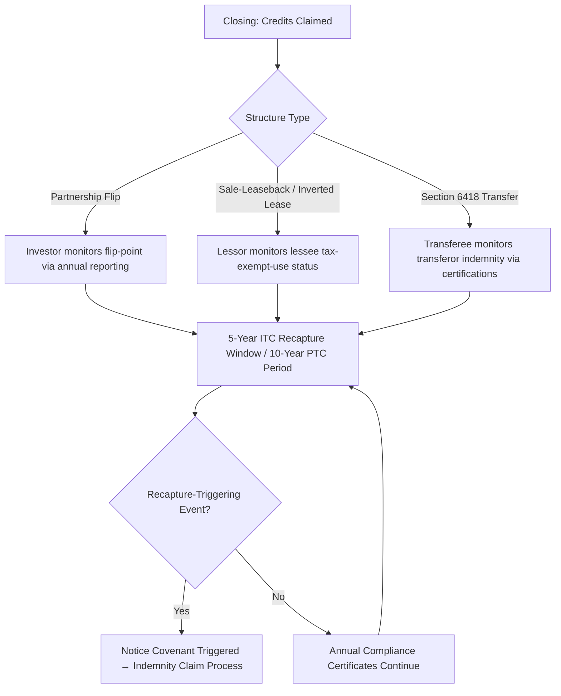

## Post-Closing Covenants and Reporting Obligations

### Overview

Post-closing covenants and reporting obligations are the contractual and regulatory mechanisms that govern a tax equity project's operation after the financing closes and tax credits (Investment Tax Credit ("ITC"), Production Tax Credit ("PTC"), or transferred credits under IRC §6418) have been claimed. Because ITC recapture runs for a five-year compliance period and PTC benefits accrue over a ten-year production period, the closing of a tax equity transaction is not the end of the sponsor's obligations — it is the beginning of an extended compliance regime. These covenants are typically embedded in the Partnership/LLC Agreement, the Credit Agreement (if leverage is present), and increasingly in the Tax Credit Transfer Agreement for §6418 deals.

**Key Points**

- Reporting obligations exist to give the tax equity investor (or transferee, in a transfer deal) visibility into events that could trigger recapture, credit reduction, or indemnity claims
- Covenants are drafted to give the investor either consent rights or at minimum notice rights over actions that affect tax attributes
- Failure to comply with reporting covenants is itself often an Event of Default independent of any actual recapture event
- The obligations differ meaningfully between partnership-flip structures, sale-leasebacks, inverted leases, and §6418 transfer transactions

### Why Post-Closing Obligations Exist

#### The Recapture Period Problem

Under IRC §50(a), the ITC is subject to a five-year vesting schedule. If a "recapture event" occurs before the property has been held for five full years post-placed-in-service, a portion of the credit must be repaid to the IRS.

$$\text{Recapture Amount} = \text{ITC Claimed} \times \left(1 - \frac{\text{Full Years Held}}{5}\right)$$

Because the investor (or a credit buyer under transfer rules) bears this economic risk contractually even though the IRS technically pursues the credit claimant, the legal documents must create a private system of monitoring, notice, and indemnification that substitutes for the IRS's own enforcement.

#### The PTC Verification Problem

PTC has no formal statutory recapture mechanism, but it requires *continuing production verification* — metered output, placed-in-service confirmation, and in post-IRA (Inflation Reduction Act) deals, ongoing prevailing wage and apprenticeship (PWA) compliance for each year credits are claimed, not just at construction. This makes PTC deals reporting-intensive throughout the entire 10-year credit period rather than front-loaded like ITC.

**Example**

A wind facility claiming PTC on IRC §45 must submit annual production data (MWh generated, metering certifications) to the tax equity investor's asset manager, along with an annual PWA compliance certificate, for each of the ten years the credit is claimed — not merely for the placed-in-service year.

### Core Categories of Post-Closing Covenants

#### 1. Negative Covenants (Restrictions Requiring Consent)

These prohibit the project company from taking actions without investor/lender consent because the action could jeopardize tax attributes:

- **Transfers of the Project or Equity Interests** — Any sale, transfer, or encumbrance of the underlying energy property (a recapture-triggering event under Treas. Reg. §1.47-6) generally requires investor consent
- **Liens and Additional Indebtedness** — New debt secured by the project can implicate the "at-risk" rules (IRC §49) and disqualified-debt-financing considerations for tax-exempt use property
- **Material Modifications to the Facility** — Repowering, capacity expansion, or equipment replacement can affect basis, placed-in-service determinations, or trigger a new five-year recapture clock on incremental basis
- **Change in Use** — Converting the facility's end use (e.g., from a taxable off-taker to a tax-exempt or governmental off-taker) can trigger the tax-exempt use property rules and reduce or eliminate credit eligibility
- **Amendments to Material Contracts** — Changes to the PPA, interconnection agreement, or O&M agreement often require notice or consent because they affect projected cash flows underlying the investor's return model

#### 2. Affirmative Covenants (Required Ongoing Actions)

- **Maintain Insurance** — Property, business interruption, and liability coverage at levels specified in the operative documents
- **Maintain Qualification** — Take no action inconsistent with the facility's qualification as "energy property" or a "qualified facility"
- **Comply with PWA Requirements** — For post-IRA projects, maintain payroll records and apprenticeship utilization logs sufficient to substantiate the 5x credit multiplier annually, not just at construction completion
- **Preserve Organizational Existence** — Maintain the project company's good standing, avoid dissolution events
- **Comply with Law** — Maintain permits (environmental, interconnection, land use) in good standing

#### 3. Reporting Covenants

Typically structured on a tiered cadence:

| Frequency | Typical Deliverables |
| --- | --- |
| Monthly/Quarterly | Production/generation reports, budget-to-actual, O&M status |
| Annual | Financial statements (audited or reviewed), tax capital account reporting, Schedule K-1s, PWA compliance certificates, insurance renewal certificates |
| Event-Driven | Notice of default, casualty/condemnation, litigation, change of law, recapture-triggering events |
| Upon Request | Books and records access, inspection rights |

**Example**

A typical partnership-flip Credit Agreement/LLC Agreement reporting schedule requires: (i) monthly operating reports within 20 days of month-end; (ii) quarterly unaudited financials within 45 days; (iii) annual audited financials within 120 days; (iv) K-1s by March 15 (or as needed to meet the investor's own tax filing deadlines); and (v) immediate notice (often within 2–5 business days) of any event reasonably expected to cause recapture.

### Structure-Specific Variations

#### Partnership Flip

The managing member (sponsor) owes fiduciary-adjacent contractual duties to the tax equity investor as a minority-flip partner. Reporting is the investor's primary tool for monitoring flip-date progression (target vs. actual IRR) since the flip is triggered by the investor reaching an agreed after-tax yield, not a fixed calendar date. Covenants commonly include:

- Annual flip-point projection updates/"flip models" delivered to the investor
- Restrictions on the sponsor's ability to cause the company to incur obligations that dilute the investor's capital account
- Buy-out/put-call mechanics post-flip, often with reporting continuing through the investor's minority "back-end" interest

#### Sale-Leaseback / Inverted Lease

The lessor (owner) claims the credit and depends on the lessee's operational and reporting compliance because a change in the lessee's tax-exempt status or use of the property is a direct recapture trigger under the tax-exempt use rules. Reporting obligations flow both directions — lessee reports operational data; lessor reports on its own continued eligibility (e.g., no transfer of its interest without consent).

#### §6418 Transferability Deals

Since transferability decouples the credit claimant from the developer (the transferor originally generates the credit, then sells it for cash to an unrelated transferee), post-closing obligations shift toward **indemnification-backed reporting**:

- The transferor (seller) typically retains recapture liability under the statute's design, but the Transfer Agreement usually requires ongoing certifications and notice covenants from the transferor to the transferee so the transferee can monitor its indemnification exposure
- No partnership-style K-1 reporting is needed since there's no partnership between buyer and seller — reporting is contractual, not partnership-tax-driven
- Insurance (recapture/tax credit insurance) has become a standard substitute or supplement to contractual indemnity reporting, shifting monitoring burden partly to the insurer's underwriting and audit requirements

### Indemnification Mechanics Tied to Reporting

Reporting covenants are the trigger mechanism for indemnification provisions. The typical chain is:

1. Sponsor/developer discovers or should have discovered a recapture-triggering event
2. Notice covenant requires disclosure within a specified cure/notice period
3. Investor calculates the recapture exposure using the formula above
4. Sponsor indemnifies the investor (via a Tax Indemnity Agreement or equivalent provisions in the LLC Agreement) for the lost credit value, gross-up for the investor's resulting tax cost, and often interest/penalties
5. Failure to timely report is frequently treated as an independent breach, sometimes voiding certain baskets, caps, or survival limitations that would otherwise apply to the indemnity

**Example**

If a facility is sold in year 3 of the 5-year ITC compliance period, 40% of the credit is subject to recapture ($1 - 3/5 = 0.4$). If the sponsor fails to provide the contractually required notice of the sale, the Tax Indemnity Agreement may treat this as a separate default, potentially removing negotiated liability caps that would have otherwise limited the sponsor's exposure to the recapture indemnity.

### Asset Management and Compliance Infrastructure

In practice, tax equity investors and larger developers maintain dedicated asset management functions to administer these obligations:

- **Compliance calendars** tracking every reporting deadline across a portfolio of projects
- **Document repositories** (data rooms) for K-1s, insurance certificates, PWA payroll records
- **Recapture risk registries** flagging projects approaching sensitive events (e.g., anticipated refinancing, planned repowering) within the five-year window
- **Third-party cost segregation/tax advisors** engaged periodically to confirm continued basis and qualification positions remain defensible on audit

### Common Pitfalls

- Treating reporting covenants as administrative boilerplate rather than default triggers — late or incomplete delivery can constitute an Event of Default independent of any substantive recapture issue
- Failing to track PWA compliance annually post-IRA, since the requirement is not a one-time construction-phase certification but a continuing condition for the enhanced 30%/5x credit rate
- Overlooking that debt refinancing, even without a change in ownership, can implicate covenant consent requirements under the Credit Agreement
- In transfer deals, assuming the "clean" nature of the cash sale eliminates ongoing obligations — recapture risk survives closing and typically requires multi-year certification delivery regardless of the transfer structure

[Inference] The degree to which insurance products (recapture/tax credit insurance) are substituting for traditional indemnity-driven reporting in §6418 deals continues to evolve rapidly as the transferability market matures; specific market-standard terms should be verified against current deal precedent rather than treated as settled.

**Related Topics**

- ITC Recapture Calculation Mechanics and the Five-Year Vesting Schedule
- Tax Indemnity Agreements: Structure, Baskets, and Survival Periods
- Prevailing Wage and Apprenticeship Ongoing Compliance Documentation
- Partnership Flip Structures and Flip-Point Determination
- Section 6418 Transferability: Registration and Pre-Filing Requirements
- Tax Credit Insurance as a Recapture Risk Mitigant
- Tax-Exempt Use Property Rules and Their Effect on Credit Eligibility
- Cost Segregation Studies and Basis Substantiation