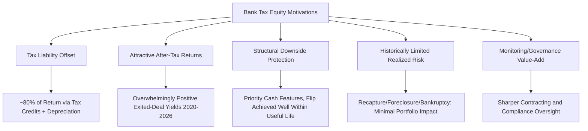
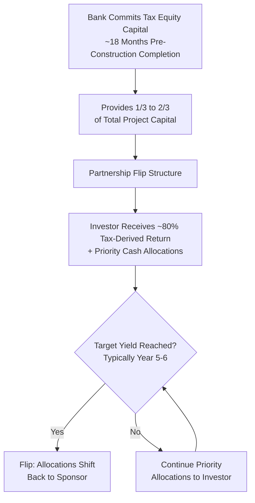

## Bank Tax Equity Investors and Their Motivations

### Overview and Market Position

Bank tax equity investors are the dominant class of capital provider in the U.S. renewable energy tax equity market, historically supplying the majority of institutional tax equity capital used to monetize investment and production tax credits. Tax equity structures are set up as special purpose vehicles (SPV), which bring together the project sponsor and a tax equity investor — usually a large bank — to extract the available tax credits, reflecting how central bank participation has been to the structure of the market itself rather than being merely one investor category among several. According to a survey of banks that represent 70% of the overall renewable tax equity market in the past five years, bank investors' behavior, appetite, and return expectations function as a leading indicator for overall market health, not merely one data point within it.

This topic connects to the broader investor landscape chapter by establishing the baseline motivations and behaviors of the largest capital provider category, against which other investor types (insurance companies, corporates, specialty tax equity funds) are typically compared.

---

### Primary Motivations Driving Bank Participation

**1. Tax Liability Offset — The Foundational Motivation**

The most direct motivation is straightforward: banks generate substantial taxable income and use tax equity investments to offset that liability through the tax credits, depreciation, and other tax benefits the structure generates. In a typical transaction, an investor funds a large portion of a wind, solar, storage, or other clean energy project's overall financing in exchange for a share of the project's tax credits, other tax benefits, and cash flows, and the tax equity investor acts as a passive owner and receives a pre-negotiated rate of return, around 80% of which comes from tax credits and other tax-related benefits, like the ability to claim all the depreciation of the project's qualified assets in the first five years of the project; the rest of the return comes from the cash flows of the project. This heavy weighting toward tax-derived return (versus cash yield) is a defining structural feature that differentiates bank tax equity motivation from ordinary project finance equity investment.

**2. Attractive, Historically Stable After-Tax Returns**

Beyond simply offsetting tax liability, banks have found the risk-adjusted return profile of these investments compelling on its own economic merits: the historical returns associated with exited energy tax equity investments, as well as projections for current investments, demonstrate overwhelmingly positive yields, and nearly all survey participants report positive after-tax returns for both ITC and PTC investments that exited between 2020 and 2026. This track record functions as a self-reinforcing motivation — historical performance data itself becomes a reason for continued and expanded participation.

**3. Downside Protection Through Structural Design**

Bank investors are motivated in part by the specific downside protections built into standard partnership flip structures: the tax equity investor in a yield-based flip achieves a flip within a target timeframe under various stress scenarios, well within the project's useful life, and the small reliance on cash distributions and priority cash features provide the investor robust protection. This structural insulation from project-level operating risk — since the investor's return is substantially tax-driven and protected through priority allocations rather than dependent primarily on merchant cash flow performance — is itself a driver of bank appetite, distinguishing tax equity from more operationally-exposed forms of project finance capital.

**4. Historically Limited Realized Risk**

Empirically, the specific risks unique to this asset class have not materialized at scale in observed bank portfolios: the risks from recapture, foreclosure, and bankruptcy have had no or extremely limited impacts on investors' overall portfolios. This observed loss experience — distinct from theoretical risk exposure — reinforces continued bank participation and supports the market's expectation that, absent new policy impediments, the low-risk profile of renewable tax equity will continue to attract considerable capital from banking investors seeking stable returns.

**5. Monitoring and Governance Value-Add (A Secondary, Structural Motivation)**

Beyond pure financial return, research suggests banks bring an active compliance and oversight function that is itself part of the value proposition of the structure: wind plants financed by tax equity investors increased capacity utilization because those investors brought sharper monitoring and contracting skills, and the bank's role is also to ensure that the project is certified and that it operates the way Congress intended it to and that it wouldn't be a fraudulent operation. [Inference] This suggests bank tax equity motivation is not purely passive capital deployment — banks appear to derive some institutional comfort from, and reputational benefit tied to, functioning as a disciplined compliance gatekeeper on federally-subsidized projects, which may partly explain why banks in particular (rather than more passive capital pools) have historically dominated this asset class, though the specific weight of this motivation relative to pure financial return is not precisely quantifiable from available data.

---

### Structural Mechanics Banks Operate Within

**Capital Contribution Scale**

The tax equity investor provides between one-third to two-thirds of the total capital of a clean energy project, injecting essential upfront capital into its development — a substantial minority-to-majority capital position reflecting the significant scale of bank commitment required in this asset class, consistent with the broader observation that tax credits account for 30% to 70% of the cost of US renewable energy projects.

**Partnership Flip as the Predominant Structure**

Partnership flips are the predominant tax equity structure in the U.S. Tax equity investors target a specific after-tax yield over the holding period, and the flip date occurs when the investor reaches that yield, often around year five or six, at which point the flip shifts cash and tax allocations from the investor back to the sponsor. Most transactions use a target yield flip rather than a fixed date flip, meaning the structural mechanics are calibrated to the investor's realized return achievement rather than a purely calendar-driven exit — proper modeling is essential to align returns with credit timing.

**Regulatory Safe Harbor Reliance**

Bank investors' comfort with the structure has been reinforced by longstanding IRS safe harbor guidance: the Internal Revenue Service has issued safe harbor guidance through Revenue Procedure 2007-65 for wind partnerships, and compliance with safe harbor rules provides protection against later challenge — a foundational piece of regulatory infrastructure that reduces structuring risk for the bank investor relative to a purely bespoke, unguided partnership arrangement.

**Long Commitment Horizons**

Bank tax equity commitments are made well in advance of project completion, reflecting the multi-year development and construction cycle of renewable projects: tax equity is committing 18 months in advance, and market participants describe already evaluating financings a full year or more ahead — we are already looking at 2027 financings, these projects take a long time to build — meaning bank tax equity motivation must be understood as involving a meaningfully forward-looking capital commitment process, not a spot-market transaction.

---

### Diversification of Monetization Strategies Available to Banks

Modern market practice has expanded beyond the classic partnership flip, and bank motivation increasingly reflects a choice among several available structures depending on institutional risk appetite and tax capacity: there are at least five strategies for monetizing tax credits. Partnership flips are one, where a bank or other tax equity investor makes an investment that it expects to be repaid partly in tax benefits and partly in cash. Beyond that:

- **Hybrid deals** — where the tax equity partnership plans to sell most of the tax credits to another company, blending traditional tax equity with credit transfer monetization
- **Preferred equity partnerships with cash investors** — where the partnership sells all the tax credits, shifting the bank's role toward a more purely cash-return-oriented position
- **Straight tax credit sales** — direct transfer transactions under §6418, requiring no ongoing partnership relationship
- **Sale-leasebacks** — described as an earlier form of tax equity that is making a comeback, reflecting renewed bank interest in this older structural form alongside the dominant partnership flip model

An emerging structural trend also reflects evolving bank motivation tied to adjacent market demand: we are also starting to see deals that combine financings of data centers and generating assets into one financing package — [Inference] likely reflecting bank interest in capturing financing relationships tied to the surge in data center electricity demand alongside traditional renewable generation financing, though the specific mechanics and prevalence of such combined structures are still developing and should be assessed against current market data rather than assumed to be standardized.

---

### Illustrative Bank Motivation and Structure Overview (svg_diagram)

<svg xmlns="http://www.w3.org/2000/svg" viewBox="0 0 800 400">
<text x="400" y="26" text-anchor="middle" font-size="17" font-weight="bold" fill="#1a1a1a">Bank Tax Equity Investor Overview (svg_diagram)</text>
<rect x="40" y="55" width="340" height="150" rx="6" fill="#e8f0fe" stroke="#4a6fa5" />
<text x="210" y="80" text-anchor="middle" font-size="13" font-weight="bold" fill="#1a1a1a">Why Banks Invest</text>
<text x="210" y="102" text-anchor="middle" font-size="11" fill="#333">Offset substantial taxable income</text>
<text x="210" y="120" text-anchor="middle" font-size="11" fill="#333">Historically strong after-tax yields</text>
<text x="210" y="138" text-anchor="middle" font-size="11" fill="#333">Structural downside protection</text>
<text x="210" y="156" text-anchor="middle" font-size="11" fill="#333">Low realized recapture/default losses</text>
<text x="210" y="174" text-anchor="middle" font-size="11" fill="#333">Active monitoring/compliance role</text>
<rect x="420" y="55" width="340" height="150" rx="6" fill="#fff4e5" stroke="#c98a2c" />
<text x="590" y="80" text-anchor="middle" font-size="13" font-weight="bold" fill="#1a1a1a">How Banks Participate</text>
<text x="590" y="102" text-anchor="middle" font-size="11" fill="#333">1/3 to 2/3 of total project capital</text>
<text x="590" y="120" text-anchor="middle" font-size="11" fill="#333">Partnership flip (predominant structure)</text>
<text x="590" y="138" text-anchor="middle" font-size="11" fill="#333">Hybrid, preferred equity, or direct sale</text>
<text x="590" y="156" text-anchor="middle" font-size="11" fill="#333">structures as alternatives</text>
<text x="590" y="174" text-anchor="middle" font-size="11" fill="#333">Commitments made ~18 months ahead</text>
<rect x="150" y="235" width="500" height="130" rx="6" fill="#e6f4ea" stroke="#3a8a52" />
<text x="400" y="260" text-anchor="middle" font-size="13" font-weight="bold" fill="#1a1a1a">Return Composition (Typical Partnership Flip)</text>
<text x="400" y="285" text-anchor="middle" font-size="11" fill="#333">~80% — Tax credits (ITC/PTC) + accelerated depreciation</text>
<text x="400" y="303" text-anchor="middle" font-size="11" fill="#333">~20% — Project cash flow distributions</text>
<text x="400" y="325" text-anchor="middle" font-size="10" fill="#555" font-style="italic">Flip typically achieved around Year 5-6</text>
<text x="400" y="341" text-anchor="middle" font-size="10" fill="#555" font-style="italic">once target after-tax yield is reached</text>
<text x="400" y="357" text-anchor="middle" font-size="10" fill="#555" font-style="italic">Governed by Rev. Proc. 2007-65 safe harbor framework</text>
</svg>

---

### Diligence-Relevant Implications for Sponsors and Counterparties

| Consideration | Why It Matters When Structuring With Bank Investors |
| --- | --- |
| Return composition expectations | Banks expect the large majority of return via tax benefits, not cash flow — model accordingly |
| Yield-flip mechanics | A target-yield (not fixed-date) flip is standard; align credit and cash timing carefully in modeling |
| Compliance and monitoring rigor | Expect active bank oversight of certification, PWA/domestic content compliance, and operational conduct |
| Long lead-time commitments | Banks commit capital well ahead of construction completion; align sponsor timelines to this planning horizon |
| Structural flexibility | Banks may prefer partnership flip, hybrid, preferred equity, or sale-leaseback depending on institutional tax capacity and risk appetite |
| Safe harbor reliance | Bank comfort is partly a function of established safe harbor guidance (e.g., Rev. Proc. 2007-65); departures from well-trodden structures may increase bank diligence friction |

---

**Related Topics**

- Insurance Company and Corporate Tax Equity Investors (Comparative Motivations)
- Partnership Flip Structuring: Yield-Based vs. Fixed-Date Flip Mechanics
- Indemnification Structures Between Sponsor and Investor (Bank-Specific Negotiation Patterns)
- Sale-Leaseback and Inverted Lease Structures as Alternative Monetization Paths
- Tax Credit Transferability (§6418) as a Complement to Traditional Tax Equity
- Revenue Procedure 2007-65 Safe Harbor Requirements for Wind Partnerships
- Data Center and Generation Asset Combined Financing Structures (Emerging Trend)
- The Five-Year Recapture Schedule (Bank Investor Risk Tolerance in Historical Context)