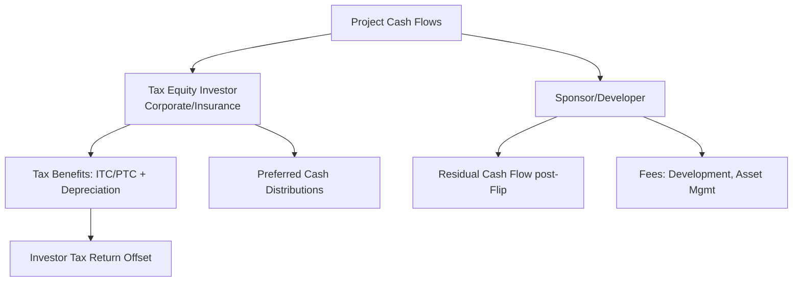
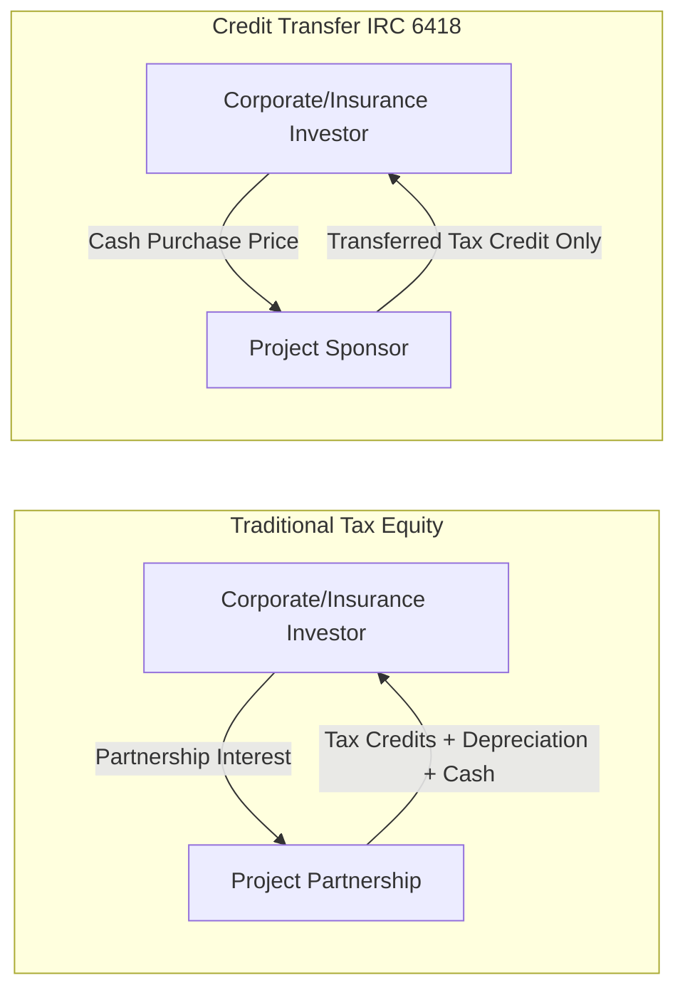

## Corporate and Insurance Company Investors

### Overview

Corporate and insurance company investors are entities that acquire tax equity or debt positions in renewable energy, affordable housing, or historic rehabilitation projects primarily to monetize federal tax incentives (such as the Investment Tax Credit (ITC), Production Tax Credit (PTC), and associated depreciation benefits) against their own tax liabilities, while also seeking a market-rate or above-market financial return. Unlike traditional bank tax equity investors, corporate and insurance investors typically have large, stable taxable income bases and long investment horizons, making them well-suited to absorb tax credits and depreciation over multi-year compliance periods.

### Role in the Capital Stack

In a typical tax equity partnership structure (Partnership Flip, Sale-Leaseback, or Inverted Lease), the corporate or insurance investor sits in a specific position relative to the developer/sponsor:

The investor typically contributes 30-50% of total project capital in exchange for a disproportionate allocation (often 99%) of tax benefits and a negotiated pre-tax and after-tax yield target, until a "flip point" is reached and allocations shift predominantly to the sponsor.

### Corporate Investors: Profile and Motivations

**Key Points**

- **Tax Appetite**: Large corporations with substantial, predictable federal tax liability are prime candidates. Historically dominated by technology, financial services, and industrial firms.
- **ESG/Sustainability Mandates**: Many corporate investors participate partly to advance publicly stated decarbonization or renewable energy procurement goals, in addition to the financial return.
- **Balance Sheet Strength**: Corporates use their own equity (not third-party fund capital), giving them flexibility in structuring but also concentrating risk on their own books.
- **Examples of Historical Corporate Tax Equity Investors**: Google, Apple, Berkshire Hathaway Energy, and various Fortune 500 industrials have been cited in industry reports as participants in wind and solar tax equity transactions. [Unverified — specific current participation levels fluctuate year to year and are not publicly disclosed in real time.]

**Example**

A technology company with $5 billion in annual pre-tax income and a 21% federal corporate tax rate has a theoretical tax capacity in the hundreds of millions of dollars. Allocating a portion of this liability to a solar partnership flip structure allows the company to reduce its effective tax rate while receiving a mid-teens after-tax internal rate of return (IRR), which is often competitive with the company's cost of capital for other uses.

### Insurance Company Investors: Profile and Motivations

**Key Points**

- **Regulatory Capital Treatment**: Insurance companies are subject to risk-based capital (RBC) requirements under NAIC (National Association of Insurance Commissioners) frameworks. Tax equity investments are evaluated for RBC charges depending on how they are categorized (e.g., as a Schedule BA "other invested asset").
- **Long-Duration Liabilities**: Life insurers in particular have long-dated liabilities (annuities, life policies) that align well with the multi-year (typically 5-6 year ITC recapture period, or longer PTC compliance periods) hold requirements of tax equity investments.
- **Statutory Accounting Principles (SAP)**: Insurers report under SAP rather than GAAP, which affects how the tax credits, depreciation, and equity method income/loss are recognized on the insurer's books; this can influence deal structuring (e.g., preference for structures that generate favorable SAP treatment).
- **Diversification**: Insurers use tax equity as a diversifying, tax-advantaged asset class alongside their traditional fixed-income and equity portfolios.

**Example**

A life insurance company evaluates a wind PTC partnership flip. Because PTC accrues over 10 years of actual electricity generation (rather than being front-loaded like the ITC), this generation-linked cash flow profile is attractive to an insurer that models liabilities over multi-decade horizons, even though the compliance/recapture risk period for PTC is effectively the full production period during which credits are earned.

### Comparison: Corporate vs. Insurance vs. Bank Tax Equity Investors

| Attribute | Corporate Investor | Insurance Investor | Bank Investor |
| --- | --- | --- | --- |
| Primary Driver | Tax offset + ESG goals | Tax offset + RBC-efficient yield | Tax offset + CRA credit (in some cases) |
| Capital Source | Own balance sheet | Policyholder/general account funds | Deposits/balance sheet |
| Regulatory Overlay | Minimal (SEC disclosure only) | NAIC RBC, SAP accounting | OCC/Fed capital rules, CRA |
| Typical Hold Period | Matches recapture/compliance period | Often longer, aligned to liabilities | Matches recapture/compliance period |
| Deal Structure Preference | Partnership Flip common | Partnership Flip, Sale-Leaseback | Partnership Flip dominant |
| Market Entry/Exit Flexibility | Can be more cyclical (tied to earnings) | Generally more stable, long-term | Historically most consistent supply |

### Structuring Considerations Specific to These Investors

**Key Points**

- **Indemnification and Guarantees**: Corporate investors, lacking specialized tax equity underwriting teams internally in many cases, often require robust sponsor indemnities for recapture risk, environmental liabilities, and construction completion guarantees.
- **Credit Support**: Insurance investors, given regulatory scrutiny, may require third-party credit enhancement, letters of credit, or parent guarantees from the sponsor to support the counterparty credit profile embedded in the deal.
- **Accounting Method Election**: Both investor types must decide between the HLBV (Hypothetical Liquidation at Book Value) method and, where available post-2023 guidance, the proportional amortization method (PAM) for financial reporting of the investment, which affects reported earnings volatility.
- **Transferability under the Inflation Reduction Act (IRA)**: Since the introduction of IRC Section 6418 transferability provisions, some corporate and insurance investors have shifted toward simpler tax credit purchases (transfer transactions) rather than full tax equity partnership structures, since transfers avoid partnership flip complexity, depreciation allocation, and passive activity loss limitations. [Inference: the degree of this shift varies by investor and is influenced by pricing dynamics between transfer and traditional tax equity markets, which change over time.]

### Tax Credit Transfer vs. Traditional Tax Equity Participation

Under a transfer transaction, the buyer receives only the tax credit itself (no depreciation, no partnership income/loss allocation, no cash distributions), typically at a discount to face value (historically observed in the range of roughly $0.90-$0.97 per $1.00 of credit for ITC/PTC, though pricing fluctuates with market supply and demand). [Unverified — actual pricing varies by deal, credit type, and prevailing market conditions at time of transaction.] This simplified structure has attracted corporate and insurance buyers who want tax offset without the accounting and structuring complexity of a partnership flip.

### Risk Factors from the Investor's Perspective

- **Recapture Risk**: If the underlying asset is sold, ceases to qualify, or the partnership structure fails to meet IRS safe harbor guidelines (e.g., Revenue Procedure 2007-65 for wind, or its successors/analogues for solar structures), a portion of previously claimed ITC can be recaptured, creating an unexpected tax liability for the investor.
- **Basis and Valuation Risk**: For ITC-eligible property, the IRS may challenge the claimed fair market value basis used to calculate the credit, particularly in sale-leaseback or related-party structures.
- **Partnership Audit Risk**: Under the Bipartisan Budget Act (BBA) partnership audit rules, the partnership itself (not individual partners) is generally the point of IRS contact, requiring careful selection of a "partnership representative" and coordination clauses in the partnership agreement.
- **Interest Rate and Yield Compression Risk**: As more capital (including from insurers and corporates newly enabled by transferability) enters the tax credit market, yields/pricing can compress, affecting the relative attractiveness of new deals.

### Practical Due Diligence Checklist for Corporate/Insurance Investors

**Key Points**

- Confirm sponsor's track record and balance sheet strength for indemnification obligations
- Review independent engineering and appraisal reports for basis support (especially for ITC step-up structures)
- Verify safe harbor equipment procurement documentation (for projects relying on "beginning of construction" rules)
- Assess counterparty credit risk of the power off-taker (PPA counterparty) or hedge counterparty
- Model after-tax IRR under multiple scenarios: base case, recapture event, delayed commercial operation date (COD)
- Confirm accounting treatment (HLBV vs. PAM) and its projected impact on reported GAAP/SAP earnings volatility
- For insurers, confirm NAIC Schedule BA/RBC categorization with internal or external actuarial/regulatory counsel

### Illustrative Investor Decision Flow (svg_diagram)

<svg xmlns="http://www.w3.org/2000/svg" viewBox="0 0 800 480">
\<style\>
.box { fill: #f4f6f8; stroke: #33475b; stroke-width: 1.5; }
.decision { fill: #eaf1fb; stroke: #2c5f8a; stroke-width: 1.5; }
.txt { font-family: Arial, sans-serif; font-size: 13px; fill: #1a1a1a; }
.title { font-family: Arial, sans-serif; font-size: 16px; fill: #1a1a1a; font-weight: bold; }
.arrow { stroke: #33475b; stroke-width: 1.5; fill: none; marker-end: url(#arrow); }
\</style\>
<text x="180" y="28" class="title">Investor Decision Flow (svg_diagram)</text>
<rect x="300" y="45" width="200" height="50" rx="6" class="box" />
<text x="330" y="75" class="txt">Sufficient Tax Appetite?</text>
<line x1="400" y1="95" x2="400" y2="130" class="arrow" />
<rect x="300" y="130" width="200" height="50" rx="6" class="decision" />
<text x="330" y="160" class="txt">Prefer Simplicity?</text>
<line x1="330" y1="180" x2="150" y2="230" class="arrow" />
<line x1="470" y1="180" x2="650" y2="230" class="arrow" />
<rect x="40" y="230" width="220" height="60" rx="6" class="box" />
<text x="55" y="255" class="txt">Yes → Credit Transfer</text>
<text x="55" y="275" class="txt">(IRC 6418 purchase)</text>
<rect x="540" y="230" width="220" height="60" rx="6" class="box" />
<text x="555" y="255" class="txt">No → Traditional</text>
<text x="555" y="275" class="txt">Tax Equity Partnership</text>
<line x1="150" y1="290" x2="150" y2="330" class="arrow" />
<line x1="650" y1="290" x2="650" y2="330" class="arrow" />
<rect x="40" y="330" width="220" height="70" rx="6" class="box" />
<text x="55" y="355" class="txt">Diligence: seller credit</text>
<text x="55" y="373" class="txt">quality, recapture indemnity,</text>
<text x="55" y="391" class="txt">registration compliance</text>
<rect x="540" y="330" width="220" height="70" rx="6" class="box" />
<text x="555" y="355" class="txt">Diligence: HLBV/PAM,</text>
<text x="555" y="373" class="txt">flip structure, sponsor</text>
<text x="555" y="391" class="txt">guarantees, BBA rep</text>
</svg>

### Related Topics

- Partnership Flip Structures (Sponsor-Owned vs. Investor-Owned Flips)
- Sale-Leaseback and Inverted Lease Structures
- IRC Section 6418 Tax Credit Transferability Mechanics
- HLBV vs. Proportional Amortization Method (PAM) Accounting
- NAIC Risk-Based Capital Treatment of Alternative Investments
- ITC Recapture Rules and Safe Harbor Provisions
- Bipartisan Budget Act (BBA) Partnership Audit Rules
- Bank Tax Equity Investors (Comparative Deep Dive)
- Tax Equity Yield Curve and Flip Point Modeling