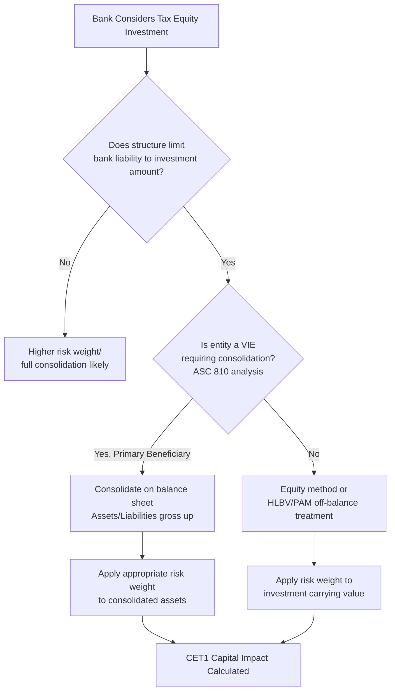

## Regulatory Capital Treatment for Bank Investors

### Overview

Bank tax equity investors are subject to a distinct regulatory capital regime that shapes how they structure, size, and price their participation in renewable energy and affordable housing tax credit transactions. Regulatory capital treatment refers to how banking regulators (the Federal Reserve, OCC, and FDIC) require banks to hold capital against tax equity investments on their balance sheets, based on the perceived risk-weighting of the asset class. This treatment directly affects the after-tax, risk-adjusted return a bank can achieve, and therefore influences deal pricing and structuring across the entire tax equity market, since banks have historically been the dominant supplier of tax equity capital.

### Core Regulatory Framework

**Key Points**

- **Basel III Capital Framework**: U.S. banks operate under capital adequacy rules derived from the Basel III international framework, as implemented domestically through the Federal Reserve's Regulation Q and related OCC/FDIC regulations.
- **Risk-Weighted Assets (RWA)**: Capital requirements are calculated as a percentage of RWA. Different asset classes receive different risk weights, and tax equity investments have historically been assigned relatively high risk weights (frequently cited around 100%, though actual weighting depends on structure and consolidation treatment), reflecting their equity-like characteristics compared to traditional lending. [Unverified — exact risk weight assignment depends on specific structure, consolidation analysis, and evolving regulatory guidance, and can vary by transaction.]
- **Common Equity Tier 1 (CET1)**: Tax equity investments consume CET1 capital capacity, which is the scarcest and most closely monitored capital tier for banks, making the opportunity cost of tax equity capital deployment a central pricing consideration.
- **Consolidation Analysis (VIE Accounting)**: Under U.S. GAAP (ASC 810), banks must determine whether a tax equity partnership is a Variable Interest Entity (VIE) requiring consolidation onto the bank's balance sheet, which has follow-on effects for both accounting presentation and regulatory capital calculation.

### The Investment in Tax Credit Structures Rule

**Key Points**

- In 2018, U.S. banking regulators (Federal Reserve, OCC, FDIC) finalized a rule specifically addressing regulatory capital treatment for investments in certain tax equity structures, commonly referred to informally as the "LIHTC capital rule" because it was initially motivated by Low-Income Housing Tax Credit (LIHTC) investments but has broader applicability language covering other tax credit equity structures that meet defined criteria.
- The rule permits qualifying tax credit equity investments to be risk-weighted at 100% under standardized approaches, subject to conditions including: the investment must not expose the bank to legal liability beyond its investment amount, the investment must qualify for the tax credit, and the investor must reasonably expect to receive the tax credits and other tax benefits.
- This rule reduced regulatory uncertainty for banks investing in LIHTC and, by extension, informed how similar risk-weighting logic is applied to renewable energy tax equity structures, though renewable energy tax equity (ITC/PTC) does not fall under the identical named rule and its regulatory capital treatment is assessed under general risk-based capital and consolidation principles. [Inference: market practice extends analogous underwriting logic, but the specific 2018 rule's named scope is centered on qualifying tax credit equity investments meeting its defined criteria, and applicability should be confirmed with the bank's own regulatory counsel for any specific structure.]

### Capital Treatment Decision Flow

### Risk-Weighting Mechanics: Illustrative Calculation

**Example**

Consider a bank investing $50 million in a solar partnership flip structure, with the investment risk-weighted at 100% under the standardized approach.

$$RWA_{contribution} = \text{Investment Carrying Value} \times \text{Risk Weight}$$

$$RWA_{contribution} = \$50{,}000{,}000 \times 1.00 = \$50{,}000{,}000$$

If the bank targets a CET1 ratio of 11% against RWA, the capital consumed by this single investment is:

$$Capital_{required} = RWA_{contribution} \times CET1\ Ratio\ Target$$

$$Capital_{required} = \$50{,}000{,}000 \times 0.11 = \$5{,}500{,}000$$

This $5.5 million in CET1 capital is now unavailable for other lending or investment activity, and the bank's expected after-tax yield on the tax equity investment must be evaluated against the opportunity cost of that capital allocation, alongside comparable risk-adjusted returns available from traditional lending.

### Accounting Method Interaction with Regulatory Capital

**Key Points**

- **HLBV (Hypothetical Liquidation at Book Value)**: Historically the default method for tax equity investments under equity method accounting, HLBV can produce significant earnings volatility (often large losses in early years followed by income later), which flows through to retained earnings and therefore CET1, creating an indirect capital effect even when the risk weight itself is fixed.
- **Proportional Amortization Method (PAM)**: Following ASU 2023-02 (Accounting Standards Update), PAM was extended beyond LIHTC to other tax equity structures (subject to specific qualifying criteria) meeting program-related criteria, allowing banks to amortize the investment in proportion to tax credits received and recognize the net result within income tax expense rather than pre-tax income. This produces smoother earnings recognition, which many banks view as reducing capital volatility and simplifying investor communication, though it does not change the underlying risk-weighting itself.
- **Deferred Tax Asset (DTA) Interactions**: Banks must also monitor how tax equity investment losses (under HLBV) interact with DTA limitations under capital rules, since certain DTAs arising from temporary differences are themselves subject to capital deduction thresholds.

### Comparative Capital Treatment Table

| Factor | Bank Investor | Insurance Investor | Corporate Investor |
| --- | --- | --- | --- |
| Primary Regulator | Federal Reserve / OCC / FDIC | State insurance regulators / NAIC | SEC (public company) / none (private) |
| Capital Framework | Basel III / Reg Q RWA | Risk-Based Capital (RBC), NAIC | No formal regulatory capital framework |
| Key Capital Metric | CET1 Ratio | RBC Ratio | N/A (internal capital allocation only) |
| Consolidation Standard | ASC 810 (VIE) | Statutory Accounting Principles (SAP) | ASC 810 (VIE), GAAP |
| Accounting Method Options | HLBV or PAM (ASU 2023-02) | HLBV, equity method, SAP-specific | HLBV or PAM |
| Sensitivity to Risk Weight | High (direct RWA impact) | Moderate (RBC charge varies by asset category) | Low (no regulatory capital charge) |

### Why This Matters for Deal Structuring

**Key Points**

- **Pricing Impact**: Because bank investors must factor in the opportunity cost of CET1 capital consumption, their required after-tax yields on tax equity transactions are influenced by the risk weight applied, all else equal — a higher risk weight increases the effective capital cost and can put upward pressure on required yield or downward pressure on the price a bank is willing to pay for a given credit stream.
- **Structuring to Limit Liability Exposure**: Sponsors and their counsel often structure partnership agreements specifically to cap the bank investor's legal exposure at its committed investment amount (avoiding general partner liability or guarantee obligations that could trigger less favorable capital treatment or full consolidation).
- **Bank Investor Concentration Limits**: Individual banks often set internal portfolio limits on aggregate tax equity exposure, partly driven by concentration risk policies tied to capital allocation frameworks, which affects how many deals a given bank can participate in during a calendar year (this can create seasonal or year-end capacity constraints in the tax equity market). [Inference: specific concentration limits are internal, bank-by-bank policy decisions and not publicly standardized figures.]
- **Interaction with Stress Testing**: Large banks subject to CCAR (Comprehensive Capital Analysis and Review) and DFAST (Dodd-Frank Act Stress Testing) must model tax equity investment performance under stress scenarios, which can affect appetite for structures with higher recapture or basis risk.

### Practical Considerations for Sponsors Negotiating with Bank Investors

- Understand that a bank's quoted yield reflects not just credit/tax risk but embedded capital cost; questions about risk-weighting assumptions can clarify pricing rationale during negotiations.
- Confirm which accounting method (HLBV vs. PAM) the bank intends to apply, as this can affect the bank's preferred deal timing, structure, and reporting cadence requirements from the sponsor.
- Be prepared to provide detailed legal opinions confirming liability is capped at the investment amount, since this is often a threshold condition for the bank achieving favorable risk-weighting.
- Recognize that regulatory capital rules can change; the 2018 rule and 2023 accounting update both illustrate how the landscape evolves, and structures viewed as market-standard can shift when new guidance is issued.

### Related Topics

- ASC 810 Variable Interest Entity (VIE) Consolidation Analysis
- ASU 2023-02 Proportional Amortization Method Expansion
- HLBV Accounting Mechanics and Illustrative Calculation
- Basel III Capital Framework Fundamentals for Non-Bank Readers
- Bank Investor Underwriting Criteria and Deal Selection Process
- CET1 Capital Ratio Calculation and Bank Capital Planning
- Comparing Bank vs. Corporate vs. Insurance Investor Economics
- CRA (Community Reinvestment Act) Motivations for Bank Tax Equity Participation
- Partnership Liability Structuring to Preserve Favorable Risk-Weighting