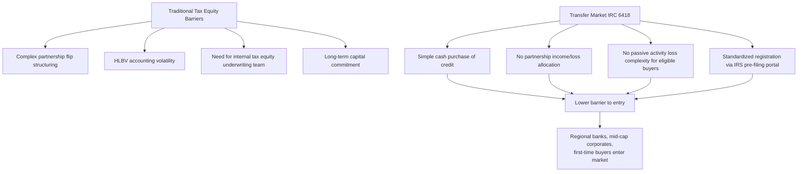

## New Entrants Since the Transfer Market Opened

### Overview

The introduction of tax credit transferability under IRC Section 6418, enacted as part of the Inflation Reduction Act (IRA) of 2022, fundamentally restructured the investor base for clean energy tax credits. Prior to transferability, tax equity was dominated by a small group of large financial institutions with the internal expertise to structure partnership flip or sale-leaseback transactions. Since the transfer market opened in mid-to-late 2023, a substantially broader and more diverse pool of buyers has entered the market, drawn by the relative simplicity of a direct credit purchase compared to a traditional tax equity partnership. This section surveys who these new entrants are, what has enabled their entry, and how their participation has reshaped market dynamics.

### Market Growth Since Inception

**Key Points**

- The transfer market began transacting in the latter half of 2023, following the publication of proposed Treasury regulations in June 2023.
- Deal volume grew rapidly: respondents to a 2024 market survey reported $13 billion of transferable tax credit deals across more than 100 unique transactions, with total market volume estimated around $30 billion including forward-market sales of 2025-or-later credits. [Axios](https://link.axios.com/click/39860684.1888/aHR0cHM6Ly93d3cuY3J1eGNsaW1hdGUuY29tL2luc2lnaHRzLzIwMjQtdHJhbnNmZXJhYmxlLXRheC1jcmVkaXQtbWFya2V0LWtleS10YWtlYXdheXM_dXRtX3NvdXJjZT1uZXdzbGV0dGVyJnV0bV9tZWRpdW09ZW1haWwmdXRtX2NhbXBhaWduPXByb19kZWFsc19hbGxfc3Vic190aG91Z2h0YnViYmxlJnN0cmVhbT10b3A/618bec50fdd3fe6e7e205b74Bf4e25e39)
- The market continued expanding into 2024, with approximately $25 billion in current-year credits changing hands, or roughly $30 billion when including sales of future-year credits. [Climatesolutionslaw](https://www.climatesolutionslaw.com/2025/05/iras-section-6418-transferable-credits-will-they-be-expanded-to-other-industries/)
- By December 2025, a single major transaction platform had facilitated over $7 billion in tax credit transfers across more than 100 transactions since 2024, achieving its highest-ever quarterly transaction volume in Q3 2025. [mexc](https://www.mexc.com/news/291499)
- Despite legislative changes introduced under the One Big Beautiful Bill Act (OBBBA), the transferable tax credit market continued to grow through 2025, with market participants expecting corporate buyers to continue realizing substantial tax savings into 2026 and beyond. [se](https://perspectives.se.com/blog-stream/crossing-climate-ambition-climate-action)

### Categories of New Entrants

**Key Points**

**1. Middle-Market and Smaller Public Companies**

Analysis of public company filings shows the share of firms disclosing tax credit purchases rose from 4.9% in 2024 to 8.5% in 2025, an increase of approximately 74%, with growth particularly pronounced among smaller taxpayers — companies with under $200 million in annual tax expense doubled their purchase rate. This indicates the transfer market has meaningfully broadened access beyond the largest historical tax equity participants. [Reunioninfra](https://www.reunioninfra.com/insights/how-big-is-the-transferable-tax-credit-buyer-market-and-how-fast-is-it-growing)

**2. Regional and Community Banks**

Regional banks have emerged as active participants, purchasing credits at a rate of approximately 13% within the surveyed population, alongside broader financial services participation (banks, insurers, and asset managers) at around 12%. Many of these institutions bring prior experience with traditional tax-equity investing, making transferable credit purchases a natural adjacent strategy that requires less structuring overhead than a partnership flip. A named example from market reporting includes a regional bank (Mercantile Bank) engaging in multiple repeat transfer transactions through an intermediary platform. [Reunioninfra](https://www.reunioninfra.com/insights/which-sectors-and-industries-purchase-transferable-tax-credits-most-often)[Reunioninfra](https://www.reunioninfra.com/insights/which-sectors-and-industries-purchase-transferable-tax-credits-most-often)

**3. Non-Technology Corporates with Limited Alternative Tax Strategies**

The data suggests the strongest predictor of tax credit purchasing is not company size or profitability, but rather the combination of meaningful federal tax liability and limited access to alternative tax-reduction strategies — large technology companies, for instance, purchase transferable credits at a much lower rate (around 3%) because they already have access to substantial R&D credits, stock-based compensation deductions, and international tax structures that reduce effective tax rates. This has shifted the buyer mix toward industrials, financial services, consumer, and other traditionally higher-effective-tax-rate sectors. [Reunioninfra](https://www.reunioninfra.com/insights/which-sectors-and-industries-purchase-transferable-tax-credits-most-often)

**4. Nonprofits and Tax-Exempt Entities (as Sellers, Enabling New Buyer Demand)**

The IRS has provided dedicated support, including office hours, to help nonprofits and charities navigate the pre-filing registration process for credit transfers — reflecting the parallel "direct pay" and transfer eligibility extended to tax-exempt entities under the IRA, which has expanded the universe of project sellers feeding the transfer market and indirectly supporting greater buyer-side participation and standardization. [Novogradac](https://www.novoco.com/notes-from-novogradac/the-release-of-final-regulations-on-transferability-provide-guidance-on-new-financing-tool)

**5. Transfer-Focused Aggregator Platforms and Funds**

Because transferee partnerships can be structured so that partners not subject to passive activity rules — corporations and other institutional investors — can take full advantage of purchased credits, market participants expect a number of partnerships to be created specifically to acquire clean energy tax credits under Section 6418, enabling institutional investors to rely on those managing the partnerships to diligence and negotiate credit acquisitions and manage post-acquisition compliance. This has given rise to intermediary platforms and funds that aggregate demand from smaller or first-time buyers. [jdsupra](https://www.jdsupra.com/legalnews/fund-formation-and-credit-transfers-8393251/)

### Why the Transfer Market Attracted New Entrant Types

### Standardization and Infrastructure Enabling Entry

**Key Points**

- **IRS Pre-Filing Registration Portal**: In December 2023, the IRS launched an online registration tool that generates the registration numbers required for any Section 6418 credit transfer, creating a standardized compliance gateway for all market participants. [jdsupra](https://www.jdsupra.com/legalnews/fund-formation-and-credit-transfers-8393251/)
- **Final Treasury Regulations**: Final regulations on credit transfers became effective July 1, 2024, providing additional certainty that helped the transfer market continue to grow and encouraged more cautious first-time buyers to enter. [Arnold & Porter](https://www.arnoldporter.com/en/perspectives/advisories/2024/06/final-rules-issued-on-transfers-of-clean-energy-tax-credits)
- **Market Transparency and Pricing Convergence**: Smaller tax credit deals (under $20 million in notional value) saw the most material year-over-year pricing improvement, indicating that better market access and transparency allowed smaller developers — historically limited in access to capital — to transact at more favorable discount rates, which in turn drew in a wider range of buyers willing to transact at smaller deal sizes. [Axios](https://link.axios.com/click/39860684.1888/aHR0cHM6Ly93d3cuY3J1eGNsaW1hdGUuY29tL2luc2lnaHRzLzIwMjQtdHJhbnNmZXJhYmxlLXRheC1jcmVkaXQtbWFya2V0LWtleS10YWtlYXdheXM_dXRtX3NvdXJjZT1uZXdzbGV0dGVyJnV0bV9tZWRpdW09ZW1haWwmdXRtX2NhbXBhaWduPXByb19kZWFsc19hbGxfc3Vic190aG91Z2h0YnViYmxlJnN0cmVhbT10b3A/618bec50fdd3fe6e7e205b74Bf4e25e39)
- **Tax Credit Insurance**: Indemnification against credit reduction, recapture, or disallowance risk has increasingly been supported by parent guaranties, tax credit insurance, or both, with insured transactions continuing to comprise the majority of market volume even as the insurance market tightened somewhat in the first half of 2025. This risk mitigation infrastructure has been particularly important in giving first-time, less specialized buyers (such as regional banks and mid-cap corporates) confidence to enter. [Buildwithbasis](https://www.buildwithbasis.com/insights/buying-tax-credits-guidance-for-corporate-tax-and-finance-leaders)

### Buyer Eligibility and Transaction Mechanics (Recap for New Entrants)

**Key Points**

- Tax credit buyers must be a C corporation, partnership, or eligible LLC, must have U.S. federal tax liability, may offset no more than 75% of tax liability in a given year, and must purchase with cash (check, wire, ACH, etc.). [Buildwithbasis](https://www.buildwithbasis.com/insights/buying-tax-credits-guidance-for-corporate-tax-and-finance-leaders)
- Credits may only be transferred once — the buyer may not resell credits. [Buildwithbasis](https://www.buildwithbasis.com/insights/buying-tax-credits-guidance-for-corporate-tax-and-finance-leaders)
- If a buyer has insufficient tax liability in the year of purchase, credits may be carried back three years or carried forward for 22 years. [Buildwithbasis](https://www.buildwithbasis.com/insights/buying-tax-credits-guidance-for-corporate-tax-and-finance-leaders)

### Legislative and Policy Context Affecting New Entrant Behavior

**Key Points**

- Since transferability's introduction, subsequent guidance has continued to refine the framework — for example, Notice 2025-42, issued in response to Executive Order 14315, addressed updated "beginning of construction" rules, and Notice 2026-15 addressed FEOC (Foreign Entity of Concern) restrictions alongside proposed regulations for the Section 45Z clean fuel production credit. [Reunioninfra](https://www.reunioninfra.com/insights/transferable-tax-credit-comprehensive-guide)
- The One Big Beautiful Bill Act (OBBBA), enacted in 2025, introduced legislative changes affecting the tax credit landscape, and market participants spent much of 2025 assessing its implications, though the transfer market continued to grow despite this uncertainty. [se](https://perspectives.se.com/blog-stream/crossing-climate-ambition-climate-action)
- Notably, even as OBBBA reduced overall corporate tax liabilities for some buyers, corporate buyers increasingly viewed tax credit purchases as a core, durable tax planning tool rather than an opportunistic one-off transaction. [Inference: this suggests new entrants are increasingly treating transfer purchases as a recurring part of annual tax planning rather than a novelty, though the degree of permanence in buyer behavior will depend on future legislative and pricing developments.] [mexc](https://www.mexc.com/news/291499)
- There is continued bipartisan legislative interest in potentially expanding transferability to additional credit categories beyond the current scope (Sections 46-48 of the Internal Revenue Code), which could further broaden the new-entrant buyer pool if enacted. [Speculation: any such expansion remains proposed/prospective and its scope and timing are not yet determined.] [Climatesolutionslaw](https://www.climatesolutionslaw.com/2025/05/iras-section-6418-transferable-credits-will-they-be-expanded-to-other-industries/)

### Comparative Snapshot: Legacy Tax Equity Investors vs. New Transfer Market Entrants

| Attribute | Legacy Tax Equity Investors | New Transfer Market Entrants |
| --- | --- | --- |
| Typical Profile | Large banks, select insurers, mega-cap corporates | Regional banks, mid-cap corporates, first-time buyers across 30+ states and 11+ sectors |
| Structure Used | Partnership Flip, Sale-Leaseback, Inverted Lease | Direct credit transfer (IRC 6418 purchase) |
| Internal Expertise Required | High (dedicated tax equity/structuring teams) | Lower (can rely on intermediary platforms/advisors) |
| Typical Deal Size Entry Point | Often tens of millions and up | Increasingly accessible at smaller notional sizes (sub-$20M deals seeing pricing convergence) |
| Risk Mitigation Tool | Sponsor indemnities, legal opinions | Tax credit insurance, parent guaranties, standardized diligence memos |
| Motivation | Tax offset + return + (sometimes) CRA/ESG | Tax offset as core recurring tax planning strategy |

### Practical Implications for Sponsors

**Key Points**

- **Broader Buyer Pool, More Competitive Pricing Discovery**: Sponsors with smaller or mid-sized projects that previously struggled to attract traditional tax equity now have access to a wider set of potential credit buyers, which has historically improved achievable pricing for smaller deals.
- **Faster Transaction Timelines**: Because transfer transactions avoid partnership flip modeling, HLBV projections, and long-term equity relationship structuring, deal execution timelines can be shorter, which appeals to sponsors and first-time buyers alike.
- **Due Diligence Still Required**: New entrants, particularly first-time buyers without deep tax equity experience, still require thorough diligence memos, registration number verification, recapture risk assessment, and (frequently) tax credit insurance — sponsors should be prepared to support this diligence process, often via intermediary platforms.
- **Repeat Buyer Relationships**: Market reporting indicates a trend toward repeat corporate buyers returning across multiple transactions once they have completed an initial purchase, suggesting new entrants that transact successfully once are likely to become recurring market participants. [Inference: based on described repeat-buyer patterns in market commentary; the degree of buyer retention going forward is not independently verifiable from available sources.]

### Related Topics

- IRC Section 6418 Transferability Mechanics and Eligibility Requirements
- Tax Credit Insurance Market and Indemnification Structures
- Comparing Direct Transfer vs. Traditional Partnership Flip Economics
- IRS Pre-Filing Registration Portal: Process and Compliance Requirements
- Passive Activity Loss Rules and Transferee Partnership Structuring
- Impact of the One Big Beautiful Bill Act (OBBBA) on Clean Energy Tax Credits
- FEOC (Foreign Entity of Concern) Restrictions and Credit Eligibility
- Pricing Trends and Discount Rate Convergence in the Transfer Market
- Corporate and Insurance Company Investors (comparative deep dive)
- Regulatory Capital Treatment for Bank Investors (comparative deep dive)