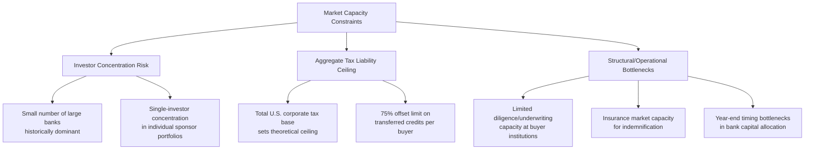

## Investor Concentration and Market Capacity Constraints

### Overview

Investor concentration and market capacity constraints refer to the structural limitations on the total volume of tax equity and tax credit transfer capital available in a given period, and the degree to which that capital supply is concentrated among a relatively small number of large participants. These constraints matter because tax credits (ITC, PTC, and related incentives) are only valuable to the extent a taxpayer has sufficient federal tax liability to absorb them; if aggregate market capacity is insufficient relative to the volume of credits generated by qualifying projects, developers face financing bottlenecks, pricing pressure, or delayed project timelines, regardless of how economically viable the underlying projects are.

### The Core Capacity Problem

**Key Points**

- **Tax Liability as the Binding Constraint**: Unlike conventional capital markets where capacity is bounded primarily by available cash or credit, tax equity and transfer capacity is bounded by the aggregate taxable income of eligible investors, since credits are only usable against actual tax liability (subject to the 75% offset limitation for transferred credits).
- **Historical Concentration**: Prior to the introduction of transferability, tax equity was supplied by a small number of large financial institutions with the internal expertise, balance sheet capacity, and risk appetite to structure partnership flip and sale-leaseback transactions. This concentration meant that a handful of investors' annual appetite effectively set a ceiling on how much renewable energy capacity could be financed via tax equity in a given year.
- **Growth in Underlying Credit Generation vs. Growth in Absorptive Capacity**: As statutory changes under the Inflation Reduction Act extended and expanded eligible credit categories (technology-neutral credits, advanced manufacturing credits, clean hydrogen, nuclear PTC, etc.), the pace of credit generation from qualifying projects has needed to be matched by a proportional expansion in buyer-side capacity to prevent oversupply relative to demand.

### Sources of Concentration Risk

### Investor Concentration: Institutional Level

**Key Points**

- **Bank Concentration Limits**: Individual banks typically maintain internal portfolio concentration limits on aggregate tax equity exposure, driven by risk management policies tied to regulatory capital allocation frameworks (see CET1 capital consumption considerations). This can create a hard ceiling on how much capacity any single institution will deploy in a calendar year, independent of how attractive available deals may be. [Inference: specific limits are internal, bank-by-bank policies and not publicly standardized or disclosed in real time.]
- **Sponsor-Level Concentration Risk**: From a developer/sponsor perspective, relying heavily on a single tax equity investor or a small number of repeat counterparties creates its own concentration risk — if that investor's appetite contracts (due to a change in earnings outlook, regulatory capital constraints, or strategic priorities), the sponsor's financing pipeline can be disrupted with limited ability to quickly substitute alternative capital.
- **Seasonal/Year-End Capacity Bottlenecks**: Historically, a substantial share of tax equity capital commitments have clustered toward calendar year-end, as investors finalize annual tax planning, creating a seasonal capacity crunch that can compress deal timelines and negotiating leverage for sponsors seeking to close before year-end deadlines.

### How Transferability Has Affected Concentration

**Key Points**

- The introduction of IRC Section 6418 transferability has meaningfully diversified the buyer base beyond the historically small group of traditional tax equity investors, drawing in regional banks, mid-cap corporates, and first-time buyers across a broad range of sectors (see related topic on new market entrants).
- This diversification reduces single-investor concentration risk at the market level: a broader base of buyers means the market is less dependent on the continued participation of any one large institution.
- However, aggregate capacity constraints have not been eliminated — they have shifted in character. Rather than being bottlenecked primarily by the appetite of a handful of large banks, capacity is now more directly tied to the aggregate federal tax liability of a much larger but still finite pool of buyers, and to the operational capacity of diligence, insurance, and intermediary infrastructure supporting the growing number of smaller transactions.
- Market data indicates growth has been particularly pronounced among smaller taxpayers (companies with under $200 million in annual tax expense saw purchase rates double year-over-year), suggesting the capacity base is genuinely broadening rather than merely redistributing among existing large players. [Inference: this broadening trend is based on available disclosure data through the most recent reporting period and may not fully capture private company or non-disclosing buyer activity.]

### Quantifying Capacity: A Simplified Framework

**Example**

A simplified way to conceptualize aggregate transfer market capacity in a given year:

$$Capacity_{market} = \sum_{i=1}^{n} \left( TaxLiability_i \times 0.75 \right) - PriorCommitments_i$$

Where for each buyer $i$: $TaxLiability_i$ is that buyer's projected federal tax liability for the relevant year, $0.75$ reflects the statutory limit that transferred credits may offset no more than 75% of a buyer's tax liability, and $PriorCommitments_i$ represents credit purchases or tax equity commitments the buyer has already made for that tax year.

This framework illustrates why market capacity is not a fixed, centrally-set number but rather an aggregate, decentralized function of thousands of individual buyers' tax positions — and why capacity estimates are inherently uncertain and revised as buyers' actual taxable income becomes clearer through the year. [Unverified — this is an illustrative simplified model; actual market capacity estimation by practitioners incorporates additional factors such as carryback/carryforward behavior, risk tolerance, and deal-specific pricing dynamics not captured here.]

### Comparative View: Traditional Tax Equity vs. Transfer Market Capacity Dynamics

| Factor | Traditional Tax Equity (Pre-2023 dominant model) | Transfer Market (Post-2023) |
| --- | --- | --- |
| Buyer Pool Size | Small (dozens of active large institutions) | Large and growing (100+ disclosed public company buyers, plus private buyers) |
| Concentration Risk | High — a few large banks set effective market ceiling | Lower — broader distribution across sectors, company sizes |
| Capacity Flexibility | Constrained by bank CET1/RWA capital allocation | Constrained by aggregate buyer tax liability and 75% offset limit |
| Structuring Complexity per Deal | High (partnership flip, HLBV, long-term relationship) | Lower (single cash transaction, standardized registration) |
| Diligence/Insurance Infrastructure Needs | Established, specialized internal teams | Growing intermediary/platform ecosystem to support new entrants |
| Sensitivity to Single-Investor Exit | High for sponsors reliant on few counterparties | Diluted across many potential buyers |

### Structural and Policy Factors That Can Tighten or Loosen Capacity

**Key Points**

- **Legislative Expansion of Eligible Credits**: Extensions or expansions of credit-eligible technologies (e.g., technology-neutral credits effective for projects starting in 2025, advanced manufacturing credits, clean hydrogen, nuclear PTC) increase the supply of credits needing buyers, which can tighten capacity if buyer growth does not keep pace.
- **Legislative Contraction (e.g., OBBBA-related changes)**: Subsequent legislative changes, such as those introduced under the One Big Beautiful Bill Act (OBBBA), can alter effective corporate tax liabilities or credit eligibility, which in turn affects both the supply of credits and the demand-side tax capacity available to absorb them. Market participants have noted that despite such changes, transfer market growth continued into 2025, suggesting resilience but not immunity to policy shifts. [Inference: the net directional effect of any specific legislative change on market capacity depends on multiple interacting provisions and is best assessed on a provision-by-provision basis with current professional guidance.]
- **FEOC (Foreign Entity of Concern) and Beginning-of-Construction Guidance**: Evolving Treasury guidance (e.g., Notice 2025-42 on beginning-of-construction rules, Notice 2026-15 on FEOC restrictions) can affect which projects qualify for credits at all, indirectly shaping the volume of credits seeking buyers in the market.
- **Insurance Market Capacity**: Because a majority of transfer transactions involve tax credit insurance as risk mitigation, the underwriting capacity and risk appetite of the tax credit insurance market itself acts as a secondary capacity constraint — reports of a tightening insurance market in the first half of 2025 illustrate how this ancillary market can itself become a bottleneck even when buyer tax appetite is otherwise sufficient.

### Risk Management Approaches for Sponsors Facing Capacity Constraints

**Key Points**

- **Diversify Counterparty Relationships**: Cultivate relationships with multiple potential tax equity or transfer buyers rather than relying on a single repeat counterparty, reducing exposure to any one investor's capacity or appetite changes.
- **Utilize Intermediary Platforms**: Engage transaction platforms or advisors that aggregate demand across many smaller buyers, which can improve access to capacity that would otherwise be fragmented and difficult to reach directly.
- **Time Transactions Strategically**: Be aware of seasonal capacity bottlenecks (e.g., year-end clustering of bank commitments) and, where possible, initiate diligence and negotiation processes well ahead of peak-demand periods.
- **Monitor Legislative and Regulatory Developments**: Because capacity is sensitive to statutory and regulatory changes, sponsors and their advisors should track evolving guidance that could affect either credit supply or buyer-side tax positions.
- **Consider Forward Sales**: Selling future-year credits (forward-market transactions) can help lock in capacity commitments ahead of the year the credit is actually generated, providing earlier certainty in a capacity-constrained environment.

### Related Topics

- New Entrants Since the Transfer Market Opened (comparative deep dive)
- Regulatory Capital Treatment for Bank Investors and CET1 Constraints
- Tax Credit Insurance Market Structure and Underwriting Capacity
- 75% Offset Limitation Mechanics for Transferred Credits
- Forward Sales and Future-Year Credit Transactions
- Impact of the One Big Beautiful Bill Act (OBBBA) on Credit Supply and Demand
- FEOC Restrictions and Beginning-of-Construction Guidance
- Corporate and Insurance Company Investors (comparative deep dive)
- Pricing Dynamics and Discount Rate Trends in the Transfer Market