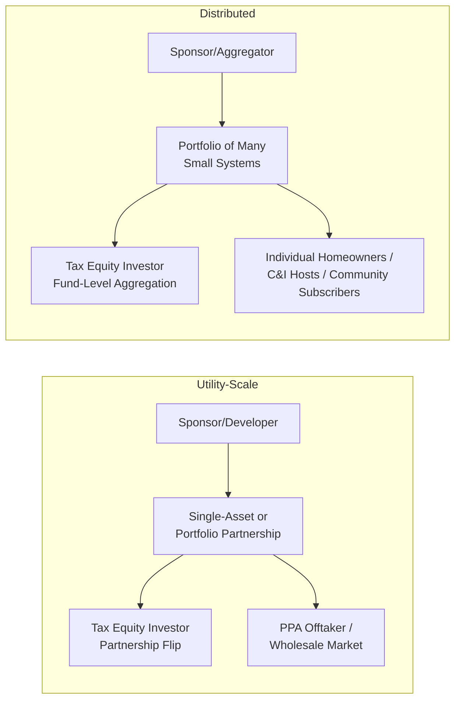

## Utility-Scale and Distributed Solar

### Overview

Solar generation projects represent one of the largest and most mature categories of tax-equity-financed clean energy assets, spanning two distinct market segments: utility-scale solar (large ground-mounted arrays, typically tens to hundreds of megawatts, selling power under long-term contracts or into wholesale markets) and distributed solar (smaller-scale systems, including residential rooftop, commercial and industrial (C&I) rooftop/carport, and community solar, typically sited at or near the point of consumption). Both segments qualify for federal tax incentives under the Investment Tax Credit (ITC) framework, but they differ meaningfully in financing structure, ownership models, credit adder eligibility, and the operational risk profile that investors must underwrite.

### Segment Definitions and Scale

**Key Points**

- **Utility-Scale Solar**: Generally defined as projects interconnected at the transmission or high-voltage distribution level, often exceeding 20 MW (with many utility-scale projects in the 100 MW+ range), typically selling output under a Power Purchase Agreement (PPA) to a utility or corporate offtaker, or merchant into wholesale electricity markets.
- **Distributed Solar**: Encompasses smaller systems, generally under 5 MW, interconnected at the distribution level and located at or near the load it serves. Sub-categories include:
  - Residential rooftop solar (typically 5-15 kW systems)
  - Commercial and industrial (C&I) rooftop or carport solar (typically tens of kW to low single-digit MW)
  - Community solar (shared subscription-based projects, typically 1-5 MW, serving multiple offtake subscribers who receive bill credits)

### Applicable Tax Incentives

**Key Points**

- **Investment Tax Credit (ITC) under Section 48 / Technology-Neutral Credit under Section 48E**: Solar projects have historically qualified for the ITC under Section 48, calculated as a percentage of the eligible tax basis (qualified cost) of the project. For projects placed in service beginning in 2025, the technology-neutral clean electricity investment credit under Section 48E generally applies instead, extending similar mechanics to any qualifying zero-emissions generation technology, including solar.
- **Base Credit Rate and Bonus Adders**: The base ITC rate is generally 6% but a 30% rate applies when prevailing wage and apprenticeship (PWA) requirements are met (or for projects under 1 MW, which are exempt from the PWA requirement). Additional bonus credit adders can increase the total credit percentage:
  - **Domestic Content Adder**: An additional percentage (commonly cited as up to 10 percentage points) for projects meeting domestic manufacturing thresholds for steel, iron, and manufactured products.
  - **Energy Community Adder**: An additional percentage (commonly cited as up to 10 percentage points) for projects sited in defined energy communities (e.g., brownfield sites, areas with historical fossil fuel employment or closed coal facilities).
  - **Low-Income Community Adder**: Under Section 48(e), an additional allocation-based adder (commonly cited as 10-20 percentage points depending on category) is available for smaller solar and wind facilities (generally under 5 MW) sited in low-income communities, on Indian land, as part of qualified low-income residential building projects, or as part of qualified low-income economic benefit projects — this adder is subject to an annual capacity allocation and competitive application process administered by the IRS/Treasury.
- **Production Tax Credit (PTC) Alternative**: Solar developers may alternatively elect the PTC (Section 45 / Section 45Y technology-neutral production credit) rather than the ITC, receiving a per-kWh credit for actual electricity generated over a 10-year period rather than an upfront investment-based credit — this election involves a trade-off between upfront certainty (ITC) and generation-linked, potentially larger total value (PTC) depending on project capacity factor and financing structure.
- **Depreciation Benefits**: Solar projects also qualify for accelerated depreciation under the Modified Accelerated Cost Recovery System (MACRS), typically over a 5-year recovery period, which is a significant component of total tax equity value alongside the ITC/PTC itself.

### Tax Credit Stacking: Illustrative Example

**Example**

A 50 MW utility-scale solar project meets prevailing wage and apprenticeship requirements (30% base rate), is sited in a designated energy community (+10 percentage points), and meets domestic content thresholds (+10 percentage points):

$$ITC\ Rate_{total} = 30\% + 10\% + 10\% = 50\%$$

If the eligible tax basis of the project is $60 million:

$$ITC\ Value = \$60{,}000{,}000 \times 0.50 = \$30{,}000{,}000$$

This $30 million credit, combined with accelerated MACRS depreciation on the depreciable basis (which is typically reduced by half the ITC claimed, per the basis reduction rule), forms the core tax benefit package that a tax equity investor or credit buyer values when pricing participation in the project. [Unverified — actual adder stacking, basis calculation, and eligibility determinations are project-specific and depend on satisfying detailed IRS guidance and, for domestic content and energy community adders, specific technical safe harbor thresholds that should be confirmed with qualified tax counsel.]

### Financing Structure Comparison: Utility-Scale vs. Distributed

### Key Structural Differences

| Attribute | Utility-Scale Solar | Distributed Solar |
| --- | --- | --- |
| Typical Project Size | 20 MW - 500+ MW | Under 5 MW per system/project |
| Offtake Structure | Long-term PPA or merchant | Net metering, lease/PPA to host, community subscription |
| Financing Aggregation | Often single-asset or small portfolio | Frequently pooled into large fund vehicles (hundreds/thousands of systems) |
| Tax Equity Investor Diligence Focus | Interconnection, offtaker credit, single-asset performance | Portfolio-level statistical performance, servicing/O&M scalability, subscriber/host credit diversification |
| PWA Applicability | Generally required for 30% base rate (except sub-1MW) | Often exempt due to sub-1MW system size |
| Low-Income Adder Relevance | Rarely applicable (size threshold) | Frequently targeted, especially community solar |
| Typical Investor Base | Banks, insurers, corporates (partnership flip or transfer) | Specialized residential/distributed solar tax equity funds, banks |

### Distributed Solar: Portfolio and Securitization Considerations

**Key Points**

- **Statistical Underwriting**: Because distributed solar (especially residential) financing typically involves pooling thousands of individual systems, tax equity investors and lenders underwrite based on portfolio-level statistical assumptions (expected default/cancellation rates, average system performance degradation, customer credit score distributions) rather than single-asset diligence.
- **Fund-Level Aggregation Structures**: Residential and small commercial solar developers commonly use warehouse facilities and fund-level partnership flip structures that aggregate many individual system-level leases or PPAs into a single tax equity partnership, allowing tax benefits to be claimed at the fund level while systems are added to the portfolio over time (subject to specific IRS guidance on "vintage" pooling of assets placed in service across different tax years).
- **Community Solar and the Low-Income Adder**: Community solar projects are frequently structured specifically to qualify for the Section 48(e) low-income community bonus, given their sub-5MW size and their design to serve subscriber bases that can include income-qualified households — this requires careful subscriber eligibility documentation and, where applicable, participation in the competitive annual allocation process.

### Common Risk Factors by Segment

**Key Points**

**Utility-Scale:**

- Interconnection queue delays and transmission upgrade cost allocation risk
- Offtaker (PPA counterparty) credit risk over the contract term
- Construction and commissioning risk affecting placed-in-service timing (critical for both ITC eligibility and beginning-of-construction safe harbor determinations)
- Basis risk in cost segregation and fair market value support for ITC calculation

**Distributed:**

- Aggregation and servicing risk across large numbers of individual systems and customer accounts
- Customer/host credit and cancellation risk (particularly relevant to residential lease/PPA models)
- Net metering policy risk, as state-level net metering rules can change and affect the economics of distributed systems already in service
- Recapture risk tied to system removal, customer relocation, or premature contract termination across a large portfolio

### Illustrative Basis Reduction and Depreciation Interaction (svg_diagram)

<svg xmlns="http://www.w3.org/2000/svg" viewBox="0 0 780 380">
\<style\>
.box { fill: #f4f6f8; stroke: #33475b; stroke-width: 1.5; }
.txt { font-family: Arial, sans-serif; font-size: 13px; fill: #1a1a1a; }
.title { font-family: Arial, sans-serif; font-size: 16px; fill: #1a1a1a; font-weight: bold; }
.arrow { stroke: #33475b; stroke-width: 1.5; fill: none; marker-end: url(#arrow2); }
.num { font-family: Arial, sans-serif; font-size: 13px; fill: #1a1a1a; font-weight: bold; }
\</style\>
<text x="160" y="28" class="title">Solar Project Basis and Depreciation Flow (svg_diagram)</text>
<rect x="40" y="60" width="220" height="60" rx="6" class="box" />
<text x="55" y="85" class="txt">Total Eligible Tax Basis</text>
<text x="55" y="103" class="num">$60,000,000</text>
<line x1="260" y1="90" x2="320" y2="90" class="arrow" />
<rect x="320" y="60" width="220" height="60" rx="6" class="box" />
<text x="335" y="85" class="txt">ITC Claimed (50% rate)</text>
<text x="335" y="103" class="num">$30,000,000</text>
<line x1="150" y1="120" x2="150" y2="170" class="arrow" />
<line x1="430" y1="120" x2="430" y2="170" class="arrow" />
<rect x="40" y="170" width="220" height="70" rx="6" class="box" />
<text x="55" y="195" class="txt">Basis Reduction</text>
<text x="55" y="213" class="txt">(50% of ITC claimed)</text>
<text x="55" y="231" class="num">$15,000,000 reduction</text>
<rect x="320" y="170" width="220" height="70" rx="6" class="box" />
<text x="335" y="195" class="txt">Depreciable Basis</text>
<text x="335" y="213" class="txt">(Total basis minus reduction)</text>
<text x="335" y="231" class="num">$45,000,000</text>
<line x1="430" y1="240" x2="430" y2="280" class="arrow" />
<rect x="320" y="280" width="220" height="60" rx="6" class="box" />
<text x="335" y="305" class="txt">MACRS 5-Year Depreciation</text>
<text x="335" y="323" class="txt">applied to $45M basis</text>
</svg>

### Related Topics

- Prevailing Wage and Apprenticeship (PWA) Requirements for ITC Bonus Rate
- Domestic Content and Energy Community Bonus Adder Mechanics
- Section 48(e) Low-Income Community Bonus Credit Allocation Process
- MACRS Depreciation and ITC Basis Reduction Rules
- Onshore and Offshore Wind Tax Credit Structures (comparative)
- Community Solar Subscriber Eligibility and Structuring
- Interconnection Queue Risk and Beginning-of-Construction Safe Harbors
- Cost Segregation and Fair Market Value Support for ITC Basis
- Residential Solar Lease/PPA Portfolio Aggregation Structures