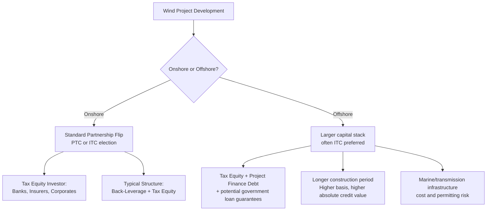

## Onshore and Offshore Wind

### Overview

Wind generation is one of the original and largest asset classes financed through federal tax equity, historically anchored by the Production Tax Credit (PTC) under Section 45, with an Investment Tax Credit (ITC) election also available under Section 48. The sector divides into two structurally distinct segments: onshore wind, a mature technology with decades of tax equity market history and standardized financing structures, and offshore wind, a comparatively nascent U.S. market segment characterized by much larger project scale, materially higher capital costs, longer development timelines, and distinct regulatory and permitting frameworks. Both segments now fall under the technology-neutral credit regime (Section 45Y PTC / Section 48E ITC) for projects placed in service beginning in 2025, but retain many technology-specific structuring conventions developed under the legacy Section 45/48 regime.

### Segment Definitions

**Key Points**

- **Onshore Wind**: Land-based wind turbine installations, typically organized into wind farms ranging from a few dozen megawatts to several hundred megawatts, sited based on wind resource quality, land availability, and transmission access.
- **Offshore Wind**: Turbine installations sited in coastal waters, generally categorized as fixed-bottom (in shallower waters, using monopile or jacket foundations) or floating (in deeper waters, using floating platform technology), typically developed at much larger individual project scale (often 500 MW to 1+ GW) due to the high fixed costs of marine infrastructure, transmission cabling, and specialized installation vessels.

### Applicable Tax Incentives

**Key Points**

- **Production Tax Credit (PTC) — Section 45 (legacy) / Section 45Y (technology-neutral, 2025+)**: The traditional and most commonly elected incentive for wind, providing a per-kWh credit for electricity generated and sold over a 10-year period beginning when the facility is placed in service. The base credit rate is a fraction of the full statutory rate unless prevailing wage and apprenticeship (PWA) requirements are met, in which case the full rate (commonly cited as up to 2.75 cents/kWh, inflation-adjusted) applies.
- **Investment Tax Credit (ITC) Election — Section 48 (legacy) / Section 48E (technology-neutral, 2025+)**: Wind developers may elect the ITC in lieu of the PTC, receiving an upfront credit based on eligible tax basis rather than a 10-year generation-linked stream. This election is more common for offshore wind, given the exceptionally high capital intensity and desire for more immediate, less generation-variance-dependent tax benefit realization.
- **Bonus Adders**: Both the PTC and ITC pathways can qualify for the same category of adders available to other technologies:
  - **Domestic Content Adder**: Increases the credit rate (commonly cited as roughly 10% for PTC or up to 10 percentage points for ITC) for projects meeting domestic manufacturing thresholds for steel, iron, and manufactured components — a particularly significant consideration for offshore wind given the current limited scale of domestic offshore wind supply chains.
  - **Energy Community Adder**: Available for projects sited in qualifying energy communities.
  - **Low-Income Community Adder (Section 48(e))**: Available for smaller wind facilities (generally under 5 MW) under the same allocation-based framework applicable to solar, though this is far more relevant to small onshore community wind than to large-scale onshore or offshore projects.
- **Depreciation**: Wind projects qualify for accelerated depreciation under MACRS, typically over a 5-year recovery period, forming a substantial secondary component of total tax equity value alongside the PTC/ITC.

### PTC vs. ITC Election: Comparative Value Framework

**Example**

Consider a 200 MW onshore wind project with a 40% capacity factor, electing the PTC at the full inflation-adjusted rate (illustratively $0.0275/kWh):

$$Annual\ Generation = 200{,}000\ kW \times 8{,}760\ hours \times 0.40 = 700{,}800{,}000\ kWh$$

$$Annual\ PTC\ Value = 700{,}800{,}000 \times \$0.0275 \approx \$19{,}272{,}000$$

Over the full 10-year credit period, assuming stable generation, this produces a nominal undiscounted PTC value in the range of $190 million+, though the actual present value to a tax equity investor depends heavily on discounting for the time value of money and generation variability risk across the 10-year window. [Unverified — illustrative calculation only; actual capacity factors, inflation adjustments to the PTC rate, and generation profiles vary by project and are subject to production risk, curtailment, and resource variability not reflected in this simplified model.]

By contrast, an equivalent project electing the ITC would receive a single upfront credit based on eligible basis (e.g., 30-50%+ depending on adders stacked), with no further tax credit tied to actual generation performance in subsequent years — trading potential upside from strong generation performance for reduced production-risk exposure in the tax benefit itself.

### Onshore vs. Offshore Structural Comparison

### Key Differences: Onshore vs. Offshore Wind

| Attribute | Onshore Wind | Offshore Wind |
| --- | --- | --- |
| Typical Project Scale | Tens to several hundred MW | 500 MW to 1+ GW |
| Market Maturity (U.S.) | Mature, decades of tax equity history | Nascent, still-developing supply chain and financing precedent |
| Preferred Credit Election | PTC common (generation-linked) | ITC more common (large upfront basis, reduces generation-risk exposure on tax value) |
| Capital Intensity | Moderate | Very high (marine foundations, offshore substations, specialized vessels) |
| Financing Complexity | Standardized partnership flip | Often more complex, larger syndicates, potential blended public/private capital |
| Domestic Content Adder Relevance | Achievable with established domestic supply chain | More challenging given limited current U.S. offshore-specific manufacturing base |
| Permitting/Regulatory Bodies | State/local siting, FAA (turbine height), wildlife agencies | BOEM (Bureau of Ocean Energy Management) leasing, additional federal marine/environmental review |
| Construction Timeline | Typically 1-2 years | Often 3-5+ years including permitting |

### Structuring Considerations Specific to Wind

**Key Points**

- **Back-Leverage Financing**: Onshore wind partnership flip structures commonly layer a "back-leverage" debt facility at the sponsor's level (behind the tax equity investor) to increase sponsor returns, distinct from and structurally subordinate to the tax equity investor's position in the project-level partnership.
- **Generation Risk and P50/P90 Estimates**: Because PTC value is directly tied to actual electricity output, tax equity investors underwriting PTC-elected wind deals rely heavily on independent wind resource assessments, typically expressed as P50 (median expected generation) and P90 (generation expected to be exceeded with 90% probability) estimates, to model downside credit value scenarios.
- **Repowering and Recapture Considerations**: Older onshore wind fleets approaching the end of their original equipment life may undergo "repowering" (replacing key components such as blades, nacelles, or full turbines), which can trigger a new PTC eligibility period under specific IRS safe harbor guidance regarding the percentage of new vs. retained property value — a specialized area requiring careful basis and eligibility analysis.
- **Offshore-Specific Federal Support Mechanisms**: Offshore wind has historically also drawn on other federal support tools beyond tax credits alone, including Department of Energy loan guarantee programs, given the scale of capital required and the relative novelty of the U.S. offshore market. [Inference: the availability and terms of any such non-tax-credit federal support are subject to change based on current administration priorities and appropriations, and should be verified against current program status.]
- **Interconnection and Transmission**: Both segments face interconnection queue risk, but offshore wind carries the added complexity of new transmission infrastructure (offshore substations, export cables to shore) that must be separately permitted, financed, and coordinated with regional transmission organizations.

### Risk Factors by Segment

**Key Points**

**Onshore:**

- Wind resource variability affecting PTC realization versus P50/P90 projections
- Curtailment risk in constrained transmission zones
- Repowering-related recapture and basis complexity for aging fleets
- Land lease and easement renewal risk over long project lives

**Offshore:**

- Permitting and regulatory timeline risk (BOEM leasing process, environmental review)
- Marine construction and specialized vessel availability risk
- Higher absolute capital exposure per project, concentrating investor risk in fewer, larger transactions
- Domestic content adder achievability given still-developing offshore-specific U.S. supply chains
- Weather and marine logistics risk affecting construction schedule and placed-in-service timing

### Related Topics

- PTC vs. ITC Election Analysis and Present Value Modeling
- Prevailing Wage and Apprenticeship (PWA) Requirements for Wind Projects
- Wind Repowering and PTC Recapture/Eligibility Rules
- BOEM Offshore Leasing Process and Federal Permitting Framework
- Back-Leverage Debt Structuring in Partnership Flip Transactions
- Domestic Content Adder Supply Chain Analysis for Offshore Wind
- Utility-Scale and Distributed Solar (comparative technology deep dive)
- Technology-Neutral Credit Regime: Section 45Y and 48E Transition
- P50/P90 Wind Resource Assessment Methodology