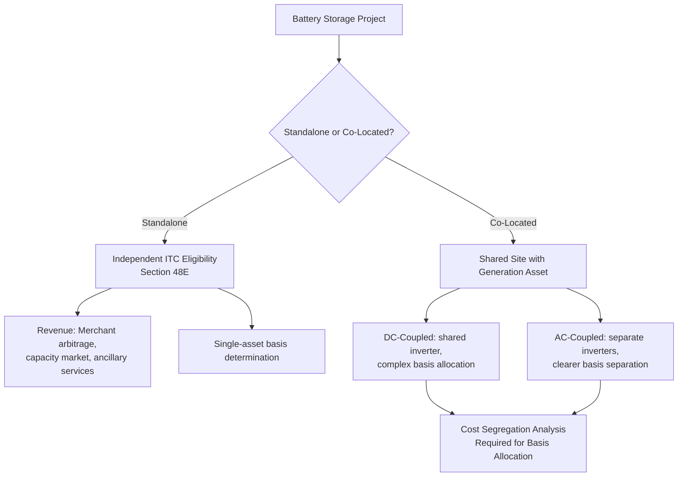

## Standalone and Co-Located Battery Storage

### Overview

Battery energy storage systems (BESS) represent one of the most significant beneficiaries of Inflation Reduction Act (IRA) tax policy changes, since prior to the IRA, standalone storage generally did not qualify for the Investment Tax Credit (ITC) on its own — storage was only credit-eligible when charged predominantly by an on-site renewable energy source and co-located with that generation asset. The IRA established standalone energy storage as an independently ITC-eligible technology, fundamentally expanding the addressable market for storage tax equity financing. This section covers both standalone storage (a battery system with no co-located generation asset) and co-located storage (a battery system paired with a generation asset, such as solar-plus-storage), examining how their tax treatment, structuring, and risk profiles differ.

### Segment Definitions

**Key Points**

- **Standalone Battery Storage**: A battery energy storage system that is not directly co-located with, or dependent on, a specific renewable generation asset for charging. Standalone storage typically charges from the grid and discharges based on market price signals, capacity market obligations, or grid services contracts (e.g., frequency regulation, ancillary services, capacity payments).
- **Co-Located (Hybrid) Storage**: A battery system installed alongside a generation asset (most commonly solar, sometimes wind) at the same site, often sharing interconnection infrastructure. Co-located systems may be DC-coupled (sharing the same inverter/DC bus as the generation asset) or AC-coupled (each with separate inverters, connected at the AC interconnection point).

### Applicable Tax Incentives

**Key Points**

- **Investment Tax Credit (ITC) Eligibility for Standalone Storage**: Under Section 48 (legacy) and the technology-neutral Section 48E (2025+), standalone energy storage technology with a capacity of at least 5 kWh is independently eligible for the ITC, without any requirement to be charged by a specific renewable source or co-located with generation. This was a foundational change introduced by the IRA, effective for property placed in service after December 31, 2022.
- **Base Rate and PWA Bonus**: As with solar and wind, the base ITC rate for storage is generally 6%, increasing to 30% when prevailing wage and apprenticeship (PWA) requirements are satisfied (or for projects under 1 MW, which are exempt from PWA requirements).
- **Bonus Adders**: Standalone and co-located storage can access the same bonus adder categories available to other ITC-eligible technologies:
  - **Domestic Content Adder**: Additional percentage points for meeting domestic manufacturing thresholds for battery cells, modules, and other manufactured components.
  - **Energy Community Adder**: Additional percentage points for siting in qualifying energy communities.
  - **Low-Income Community Adder (Section 48(e))**: Available for smaller storage facilities under the same allocation-based framework as solar and wind, subject to the annual competitive allocation process.
- **Depreciation**: Storage assets qualify for accelerated MACRS depreciation, typically over a 5-year (sometimes 7-year, depending on asset classification) recovery period, forming a meaningful component of total tax benefit value alongside the ITC.
- **No PTC Option**: Unlike solar and wind, storage is generally only eligible for the investment-based credit (ITC/48E), not a production-based credit, since storage does not "generate" electricity in the same metered sense — its tax credit value is based on installed capacity/cost basis rather than energy output.

### Co-Located Storage: Basis Allocation Complexity

**Key Points**

- **Shared Interconnection and Cost Allocation**: When storage is co-located with generation (e.g., solar-plus-storage), sponsors and their tax advisors must carefully allocate shared costs (interconnection equipment, land, certain balance-of-system components) between the generation and storage assets to correctly determine each asset's eligible tax basis, since both may separately qualify for the ITC.
- **DC-Coupled vs. AC-Coupled Basis Treatment**: DC-coupled systems, where the battery shares an inverter with the solar array, can raise more complex basis-allocation questions than AC-coupled systems, where each technology has more clearly separable equipment and costs — sponsors typically engage cost segregation specialists to support defensible basis allocation in either configuration.
- **Charging Source Considerations (Historical Context)**: Prior to standalone storage ITC eligibility, co-located storage credit eligibility depended on the percentage of charging energy sourced from the co-located renewable asset versus the grid, governed by specific IRS guidance thresholds. While this constraint is now less binding given standalone eligibility, understanding this legacy framework remains relevant for older projects and for structuring choices where investors may still prefer clearer generation-storage integration for other commercial reasons (e.g., single offtake agreement, combined revenue optimization).

### Standalone vs. Co-Located Structural Comparison

### Revenue Models Affecting Investor Underwriting

**Key Points**

- **Standalone Storage Revenue Streams**: Because standalone storage typically lacks a single long-term generation-linked offtake agreement, tax equity investors must underwrite a more complex, often multi-stream revenue model, which can include:
  - Energy arbitrage (charging when wholesale prices are low, discharging when high)
  - Capacity market payments (compensation for guaranteed availability during system peak demand periods)
  - Ancillary services (frequency regulation, voltage support, spinning reserve)
  - Tolling agreements (a fixed-payment contract where an offtaker controls dispatch in exchange for a capacity-based payment to the storage owner)
- **Co-Located Storage Revenue**: May benefit from a more integrated revenue model tied to the generation asset's existing PPA, or may separately monetize storage-specific services alongside the generation asset's contracted revenue, depending on contractual structure.
- **Revenue Volatility and Investor Risk Tolerance**: Because standalone storage revenue is frequently more merchant-exposed (dependent on real-time market prices and capacity market clearing outcomes) compared to a fixed-price PPA, tax equity investors underwriting standalone storage transactions often apply more conservative revenue assumptions and may require additional structural protections (e.g., minimum revenue guarantees, hedges, or tolling agreements) to support financeability. [Inference: the degree of conservatism applied varies by investor and market conditions, and is not a fixed, universally quoted underwriting standard.]

### Comparative Table: Standalone vs. Co-Located Storage

| Attribute | Standalone Storage | Co-Located Storage |
| --- | --- | --- |
| ITC Eligibility Basis | Independent, based on storage capacity/cost | Independent for storage; shared-site cost allocation with generation asset |
| Typical Revenue Model | Merchant arbitrage, capacity market, ancillary services, tolling | Integrated with generation PPA or separately monetized |
| Basis Determination Complexity | Lower (single asset class) | Higher (requires cost segregation for shared infrastructure) |
| Investor Underwriting Focus | Market price/revenue volatility, dispatch optimization | Generation asset performance + storage integration risk |
| Common Configuration | Grid-charged, independent site | DC-coupled or AC-coupled with solar/wind |
| PWA/Adder Eligibility | Same framework as generation assets | Same framework as generation assets |

### Structuring Considerations

**Key Points**

- **Partnership Flip Applicability**: Standalone and co-located storage can both be financed through standard partnership flip tax equity structures, similar to solar and wind, though standalone storage's more complex, multi-stream revenue profile may result in different flip point timing and yield structuring compared to fixed-PPA generation assets.
- **Tax Credit Transfer Applicability**: Storage ITC is fully eligible for transfer under IRC Section 6418, and given the relative simplicity of storage-only basis determination (for standalone systems), storage projects have been noted among the technology types attracting transfer market buyer interest, particularly as buyers gain comfort with newer credit categories. [Inference: relative attractiveness to transfer buyers depends on prevailing market pricing dynamics for different technology types, which shift over time.]
- **Interconnection Considerations**: Storage projects, whether standalone or co-located, must navigate interconnection queue processes; co-located systems sharing interconnection capacity with generation assets can sometimes achieve faster or more cost-effective interconnection than a comparable standalone system requiring its own new interconnection request, though this varies significantly by grid operator and region. [Inference: interconnection process efficiencies are jurisdiction- and grid-operator-specific and not a universal rule.]

### Risk Factors by Segment

**Key Points**

**Standalone:**

- Merchant revenue volatility tied to wholesale energy and capacity market price fluctuations
- Capacity market rule changes or clearing price uncertainty in the relevant regional transmission organization (RTO/ISO)
- Degradation and cycling risk affecting long-term capacity and revenue-generating ability
- Basis support risk if cost documentation for a single, less-precedented asset class faces heightened IRS scrutiny

**Co-Located:**

- Cost allocation and basis-splitting risk between generation and storage components
- Integration and interconropriate curtailment risk (e.g., DC-coupled systems experiencing clipping losses)
- Combined asset underperformance risk if generation asset performance issues affect storage charging patterns and revenue

### Related Topics

- Cost Segregation Methodology for Co-Located Generation-Storage Assets
- Capacity Market and Ancillary Services Revenue Modeling for Storage
- DC-Coupled vs. AC-Coupled System Design and Tax Basis Implications
- Utility-Scale and Distributed Solar (comparative technology deep dive)
- Tolling Agreements as a Storage Revenue De-Risking Structure
- Domestic Content Adder Supply Chain Analysis for Battery Manufacturing
- Section 48(e) Low-Income Community Bonus Credit Allocation Process
- IRC Section 6418 Transferability Mechanics Applied to Storage Assets
- Interconnection Queue Dynamics for Standalone vs. Hybrid Storage Projects