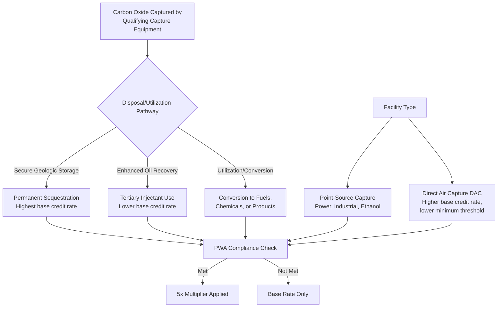

## Carbon Capture and Sequestration

### Overview

Carbon capture and sequestration (CCS), along with carbon capture, utilization, and storage (CCUS), is a technology category incentivized primarily through Section 45Q of the Internal Revenue Code, which provides a per-metric-ton tax credit for qualified carbon oxide that is captured using carbon capture equipment and either permanently sequestered in secure geologic storage, used as a tertiary injectant in enhanced oil recovery (EOR), or utilized in other qualifying ways. Unlike the technology-neutral clean electricity credits (Section 45Y/48E), Section 45Q is a standalone, technology-specific credit that predates the IRA but was substantially expanded and extended by it, and it applies across industrial source categories (power generation, ethanol production, natural gas processing, cement, hydrogen production, and direct air capture) rather than being limited to electricity generation.

### Core Credit Mechanics Under Section 45Q

**Key Points**

- **Credit Structure**: Section 45Q provides a credit per metric ton of qualified carbon oxide captured and disposed of, with the credit rate varying based on (1) the disposal/utilization pathway and (2) whether the capture equipment is a direct air capture (DAC) facility or another type of qualifying facility.
- **Disposal/Utilization Pathways and Rates**: The statute establishes different credit rates depending on end use:
  - Secure geologic storage (permanent sequestration, no EOR use) generally commands the highest credit rate.
  - Utilization as a tertiary injectant for enhanced oil recovery (EOR), or other qualifying utilization/conversion into products, generally commands a somewhat lower rate than pure secure storage, reflecting the different environmental value proposition.
  - Direct air capture (DAC) facilities receive materially higher credit rates than conventional point-source capture, in recognition of the higher cost and technological novelty of removing carbon dioxide directly from ambient air rather than from a concentrated industrial flue stream.
- **Prevailing Wage and Apprenticeship (PWA) Multiplier**: As with the clean electricity credits, meeting PWA requirements during construction (and, for the credit period, alteration/repair) multiplies the base credit rate upward — generally by a factor of five — making PWA compliance a major driver of total credit value.
- **Minimum Capture Thresholds**: Facilities must meet minimum annual carbon oxide capture thresholds to qualify, with different thresholds applying by facility type (e.g., lower thresholds for direct air capture facilities compared to power generation or industrial facilities), reflecting Congressional intent to make the credit accessible to a range of facility scales appropriate to each technology's typical deployment size.
- **Credit Period**: The credit is generally available for a 12-year period beginning when the carbon capture equipment is originally placed in service, applied to each ton of qualified carbon oxide captured and disposed of, utilized, or injected during that period.

### Qualifying Pathways: Structural Overview

### Ownership and Election Mechanics

**Key Points**

- **Default Ownership Rule**: The Section 45Q credit is generally available to the person or entity that owns the carbon capture equipment and physically or contractually ensures the captured carbon oxide is disposed of, injected, or utilized in a qualifying manner — this is often, but not always, the same entity that owns the underlying industrial facility generating the carbon oxide.
- **Election to Transfer Credit to the Person Disposing of Carbon Oxide**: Section 45Q permits the credit-eligible party (the equipment owner) to elect to allow the person who physically captures and disposes of, injects, or utilizes the carbon oxide (if a different party) to claim the credit instead — this differs from the general IRC Section 6418 transferability regime and is a mechanism specific to 45Q's own statutory structure, distinct from a market sale of the credit.
- **IRC Section 6418 Transferability**: Separately, Section 45Q credits are also included among the credits eligible for transfer under Section 6418, allowing the credit-eligible taxpayer to sell all or a portion of the credit to an unrelated third-party buyer for cash, following the same general transfer market mechanics applicable to ITC/PTC credits (registration number requirement, 75% offset limitation for the buyer, cash-only consideration, one-time transfer restriction).
- **Direct Pay Option for Certain Entities**: Tax-exempt organizations, state and local governments, and certain other specified entities may be eligible for direct pay (elective payment) treatment under Section 6417 for the 45Q credit, receiving a cash payment from the IRS in lieu of a nonexistent or insufficient tax liability, for a limited initial period specified in the statute before other transfer mechanisms become the applicable option for certain claimants.

### Illustrative Credit Calculation

**Example**

A direct air capture facility captures 100,000 metric tons of qualified carbon oxide annually and permanently sequesters it in secure geologic storage, meeting PWA requirements (5x multiplier applied to an illustrative DAC base rate):

$$Annual\ Credit\ Value = Tons\ Captured \times Credit\ Rate\ per\ Ton$$

Using an illustrative post-PWA-multiplier DAC secure-storage rate:

$$Annual\ Credit\ Value = 100{,}000 \times \$180 = \$18{,}000{,}000$$

Over the 12-year credit period, assuming stable annual capture volumes, this produces a substantial cumulative credit value, though actual realized value depends on the facility consistently meeting minimum capture thresholds and properly documenting secure geologic storage compliance each year. [Unverified — illustrative calculation using an approximate rate; actual current statutory rates, inflation adjustments, and DAC-specific thresholds should be confirmed against the current Internal Revenue Code text and IRS guidance, as specific dollar figures are subject to periodic inflation adjustment and potential legislative amendment.]

### Financing Structures for CCS Projects

**Key Points**

- **Tax Equity Partnership Structures**: Similar in concept to renewable energy partnership flips, CCS projects can be financed through partnerships where a tax equity investor contributes capital in exchange for an allocation of Section 45Q credits (and associated depreciation), with a negotiated flip point transferring greater residual economics to the sponsor thereafter.
- **Credit Transfer as an Increasingly Common Alternative**: Given the complexity of measuring, verifying, and monitoring carbon oxide capture and disposal over a 12-year compliance period, and the relative novelty of CCS-specific tax equity partnership precedent compared to renewable electricity generation, credit transfer under Section 6418 has been an attractive simplification path for CCS project sponsors, avoiding the need to negotiate complex measurement-and-verification-linked partnership allocations. [Inference: relative usage rates of transfer versus traditional tax equity for 45Q credits specifically are not independently verified here and depend on evolving market practice.]
- **EOR-Linked Revenue Considerations**: For projects using captured carbon oxide as a tertiary injectant in enhanced oil recovery, project economics often combine 45Q credit value with incremental oil production revenue, requiring investors to underwrite both the carbon capture/credit compliance risk and the oil price/production risk associated with the EOR operation — a materially different risk profile than pure geologic storage or renewable electricity projects.
- **Long-Term Monitoring, Reporting, and Verification (MRV) Obligations**: Secure geologic storage claims require an EPA-approved MRV plan under the Greenhouse Gas Reporting Program (or equivalent), and ongoing compliance with this plan over the credit period (and often beyond, for post-injection monitoring) is a critical due diligence and structuring consideration for any investor or credit buyer, since failure to maintain compliant storage can jeopardize credit eligibility or trigger recapture exposure.

### Comparative Table: CCS/CCUS vs. Renewable Electricity Tax Credits

| Attribute | Section 45Q (Carbon Capture) | Section 45Y/48E (Clean Electricity) |
| --- | --- | --- |
| Credit Basis | Per metric ton of carbon oxide captured/disposed | Per kWh generated (PTC) or % of eligible basis (ITC) |
| Applicable Sectors | Power, industrial, ethanol, cement, hydrogen, DAC | Electricity generation technologies |
| Credit Period | 12 years from equipment placed in service | 10 years (PTC) or one-time (ITC) |
| Key Compliance Requirement | MRV plan, secure storage verification | Placed-in-service and (for PTC) generation metering |
| Ownership Flexibility | Statutory election to allocate credit to disposal party | General partnership allocation rules apply |
| Transfer Eligibility (6418) | Yes | Yes |
| Direct Pay Eligibility (6417) | Yes, for specified eligible entities | Yes, for specified eligible entities |

### Risk Factors

**Key Points**

- **MRV Compliance and Recapture Risk**: Failure to maintain a compliant Monitoring, Reporting, and Verification plan, or a demonstrated leak or failure of secure geologic storage, can create recapture exposure for previously claimed credits — a risk profile distinct from, and in some respects more operationally intensive than, typical renewable electricity recapture triggers.
- **Minimum Threshold Maintenance**: Facilities must sustain qualifying annual capture volumes above the applicable minimum threshold; underperformance relative to design capacity can jeopardize credit eligibility for a given year.
- **Technology and Cost Risk (Particularly DAC)**: Direct air capture remains a comparatively immature technology relative to point-source capture, with higher per-ton capture costs and less operational track record, creating additional technology performance risk for investors.
- **EOR Oil Price Exposure**: Projects tied to enhanced oil recovery introduce commodity price risk into what is otherwise a tax-credit-driven investment thesis, requiring investors to separately underwrite oil market conditions.
- **Permitting Risk for Class VI Injection Wells**: Secure geologic storage typically requires EPA (or state primacy) Class VI injection well permits, and the permitting timeline for these wells has historically been a significant project development risk and schedule driver. [Inference: permitting timelines and process efficiency are subject to ongoing regulatory developments, including potential state primacy program expansions, and should be verified against current EPA/state program status.]

### Related Topics

- Monitoring, Reporting, and Verification (MRV) Plan Requirements Under the Greenhouse Gas Reporting Program
- Class VI Injection Well Permitting Process (EPA and State Primacy Programs)
- Direct Air Capture (DAC) Technology and Cost Structure
- Section 6417 Direct Pay (Elective Payment) Mechanics
- IRC Section 6418 Transferability Mechanics Applied to 45Q Credits
- Enhanced Oil Recovery (EOR) Revenue and Risk Modeling
- Clean Hydrogen Production Tax Credit (Section 45V) Interaction with CCS
- Prevailing Wage and Apprenticeship (PWA) Multiplier Mechanics
- Standalone and Co-Located Battery Storage (comparative technology deep dive)