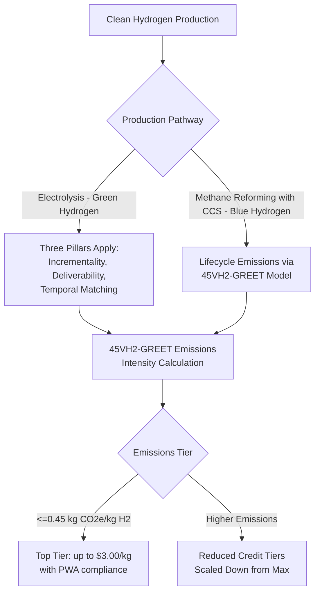

## Clean Hydrogen Production

### Overview

Clean hydrogen production is incentivized primarily through Section 45V of the Internal Revenue Code, enacted by the Inflation Reduction Act of 2022, which provides a production tax credit (PTC) for qualified clean hydrogen based on the lifecycle greenhouse gas (GHG) emissions intensity of the production process. Unlike a flat per-unit credit, Section 45V uses a tiered, emissions-intensity-based structure, meaning the credit value a producer receives depends directly on how "clean" the hydrogen production pathway is, as measured by a specific Department of Energy-developed lifecycle emissions model. This section covers the credit's mechanics, the "three pillars" framework that determines eligibility for the most favorable rates, the interaction with the ITC election, and the significant statutory changes introduced by the One Big Beautiful Bill Act (OBBBA) in 2025.

### Core Credit Mechanics

**Key Points**

- **Credit Structure**: Section 45V provides a per-kilogram production tax credit, with the maximum credit reaching up to $3.00 per kilogram of qualified clean hydrogen for production achieving the lowest lifecycle emissions tier (generally, emissions of 0.45 kg CO2e per kg of hydrogen or less), scaled down for higher-emissions production pathways.
- **Prevailing Wage and Apprenticeship (PWA) Multiplier**: As with other IRA-era credits, meeting PWA requirements during construction is required to access the top of the emissions-tiered credit scale; failing to meet PWA generally reduces the credit rate by a factor of five (i.e., to one-fifth of the PWA-compliant rate) for a given emissions tier.
- **Credit Period**: The credit applies to production after December 31, 2022, during a 10-year period beginning on the date the qualified clean hydrogen facility is originally placed in service.
- **ITC Election Alternative**: Taxpayers may elect to treat a portion of a specified clean hydrogen facility as energy property eligible for the Section 48 (legacy) investment tax credit instead of claiming the Section 45V production credit, providing a similar upfront-versus-generation-linked trade-off analysis as exists between the ITC and PTC for wind and solar.

### The "Three Pillars" Framework

**Key Points**

The proposed and final Section 45V regulations were built around three core eligibility pillars, particularly significant for electrolytic (grid-connected) hydrogen production using electricity as an input:

1. **Incrementality**: Generally requires that the electricity used to produce hydrogen come from newly built (or otherwise "incremental") clean electricity generation resources, intended to prevent existing clean generation from simply being redirected to hydrogen production in a way that indirectly increases reliance on fossil generation elsewhere on the grid.
2. **Deliverability**: Generally requires that the clean electricity source be deliverable to the hydrogen production facility (typically interpreted through regional grid/balancing authority boundaries), to ensure a credible link between the claimed clean power source and the actual electricity consumed by the facility.
3. **Temporal Matching**: Generally requires that clean electricity generation be matched to hydrogen production on a time-matched basis (with the final rules addressing the specific granularity and phase-in of this requirement), to ensure hydrogen is not produced using grid power at times when the associated clean generation source is not actually operating.

The final regulations, released by Treasury and the IRS on January 3, 2025 (published in the Federal Register on January 10, 2025, effective immediately), refined all three pillars in response to substantial industry feedback — the proposed rule had generated approximately 30,000 written comments — introducing additional flexibility relative to the initial proposal while still preserving the core three-pillar structure intended to protect environmental integrity.

### Lifecycle Emissions Determination: The 45VH2-GREET Model

**Key Points**

- **Sole Determination Model**: The final regulations adopted the 45VH2-GREET model as the exclusive methodology for determining well-to-gate greenhouse gas emissions for Section 45V credit purposes, with the Department of Energy releasing an updated version (45VH2-GREET, Rev. January 2025) alongside a user manual and a change log documenting revisions from the prior November 2024 version.
- **Weighted Average for Multi-Process Facilities**: For facilities using multiple hydrogen production processes, the credit is determined using a weighted average of GHG emissions across each process, rather than requiring a single uniform pathway per facility.
- **Interaction with Carbon Capture**: The final regulations include specific rules and definitions applicable when carbon capture and sequestration (CCS) is used as part of the electricity generation supplying a hydrogen facility, reflecting the interconnection between "blue" hydrogen (produced from natural gas with CCS) and "green" hydrogen (produced via electrolysis from clean electricity) production pathway analysis.

### Production Pathway Comparison

### OBBBA Impact: Accelerated Termination Timeline

**Key Points**

- **Original Deadline**: Under the IRA as originally enacted, developers had until January 1, 2033 to begin construction and still qualify for the full value of the Section 45V credit.
- **OBBBA Change**: The One Big Beautiful Bill Act (P.L. 119-21), signed into law July 4, 2025, accelerated this cutoff — the Section 45V credit terminates for facilities that do not begin construction prior to January 1, 2028, a five-year reduction from the original schedule.
- **Placed-in-Service Backstop**: Related industry analysis has noted that hydrogen fuel produced and placed in service after January 1, 2028 no longer qualifies under some readings of the compressed timeline, effectively creating a hard commercial deadline distinct from the "beginning of construction" trigger. [Inference: precise interaction between the beginning-of-construction cutoff and any placed-in-service backstop should be confirmed against the current statutory text and any subsequent IRS guidance, as secondary source characterizations of compressed deadlines can vary in emphasis.]
- **Continuous Construction Test**: The IRS has historically allowed a four-year window under the continuous construction test (i.e., the period within which construction must proceed continuously once begun), but the OBBBA's compressed overall horizon has led practitioners to recommend that project contracts include cost-overrun and delay-risk allocation clauses shifting credit-eligibility risk appropriately between developers and contractors, given the narrower margin for schedule slippage.
- **Maximum Credit Rate Preserved**: Despite the accelerated termination timeline, the OBBBA preserved the maximum credit rate of $3.00 per kilogram for hydrogen produced at or below the 0.45 kg CO2e per kg of hydrogen emissions threshold, along with the 10-year credit period structure.

### Interaction with Section 48E and Dual-Track Optionality

**Key Points**

- **5% Safe Harbor Strategy**: Contractors and developers can lock in "beginning of construction" status for the Section 48E investment tax credit by incurring at least 5% of total qualified project basis by a specified safe harbor deadline (identified in industry guidance as December 31, 2025 in the context of the OBBBA-compressed environment), creating dual-track optionality between completing construction to claim the 30% ITC under Section 48E versus commissioning later to potentially stack the Section 45V production credit for onsite hydrogen production. [Inference: the specific safe harbor percentage and deadline framework reflects industry practitioner guidance interpreting the interaction between §45V and §48E deadlines under OBBBA, and should be confirmed against current IRS safe harbor guidance for the specific facility type and timeline.]
- **New Section 48E-j Fuel Cell Credit**: The OBBBA framework also formally incorporated qualified fuel-cell property into a new Section 48E-j category, providing a flat 30% investment tax credit without the bonus-adder-dependent structure of legacy Section 48 fuel cell credits, applicable to fuel-cell systems placed in service after specified dates.

### Structuring and Financing Considerations

**Key Points**

- **Tax Equity Partnership Structures**: Clean hydrogen facilities can be financed through partnership structures allocating the Section 45V credit (or the elected Section 48 ITC) to a tax equity investor, broadly analogous to renewable electricity partnership flip structures, though underwriting must account for the added complexity of emissions-tier verification and ongoing three-pillars compliance (for electrolytic facilities) over the full 10-year credit period.
- **Credit Transfer Applicability**: Section 45V credits are eligible for transfer under IRC Section 6418, allowing hydrogen project sponsors to sell credits to third-party buyers for cash, subject to the same general transfer mechanics (registration, 75% offset limitation, one-time transfer) applicable to other transferable credits.
- **Compressed Development Timeline Risk**: Given the OBBBA's accelerated 2028 beginning-of-construction cutoff, sponsors and investors face materially compressed development and financing timelines compared to the original 2033 deadline, which increases the premium on early final investment decisions (FID), efficient permitting, and locking in construction and equipment supply commitments.

### Comparative Table: Green vs. Blue Hydrogen Considerations

| Attribute | Green Hydrogen (Electrolysis) | Blue Hydrogen (Methane Reforming + CCS) |
| --- | --- | --- |
| Primary Compliance Framework | Three pillars (incrementality, deliverability, temporal matching) | 45VH2-GREET lifecycle model incorporating CCS-specific rules |
| Key Input Risk | Clean electricity procurement structuring | Carbon capture rate and MRV compliance (see Section 45Q) |
| Potential Credit Stacking | 45V credit; ITC election alternative | 45V credit; potential interaction with 45Q for the CCS component |
| Primary Technology Risk | Electrolyzer cost and efficiency, renewable PPA structuring | Capture rate performance, geologic storage compliance |
| OBBBA Deadline Sensitivity | High — new-build renewable generation and matching infrastructure timeline critical | High — CCS infrastructure and injection well permitting timeline critical |

### Risk Factors

**Key Points**

- **Three Pillars Compliance Risk**: For electrolytic hydrogen, failure to maintain incrementality, deliverability, or temporal matching compliance over the credit period can jeopardize the claimed emissions tier and associated credit value.
- **Accelerated Deadline Risk**: The OBBBA's 2028 beginning-of-construction cutoff creates schedule risk for projects still in early development, particularly given historically long lead times for large-scale hydrogen and associated clean power infrastructure.
- **Emissions Model Dependency**: Because credit value is directly tied to the 45VH2-GREET model's emissions calculation, any future revisions to the model's methodology could affect the credit tier a given facility qualifies for, even absent changes to the facility's actual operations.
- **Policy and Political Risk**: The rapid succession of proposed rules (2023), final rules (January 2025), and material legislative amendment (OBBBA, July 2025) illustrates that clean hydrogen policy has been subject to significant and relatively fast-moving change, and sponsors/investors should treat the current framework as subject to potential further legislative or regulatory adjustment. [Inference: general characterization of policy volatility based on the documented sequence of regulatory and legislative changes; future developments cannot be predicted with certainty.]

### Related Topics

- Three Pillars Framework: Incrementality, Deliverability, and Temporal Matching Deep Dive
- 45VH2-GREET Model Methodology and Emissions Tier Calculation
- Section 48E-j Fuel Cell Investment Tax Credit Mechanics
- Carbon Capture and Sequestration (comparative deep dive, Section 45Q interaction)
- OBBBA Impact on Clean Energy Tax Credit Deadlines Across Technologies
- 5% Safe Harbor and Beginning-of-Construction Documentation Strategies
- Dual-Track ITC/PTC Optionality Structuring for Hydrogen Facilities
- IRC Section 6418 Transferability Mechanics Applied to 45V Credits
- Green vs. Blue Hydrogen Production Economics and Risk Comparison