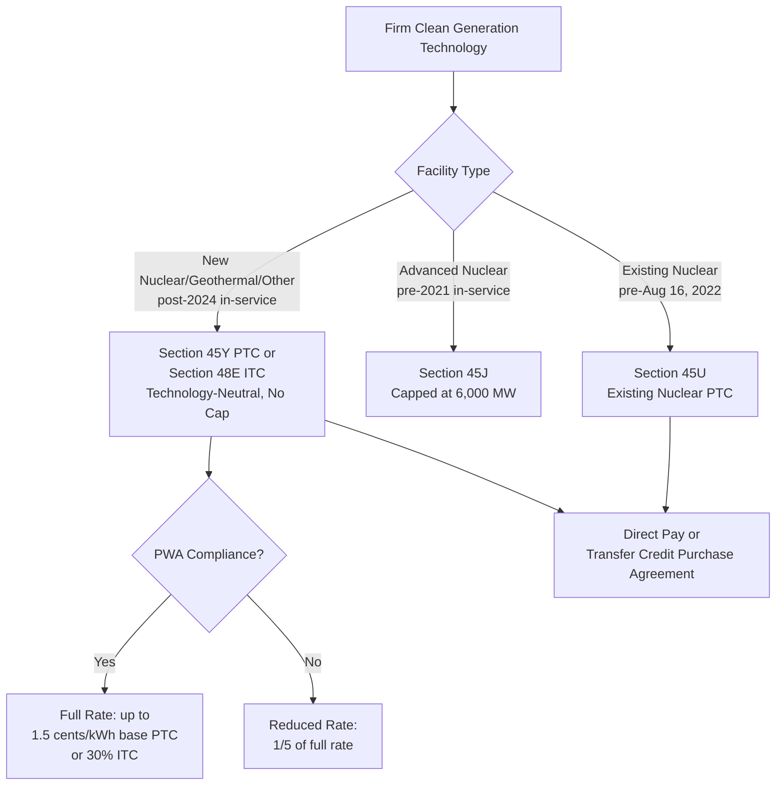

## Nuclear, Geothermal, and Other Firm Clean Generation

### Overview

Firm clean generation technologies — those capable of providing continuous, dispatchable, weather-independent power — occupy a distinct position in the tax credit landscape compared to variable renewables like wind and solar. This category spans existing nuclear plants (incentivized via the dedicated Section 45U credit), new and advanced nuclear (eligible under the technology-neutral Section 45Y/48E regime alongside legacy Section 45J), geothermal (eligible under both legacy Section 45/48 provisions and the technology-neutral regime), and other zero-emission firm resources such as qualified hydropower and marine/hydrokinetic energy. Because these technologies often have different development timelines, cost structures, and risk profiles than wind and solar, their tax equity financing and credit transfer dynamics carry distinctive considerations.

### The Multi-Layered Nuclear Credit Framework

**Key Points**

- **Section 45U — Existing Nuclear Production Credit**: Introduced by the IRA specifically to address the fact that, despite nuclear power providing about 19% of all U.S. electricity and roughly half of domestically produced zero-emission electricity, existing nuclear plants had not previously been eligible for clean energy tax credits. Section 45U applies to nuclear facilities that began supplying electricity to customers before August 16, 2022, and that have not previously received a Section 45J credit.
- **Section 45J — Advanced Nuclear Production Credit (Legacy)**: Applies only to advanced nuclear plants placed in service before January 1, 2021, and is subject to a national capacity cap of 6,000 MW — a much more limited legacy incentive compared to the newer technology-neutral framework.
- **Section 45Y/48E — Technology-Neutral Credits for New Nuclear**: New nuclear power plants beginning construction by a specified deadline are eligible for the technology-neutral Section 45Y production tax credit or Section 48E investment tax credit, which — unlike Section 45J — carry no capacity cap, a significant structural advantage for scaling new nuclear deployment.
- **Repowered Nuclear Facilities**: Repowered nuclear facilities can qualify for the Section 45Y or 48E credit if they meet an "80/20" repowering test, requiring at least 80% of the project's value to come from new equipment.

### OBBBA Treatment of Nuclear Credits

**Key Points**

- **45U Preserved**: The One Big Beautiful Bill Act (OBBBA), enacted July 2025, preserved the Section 45U credit's original 2032 phaseout date, reflecting nuclear power's bipartisan Congressional support even as OBBBA eliminated or restricted many other clean energy incentives. Some analyses describe the retention period as through 2031, with the credit's structure otherwise unchanged from current law. [Unverified — sources describe the phase-out endpoint as either 2031 or 2032; this discrepancy may reflect different characterizations of the final eligible year versus the statutory phase-out date and should be confirmed against the current statutory text.]
- **New Nuclear Carve-Out Under 45Y/48E**: OBBBA included a specific carve-out allowing new advanced nuclear projects to qualify for the technology-neutral 45Y/48E credits, provided construction begins before a specified deadline (cited as 2029 in some analyses), with subsequent credit value phasing out based on the placed-in-service year.
- **Foreign Entity Restrictions**: The nuclear production credit under Section 45U is no longer available to foreign entities, and "foreign-influenced taxpayers" lose access to the credit after a specified period (two years from OBBBA's enactment, per some analyses) — the technology-neutral 45Y/48E credits face analogous foreign-based and foreign-controlled taxpayer restrictions.
- **Transferability Preserved with Different Deadlines**: For the technology-neutral 45Y/48E credits, transferability is preserved for the full credit period, but only for projects placed in service by a specified deadline (cited as December 31, 2028, in some analyses); for 45U, transferability remains in place through its full eligibility window, with a placed-in-service deadline cited as December 31, 2031, in some sources. [Inference: these specific deadline figures come from third-party legislative summaries published shortly after or anticipating OBBBA's enactment and should be verified against the final enacted statutory text for precise applicability to any given transaction.]

### Nuclear Credit Transfer Market Characteristics

**Key Points**

- **Low Perceived Risk Profile**: Market data from a full-year 2025 dataset indicates that tax credit insurance was not observed in any nuclear tax credit transactions during that period — all observed deals involved investment-grade sellers relying on parent guarantees, with buyers generally viewing these credits as low-risk without requiring additional structural protection. [Unverified — reflects one data provider's observed transaction set for a specific period and may not represent the entire market.]
- **No Recapture Risk, But Disallowance/Qualification Risk Remains**: The 45U credit is not subject to recapture risk once properly claimed, though it remains vulnerable to disallowance and qualification risk if underlying eligibility criteria are later challenged.
- **Pricing Characteristics**: Investment-grade-rated sellers of already-generated 45U credits have commanded pricing over $0.95 per dollar of credit, reflecting the perceived low-risk nature of these transactions relative to many other credit categories.
- **Revenue Environment Affecting Supply**: Higher revenues for nuclear operators — particularly attributed to rising capacity market prices in markets such as PJM — have reduced the volume of 45U credits available for sale in the transfer market, since operators with strong merchant or capacity revenue have less need to monetize credits through third-party sale. [Inference: this describes an observed relationship between operator revenue and credit supply behavior, not a fixed rule, and market conditions can shift.]

### Geothermal and Other Firm Resources

**Key Points**

- **Legacy Eligibility**: Geothermal was included among technologies eligible for the reinstated and extended Section 45 production tax credit (alongside wind, biomass, landfill gas, trash, qualified hydropower, and marine/hydrokinetic resources), extended through 2024 under the IRA before the technology-neutral transition.
- **Technology-Neutral Eligibility**: Geothermal, along with any other zero-greenhouse-gas-emissions generation technology, is eligible for the Section 45Y PTC and Section 48E ITC for facilities placed in service after December 31, 2024, at the same base rates and PWA-bonus structure applicable to other technology-neutral-eligible resources (base rate cited as 0.3 cents/kWh, rising to 1.5 cents/kWh with the prevailing wage and apprenticeship bonus, adjusted for inflation, for the first 10 years of operation).
- **Commercial Readiness Timeline**: Advanced nuclear and geothermal technologies are widely noted as not expected to reach full commercial readiness until the late 2020s, meaning their practical utilization of the technology-neutral credit framework will develop somewhat later than for more mature technologies like solar and onshore wind. [Inference: commercial readiness timelines are inherently forward-looking estimates and subject to change based on technology development pace and market conditions.]

### Technology-Neutral Credit Structure: Firm Generation in Context

### Comparative Table: Nuclear vs. Geothermal Credit Pathways

| Attribute | Section 45U (Existing Nuclear) | Section 45J (Legacy Advanced Nuclear) | Section 45Y/48E (Technology-Neutral) |
| --- | --- | --- | --- |
| Eligible Facilities | Nuclear, in service before Aug 16, 2022 | Advanced nuclear, in service before Jan 1, 2021 | Any zero-emission technology, in service after Dec 31, 2024 |
| Capacity Cap | None | 6,000 MW national cap | None |
| Recapture Risk | None (but disallowance/qualification risk remains) | Standard credit qualification risk | Standard credit qualification risk |
| Transferability | Yes (direct pay or Transfer Credit Purchase Agreement) | Yes (direct pay or transfer) | Yes, subject to OBBBA placed-in-service deadlines |
| OBBBA Treatment | Phaseout date preserved (2031/2032) | Legacy, largely superseded by 45Y/48E for new projects | New nuclear carve-out; foreign entity restrictions apply |
| Typical Buyer Risk Perception | Low (often uninsured, guarantee-based) | Limited current market relevance | Varies by underlying technology |

### Structuring and Market Considerations

**Key Points**

- **Direct Pay and Transfer Availability**: Both the 45J and 45U credits qualify for direct pay (elective payment, for eligible entity types) or can be sold under a Transfer Credit Purchase Agreement (TCPA) — buyers in transfer transactions typically require either a strong seller guaranty or tax credit insurance, though as noted, the nuclear segment specifically has seen deals proceed on guarantee-only bases without insurance in observed 2025 market activity.
- **Policy Momentum Supporting New Nuclear**: Beyond tax credit structure, broader federal policy has moved to support nuclear expansion — executive orders signed in May 2025 launched a national strategy targeting significant nuclear capacity growth (with cited goals including 5 GW in uprates and 10 new large reactors by 2030, and an aim of increasing total nuclear capacity from roughly 100 GW to 400 GW by 2050), building on provisions in the ADVANCE Act of 2024 and targeting Nuclear Regulatory Commission (NRC) licensing process reforms. [Inference: these are stated policy goals and targets, not guaranteed outcomes, and actual capacity growth will depend on execution, financing, and regulatory implementation over an extended multi-decade horizon.]
- **Firm Generation's Distinct Investor Appeal**: Because firm generation technologies like nuclear provide continuous output rather than weather-dependent generation, tax equity investors and credit buyers underwriting production-linked credits (PTC-style) for these technologies generally face less generation-variance risk than with wind or solar, which is reflected in the comparatively low-risk market perception and pricing observed for nuclear credits specifically.

### Related Topics

- Section 45Y/48E Technology-Neutral Credit Qualification Requirements
- OBBBA Foreign Entity of Concern (FEOC) Restrictions Across Technology-Neutral Credits
- 80/20 Repowering Test Mechanics for Existing Facilities
- Tax Credit Insurance Market Structure and Nuclear Credit Risk Perception
- Onshore and Offshore Wind (comparative technology deep dive)
- Clean Hydrogen Production (comparative deep dive, technology-neutral overlap)
- Prevailing Wage and Apprenticeship (PWA) Multiplier Mechanics
- Direct Pay (Section 6417) vs. Transfer (Section 6418) Election Considerations
- Marine, Hydrokinetic, and Qualified Hydropower Credit Eligibility