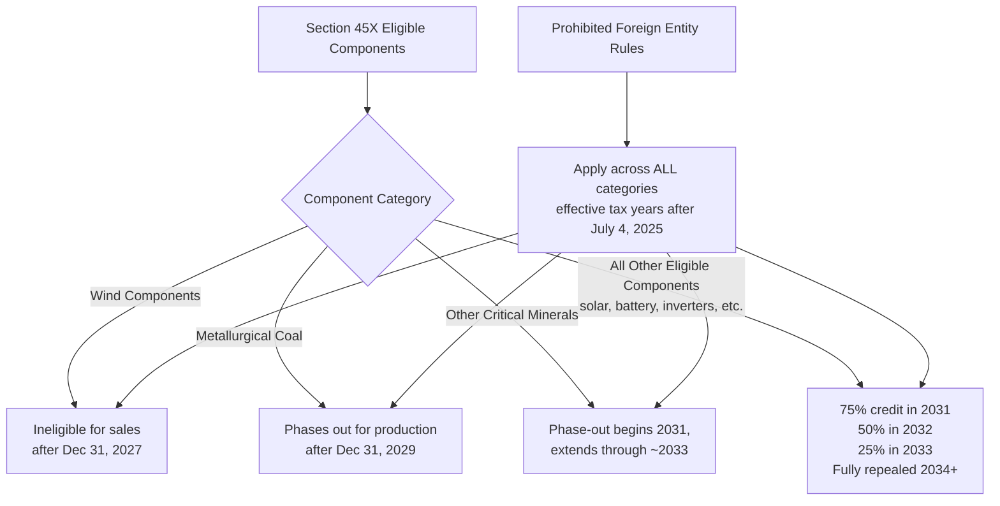

## Advanced Manufacturing Credits

### Overview

Advanced manufacturing credits, codified primarily under Section 45X of the Internal Revenue Code, incentivize the domestic production of clean energy supply chain components rather than the deployment of finished generation or storage assets. Enacted by the Inflation Reduction Act of 2022, Section 45X provides per-unit tax credits to manufacturers that produce and sell "eligible components" — including solar components, wind components, battery cells and modules, inverters, electrode active materials, and critical minerals — domestically. This credit category sits upstream in the clean energy value chain: rather than rewarding a project owner for generating electricity, it rewards a manufacturer for building the physical hardware that generation and storage projects rely on, and interacts closely with the domestic content bonus adders available to project-level ITC/PTC claimants.

### Core Credit Mechanics

**Key Points**

- **Eligible Component Categories**: Section 45X covers solar components (cells, wafers, modules, backsheets), wind components (blades, nacelles, towers), inverters, battery cells and modules, electrode active materials, and critical minerals, with the credit amount varying by specific component type (calculated on a per-unit or percentage-of-production-cost basis depending on category).
- **Domestic Production and Substantial Transformation Requirement**: To qualify, manufacturers must produce eligible components in the United States or its possessions, substantially transform those components during the manufacturing process, and sell them either to an unrelated party or through a related-party election.
- **Timing Requirement**: Components must be sold in the ordinary course of business within the same tax year as production to qualify for that year's credit.
- **Section 48C Exclusivity**: Facilities that have claimed the Section 48C Qualifying Advanced Energy Project Credit are ineligible to also claim Section 45X for the same production, preventing double-incentivizing of the same manufacturing investment.
- **Claiming Mechanics**: Manufacturers claim the credit using IRS Form 7207, in conjunction with Form 3800 (General Business Credit), and must register facilities through the IRA/CHIPS Pre-filing Registration Tool.

### Integrated Components Provision

**Key Points**

- **Sale-of-Integrated-Components Rule**: A manufacturer can be treated as having "sold" an eligible component even if that component (the "primary component") is integrated, incorporated, or assembled into another eligible component (the "secondary component") rather than sold as a standalone item.
- **65% Cost Attribution Threshold**: Under rules modified by the OBBBA, a taxpayer may claim the 45X credit for the primary component only if 65% of the costs incurred to manufacture the secondary component are attributable to the primary component, and the secondary component is sold to an unrelated person — a threshold intended to prevent credit-stacking abuse in multi-stage component assembly.
- **Effective Date**: Changes to the integrated components eligibility rules generally apply to taxable years beginning after December 31, 2026.

### OBBBA Changes: Preserved Structure, New Guardrails

**Key Points**

- **No Wholesale Repeal**: Despite Section 45X having been a target of some congressional scrutiny prior to the OBBBA's passage, the credit was largely preserved by the One Big Beautiful Bill Act (signed July 4, 2025) rather than repealed outright — the OBBBA added guardrails and accelerated certain phase-outs rather than eliminating the credit entirely.
- **Wind Components — Accelerated Termination**: Wind components produced and sold after December 31, 2027 are no longer eligible for the Section 45X credit, representing the most significant sector-specific acceleration under the OBBBA.
- **General Component Phase-Out Schedule**: For eligible components other than wind and critical minerals, the credit phases down as follows: components sold in 2031 qualify for 75% of the credit value, decreasing to 50% in 2032 and 25% in 2033, with full repeal for sales occurring in 2034 or later. Some sources describe this as a one-year acceleration from an original 2032 endpoint to a 2031 endpoint for the phase-out's start. [Unverified — sources present slightly varying phase-out year framings; the precise schedule should be confirmed against the current statutory text.]
- **Critical Minerals Expansion and Phase-Out**: The definition of qualified critical minerals was expanded to include metallurgical coal (a type of coal used in steelmaking), credited at a rate cited as 2.5% of production costs, with a phase-out for metallurgical coal production after December 31, 2029. Notably, the metallurgical coal credit is available for production costs regardless of whether production occurs outside the United States, though the credit remains only useful to a claimant with a U.S. taxable presence. For other critical minerals, a phase-out was newly introduced beginning in 2031 (extending through roughly 2033), whereas under pre-OBBBA law there was no phase-out at all for critical mineral production and sale.
- **Battery Module Definition Tightened**: The OBBBA clarified that a qualifying "battery module" must be comprised of all other essential equipment needed for battery functionality, narrowing what previously may have been a more permissive definition.

### Foreign Entity Restrictions (Prohibited Foreign Entity / PFE Rules)

**Key Points**

- **Material Assistance Disqualification**: Effective for taxable years beginning after July 4, 2025, the OBBBA's Prohibited Foreign Entity (PFE) provisions disallow the Section 45X credit if the taxpayer received material assistance from a prohibited foreign entity, or if the taxpayer itself is a specified foreign entity or a foreign-influenced entity.
- **Material Assistance Cost Ratio**: Material assistance from a PFE is determined to exist when the material assistance cost ratio falls below a specified threshold percentage for the relevant eligible component category — this calculation involves multiple complexities in sourcing and cost attribution that practitioners have flagged as requiring further IRS guidance.
- **Safe Harbor Tables**: The statute directs Treasury and the IRS to issue "safe harbor tables" identifying the percentage of total direct materials costs attributable to a PFE for any eligible component, by the end of 2026; in the interim, tables included in IRS Notice 2025-08 may be used, although that notice was originally issued in the context of the domestic content bonus for Section 45Y/48 qualified facilities rather than Section 45X eligible components specifically, creating some interpretive uncertainty about its direct applicability. [Inference: practitioner commentary describes this as an open implementation question; taxpayers should monitor forthcoming Treasury/IRS guidance specific to 45X.]
- **Supplier Documentation Burden**: These restrictions require manufacturers to reevaluate sourcing strategies and maintain robust supplier documentation and due diligence processes to avoid disallowed credits and associated penalties.

### Credit Category Phase-Out Timeline

### Transferability of 45X Credits

**Key Points**

- **Transferability Preserved**: Transferability under IRC Section 6418 remains intact for Section 45X credits under the OBBBA, allowing manufacturers to sell credits for cash to unrelated taxpayer buyers, following the general transfer mechanics applicable to other transferable credits (registration, 75% offset limitation, cash-only consideration).
- **Special Purpose Entity Restriction**: The OBBBA introduced a new restriction prohibiting transfers of 45X credits to special purpose entities, tightening the transferability rules specifically for this credit category relative to the framework applicable to other transferable credits. [Inference: the precise scope and definition of "special purpose entity" for this restriction should be confirmed against final Treasury/IRS guidance, as the term can carry different meanings across tax contexts.]

### Comparative Table: Section 45X vs. Project-Level Domestic Content Bonus

| Attribute | Section 45X (Manufacturing Credit) | Domestic Content Bonus (ITC/PTC Adder) |
| --- | --- | --- |
| Who Claims It | Component manufacturer | Project owner/developer |
| Credit Basis | Per-unit or % of production cost for the component | Additional percentage points on project-level ITC/PTC |
| Point in Value Chain | Upstream (manufacturing) | Downstream (project deployment) |
| Interaction | Manufacturer's 45X credit does not directly reduce a project's eligible basis for domestic content purposes, but a healthy 45X-incentivized domestic supply base makes domestic content bonus achievability easier for developers | Requires sourcing components (potentially 45X-incentivized) meeting domestic manufacturing thresholds |
| OBBBA Foreign Restrictions | PFE/material assistance rules apply | Similar foreign entity restrictions apply under OBBBA to 45Y/48E |

### Strategic Considerations for Manufacturers and Investors

**Key Points**

- **Sector-Specific Planning Horizon**: Wind component manufacturers face a substantially compressed planning horizon (credit ends for sales after 2027) compared to manufacturers of solar, battery, and most other components (phase-out beginning 2031), meaning capital allocation and facility investment decisions should account for materially different credit-availability windows by component category.
- **Metallurgical Coal as a Temporary Opportunity**: The addition of metallurgical coal as a qualifying critical mineral, while temporary (phasing out after 2029), expands credit availability to producers in an industry not traditionally associated with clean energy tax incentives, representing a notable and somewhat unusual policy carve-out.
- **Supply Chain Documentation as a Compliance Priority**: Given the PFE and material assistance restrictions, manufacturers should prioritize building auditable supply chain documentation now, both to support current credit claims and to prepare for the safe harbor table guidance expected by the end of 2026.
- **Tax Equity vs. Transfer for Manufacturing Facilities**: Because 45X is a production-linked (not investment-linked) credit tied to actual unit sales rather than upfront project basis, financing structures for manufacturing facilities claiming 45X differ from typical project-level partnership flip structures — credit monetization more frequently occurs through direct transfer sales of accrued credits or through direct pay for eligible entities, rather than through a traditional tax equity partnership.

### Related Topics

- Prohibited Foreign Entity (PFE) and Material Assistance Cost Ratio Rules
- Domestic Content Bonus Adder Mechanics for ITC/PTC Claimants
- Section 48C Qualifying Advanced Energy Project Credit (comparative)
- IRC Section 6418 Transferability Restrictions for Manufacturing Credits
- Battery Module and Electrode Active Material Eligibility Definitions
- OBBBA Foreign Entity Restrictions Across Technology-Neutral Credits
- Critical Minerals Phase-Out Schedule and Metallurgical Coal Carve-Out
- Onshore and Offshore Wind (comparative, wind component phase-out impact)
- IRA/CHIPS Pre-Filing Registration Tool: Process Overview