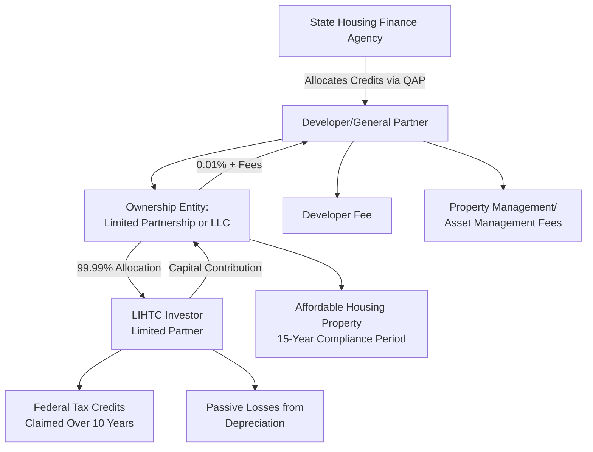

## Low-Income Housing Tax Credit Structuring

### Overview

The Low-Income Housing Tax Credit (LIHTC), established under Section 42 of the Internal Revenue Code, is the primary federal incentive supporting the development and preservation of affordable rental housing in the United States. Unlike the clean energy ITC/PTC framework, LIHTC operates through an annual state-administered allocation process rather than automatic taxpayer eligibility, and its financing structures — while sharing some conceptual DNA with renewable energy tax equity (investor capital in exchange for allocated tax benefits) — involve materially different mechanics, timelines, and compliance obligations. LIHTC has also historically been the credit category most directly addressed by dedicated bank regulatory capital guidance (see the 2018 tax credit equity investment rule), making it a useful reference point for understanding how tax credit structuring principles apply outside the clean energy context.

### Core Program Mechanics

**Key Points**

- **Two Credit Types**: LIHTC is issued in two forms — the 9% credit (more accurately, a credit calculated to yield a 70% present value subsidy, though colloquially called "9%") for new construction or substantial rehabilitation without other federal subsidies, and the 4% credit (a 30% present value subsidy) for projects that are financed in part with tax-exempt private activity bonds.
- **State Allocation Process**: Each state receives an annual LIHTC allocation (a per-capita volume cap, adjusted annually for inflation) administered by a state Housing Finance Agency (HFA) through a Qualified Allocation Plan (QAP). Developers compete for 9% credits through a competitive application process scored against state-specific QAP priorities (e.g., serving extremely low-income households, geographic distribution, supportive services).
- **4% Credits and Bond Financing**: Unlike the competitive 9% credit, 4% credits are generally available on a non-competitive, as-of-right basis to any project that meets eligibility requirements and finances at least 50% of its aggregate basis (a threshold that has been reduced from a historical 50% level to 25% in some jurisdictions following the 2020 "4% fix" and subsequent legislative changes) with tax-exempt private activity bonds.
- **10-Year Credit Period, 15-Year Compliance Period, Extended Use**: The credit is claimed over a 10-year period, but the property must remain compliant with income and rent restrictions for a minimum 15-year compliance period, and typically an additional "extended use period" (commonly 15 more years, for a 30-year total affordability commitment) under a recorded extended-use agreement with the state HFA.

### LIHTC Partnership Structure

### The Syndication Model

**Key Points**

- **Limited Partnership/LLC Structure**: LIHTC properties are almost universally owned through a single-asset limited partnership or LLC, with a developer-affiliated general partner (or managing member) holding a nominal ownership interest (commonly 0.01%) and an investor limited partner holding the overwhelming majority interest (commonly 99.99%), entitling the investor to that same percentage of tax credits, depreciation losses, and often cash flow.
- **Direct Investment vs. Syndicated Fund Investment**: Investors can invest directly in a single project's partnership, but far more commonly invest through a syndicated multi-investor fund managed by a LIHTC syndicator, which pools capital across multiple properties to diversify investor risk (geographic, sponsor, and market-specific) across a portfolio rather than concentrating exposure in a single asset.
- **Investor Motivations**: LIHTC investors are predominantly banks (motivated significantly by Community Reinvestment Act (CRA) credit in addition to the tax benefit and return) alongside insurance companies and, increasingly, some corporate investors — this investor base overlaps meaningfully with the clean energy tax equity investor community discussed elsewhere in this course, though CRA considerations create a LIHTC-specific demand driver not present in renewable energy tax equity.
- **Pricing Convention**: LIHTC pricing is conventionally quoted as a price per dollar of credit (e.g., "$0.90 per credit dollar"), reflecting the amount an investor pays today for each dollar of future tax credit and loss allocation — this pricing convention differs from the yield-based (IRR) pricing convention more common in renewable energy partnership flip structures, though ultimately both reduce to an underlying investor return calculation.

### Illustrative LIHTC Investment Calculation

**Example**

A 9% LIHTC project has $1,000,000 in annual eligible credit allocated over 10 years, for a total credit stream of $10,000,000. If an investor purchases the limited partnership interest at a price of $0.92 per credit dollar:

$$Total\ Investment = Total\ Credit\ \times\ Price\ per\ Credit\ Dollar$$

$$Total\ Investment = \$10{,}000{,}000 \times 0.92 = \$9{,}200{,}000$$

This $9.2 million capital contribution, paid into the partnership typically in installments tied to construction and lease-up milestones, funds a substantial portion of the project's total development cost, with the balance typically covered by permanent debt, deferred developer fee, and/or soft/gap financing sources such as HOME funds or state housing trust fund dollars. [Unverified — illustrative calculation only; actual pricing, payment timing (capital pay-in schedules), and total development cost composition vary significantly by market, project type, and investor.]

### Comparative Table: LIHTC vs. Renewable Energy Tax Equity Structuring

| Attribute | LIHTC (Section 42) | Renewable Energy Tax Equity (ITC/PTC) |
| --- | --- | --- |
| Credit Allocation Mechanism | Competitive state allocation (9%) or as-of-right with bond financing (4%) | Automatic federal eligibility upon meeting technical/PWA requirements |
| Credit Period | 10 years | 10 years (PTC) or one-time (ITC) |
| Compliance Period | 15-year minimum, often 30-year extended use | ITC: 5-year recapture period; PTC: full generation period |
| Typical Investor Motivation | Tax benefit + CRA credit + return | Tax benefit + return + (sometimes) ESG goals |
| Typical Ownership Split | 99.99% investor LP / 0.01% GP | Varies by structure (partnership flip %, sale-leaseback) |
| Pricing Convention | Price per credit dollar (e.g., $0.90-$0.95) | Target after-tax IRR / yield-based |
| Aggregation Model | Frequently syndicated multi-property funds | Frequently single-asset or smaller portfolio deals |
| Transferability (6418) | Not eligible — LIHTC is not among the Section 6418 transferable credits | Eligible for ITC/PTC |

### Key Structuring and Compliance Considerations

**Key Points**

- **Recapture Risk and Compliance Period Length**: Because the compliance period extends well beyond the 10-year credit period, LIHTC investors face an extended recapture exposure window (a portion of previously claimed credits can be recaptured if the property fails to maintain compliance with income/rent restrictions during the 15-year compliance period), requiring robust ongoing asset management and compliance monitoring — typically performed by dedicated compliance/asset management teams at the syndicator or investor level.
- **Exit Strategies and the Qualified Contract Provision**: LIHTC partnership agreements typically include provisions addressing investor exit after the compliance period, including the right of first refusal (allowing the nonprofit or governmental general partner, where applicable, to acquire the property at a below-market price after year 15) and, in some cases, the qualified contract provision (a mechanism, subject to state-specific implementation, that can allow an owner to exit the extended-use restriction under certain conditions).
- **Combining LIHTC with Other Subsidy Sources**: LIHTC projects very commonly layer multiple funding sources beyond the tax credit equity itself — including tax-exempt bonds, HOME Investment Partnerships Program funds, state and local housing trust fund dollars, project-based Section 8 rental assistance, and soft second mortgages — creating complex capital stacks that require careful subordination and intercreditor structuring.
- **Historic Tax Credit (HTC) Twinning**: LIHTC is frequently combined ("twinned") with the Federal Historic Rehabilitation Tax Credit (Section 47) when a project involves rehabilitation of a historic building, requiring careful basis allocation and structuring to ensure both credits can be claimed without running afoul of anti-abuse or basis-reduction rules applicable to combined credit claims.
- **Not Eligible for Section 6418 Transferability**: Unlike the clean energy ITC/PTC family, LIHTC is not among the credits eligible for transfer under IRC Section 6418 — LIHTC monetization continues to rely exclusively on the traditional syndicated partnership/direct investment model rather than a simplified cash-purchase transfer mechanism, a structural distinction worth emphasizing given this course's broader focus on the transfer market for clean energy credits.

### Risk Factors Specific to LIHTC

**Key Points**

- **Construction and Lease-Up Risk**: Delays in construction completion or achieving stabilized occupancy (typically requiring a specified minimum occupancy threshold, such as 90%, sustained for a period) can delay the beginning of the 10-year credit period and affect investor return timing.
- **Operating Subsidy and Rent Restriction Interaction**: Because LIHTC units are rent-restricted based on area median income (AMI) formulas rather than market rents, properties can face operating margin pressure if operating costs rise faster than allowable rent increases, creating a distinct financial risk profile compared to market-rate or merchant-revenue renewable energy assets.
- **State QAP Policy Risk**: Because 9% credit allocation criteria are set by each state's QAP and can change from year to year, developers relying on specific scoring priorities in one allocation round face policy risk that a future round's QAP may deprioritize their project type or location.
- **Recapture from Noncompliance**: Beyond construction/lease-up risk, ongoing tenant income certification errors, rent overcharges, or failure to maintain applicable fraction requirements can trigger partial recapture, making robust property-level compliance systems a critical underwriting consideration for investors.

### Related Topics

- Federal Historic Rehabilitation Tax Credit (Section 47) and LIHTC Twinning Structures
- Bank Investor CRA Motivations and Regulatory Capital Treatment for LIHTC
- LIHTC Syndication Fund Structures and Multi-Investor Risk Diversification
- Qualified Allocation Plan (QAP) Scoring Criteria and State Policy Variation
- 4% vs. 9% Credit Election and Private Activity Bond Financing Thresholds
- Right of First Refusal and Qualified Contract Exit Mechanisms
- Recapture Risk Management and Compliance Period Monitoring
- Corporate and Insurance Company Investors (comparative, cross-program investor overlap)
- Regulatory Capital Treatment for Bank Investors (comparative, cross-program regulatory framework)