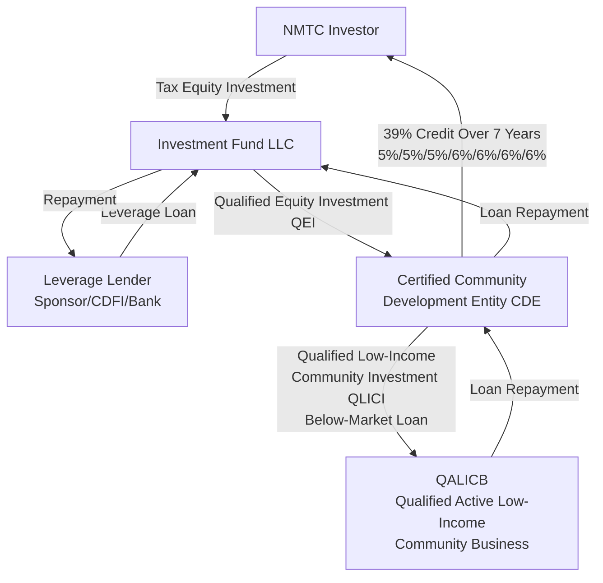

## New Markets Tax Credit Structuring

### Overview

The New Markets Tax Credit (NMTC), established under Section 45D of the Internal Revenue Code, is a federal incentive designed to spur private investment in businesses and real estate projects located in low-income communities. Administered by the Community Development Financial Institutions (CDFI) Fund within the U.S. Department of the Treasury, NMTC operates through a distinctive intermediary structure — capital does not flow directly from investor to project, but instead passes through a certified Community Development Entity (CDE) that has itself competed for and received an allocation of tax credit authority. This intermediary layer, combined with a signature "leveraged structure" financing model, makes NMTC structurally more complex than most other federal tax credit programs, including LIHTC and clean energy ITC/PTC.

### Core Program Mechanics

**Key Points**

- **Credit Calculation**: The NMTC provides a total credit equal to 39% of the amount invested by an investor in a CDE, claimed over a 7-year period — 5% of the investment amount in each of the first three years, and 6% in each of the final four years.
- **Qualified Active Low-Income Community Business (QALICB)**: Credit-generating investments must ultimately flow to a QALICB — a business or real estate project meeting specific criteria regarding its location in a qualifying low-income census tract (generally defined by poverty rate and median family income thresholds) and the nature of its operations (with certain business types, such as residential rental property without a substantial commercial component, generally excluded from eligibility).
- **Community Development Entity (CDE) Certification and Allocation**: A CDE must first be certified by the CDFI Fund as meeting statutory requirements (a primary mission of serving low-income communities, and accountability to those communities through representation on a governing or advisory board), and then separately compete annually for a Qualified Equity Investment (QEI) allocation authority through a competitive application process.
- **7-Year Compliance Period**: Unlike LIHTC's 15-year compliance period, NMTC's compliance obligations are tied to a 7-year period matching the credit claim period, after which the underlying structure is typically unwound.

### The Leveraged Structure: NMTC's Signature Financing Model

**Key Points**

- **Purpose of Leverage**: Because the 39% credit is calculated on the investor's Qualified Equity Investment (QEI) into the CDE — not on the total capital reaching the QALICB — sponsors use a "leveraged structure" to combine investor tax equity with additional leverage debt, increasing the total QEI amount (and therefore total credit generated) relative to the investor's actual net cash outlay, while channeling a larger pool of capital to the underlying project.
- **Leverage Lender**: A separate leverage loan is typically provided by the project sponsor, a related community development financial institution, a bank, or a combination of sources, and is loaned into an "investment fund" entity rather than directly to the CDE or QALICB.
- **Investment Fund as Intermediary Vehicle**: The investment fund entity combines the investor's tax equity contribution and the leverage loan proceeds into a single, larger capital contribution, which is then contributed to the CDE as the investor's Qualified Equity Investment — this is the mechanism that allows the 39% credit calculation to apply to a QEI amount substantially larger than the investor's actual net equity contribution.
- **QLICI to the QALICB**: The CDE, in turn, makes a Qualified Low-Income Community Investment (QLICI) — typically structured as a loan (often on below-market terms, such as an interest-only period or long amortization) — to the QALICB, which uses the proceeds for the underlying business or real estate project.

### Leveraged Structure Flow

### Illustrative Leverage Calculation

**Example**

A project sponsor arranges a $3,000,000 leverage loan and combines it with a $4,500,000 NMTC investor tax equity contribution into an investment fund, producing a total Qualified Equity Investment of $7,500,000 contributed to the CDE:

$$Total\ QEI = Leverage\ Loan + Investor\ Equity = \$3{,}000{,}000 + \$4{,}500{,}000 = \$7{,}500{,}000$$

$$Total\ NMTC\ Generated = QEI \times 0.39 = \$7{,}500{,}000 \times 0.39 = \$2{,}925{,}000$$

This $2.925 million in total credit, claimed over 7 years by the investor, is generated on the full $7.5 million QEI even though the investor's actual net cash equity contribution was only $4.5 million — illustrating why the leveraged structure is central to making NMTC transactions economically attractive to investors relative to a smaller, unleveraged direct equity investment. [Unverified — illustrative calculation only; actual leverage ratios, loan terms, and fee structures vary significantly by transaction and CDE allocation terms.]

### Comparative Table: NMTC vs. LIHTC vs. Clean Energy ITC Structuring

| Attribute | New Markets Tax Credit (NMTC) | LIHTC | Clean Energy ITC |
| --- | --- | --- | --- |
| Credit Rate/Period | 39% over 7 years | ~70% or ~30% present value over 10 years | 6%-50%+ of basis, one-time |
| Intermediary Entity Required | Yes — certified CDE mandatory | No — direct partnership investment | No — direct partnership or transfer |
| Leverage Structure | Central, signature feature | Not typically used in this manner | Back-leverage debt is separate/optional |
| Compliance Period | 7 years | 15+ years | 5-year ITC recapture period |
| Allocation Mechanism | Competitive CDE allocation application | Competitive state QAP (9%) or as-of-right (4%) | Automatic upon technical qualification |
| Eligible Project Types | Broad — operating businesses, real estate, community facilities | Rental housing only | Energy generation/storage only |
| Transferability (6418) | Not eligible | Not eligible | Eligible |

### Structuring Considerations and Investor Exit

**Key Points**

- **Put/Call Options at Year 7**: NMTC transactions typically include contractual put and call option provisions allowing the sponsor (or a sponsor affiliate) to acquire the investor's interest in the investment fund/CDE structure at the end of the 7-year compliance period for a nominal price, since the tax benefits are fully realized by that point and the investor generally has no interest in a continuing ownership stake.
- **Unwind Mechanics**: At the end of year 7, the leveraged structure is typically unwound — the CDE loan (QLICI) may be forgiven, restructured, or assigned back to the sponsor as part of the exit, often resulting in the sponsor obtaining favorable long-term financing terms on the underlying project debt (below-market interest rates, extended amortization, or partial principal forgiveness) that were embedded in the original QLICI structuring — this "soft" financing benefit to the underlying project is a key economic driver for sponsors pursuing NMTC financing beyond the tax credit itself.
- **Community Development Impact Requirements**: Because a CDE's initial certification and allocation are tied to demonstrated community development impact, sponsors must document and report on job creation, community services, and other impact metrics throughout the compliance period to support the CDE's ongoing program compliance and future allocation competitiveness.
- **Combining NMTC with Other Credits**: NMTC is frequently combined with other federal and state incentives, including Historic Tax Credits (for rehabilitation projects) and, in some cases, renewable energy tax credits (for projects incorporating on-site solar or other qualifying energy improvements), requiring careful multi-credit structuring to avoid basis conflicts and ensure each credit's technical eligibility requirements are independently satisfied.

### Risk Factors Specific to NMTC

**Key Points**

- **CDE Allocation Competition and Availability Risk**: Because CDEs must separately compete for limited annual allocation authority, sponsors depend on securing a partnering CDE with sufficient unallocated authority for their specific project — allocation scarcity and CDE-specific priorities can create timing and availability constraints not present in automatically-eligible credit categories.
- **QALICB Eligibility and Ongoing Compliance Risk**: The underlying business or project must maintain QALICB eligibility (location in a qualifying census tract, permissible business activity) throughout the 7-year compliance period; a change in circumstances that causes the QALICB to fall out of compliance can jeopardize credit eligibility and trigger recapture.
- **Recapture Triggers**: Recapture can be triggered by several events, including the CDE ceasing to qualify as a CDE, failure to maintain the required percentage of QEI proceeds invested in qualifying investments, or redemption of the investor's equity interest before the compliance period ends.
- **Structural Complexity and Transaction Costs**: The multi-entity leveraged structure (investment fund, CDE, QALICB, leverage lender, tax equity investor) involves substantially higher legal, accounting, and structuring costs relative to simpler tax credit programs, which can make NMTC financing more cost-effective primarily for larger transactions able to absorb these fixed structuring costs.

### Related Topics

- Community Development Entity (CDE) Certification and Allocation Application Process
- Qualified Active Low-Income Community Business (QALICB) Eligibility Criteria
- Put/Call Option Structuring and Year-7 Unwind Mechanics
- Low-Income Housing Tax Credit Structuring (comparative, cross-program structuring differences)
- Historic Tax Credit Twinning with NMTC for Rehabilitation Projects
- CDFI Fund Program Compliance and Community Impact Reporting
- Leverage Lender Roles and Below-Market QLICI Loan Structuring
- Corporate and Insurance Company Investors (comparative, cross-program investor overlap)