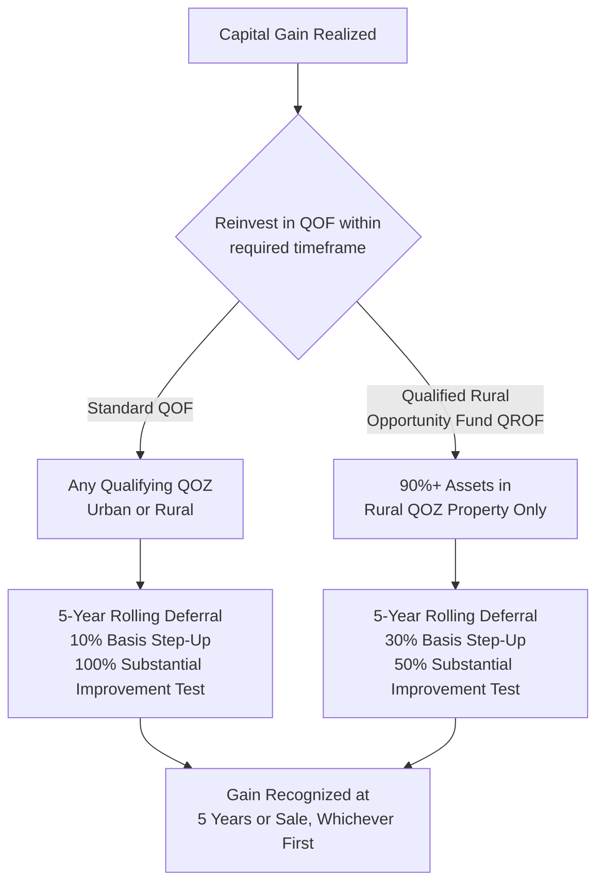

## Qualified Opportunity Zone Funds After the 2025 Reforms

### Overview

The Qualified Opportunity Zone (QOZ) program, originally established under the Tax Cuts and Jobs Act (TCJA) of 2017, was fundamentally restructured by the One Big Beautiful Bill Act (OBBBA), signed into law July 4, 2025. What was originally a temporary incentive (set to expire December 31, 2026) for deferring, reducing, and potentially eliminating capital gains tax on gains reinvested into Qualified Opportunity Funds (QOFs) has been made a permanent feature of the federal tax code, colloquially referred to by practitioners as "Opportunity Zones 2.0." The reforms introduce a new rolling deferral structure, a distinct rural investment sub-program with enhanced benefits, a recurring decennial zone redesignation process, and substantially expanded reporting obligations — collectively reshaping how QOF sponsors and investors should approach structuring going forward.

### Program Permanence and Zone Redesignation

**Key Points**

- **Permanent Program Status**: The OBBBA eliminates the original sunset structure entirely, making the Opportunity Zone incentive a permanent part of the tax code rather than a temporary provision requiring periodic Congressional reauthorization.
- **Accelerated Sunset of Current Designations**: Current QOZ designations, which under original law would have persisted through 2028, instead sunset at the end of 2026 under the OBBBA.
- **Decennial Redesignation Process**: Because the program is now permanent, governors are required to redesignate QOZs every 10 years on a rolling basis, using updated Census data to determine eligible tracts. The first redesignation cycle begins with new nominations submitted within a 90-day period starting July 1, 2026, subject to U.S. Treasury Secretary approval, with new designations taking effect for new investments beginning January 1, 2027.
- **Overlap Period**: A transition/overlap period exists between the old zone designations and the new 2027 designations, described by some practitioners as extending through December 31, 2028, during which both old and new zone maps may have relevance depending on investment timing. [Unverified — the precise mechanics and duration of this overlap period, and how they interact with the 2026 sunset of current designations, involve some variation in secondary-source characterization and should be confirmed against final Treasury guidance and IRS forms once issued.]

### Rolling Five-Year Deferral: The Core Structural Change

**Key Points**

- **From Fixed-Date to Rolling Deferral**: Under the original TCJA structure, all deferred gains were required to be recognized on a fixed date (December 31, 2026), regardless of when the investment was made — meaning an investor who invested in 2019 deferred gain recognition for roughly seven years, while an investor who invested in 2025 deferred gain recognition for only about one year.
- **New Rolling Structure**: For gains invested in a QOF after December 31, 2026, the OBBBA introduces a rolling five-year deferral period with no fixed end date — the deferred gain is recognized five years from the date of investment, or when the QOF investment is sold, whichever comes first. This creates a consistent, predictable five-year deferral window for every investor regardless of when they invest, replacing the prior structure's uneven benefit depending on investment timing.
- **Simplified, Single-Tier Basis Step-Up**: If a QOF investment is held for at least five years, the investor receives a single 10% step-up in basis, eliminating the original program's additional tiered benefit (an extra 5% step-up available after seven years under the TCJA structure, for a total of 15%) — the maximum standard step-up is now capped at 10%.
- **30-Year Gain Exclusion Limit**: The permanent gain exclusion benefit for long-term holdings (originally associated with a 10-year holding period under the TCJA) is now subject to an overall 30-year limit on the gain exclusion benefit under the reformed structure. [Inference: sources describe this as a "30-year limit for gain exclusion," which appears to establish an outer bound on how long the exclusion benefit can be claimed relative to the original investment; the precise mechanical interaction with the five-year deferral and 10% step-up should be confirmed against the final statutory and regulatory text.]

### Qualified Rural Opportunity Funds (QROFs): A New Sub-Program

**Key Points**

- **Purpose**: In response to persistent criticism that the original QOZ program disproportionately directed investment to urban and suburban areas rather than rural communities, the OBBBA creates Qualified Rural Opportunity Funds (QROFs) as a distinct fund sub-category with enhanced incentives specifically for rural investment.
- **Rural Area Definition**: A rural area is generally defined as any location outside a city or town with a population greater than 50,000, and excluding census tracts adjacent to such a city or town — the IRS has issued initial clarifying guidance on this definition.
- **90% Asset Test**: QROFs must invest at least 90% of their assets in QOZ property located entirely within qualifying rural zones, a higher and more narrowly targeted threshold than the general QOF asset test.
- **Enhanced 30% Basis Step-Up**: Investments in QROFs receive a 30% step-up in basis after a five-year holding period, substantially more generous than the standard 10% step-up available to conventional QOFs — a deliberate policy design to channel greater capital toward rural investment.
- **Reduced Substantial Improvement Threshold**: For property in qualifying rural opportunity zones, the "substantial improvement" test (which normally requires a QOF to invest additional capital equal to more than 100% of a property's adjusted basis within a 31-month period to qualify) is reduced to a 50% threshold — meaning a QOF acquiring rural property with a $2 million adjusted basis would need to invest only $1 million in improvements, rather than the full $2 million otherwise required.
- **Early Effective Date for the Improvement Threshold**: While most QROF provisions take effect for investments made after December 31, 2026, the reduced 50% substantial improvement threshold itself became effective immediately upon the OBBBA's enactment on July 4, 2025 — an important distinction for sponsors evaluating rural rehabilitation projects in the near term.

### Structural Comparison: Standard QOF vs. QROF

### Comparative Table: Original TCJA Structure vs. OBBBA "OZ 2.0"

| Attribute | Original TCJA Structure (2017) | OBBBA Reform ("OZ 2.0") |
| --- | --- | --- |
| Program Duration | Temporary, set to expire 2026-2028 | Permanent |
| Gain Deferral Structure | Fixed date (Dec. 31, 2026) regardless of investment date | Rolling 5 years from investment date, or sale, whichever first |
| Standard Basis Step-Up | Up to 15% (10% at 5 years + 5% at 7 years) | 10% at 5 years only (tiered structure eliminated) |
| Rural-Specific Incentive | None | QROF: 30% basis step-up at 5 years |
| Substantial Improvement Threshold (Rural) | 100% of adjusted basis | 50% of adjusted basis (effective July 4, 2025) |
| Zone Designation Duration | Fixed through original expiration | Redesignated every 10 years (decennial cycle) |
| Reporting Requirements | Limited | Extensive annual reporting for QOFs and QOZBs, with penalties up to $50,000 |

### Enhanced Reporting and Compliance Requirements

**Key Points**

- **Significant Expansion from Limited Original Requirements**: Under the original 2017 legislation, QOF and investor reporting requirements were comparatively limited; the OBBBA introduces substantially more detailed annual reporting obligations for QOFs to the IRS.
- **QOF Reporting Elements**: Required annual reporting includes detailed information such as the type of qualifying property held, the number of residential units (for housing-related investments), the value of total assets, employment figures, NAICS codes, investment amounts by census tract, and property type (owned versus leased).
- **QOZB Reporting**: Qualified Opportunity Zone Businesses (QOZBs) — operating businesses located within QOZs that a QOF may invest in indirectly — are also required to file reports regarding their business activity, including use of funds, compliance with statutory business requirements, and community impact metrics.
- **Investor-Level Disposition Reporting**: Reporting requirements extend to investor-level disclosures at the time of disposition of a QOF investment, adding a new compliance layer for investors exiting their positions.
- **Penalties for Noncompliance**: Failure to comply with the enhanced reporting regime can trigger meaningful penalties, cited as scaling up to $50,000 for larger funds, creating a significant new compliance risk dimension for QOF sponsors that did not exist under the original program's lighter-touch reporting framework.
- **Effective Date for Reporting**: Enhanced reporting requirements apply to all active QOZ investments starting with any tax year beginning after July 4, 2025 — notably, this applies broadly to existing investments, not merely to new investments made under the reformed post-2026 rules.

### Structuring and Planning Considerations

**Key Points**

- **QOF Structural Options Remain Available**: A QOF can continue to be structured in one of two established ways — holding QOZ property directly, or holding an interest in a Qualified Opportunity Zone Business (QOZB), with the QOZB structure often preferred for its greater operational flexibility in maintaining ongoing qualification compliance.
- **Timing Considerations Around the 2026-2027 Transition**: Capital gains reinvested into a QOF before December 31, 2026 generally remain subject to the original TCJA rules, meaning such gains would still become taxable in 2027 under the original fixed-date structure — this creates a bifurcated planning environment where sponsors and investors must carefully distinguish between "legacy" TCJA-rule investments and "reformed" post-2026 rolling-deferral investments within the same fund or portfolio.
- **State Conformity Risk**: Some states may choose not to conform to (i.e., may "decouple" from) the federal OBBBA changes, meaning an investor's federal tax treatment could differ from state tax treatment on the same QOF investment, requiring separate state-level tax planning analysis. [Inference: specific state conformity positions are jurisdiction-by-jurisdiction determinations that evolve over time and should be verified against current state guidance for any specific state of investor residence or fund operation.]
- **Rural Investment Strategy Shift**: Given the substantially enhanced QROF benefits (30% vs. 10% basis step-up, 50% vs. 100% substantial improvement threshold), fund sponsors evaluating new capital raises may find rural-focused fund strategies meaningfully more attractive under the reformed framework than under the original QOZ structure, which offered no rural-specific enhancement.

### Risk Factors and Open Implementation Questions

**Key Points**

- **Pending Treasury Guidance**: The Treasury Department is expected to provide additional guidance clarifying which specific census tracts qualify for enhanced rural benefits, and sponsors evaluating QROF structures in the near term face some interpretive uncertainty pending that guidance.
- **Redesignation Uncertainty**: Because the decennial redesignation process based on updated Census data could result in some currently-designated urban tracts losing QOZ status while new tracts (potentially more rural-focused) gain designation, sponsors and investors with multi-year investment horizons face genuine uncertainty about which specific properties will remain in qualifying zones after the 2027 redesignation takes effect. [Inference: the directional shift toward potentially deprioritizing some urban tracts is described in secondary sources as a likely effect of applying updated Census data and the program's rural policy emphasis, but actual redesignation outcomes are not yet finalized and will depend on the formal nomination and approval process.]
- **Increased Compliance Infrastructure Burden**: The substantially expanded reporting regime requires QOF and QOZB sponsors to build more robust data collection and reporting infrastructure than was necessary under the original program, and fund counsel and administrators should anticipate updated IRS forms and companion regulations that will further shape specific reporting mechanics.

### Related Topics

- Qualified Rural Opportunity Fund (QROF) Eligibility and Rural Area Definition Guidance
- Decennial QOZ Redesignation Process and 2020 Census Tract Methodology
- Substantial Improvement Test Mechanics for Standard vs. Rural QOZ Property
- QOF vs. QOZB Structuring Choice and Compliance Implications
- State Conformity and Decoupling from Federal OBBBA Tax Provisions
- Low-Income Housing Tax Credit Structuring (comparative, cross-program community investment overlap)
- New Markets Tax Credit Structuring (comparative, cross-program community investment overlap)
- Enhanced QOF/QOZB Reporting Requirements and Penalty Exposure