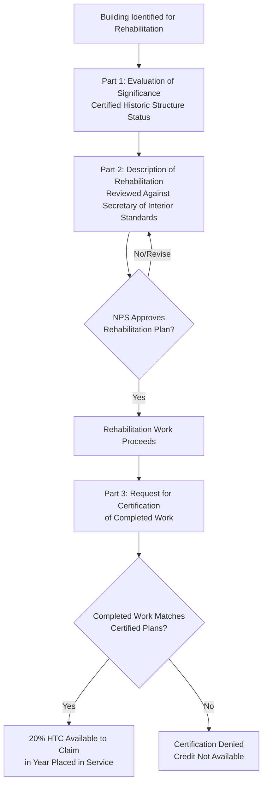

## Federal Historic Rehabilitation Tax Credit

### Overview

The Federal Historic Rehabilitation Tax Credit (HTC), codified under Section 47 of the Internal Revenue Code, incentivizes the rehabilitation of historic and older commercial buildings by providing a tax credit calculated as a percentage of qualified rehabilitation expenditures (QREs). Administered jointly by the National Park Service (NPS), State Historic Preservation Offices (SHPOs), and the IRS, the HTC is one of the oldest federal tax credit incentive programs still in active use, and it is frequently combined ("twinned") with other credit programs — most notably the Low-Income Housing Tax Credit — when a rehabilitation project also serves an affordable housing purpose.

### Core Program Mechanics

**Key Points**

- **Credit Rate**: The federal HTC provides a credit equal to 20% of qualified rehabilitation expenditures for the rehabilitation of a "certified historic structure."
- **Certified Historic Structure Definition**: A certified historic structure is a building listed individually in the National Register of Historic Places, or located in a registered historic district and certified by the National Park Service as contributing to that district's historic significance.
- **Qualified Rehabilitation Expenditures (QREs)**: QREs generally include costs directly associated with the rehabilitation of the building's structural and architectural components (walls, floors, roof structure, windows, interior structural elements), but generally exclude costs for acquisition of the building, new additions that expand the building's footprint, site work outside the building envelope, and personal property/furnishings.
- **Substantial Rehabilitation Test**: To qualify, the rehabilitation expenditures must exceed the greater of the building's adjusted basis or $5,000, within a defined measuring period (generally 24 months, or 60 months for projects completed in phases under a written architectural plan) — this test ensures the credit incentivizes genuinely substantial rehabilitation rather than minor repairs.
- **Credit Claiming Timeline**: Unlike the annual claiming structure of the LIHTC or the PTC, the HTC is generally claimed as a single credit in the year the rehabilitated building is placed in service, though the credit is subject to a 5-year recapture period during which the property must generally be retained and not disposed of.

### The Three-Part Certification Process

**Key Points**

The National Park Service administers a formal three-part application process to certify that a rehabilitation project qualifies for the credit:

1. **Part 1 — Evaluation of Significance**: Documents that the building is a certified historic structure (either individually listed or a contributing structure within a registered historic district).
2. **Part 2 — Description of Rehabilitation**: Details the proposed rehabilitation work, which the NPS reviews against the Secretary of the Interior's Standards for Rehabilitation to ensure the work preserves the building's historic character.
3. **Part 3 — Request for Certification of Completed Work**: Submitted after rehabilitation work is finished, confirming the completed work matches the certified Part 2 plans and requesting final certification that allows the credit to be claimed.

### Financing Structure: The HTC Investor Partnership

**Key Points**

- **Master Tenant Structure**: A common HTC financing structure involves the property owner (often itself a partnership or LLC) leasing the building to a separate "master tenant" entity, in which a tax equity investor holds a leveraged ownership interest — this structure, sometimes called the "master lease pass-through" or "master tenant" structure, allows the investor to be allocated the HTC even though the underlying real property is owned by a different entity, since Section 50(d) of the Internal Revenue Code permits a lessee (rather than only the owner) to claim the credit if certain election requirements are met.
- **Direct Investment Structure**: Alternatively, the investor can invest directly as a partner in the entity that owns the historic building, receiving an allocation of the credit (and associated depreciation) proportional to its partnership interest, similar in concept to LIHTC or renewable energy tax equity partnership structures.
- **Historic Boardwalk Hall Considerations**: Structuring approaches in this space have been shaped significantly by prior tax litigation addressing the boundaries of legitimate partnership allocations of historic tax credits, leading practitioners to carefully structure investor economic risk, profit-sharing, and capital contribution timing to support the investor's status as a bona fide partner rather than merely a purchaser of the credit. [Inference: this reflects a general area of established tax practice caution informed by historical case law; specific structuring approaches should be developed with current qualified tax counsel given the fact-specific nature of partnership validity analysis.]

### Illustrative Credit Calculation

**Example**

A developer rehabilitates a certified historic office building with an adjusted basis of $2,000,000, incurring $6,000,000 in qualified rehabilitation expenditures — comfortably exceeding the substantial rehabilitation threshold (the greater of adjusted basis or $5,000):

$$HTC\ Value = QREs \times 0.20 = \$6{,}000{,}000 \times 0.20 = \$1{,}200{,}000$$

This $1.2 million credit, combined with depreciation on the rehabilitated basis (subject to a basis reduction equal to the full amount of the HTC claimed, unlike the 50% basis reduction rule applicable to the clean energy ITC), forms the core tax benefit package available to structure into an investor partnership. [Unverified — illustrative calculation only; actual qualifying expenditure categorization, basis calculations, and structuring specifics require detailed cost certification and qualified tax and accounting advice specific to the project.]

### Comparative Table: HTC vs. LIHTC vs. Clean Energy ITC

| Attribute | Federal HTC (Section 47) | LIHTC (Section 42) | Clean Energy ITC |
| --- | --- | --- | --- |
| Credit Rate | 20% of QREs | ~70% or ~30% present value | 6%-50%+ of eligible basis |
| Claiming Timeline | Single credit, year placed in service | Over 10 years | One-time, year placed in service |
| Recapture Period | 5 years | 15-year compliance period | 5-year recapture period |
| Certifying Agency | National Park Service (3-part application) | State Housing Finance Agency | No third-party certification (self-certified technical compliance) |
| Basis Reduction | Full amount of credit claimed | Not applicable in the same manner | 50% of credit claimed |
| Common Structuring Vehicle | Master tenant / direct partnership | Syndicated limited partnership | Partnership flip / sale-leaseback |
| Transferability (6418) | Not eligible | Not eligible | Eligible |

### Twinning with Other Tax Credit Programs

**Key Points**

- **HTC + LIHTC**: Historic buildings converted to affordable rental housing frequently combine the HTC with LIHTC, requiring careful allocation of qualified rehabilitation expenditures and eligible basis between the two credit calculations to avoid impermissible double-counting of the same costs, and often requiring separate but coordinated investor structures (or a single investor willing to take both credit types) within the overall capital stack.
- **HTC + NMTC**: Historic rehabilitation projects involving qualifying commercial or mixed-use development in low-income communities can also be twinned with the New Markets Tax Credit, adding the NMTC's leveraged structure and CDE intermediary layer on top of the HTC partnership structure — a combination that increases structuring complexity but can meaningfully increase total project subsidy.
- **State Historic Tax Credits**: Many states offer their own historic rehabilitation tax credits that can be layered on top of the federal HTC, often monetized through separate state-specific transfer or syndication markets (state HTC transferability rules vary significantly by state and are distinct from the federal Section 6418 regime, which does not include the federal HTC).

### Risk Factors

**Key Points**

- **NPS Certification Risk**: Because Part 2 and Part 3 certifications require NPS approval against the Secretary of the Interior's Standards for Rehabilitation, there is inherent risk that proposed or completed work may be deemed non-compliant, potentially resulting in required design changes mid-project or, in the case of Part 3 denial, complete loss of credit eligibility for work already performed.
- **Basis and Cost Certification Risk**: Distinguishing qualified rehabilitation expenditures from non-qualifying costs (acquisition costs, new additions, site work, personal property) requires careful accounting and often a specialized cost certification process; misclassification can result in a smaller credit than anticipated or, in an audit context, disallowance of miscategorized costs.
- **Recapture Risk**: Disposition of the property, or a reduction in the investor's interest, within the 5-year recapture period can trigger partial recapture of the credit, requiring investors to carefully monitor ownership stability through the compliance window.
- **Partnership Validity Risk**: Given historical litigation in this area, structures that allocate disproportionate credit benefit to an investor without corresponding meaningful economic risk and reward can face IRS challenge to the underlying partnership's validity, potentially jeopardizing the investor's ability to claim the allocated credit.

### Related Topics

- Secretary of the Interior's Standards for Rehabilitation: Technical Compliance Overview
- Section 50(d) Master Tenant/Lessee Election Structuring
- Qualified Rehabilitation Expenditure (QRE) Classification and Cost Certification
- Low-Income Housing Tax Credit Structuring (comparative, HTC/LIHTC twinning)
- New Markets Tax Credit Structuring (comparative, HTC/NMTC twinning)
- State Historic Tax Credit Programs and Transfer Market Variation
- Partnership Validity and Bona Fide Partner Risk in Tax Credit Structures
- Basis Reduction Rules Across Federal Tax Credit Programs (comparative)