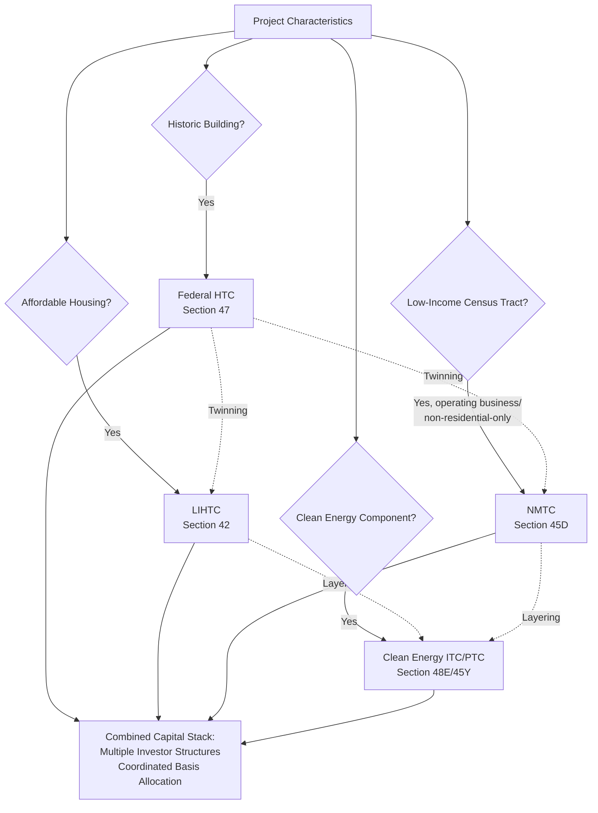

## Cross-Program Layering and Twinning Strategies

### Overview

Cross-program layering (also called "twinning" or "stacking") refers to the practice of combining two or more federal tax credit programs — and often accompanying state and local subsidy sources — within a single project's capital stack to maximize total available subsidy. Because each federal credit program (LIHTC, NMTC, HTC, and clean energy ITC/PTC) is governed by its own statutory basis rules, allocation mechanics, compliance periods, and investor structuring conventions, combining them requires careful technical coordination to avoid impermissible double-counting of costs, basis conflicts, and structural incompatibilities between the programs' respective investor and compliance requirements. This section synthesizes the most common layering combinations covered elsewhere in this course and the cross-cutting structuring principles that apply across all of them.

### Why Layering Occurs

**Key Points**

- **Subsidy Gap Financing**: Many affordable housing, community development, and historic preservation projects have total development costs that exceed what any single tax credit program's subsidy value can support, particularly in high-cost markets or projects serving very low-income populations — layering additional credit programs closes this financing gap.
- **Complementary Project Characteristics**: Certain project types naturally trigger eligibility for multiple programs simultaneously — for example, a historic building being converted into affordable housing in a low-income census tract can independently qualify for the Historic Tax Credit (based on the building's historic status), LIHTC (based on the affordable housing use), and potentially NMTC (based on the census tract's low-income designation), even though each program's eligibility test is entirely independent of the others.
- **Renewable Energy and Community Development Overlap**: Clean energy tax credits can also be layered into community development contexts — for example, a solar or storage installation as part of a larger LIHTC-financed affordable housing development, or a clean energy component within a QALICB financed through NMTC, allowing a single physical project to draw on multiple, otherwise unrelated federal incentive programs.

### Core Structural Challenge: Basis and Cost Allocation

**Key Points**

- **No Double-Dipping on the Same Dollar of Cost**: The fundamental technical constraint across all layering combinations is that the same dollar of project cost generally cannot be counted toward the eligible basis or qualified expenditure calculation of two different credit programs simultaneously — sponsors and their accountants must carefully allocate costs to the specific program(s) for which they qualify, often requiring detailed cost segregation studies.
- **Basis Reduction Interactions**: Different programs apply different basis reduction rules when a credit is claimed (for example, the clean energy ITC requires a 50% basis reduction for depreciation purposes, while the Historic Tax Credit requires a full basis reduction equal to the credit claimed) — when combining programs, sponsors must apply each program's specific basis reduction rule to the correct portion of allocated costs, in the correct sequence, to avoid understating or overstating available depreciation.
- **Independent Eligibility Determinations**: Each program's eligibility criteria must be independently satisfied — qualifying for one program (e.g., LIHTC's income/rent restrictions) does not automatically satisfy or substitute for another program's separate requirements (e.g., HTC's Secretary of the Interior's Standards compliance, or NMTC's QALICB census tract and business-type requirements).

### Common Layering Combinations

### Layering Combination Profiles

**Key Points**

**HTC + LIHTC**: The most well-established twinning combination, applicable when a historic building is rehabilitated into affordable rental housing. Requires allocating qualified rehabilitation expenditures (for HTC) versus eligible basis (for LIHTC) across the same rehabilitation costs, often necessitating a single detailed cost certification supporting both credit calculations, and frequently requires coordinating two separate investor relationships (an HTC investor and an LIHTC investor) or identifying a single investor willing to take both credit types within one partnership structure.

**HTC + NMTC**: Applicable to historic commercial or mixed-use rehabilitation in low-income communities, layering the HTC's building-focused rehabilitation credit with NMTC's leveraged structure and business-development focus. This combination adds NMTC's certified CDE intermediary layer and 7-year compliance period on top of the HTC's more building-centric certification and 5-year recapture period, requiring careful sequencing of the two programs' distinct closing and compliance timelines.

**LIHTC + NMTC**: Generally more limited in applicability, since NMTC eligibility criteria typically exclude projects that are predominantly residential rental property without a substantial commercial component — layering is more feasible for mixed-use projects combining affordable housing with a qualifying commercial or community facility component that can independently satisfy NMTC's QALICB requirements for the commercial portion.

**Clean Energy Credits + LIHTC**: Increasingly common as affordable housing developers incorporate on-site solar, storage, or energy efficiency measures into new construction or rehabilitation projects, allowing the housing development to separately claim the clean energy ITC for qualifying energy property alongside the LIHTC for the housing itself — this combination generally involves less basis-allocation friction than HTC/LIHTC twinning, since the clean energy equipment is typically a more clearly separable cost category from the building's core construction costs.

**Clean Energy Credits + NMTC**: Applicable when a QALICB (the operating business financed through an NMTC leveraged structure) incorporates a qualifying clean energy component as part of its facility, allowing the underlying clean energy equipment to separately generate ITC/PTC value alongside the NMTC financing the broader business facility.

### Comparative Table: Compliance Period and Structural Compatibility

| Program Pair | Compliance Period Alignment Challenge | Typical Investor Structure Compatibility |
| --- | --- | --- |
| HTC + LIHTC | 5-year (HTC) vs. 15-year (LIHTC) — HTC recapture window closes well before LIHTC compliance ends | Moderate — often requires two investor relationships or a dual-credit investor |
| HTC + NMTC | 5-year (HTC) vs. 7-year (NMTC) — closer alignment, but different unwind mechanics | Moderate — NMTC's leveraged structure and put/call exit differ from HTC's partnership model |
| LIHTC + NMTC | 15-year (LIHTC) vs. 7-year (NMTC) — significant misalignment if combined on the same asset | Lower — NMTC eligibility constraints on residential rental limit applicability |
| Clean Energy ITC + LIHTC | 5-year (ITC recapture) vs. 15-year (LIHTC) — ITC risk window closes first | Higher — clean energy equipment often more cleanly separable as its own cost/credit silo |
| Clean Energy ITC + NMTC | 5-year (ITC recapture) vs. 7-year (NMTC) — reasonably aligned | Higher — clean energy equipment within a QALICB facility is a relatively clean addition |

### Investor and Underwriting Considerations

**Key Points**

- **Single Investor vs. Multiple Investor Structures**: Sponsors must decide whether to seek a single investor willing to take an allocation across multiple credit types (simplifying negotiation but potentially limiting the pool of capable investors) or to bring in separate specialized investors for each credit program (broadening the potential investor pool but increasing structuring complexity and intercreditor/inter-partnership coordination).
- **Underwriting Complexity Scales with Program Count**: Each additional program layered into a project adds its own due diligence requirements, compliance monitoring obligations, and recapture risk profile — investors and their counsel must underwrite the cumulative compliance burden and risk of the combined structure, not merely each program in isolation.
- **Closing Sequencing**: Because different programs often have different certification timelines (e.g., NPS Part 2/Part 3 review for HTC, CDE allocation timing for NMTC, construction/placed-in-service milestones for ITC), sponsors must carefully sequence the overall project closing and construction schedule to accommodate each program's distinct procedural requirements without creating conflicting deadlines.
- **Legal and Accounting Cost Premium**: Layered transactions carry meaningfully higher legal and accounting structuring costs than single-program transactions, given the need for coordinated cost certifications, multiple partnership agreements (or a more complex single agreement addressing multiple credit allocations), and specialized counsel familiar with each program's technical requirements — this cost premium generally makes layering most economically viable for larger-scale projects able to absorb the fixed transaction costs across a bigger total capital base.

### Risk Factors Specific to Layered Structures

**Key Points**

- **Basis Allocation Disputes**: Because layered structures require allocating shared costs across multiple credit programs, there is elevated risk of IRS challenge to the allocation methodology if it is not well-documented and defensibly grounded in an independent cost certification or segregation study.
- **Compounding Recapture Exposure**: A single adverse event (e.g., premature disposition of the property, or a compliance failure under one program) can potentially trigger recapture under multiple programs simultaneously if the underlying triggering event affects the qualifying conditions of more than one credit, magnifying the financial consequence of a single compliance lapse.
- **Compliance Period Mismatch Risk**: Because different programs' compliance periods end at different times, sponsors and investors must maintain active compliance monitoring systems that track multiple, non-aligned compliance windows simultaneously — allowing one program's compliance period to lapse into non-monitoring while another remains active is a common structural risk in layered deals.
- **Market Availability Risk**: Not all investors are equipped or willing to underwrite multi-program layered structures, potentially narrowing the pool of capital providers willing to participate compared to a simpler single-program transaction, which can affect pricing and closing timeline certainty.

### Related Topics

- Federal Historic Rehabilitation Tax Credit (comparative deep dive)
- Low-Income Housing Tax Credit Structuring (comparative deep dive)
- New Markets Tax Credit Structuring (comparative deep dive)
- Basis Reduction Rules Across Federal Tax Credit Programs
- Cost Segregation Methodology for Multi-Credit Basis Allocation
- Multi-Investor Partnership Structuring and Intercreditor Coordination
- Compliance Period Monitoring Systems for Layered Tax Credit Structures
- Qualified Opportunity Zone Funds After the 2025 Reforms (comparative, additional layering candidate)