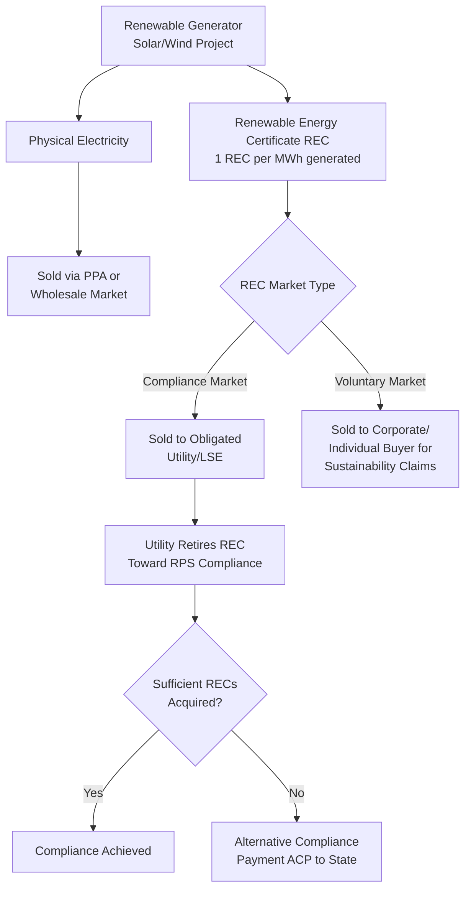

## State Renewable Portfolio Standards and Credit Markets

### Overview

State Renewable Portfolio Standards (RPS), sometimes called Clean Energy Standards (CES) in states that include non-renewable zero-carbon resources like nuclear, are state-level policy mandates requiring electric utilities and other load-serving entities to source a specified percentage of their electricity sales from qualifying renewable or clean energy resources by defined target dates. Unlike the federal tax credit programs covered elsewhere in this course, RPS programs are not tax incentives at all — they are regulatory compliance obligations that create their own market-based tradable instruments, most notably Renewable Energy Certificates (RECs), which function as a distinct, non-federal revenue stream that project developers layer alongside federal tax credits and PPA revenue to complete a project's overall economics.

### Core RPS Mechanics

**Key Points**

- **State-by-State Variation**: RPS programs are established individually by each state's legislature or public utility commission, meaning there is no single federal RPS — instead, a patchwork of approximately 30 states plus the District of Columbia maintain mandatory RPS or CES programs, each with its own target percentage, target date, eligible technology definitions, and compliance mechanisms. [Unverified — the exact count and specific program parameters change over time as states adopt, amend, or in rare cases retire RPS legislation, and should be verified against current state-by-state policy trackers for any specific jurisdiction.]
- **Compliance Obligation Structure**: Utilities or other obligated load-serving entities within a state must demonstrate that a specified percentage of their retail electricity sales are sourced from qualifying renewable resources, typically increasing on a defined schedule toward a long-term target (e.g., 50% by a certain year, 100% clean by a later year).
- **Tiered and Carve-Out Structures**: Many RPS programs include tiered structures distinguishing between different resource categories (e.g., a general renewable tier alongside a specific "solar carve-out" or "distributed generation carve-out" requiring a minimum percentage of compliance to come from a particular technology or scale of project), creating differentiated compliance value and separate credit markets for different resource types within the same state.

### Renewable Energy Certificates (RECs): The Core Tradable Instrument

**Key Points**

- **REC Definition**: A REC represents the environmental and social attributes (but not the electricity itself) associated with one megawatt-hour (MWh) of renewable electricity generation, allowing the environmental attribute to be tracked, certified, and traded separately from the physical electricity commodity.
- **Unbundling from Physical Electricity**: Because a REC is legally separable from the underlying electricity, a generator can sell the physical electricity into the wholesale market (or under a PPA) while separately selling the associated REC to a different buyer seeking to demonstrate renewable sourcing — this "unbundling" is central to how RPS compliance markets function.
- **Compliance RECs vs. Voluntary RECs**: RECs used by obligated utilities to meet RPS compliance obligations ("compliance RECs") typically must meet specific state-defined eligibility criteria (technology type, vintage, geographic/regional tracking system registration) and often trade at a premium reflecting genuine compliance value, whereas "voluntary RECs" (purchased by corporations or individuals for voluntary sustainability claims rather than regulatory compliance) generally trade at lower prices reflecting a less constrained buyer pool and less stringent eligibility requirements.
- **Alternative Compliance Payments (ACPs)**: Most RPS programs establish an Alternative Compliance Payment mechanism — a per-MWh penalty payment a utility can make to the state in lieu of acquiring sufficient RECs — which effectively creates a price ceiling for compliance RECs in that state's market, since a rational utility will not pay more for a REC than the cost of simply paying the ACP instead.

### REC Market Flow

### RECs as a Project Revenue Component

**Key Points**

- **Layered Revenue Stack**: For a typical renewable energy project, total revenue is generally composed of multiple layered streams — physical electricity sales (via PPA or merchant market), federal tax credit value (ITC or PTC, monetized via tax equity or transfer), and REC sales (either bundled into a PPA price or sold separately/"unbundled" into the compliance or voluntary market) — REC revenue is a distinct, non-federal, state-policy-driven component of this stack.
- **Bundled vs. Unbundled REC Sales**: Some project PPAs bundle REC value directly into the contracted electricity price (the offtaker receives both the energy and the associated RECs under a single contract), while other projects sell electricity and RECs separately to different counterparties, allowing the developer to potentially capture higher aggregate value if REC and energy markets are priced favorably at different times or to different buyers.
- **REC Price Volatility and Geographic Variation**: Because RPS programs and their associated REC markets are state-specific, REC prices vary substantially by state and by resource-tier eligibility — a solar carve-out REC in a state with an aggressive solar-specific mandate and limited qualifying supply can command a materially higher price than a general Class I renewable REC in a state with a less stringent target or abundant qualifying supply.

### Tracking Systems and Certification Infrastructure

**Key Points**

- **Regional Tracking Systems**: RECs are tracked through regional electronic tracking systems (such as NEPOOL-GIS in New England, PJM-GATS in the PJM region, WREGIS in the Western states, and other regional systems), which issue, track ownership transfers, and retire RECs to prevent double-counting or double-selling of the same environmental attribute.
- **Certification and Vintage Requirements**: State RPS programs typically specify vintage requirements (how recently the REC must have been generated to count toward a given compliance year) and may restrict eligibility to RECs generated within the same state, a broader regional grid area, or facilities meeting specific commercial operation date thresholds (e.g., "new" resources built after a certain date, to ensure the RPS drives incremental clean energy development rather than simply crediting existing legacy resources).

### Comparative Table: REC Markets vs. Federal Tax Credit Transfer Market

| Attribute | REC/RPS Compliance Market | Federal Tax Credit Transfer Market (IRC 6418) |
| --- | --- | --- |
| Governing Authority | Individual state legislatures/utility commissions | Federal (IRS/Treasury) |
| Underlying Instrument | Renewable Energy Certificate (1 MWh) | Tax credit dollar amount |
| Price Ceiling Mechanism | Alternative Compliance Payment (ACP), where applicable | Market-driven; no statutory price ceiling |
| Geographic Scope | State-specific, sometimes regional | National |
| Compliance Buyer | Obligated utilities/load-serving entities | Any eligible taxpayer with sufficient tax liability |
| Standardization | Varies significantly by state/tracking system | Standardized IRS registration process |
| Typical Project Use | Layered revenue alongside energy sales and tax credits | Primary tax benefit monetization mechanism |

### Structuring and Financing Considerations

**Key Points**

- **REC Revenue in Project Finance Underwriting**: Lenders and tax equity investors financing a renewable project must independently underwrite REC price risk (for unbundled/merchant REC sales) or REC price is effectively locked in (for bundled long-term PPA structures), since REC revenue volatility can materially affect a project's overall debt service coverage and equity return projections, particularly for projects relying on a meaningful proportion of merchant REC sales.
- **Interaction with Federal Additionality/Matching Requirements**: For clean hydrogen production under Section 45V (see related topic), the "three pillars" framework's incrementality and temporal matching requirements draw conceptually on REC-like tracking and time-matching principles, illustrating how state REC market infrastructure and emerging federal clean energy program design can share common technical DNA even though they are legally and administratively distinct systems.
- **Policy Risk from RPS Program Changes**: Because RPS targets, eligible technology definitions, and carve-out structures are set at the state level and subject to legislative or regulatory amendment, developers and investors relying on projected REC revenue face policy risk that a state could reduce its RPS target, expand eligible resource definitions (increasing supply and depressing prices), or otherwise alter the compliance framework in ways that affect long-term REC value — this risk is analogous in character to (but legally distinct from) federal tax credit policy risk.

### Related Topics

- Regional REC Tracking Systems (WREGIS, PJM-GATS, NEPOOL-GIS) Technical Overview
- Solar and Technology-Specific Carve-Out Market Dynamics
- PPA Structuring: Bundled vs. Unbundled REC Sales
- Voluntary Renewable Energy Markets and Corporate Sustainability Procurement
- Clean Hydrogen Production (comparative, three pillars matching framework)
- State Tax Credit and Incentive Programs Beyond RPS/REC Markets
- Alternative Compliance Payment Mechanisms and Price Ceiling Effects
- Utility-Scale and Distributed Solar (comparative, REC revenue interaction)