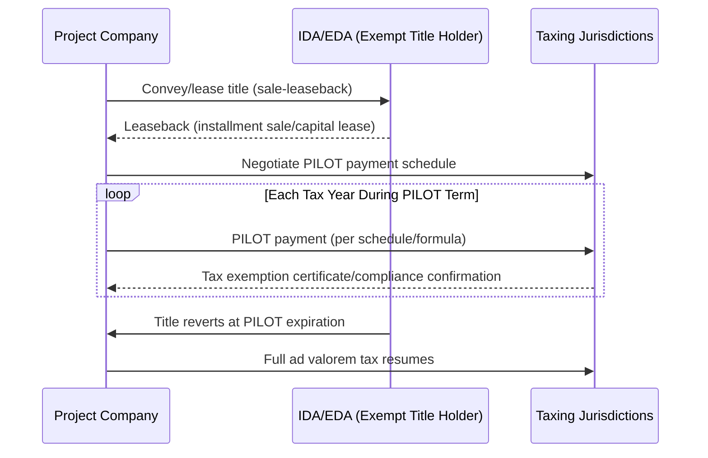
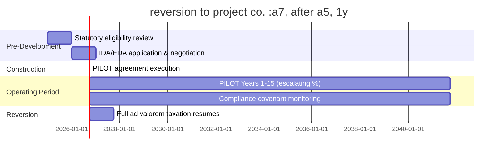

## Property Tax Abatements and Payment-in-Lieu-of-Tax Agreements

### Overview

Property tax abatements and Payment-in-Lieu-of-Tax (PILOT) agreements are state and local incentive mechanisms used to reduce or restructure a project's real and/or personal property tax liability in exchange for economic development commitments — capital investment, job creation, retention, or blight remediation. Both tools operate at the intersection of local government finance, state enabling statutes, and project-level tax equity structuring, and are frequently layered with federal incentives (e.g., the Investment Tax Credit (ITC), Production Tax Credit (PTC), or Low-Income Housing Tax Credit (LIHTC)) in renewable energy, manufacturing, and real estate development deals.

- **Property tax abatement**: A statutory or negotiated reduction, freeze, or exemption of ad valorem property taxes for a defined period, typically tied to an assessed value baseline.
- **PILOT agreement**: A contractual arrangement in which a property owner (often a tax-exempt entity, government-affiliated authority, or project company holding title through a conduit issuer) makes negotiated payments to a taxing jurisdiction *in lieu of* standard property taxes, which would otherwise be zero or reduced due to exempt ownership.

### Legal and Structural Foundations

#### Why PILOTs Exist

Local property tax is levied on the property owner of record. Many economic development structures intentionally place title with a tax-exempt or specially chartered entity — a state/local Industrial Development Authority (IDA), Economic Development Authority (EDA), or a municipal redevelopment agency — to unlock financing benefits (e.g., IDA-issued tax-exempt bonds) or statutory exemptions. Because government or quasi-governmental ownership would otherwise eliminate the local tax base, PILOTs are negotiated so the jurisdiction still receives predictable revenue, just restructured and often reduced relative to full assessed-value taxation.

#### Common Ownership/Leaseback Structure

1. Project company conveys or leases the underlying land/improvements to an IDA/EDA (sale-leaseback or lease-leaseback).
2. The IDA/EDA, as title holder, is exempt from local property tax under state law.
3. The IDA/EDA leases the property back to the project company (the "lessee" or "sublessee") under an installment sale or capital lease.
4. The project company, as beneficial user, executes a PILOT agreement directly with the IDA/EDA and/or affected taxing jurisdictions (county, municipality, school district).
5. At the end of the PILOT term (or upon default), title reverts to the project company, triggering standard *ad valorem* taxation going forward.

### Abatement Mechanisms

Property tax abatement programs vary by state and locality but generally fall into these categories:

- **Exemption abatements**: A percentage (often declining over time) of assessed value is exempted from taxation — e.g., 100% year 1–5, phasing down to 0% by year 10.
- **Freeze/base-year assessment**: The assessed value is frozen at pre-improvement levels for a term, so only the baseline (not the new improvement value) is taxed; incremental value escapes taxation until the freeze expires.
- **Tax increment financing (TIF) overlap**: Related but distinct — TIF captures the *incremental* tax revenue from increased assessed value to fund public infrastructure, rather than abating the tax itself. Deals frequently combine TIF districts with abatements or PILOTs.
- **Enterprise zone / opportunity zone property tax incentives**: State-designated zones (distinct from federal Opportunity Zones) offering abatement eligibility tied to location rather than negotiated deal terms.

### PILOT Payment Formulas

PILOT payment schedules are negotiated instruments and vary widely, but common formula structures include:

1. **Fixed schedule**: Flat or stepped dollar amounts per year, agreed in advance, independent of assessed value fluctuations.
2. **Percentage-of-taxes-otherwise-due**: PILOT payment = negotiated % × (what standard *ad valorem* tax would have been), often escalating over the term (e.g., 10% year 1 → 100% year 15).
3. **Per-unit/per-megawatt formulas**: Common in utility-scale wind, solar, and battery storage projects, where payments are calculated per installed MW or MWh rather than assessed value, providing revenue predictability for both the developer and jurisdiction despite volatile equipment valuation.
4. **Revenue-based or production-based formulas**: Tied to project output or gross revenue, more common in specialized infrastructure.

A generic percentage-based PILOT calculation:

$$PILOT_t = p_t \times \left( AV_t \times m_t \right)$$

Where:

- $AV_t$ = assessed value in year $t$ (or frozen base-year value, depending on structure)
- $m_t$ = applicable millage/tax rate in year $t$
- $p_t$ = negotiated PILOT percentage applicable in year $t$ (may escalate per a step schedule)

**Example**

A solar project with a stipulated per-MW PILOT: $8,000/MW-year for a 100 MW project.

$$PILOT_{annual} = 100 \text{ MW} \times \$8{,}000/\text{MW} = \$800{,}000$$

This flat per-MW approach avoids annual reassessment disputes over depreciating equipment value — a frequent source of litigation in ad valorem solar/wind taxation.

### Interaction with Tax Equity Structures

Property tax treatment materially affects the economics underlying federal tax equity investment (partnership flips, sale-leasebacks, inverted leases):

- **Cash flow modeling**: PILOT payment obligations are modeled as a fixed or semi-fixed operating expense line, directly affecting the project's net cash available for distribution to the tax equity investor and sponsor.
- **Depreciation basis interactions**: In inverted lease or sale-leaseback structures involving IDA/EDA title holders, care must be taken that the exempt entity's involvement does not jeopardize the project company's ability to claim MACRS depreciation or ITC — the IRS looks to beneficial ownership and the substance of the lease, not bare legal title, per general federal tax principles (see *Frank Lyon Co. v. United States*, 435 U.S. 561 (1978), for sale-leaseback substance analysis). [Inference: application of this doctrine to specific PILOT/IDA fact patterns depends on deal-specific structuring and counsel opinion.]
- **ITC basis and abated taxes**: Property tax abatements generally do not reduce ITC-eligible basis (unlike direct grants or certain state credits that require basis reduction under IRC §50(c)); however, characterization depends on whether the abatement is treated as a cost reduction versus a separate incentive. [Unverified: consult current IRS guidance and counsel for basis treatment of specific state programs, as treatment can vary and has been subject to evolving guidance.]
- **Recapture risk**: If the PILOT/abatement structure is unwound early (e.g., IDA involvement terminated, property reverts, sale-leaseback recharacterized), this can create disruption to the tax equity financing structure that must be addressed contractually via indemnities and step-in rights.

### Negotiation and Underwriting Considerations

**Key Points**

- **Term length**: Typical PILOT/abatement terms range 5–30 years depending on jurisdiction, project type, and capital intensity; utility-scale generation and large manufacturing facilities often negotiate longer terms (15–25 years) given multi-decade asset life.
- **Clawback/recapture provisions**: Agreements typically include job-creation or investment-threshold covenants; failure to meet benchmarks can trigger reduced abatement percentages or repayment obligations.
- **School district and overlapping jurisdiction consent**: In many states, school districts and other overlapping taxing bodies (fire districts, county governments) must separately consent to or be bound by the PILOT, since they otherwise lose their share of the tax base.
- **Assignability**: Tax equity and lender due diligence typically requires confirmation that PILOT agreements are assignable/survive a change of control, foreclosure, or transfer to a tax equity partnership, without triggering renegotiation or termination rights.
- **Sunset and reversion mechanics**: Clear definition of what assessed value baseline applies once the PILOT/abatement term ends is essential for post-term cash flow projections.
- **State enabling statute variance**: Authority to grant abatements/PILOTs derives from state statute (e.g., New York's Real Property Tax Law §487 for renewable energy PILOTs, various states' IDA/EDA enabling acts); local governments cannot grant incentives beyond what state law authorizes.

### Illustrative Deal Timeline

### Common Pitfalls

- **Underestimating compliance administration**: Annual certification, job-count reporting, and capital investment verification carry ongoing administrative burden often underweighted in initial deal underwriting.
- **Ignoring overlapping jurisdiction dynamics**: A county-level PILOT may not bind an independent school district; failing to secure multi-jurisdictional consent can leave a portion of expected tax savings unrealized.
- **Static modeling of escalating formulas**: Step-up PILOT percentages (e.g., 10% → 100% over 15 years) are sometimes mismodeled as flat, materially misstating late-term project economics.
- **Assuming ITC basis is unaffected without verification**: Basis-reduction rules under IRC §50(c) apply to certain subsidies; each state program's abatement/PILOT design should be individually assessed against current guidance rather than assumed benign.

### Related Topics

- Tax Increment Financing (TIF) Districts
- Industrial Development Bonds and Conduit Financing
- Sale-Leaseback Structures in Tax Equity Financing
- IRC §50(c) Basis Reduction Rules for Subsidized Energy Property
- State Enabling Statutes for Economic Development Authorities
- Enterprise Zones and State-Level Opportunity Zone Programs
- Ad Valorem Taxation of Utility-Scale Renewable Energy Equipment
- Partnership Flip and Inverted Lease Structures (Federal Tax Equity)