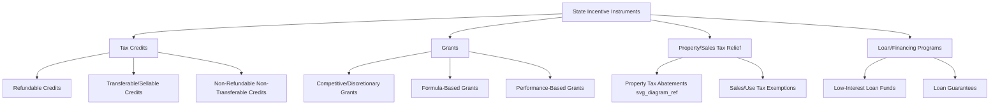

## State-Level Tax Credits and Grant Programs

### Overview

State-level tax credits and grant programs are non-federal incentive instruments that states, and in some cases municipalities, use to attract capital investment, encourage job creation, and support targeted policy objectives (renewable energy, historic preservation, film production, low-income housing, R&D, manufacturing). Unlike federal tax equity vehicles (ITC/PTC), these instruments are governed by individual state statutes and administrative codes, resulting in significant heterogeneity in eligibility, transferability, monetization mechanics, and interaction with federal tax attributes.

- **Tax credit**: A dollar-for-dollar reduction of state tax liability, which may be refundable, transferable/sellable, or non-refundable/non-transferable depending on the enabling statute.
- **Grant**: A direct cash disbursement from a state agency, typically not tied to tax liability, often subject to appropriations availability and competitive or formulaic award processes.

### Taxonomy of State Incentive Instruments

### Common Categories by Policy Objective

**Key Points**

- **Renewable energy production/investment credits**: State-level analogs to federal PTC/ITC, sometimes stackable, sometimes designed to fill gaps where federal credits phase out or exclude certain technologies.
- **Historic rehabilitation tax credits (HTCs)**: Parallel state credits to the federal 20% HTC under IRC §47, often transferable, frequently layered ("twinned") with the federal credit in historic redevelopment tax equity deals.
- **Film and media production credits**: Typically transferable or refundable, calculated as a percentage of qualified in-state spend; among the most actively traded transferable credit markets.
- **Low-income housing credits (state LIHTC)**: State-level supplements to the federal 9%/4% LIHTC, either as a percentage "piggyback" of the federal credit or a freestanding state allocation.
- **R&D and innovation credits**: Often modeled on the federal §41 R&D credit but with independent qualification rules and sometimes refundability for early-stage/pre-revenue companies.
- **Job creation/retention and capital investment credits**: Tied to negotiated job count, wage thresholds, and capital expenditure commitments, frequently subject to clawback for non-performance.
- **Opportunity zone-adjacent state programs**: Some states layer additional state tax benefits on top of federal Qualified Opportunity Zone (QOZ) investments.

### Monetization Mechanics

State credits generally reach economic value to an investor or developer through one of the following paths:

1. **Direct use against tax liability**: The generating entity uses the credit to offset its own state tax liability across the statutory carryforward period (commonly 5–20 years, varies by state).
2. **Transfer/sale**: In states permitting transferability (e.g., historic and film credits in many jurisdictions), the credit is sold to a third-party taxpayer with sufficient state tax liability, typically at a discount to face value (commonly $0.80–$0.95 per $1.00 of credit, depending on market liquidity, credit type, and risk of recapture).
3. **Syndication through a tax credit investor/fund**: Similar in structure to federal LIHTC/HTC syndication, where an investor acquires an equity interest in the credit-generating entity to claim the credit directly (pass-through), often combined with federal credits in "twinned" deals.
4. **Refund**: For refundable credits, the state issues a cash refund for any credit amount exceeding tax liability, functioning economically similar to a grant.

$$\text{Effective Yield} = \frac{\text{Purchase Price Paid for Credit}}{\text{Face Value of Credit}}$$

**Example**

An investor purchases $1,000,000 of a transferable state film tax credit at $0.90 on the dollar:

$$\text{Purchase Price} = \$1{,}000{,}000 \times 0.90 = \$900{,}000$$

$$\text{Effective Discount Yield} = \frac{\$1{,}000{,}000 - \$900{,}000}{\$900{,}000} \approx 11.1\%$$

This discount compensates the buyer for timing risk (when the credit can actually be claimed/refunded), recapture risk, and market liquidity constraints.

### Grant Program Structures

- **Competitive/discretionary grants**: Awarded via application and scoring process against state economic development priorities (e.g., site selection incentive packages for large manufacturing facilities).
- **Formula-based grants**: Distributed according to a statutory formula (e.g., per-job or per-dollar-invested), with less discretion once eligibility thresholds are met.
- **Performance-based/reimbursement grants**: Disbursed in tranches contingent on milestones (job creation benchmarks, capital expenditure verification, construction completion), often requiring the recipient to front costs and seek reimbursement.
- **Matching grants**: Require the recipient to contribute a specified proportion of matching capital, common in state clean energy and infrastructure grant programs.

### Interaction with Federal Tax Equity Structures

- **Basis reduction under IRC §50(c)**: Certain state grants and some credit structures characterized as "subsidized energy financing" can trigger basis reduction for federal ITC purposes; the specific treatment depends on whether the incentive is a grant (generally requiring basis reduction if a taxable grant funds cost) versus a tax credit (generally not reducing basis, though this varies by state credit design and is fact-specific). [Unverified: state-specific characterization determinations should be confirmed through current IRS guidance and tax counsel, since treatment is not uniform across programs.]
- **Twinning with federal credits**: In historic rehabilitation and low-income housing deals, state and federal credits are frequently structured to be claimed by the same investor or allocated pro-rata among investors within a single partnership, requiring careful capital account and allocation drafting under the partnership agreement.
- **Stacking limitations**: Some states impose "but-for" or anti-stacking rules limiting the combined value of state and federal incentives, or require disclosure of all incentives received when applying.
- **State tax equity investor base**: Because transferable credits require a buyer with sufficient state tax liability, market depth varies significantly by state; large states with robust corporate tax bases (e.g., California, New York, Georgia for film) tend to have more liquid transfer markets than smaller states.

### Underwriting and Diligence Considerations

**Key Points**

- **Statutory sunset risk**: State credit programs are subject to legislative renewal, budget caps, and periodic moratoria (film credits in particular have seen multiple states suspend or cap programs); diligence should confirm current program status and appropriations availability.
- **Annual/aggregate caps**: Many programs impose a statewide annual cap on total credits issued, creating allocation risk — an otherwise-qualifying project may not receive a credit if the cap is exhausted.
- **Recapture triggers**: Failure to maintain job counts, investment levels, or holding periods can trigger recapture, which is a material risk factor for any purchaser or investor in the credit.
- **Assignability and transfer restrictions**: Transfer often requires state agency notice, filing, or approval; diligence should confirm procedural requirements are met to preserve enforceability.
- **Timing mismatch**: Grants and refundable credits may be disbursed on a delayed basis relative to project cash needs, requiring bridge financing in the interim.

### Common Pitfalls

- **Treating all "state tax credits" as fungible**: Refundability, transferability, and carryforward rules differ enormously; conflating credit types leads to mispriced monetization assumptions.
- **Overlooking annual program caps in deal timing**: Submitting an application late in a fiscal year when the statewide cap is near exhaustion can result in a qualifying project receiving no allocation.
- **Failing to model recapture exposure in purchase price**: Transferable credit purchasers should discount for recapture risk (often mitigated via seller indemnities or holdback/escrow provisions), not merely for time value.
- **Assuming state and federal characterization are aligned**: A payment treated as a non-taxable credit at the state level may still have federal income tax or basis implications; state and federal tax treatment must be analyzed separately.

### Related Topics

- Property Tax Abatements and Payment-in-Lieu-of-Tax Agreements
- Federal Historic Rehabilitation Tax Credit (IRC §47) and Twinning Strategies
- Transferable Tax Credit Markets and Pricing Dynamics
- IRC §50(c) Basis Reduction for Subsidized Energy Property
- State Film and Media Production Incentive Structuring
- Low-Income Housing Tax Credit (LIHTC) Syndication
- Clawback and Recapture Provisions in Economic Development Agreements
- Bridge Financing Against Deferred Grant/Refund Disbursements