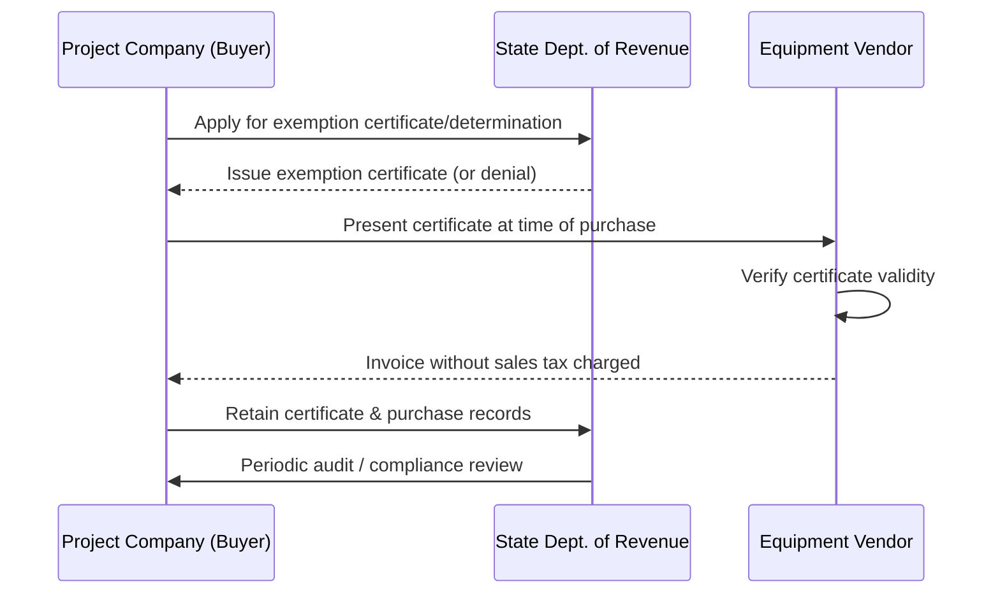
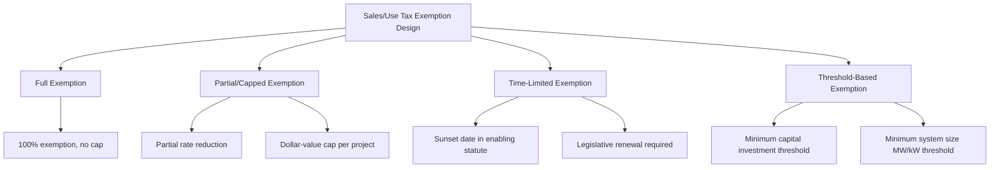

## Sales and Use Tax Exemptions for Energy Equipment

### Overview

Sales and use tax exemptions for energy equipment are state-level incentives that eliminate or reduce transaction-based taxes on the purchase, installation, or use of qualifying energy generation, storage, or efficiency equipment. Unlike income tax credits (federal ITC/PTC or state credits), these exemptions reduce upfront capital cost at the point of transaction rather than reducing tax liability over time, making them a distinct lever in project capital stack and total installed cost (TIC) modeling.

- **Sales tax exemption**: Relief from tax otherwise due at the point of sale on qualifying equipment purchased within the state.
- **Use tax exemption**: Relief from the complementary tax due when qualifying equipment is purchased out-of-state (where no sales tax was collected) but used/installed within the taxing state — use tax exists to prevent avoidance of sales tax via out-of-state purchasing.

### Why This Incentive Matters in Project Economics

Sales/use tax rates on capital equipment range roughly 4%–9%+ depending on state and local jurisdiction. For capital-intensive projects (utility-scale solar, wind, battery storage, combined heat and power, manufacturing equipment), this represents a direct, dollar-for-dollar reduction in total installed cost — distinct from and additive to income-tax-based incentives.

$$\text{Tax Savings} = C_{eq} \times r_{sut}$$

Where:

- $C_{eq}$ = total cost of qualifying equipment
- $r_{sut}$ = combined state/local sales and use tax rate

**Example**

A 50 MW solar project with $35,000,000 in qualifying equipment cost, sited in a state with a combined 7% sales/use tax rate and a full exemption for solar generation equipment:

$$\text{Tax Savings} = \$35{,}000{,}000 \times 0.07 = \$2{,}450{,}000$$

This $2,450,000 reduces the project's total installed cost basis for financing purposes, though its effect on ITC-eligible basis depends on how the exemption interacts with basis calculation (see Basis Interaction below).

### Qualifying Equipment Categories

**Key Points**

- **Solar generation equipment**: Modules, inverters, racking/mounting systems, and in some states balance-of-system components; definitions vary — some states narrowly exempt only "solar energy systems" as a defined term, excluding ancillary equipment.
- **Wind generation equipment**: Turbines, towers, and associated electrical equipment; often bundled with property tax incentives in the same enabling statute.
- **Energy storage systems**: An increasing number of states have extended or are extending sales tax exemptions to standalone battery storage, following IRA-driven growth in storage deployment; treatment varies by whether storage is co-located with generation or standalone.
- **Combined heat and power (CHP) and efficiency equipment**: Commercial/industrial energy efficiency retrofits, high-efficiency HVAC, and CHP systems in some states.
- **Manufacturing equipment for clean energy production**: Machinery and equipment used to manufacture solar, wind, or battery components, distinct from equipment used to generate energy itself — often tied to broader manufacturing sales tax exemptions rather than energy-specific statutes.
- **Data center energy equipment**: Some states extend sales tax exemptions to power infrastructure supporting large data center developments as a distinct economic development category.

### Exemption Certificate and Compliance Mechanics

Key procedural elements:

1. **Pre-qualification vs. point-of-sale self-certification**: Some states require formal pre-approval (application, agency determination letter) before exemption applies; others allow the buyer to self-certify via a standard exemption certificate form presented directly to the vendor.
2. **Direct pay permits**: Larger buyers in some states obtain a "direct pay permit," allowing them to purchase equipment tax-free and self-assess any use tax due directly to the state, simplifying vendor-side compliance.
3. **Retroactive refund claims**: If tax was paid in error on qualifying equipment (e.g., exemption certificate not available at time of purchase), most states allow a refund claim within a statutory limitations period (commonly 3–4 years).
4. **Recordkeeping**: Exemption certificates and equipment specification documentation must generally be retained for the state's audit lookback period (commonly 3–7 years).

### Basis Interaction with Federal Tax Equity

- **ITC basis is generally computed net of sales tax not actually paid**: Because the ITC is based on the tax basis of eligible energy property under IRC §48, and sales tax exemptions reduce the amount actually paid (and therefore capitalized) for equipment, the exempted sales tax amount is typically not includible in depreciable/ITC basis — the exemption reduces cost, it does not create a separate taxable subsidy requiring basis reduction under IRC §50(c) the way certain cash grants might. [Inference: general principle follows from basis being cost-based under §1012; specific characterization in a given deal should be confirmed with tax counsel, as facts such as reimbursement timing can affect analysis.]
- **Contrast with income tax credits**: Unlike a state income tax credit received *after* full-basis capitalization (which may or may not trigger basis reduction depending on characterization), a point-of-sale exemption simply means less cash left the project company in the first place — a cleaner mechanical treatment with less basis-reduction ambiguity.
- **Impact on cost segregation and depreciation schedules**: Because the exemption lowers the capitalized cost of equipment, it flows through proportionally into MACRS depreciation schedules and ITC-eligible basis calculations at the outset, rather than requiring a subsequent basis adjustment.

### State Program Design Variation

Design variation across states materially affects underwriting:

- **Full vs. partial exemptions**: Some states exempt 100% of the applicable rate; others provide a partial percentage reduction or cap the exemption at a fixed dollar amount per project.
- **Sunset provisions**: Many state energy equipment exemptions are enacted with sunset dates and require legislative reauthorization, creating timing risk for projects with long development cycles that may not reach procurement before expiration.
- **Minimum size/investment thresholds**: Some programs require a minimum system capacity (e.g., systems above 1 MW) or minimum capital investment to qualify, excluding smaller distributed generation or residential-scale projects from the same statute that covers utility-scale.
- **Local option add-ons**: In home-rule states, local jurisdictions may separately opt in or out of a state-level exemption for their local-option sales tax component, meaning the effective exemption rate can vary by county/municipality even under a single state statute.

### Underwriting and Diligence Considerations

**Key Points**

- **Confirm current statutory status**: Sunset dates and legislative sessions should be checked for each relevant state before assuming exemption eligibility in a pro forma; programs are periodically allowed to lapse or are modified mid-development-cycle.
- **Equipment classification risk**: Ambiguity in whether specific components (e.g., racking, transformers, switchgear) fall within the statutory definition of "qualifying equipment" is a common audit and diligence issue; obtaining a written determination letter from the state revenue agency reduces this risk.
- **Procurement timing and contracting**: Because exemption certificates must generally be presented at time of purchase, procurement contracts and purchase orders should be structured to ensure the certificate is in place before invoicing to avoid paying tax that then requires a refund claim.
- **Multi-state procurement complexity**: For projects sourcing equipment from vendors across multiple states, use tax obligations and destination-state exemption rules must be separately confirmed for each shipment/installation jurisdiction.
- **Local jurisdiction opt-outs**: In home-rule states, confirm whether the specific project's local jurisdiction has opted into the state exemption, since assuming statewide uniformity can misstate savings.

### Common Pitfalls

- **Assuming exemption applies retroactively without a refund process**: Paying tax at purchase and later attempting to apply an exemption typically requires an affirmative refund claim within a limitations period — it is not automatic.
- **Conflating "energy equipment" exemptions with general manufacturing exemptions**: These are often governed by separate statutes with different qualifying criteria; equipment used to *generate* energy and equipment used to *manufacture* energy components may fall under entirely different exemption regimes.
- **Ignoring sunset/reauthorization risk in multi-year development timelines**: A project modeled during early development under an exemption that later lapses before procurement can face a material unbudgeted cost increase.
- **Overlooking local-option variance**: Treating the state-level exemption rate as automatically applicable to the full combined state-plus-local rate in home-rule jurisdictions.

### Related Topics

- Property Tax Abatements and Payment-in-Lieu-of-Tax Agreements
- State-Level Tax Credits and Grant Programs
- IRC §48 Investment Tax Credit Basis Calculation
- IRC §50(c) Basis Reduction for Subsidized Energy Property
- Cost Segregation Studies for Energy Property
- Total Installed Cost (TIC) Modeling in Project Finance
- State Enabling Statutes for Renewable Energy Incentives
- Multi-State Procurement and Use Tax Compliance