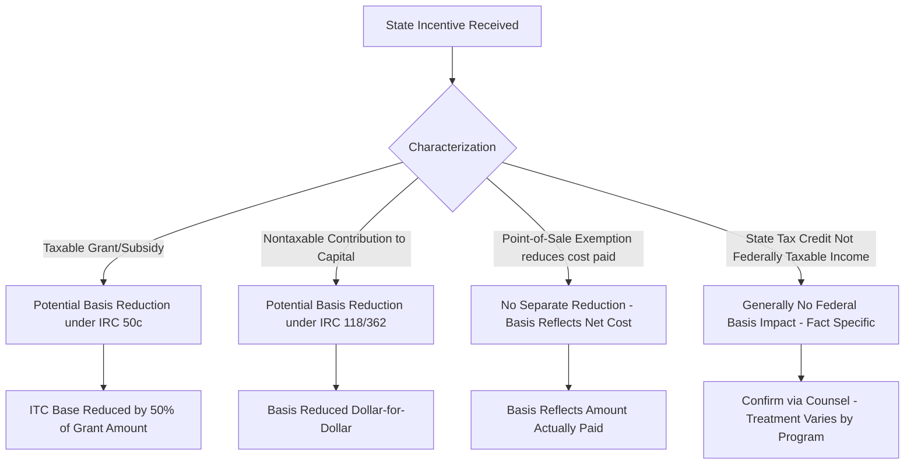

## Interaction Between State Incentives and Federal Basis

### Overview

The interaction between state incentive programs and federal tax basis is one of the more technically consequential — and frequently misapplied — areas in tax equity structuring. Because the federal Investment Tax Credit (ITC) under IRC §48 and depreciation under MACRS are both computed as a function of the property's tax basis, any state-provided incentive that reduces cost, provides cash, or otherwise subsidizes the property can potentially reduce that basis, directly compressing the value of federal tax benefits available to the tax equity investor.

- **Tax basis**: Generally, the cost of acquiring property under IRC §1012, adjusted per applicable Code sections; this basis is what depreciation deductions and ITC are calculated against.
- **Basis reduction**: A statutory or judicial requirement to reduce otherwise-includible basis because a portion of the property's cost was effectively subsidized by a government payment or below-market financing.

### Governing Framework: IRC §50(c) and Related Rules

The core statutory anchor is **IRC §50(c)**, which requires basis reduction for property financed in whole or in part by a "subsidized energy financing" or certain government grants, historically including specific federal grant programs (e.g., the now-expired §1603 cash grant program explicitly required a basis reduction equal to the full grant amount under its governing guidance). The analogous question for *state* grants and credits is whether they are treated the same way — and the answer is fact-dependent:

1. **Direct state cash grants**: Generally analyzed under general tax principles (including IRC §118 concepts for corporations, and broader income/exclusion doctrine) to determine whether the grant is taxable income to the recipient or a nontaxable contribution to capital; either characterization can implicate basis reduction, though through different Code provisions and mechanics.
2. **State tax credits (non-refundable/non-transferable)**: Because these merely offset the recipient's own state tax liability, and are not federal income, they generally do not require federal basis reduction — the recipient's economic cost was already the gross equipment purchase price; the credit changes the recipient's after-tax return, not the equipment's cost. [Inference: this is the general principle applied by practitioners; program-specific characterization should be confirmed for atypical structures.]
3. **Transferable/refundable state tax credits**: These sit closer to a cash-equivalent instrument. If a transferable credit is treated as generating taxable income upon sale (common, since selling a state credit for cash to a third party is generally treated as a taxable sale/exchange event), the sale proceeds are separately taxable to the seller but this does not typically require reduction of the underlying property's basis, since the property's original cost was unaffected by the state's issuance of the credit. [Unverified: specific IRS or state guidance on a given credit program should be reviewed, as this remains an area with limited direct authority for many state programs.]
4. **Point-of-sale sales/use tax exemptions**: As covered in prior material, these reduce the amount actually paid for equipment; basis is simply computed on the net amount paid under §1012 — there is no separate "reduction" mechanic because the cost was never incurred in the first place.

### Comparative Treatment Table (Conceptual)

| Incentive Type | Federal Income to Recipient? | Basis Impact |
| --- | --- | --- |
| State sales/use tax exemption | No | Basis reflects net cost paid (no separate reduction) |
| Non-refundable/non-transferable state tax credit | No | Generally none — credit offsets own tax liability only |
| Transferable state tax credit (sold to third party) | Sale proceeds generally taxable | Generally none to underlying property basis; gain/loss on credit sale itself |
| Refundable state tax credit | Fact-specific; often treated akin to grant for character purposes | Fact-specific — closer to grant analysis |
| Direct state cash grant | Fact-specific (taxable vs. contribution to capital) | Potential basis reduction under §118/362 principles or general tax benefit doctrine |
| Below-market state financing/loan | No (loan proceeds are not income) | Generally none, though imputed interest rules may apply separately |

[Unverified: this table reflects general practitioner treatment; because state programs are not uniform and direct authority is sparse for many, deal-specific tax opinions are standard practice before relying on any particular characterization.]

### Modeling the Basis Impact

For a project where a portion of cost is offset by an incentive requiring basis reduction:

$$B_{adj} = C_{total} - R$$

$$ITC = B_{adj} \times r_{itc}$$

Where:

- $C_{total}$ = total unadjusted eligible basis (equipment + qualifying soft costs)
- $R$ = required basis reduction amount attributable to the state (or federal) incentive
- $r_{itc}$ = applicable ITC rate (e.g., 30% base rate under current law, subject to adders)

**Example**

A project has $40,000,000 of ITC-eligible basis before adjustment. It receives a $2,000,000 state grant that counsel determines requires basis reduction under general contribution-to-capital principles (full reduction, not the 50%-of-grant convention specific to §1603-style federal grants):

$$B_{adj} = \$40{,}000{,}000 - \$2{,}000{,}000 = \$38{,}000{,}000$$

$$ITC = \$38{,}000{,}000 \times 0.30 = \$11{,}400{,}000$$

Compare to the *unadjusted* (incorrect) calculation an underwriter might mistakenly use:

$$ITC_{incorrect} = \$40{,}000{,}000 \times 0.30 = \$12{,}000{,}000$$

The $600,000 ITC overstatement in the incorrect calculation illustrates why basis-reduction characterization must be resolved *before* finalizing tax equity investor return models — a downstream recapture or IRS challenge on this point directly affects investor yield.

### Interaction with Tax Equity Partnership Allocations

- **Capital account and basis step-adjustments**: Where a state incentive flows through a partnership (e.g., a project-company LLC with a tax equity investor), the basis reduction (if applicable) reduces the depreciable basis allocated among partners per the partnership agreement's ITC and depreciation allocation provisions — this must be reflected in the partnership's capital account maintenance under Treasury Regulation §1.704-1(b).
- **Timing of incentive receipt relative to partnership admission**: If a state grant or credit is received *before* the tax equity investor is admitted to the partnership, versus *after*, the economic and basis consequences can differ — pre-admission incentives are typically reflected in the sponsor's contributed basis, while post-admission incentives may require special allocation provisions.
- **Investor tax opinions**: Because basis-reduction characterization directly affects the ITC amount the investor is relying on for its return model, tax equity investment committees typically require a reasoned tax opinion (or at minimum, counsel memorandum) addressing the treatment of any material state incentive received by the project before closing.

### Underwriting and Diligence Considerations

**Key Points**

- **Identify all state incentives early in diligence**: Grants, credits, exemptions, and below-market financing should be inventoried at the start of underwriting, since retrofitting basis adjustments late in the process can disrupt agreed pricing.
- **Distinguish credit type precisely**: "Tax credit" is used loosely in the industry; confirming refundability and transferability status is essential before assuming no federal basis impact.
- **Obtain state agency award documentation**: The specific statutory language and award letter characterizing the incentive (grant vs. credit vs. exemption) is often the starting point for counsel's basis analysis.
- **Model both adjusted and unadjusted scenarios**: Presenting tax equity investors with sensitivity cases for basis-reduction outcomes helps avoid post-closing disputes if the IRS or a subsequent opinion revises the initial characterization.
- **Coordinate with §1603-grant-era precedent cautiously**: Some practitioners analogize new state grant characterization questions to the retired federal §1603 program's 50%-of-grant basis reduction convention, but this convention was specific to that program's Treasury guidance and does not automatically transfer to state programs. [Speculation: whether regulators or courts would apply an analogous convention to a given state grant is not settled for most programs and should not be assumed without specific analysis.]

### Common Pitfalls

- **Assuming all state incentives are basis-neutral**: This is true for many credit and exemption structures but is not a universal rule — direct grants are the highest-risk category for requiring reduction.
- **Applying the federal §1603 50%-reduction convention by default**: That convention was a specific administrative rule for a specific expired program, not a general Code provision applicable to all subsidies.
- **Failing to update capital account allocations after a late-arriving state grant**: If a grant is received mid-construction, partnership agreements should have mechanisms to properly reflect any resulting basis adjustment in subsequent allocations.
- **Treating credit sale proceeds and basis reduction as the same question**: Taxability of proceeds from selling a transferable credit and whether the underlying property's basis is reduced are analytically separate issues that are sometimes conflated in practice.

### Related Topics

- IRC §50(c) Basis Reduction for Subsidized Energy Property
- State-Level Tax Credits and Grant Programs
- Sales and Use Tax Exemptions for Energy Equipment
- Partnership Capital Account Maintenance under Treas. Reg. §1.704-1(b)
- Contribution to Capital Doctrine (IRC §118) and Corporate Basis Adjustments
- Federal Section 1603 Cash Grant Program (Historical Precedent)
- Tax Equity Investor Underwriting and Return Modeling
- Recapture Risk in Multi-Layered State and Federal Incentive Stacks