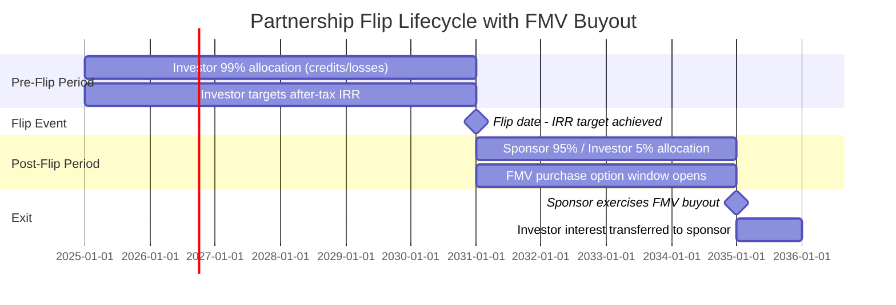
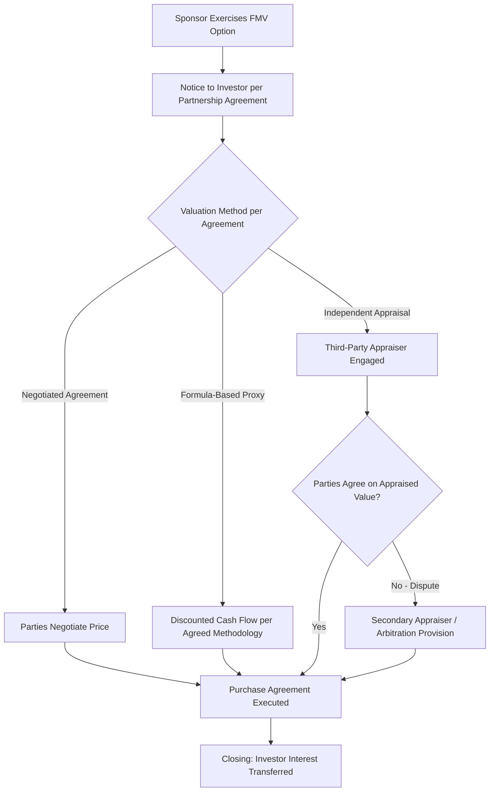

## Flip-Date Buyouts and Fair Market Value Purchase Options

### Overview

Flip-date buyouts and fair market value (FMV) purchase options are exit mechanisms embedded in partnership-flip tax equity structures that govern how and when the sponsor reacquires the tax equity investor's interest in the project company after the investor has achieved its target after-tax yield. These provisions are central to the economic lifecycle of a partnership flip and directly affect both parties' return calculations, IRS safe harbor compliance, and post-flip project economics.

- **Flip date**: The point in a partnership-flip structure at which allocations of income, loss, and tax credits shift from a pre-flip ratio (heavily weighted to the tax equity investor, e.g., 99%) to a post-flip ratio (heavily weighted to the sponsor, e.g., 5%), typically triggered upon the investor achieving a target internal rate of return (IRR) or after a fixed time period.
- **FMV purchase option**: A contractual right (not obligation) granted to the sponsor to purchase the investor's remaining partnership interest after the flip date, at a price equal to the interest's fair market value at the time of exercise.

### Structural Position in the Partnership Flip Lifecycle

The FMV purchase option is typically structured to become exercisable only *after* the flip date, and often only after an additional minimum holding period following the flip — a design feature intended to preserve the substance of the investor's equity ownership for federal tax purposes.

### Why the Purchase Price Must Be FMV

The requirement that the buyout price equal fair market value — rather than a pre-agreed fixed price or nominal amount — stems directly from the IRS's tax equity partnership guidance and case law concerning the recognition of a partner as a genuine equity owner rather than a disguised lender:

- **Revenue Procedure 2007-65** (the historic wind PTC safe harbor, since allowed to lapse but still influential in structuring norms) and subsequent guidance addressing ITC partnership flips emphasized that a fixed-price purchase option granted to the sponsor at a price below reasonably anticipated FMV could recharacterize the arrangement, jeopardizing the investor's status as a bona fide partner and thus the pass-through of tax credits and losses to that investor.
- A **fixed-price call option** at a bargain price is a red flag under general tax principles because it suggests the investor never bore the economic risk/reward of a true equity interest — the arrangement more closely resembles a secured loan with the "return of principal" embedded in the option price.
- Requiring the option price to be **the interest's FMV at time of exercise** (rather than a stated dollar figure fixed at closing) preserves the argument that the investor's residual interest fluctuates with actual project performance, consistent with real equity ownership. [Inference: this is the general rationale underlying market-standard FMV option structuring, though the IRS has not issued a comprehensive replacement safe harbor for ITC flips analogous to Rev. Proc. 2007-65's PTC-specific guidance, so practitioners rely on that guidance by analogy along with general partnership tax principles.]

### FMV Determination Mechanics

Common FMV determination approaches specified in partnership agreements:

1. **Independent third-party appraisal**: An appraiser (often selected from a pre-agreed list or mutually approved) values the investor's residual interest based on projected remaining cash flows, tax attributes (if any remain), and market comparables; this is the most common and most defensible approach for audit purposes.
2. **Discounted cash flow (DCF) methodology**: The partnership agreement may prescribe a specific DCF methodology (discount rate, cash flow projection basis) to be applied by the appraiser or by agreement of the parties, reducing valuation disputes by constraining appraiser discretion.
3. **Dispute resolution/second appraisal mechanism**: Most agreements include a fallback mechanism (e.g., a second independent appraiser, or averaging of two appraisals within a specified variance threshold, or binding arbitration) if the initial appraisal is disputed by either party.
4. **Minimum/floor considerations**: Some agreements include a "no lower than X" floor tied to defined circumstances (e.g., accrued but unpaid preferred returns), though care must be taken that any floor mechanism does not effectively convert the option back into a disguised fixed-price arrangement inconsistent with FMV principles.

### Valuation Inputs for the Investor's Residual Interest

At the point of exercise (typically years into the post-flip period), the investor's remaining interest value reflects:

$$V_{residual} = \sum_{t=1}^{n} \frac{CF_t \times \alpha_{post}}{(1+d)^t}$$

Where:

- $CF_t$ = projected total partnership cash flow (and residual tax attributes, if any) in period $t$
- $\alpha_{post}$ = investor's post-flip allocation percentage (commonly around 5%, though structure-specific)
- $d$ = discount rate reflecting the residual interest's risk profile
- $n$ = remaining useful life or contractual term over which cash flows are projected

**Example**

An investor holds a 5% post-flip allocation in a project generating a projected $10,000,000 in remaining discounted total partnership value over its residual life. At a 5% allocation:

$$V_{residual} = \$10{,}000{,}000 \times 0.05 = \$500{,}000$$

If the appraisal independently confirms approximately this value (adjusted for any residual tax attributes and appraiser-specific methodology), the sponsor's buyout price would be set near $500,000, subject to the specific appraisal's full analysis.

### Timing Considerations and Minimum Holding Periods

**Key Points**

- **Minimum post-flip holding period**: Many structures require the investor to remain a partner for a minimum period after the flip date (commonly informally referenced around five years, tracking the general ITC recapture period under IRC §50(a), though not a strict statutory requirement for the buyout mechanism itself) before the FMV option becomes exercisable, to further support the substance of continued equity ownership.
- **Right of first refusal (ROFR) vs. call option**: Some agreements grant the sponsor a ROFR if the investor seeks to sell to a third party, rather than (or in addition to) an affirmative call option — the distinction affects who controls the timing of the exit transaction.
- **Put option considerations**: Less common than sponsor call options, but some structures include a limited investor put right; put rights at a fixed price carry similar recharacterization concerns as fixed-price call options and are typically also FMV-based where present.
- **Coordination with recapture period**: Because triggering a "partner" characterization change or an underlying change in ownership before the five-year ITC recapture period under IRC §50(a) can trigger partial recapture, buyout timing is typically coordinated to occur after the recapture period has fully run, or the agreement includes indemnification provisions addressing any recapture exposure triggered by an earlier transfer.

### Interaction with Broader Deal Documents

- **Partnership/LLC agreement provisions**: The FMV option mechanics, notice periods, valuation methodology, and dispute resolution process are typically embedded directly in the operating agreement governing the project company.
- **Consent and approval rights**: Buyout execution may require coordination with lender consents (if project-level debt remains outstanding) and, in some structures, rating agency or other third-party approvals if the transaction affects credit-rated project debt.
- **Tax opinion reliance**: Because the FMV structuring is central to the overall tax equity structure's defensibility, counsel's original tax opinion (delivered at initial closing) typically addresses the buyout mechanism's design as part of its overall analysis supporting the investor's bona fide partner status throughout the structure's life.

### Common Pitfalls

- **Using a pre-agreed fixed price disguised as "FMV"**: Contractually specifying a dollar amount or a formula that produces a predetermined result regardless of actual project performance undermines the FMV characterization and creates audit risk.
- **Exercising the option too early relative to the recapture period**: Triggering a change in ownership interest before the five-year ITC recapture period has run can create unintended partial recapture exposure if not properly structured or indemnified.
- **Underestimating appraisal timeline in deal planning**: Independent appraisals can take weeks to months; sponsors planning to exercise a buyout should build appraisal lead time into refinancing or sale timelines.
- **Inadequate dispute resolution mechanics**: Agreements lacking a clear fallback process for disputed appraisals can result in costly litigation or arbitration at exactly the point when both parties want a clean, efficient exit.
- **Overlooking lender consent requirements**: Where project debt remains outstanding, failing to confirm lender consent rights before initiating a buyout can delay or jeopardize the transaction's closing timeline.

### Related Topics

- Partnership Flip Structures and Allocation Mechanics
- ITC Recapture under IRC §50(a) and Five-Year Vesting
- IRS Safe Harbor Guidance for Tax Equity Partnerships (Rev. Proc. 2007-65 and Successors)
- Independent Appraisal Standards in Tax Equity Transactions
- Right of First Refusal vs. Call Option Structuring
- Secondary Market Transfers of Tax Equity Interests
- Post-Flip Cash Flow Waterfall Modeling
- Lender Consent and Intercreditor Considerations in Tax Equity Exits