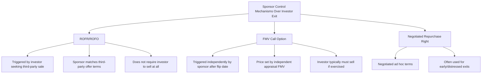
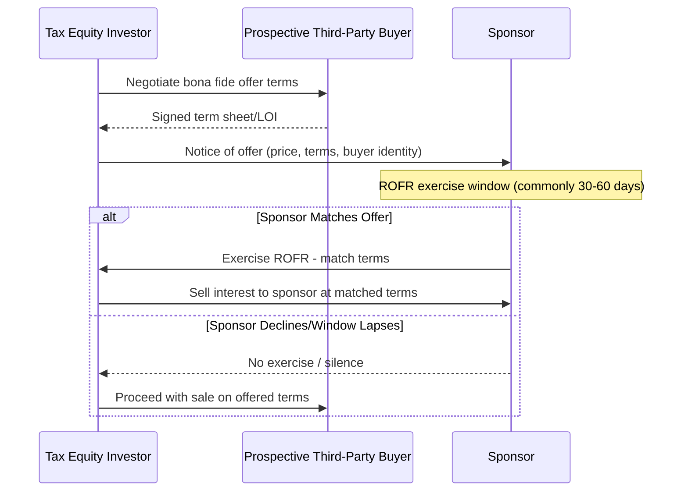

## Rights of First Refusal and Sponsor Repurchase Rights

### Overview

Rights of first refusal (ROFR) and sponsor repurchase rights are contractual mechanisms in tax equity partnership agreements that govern the sponsor's ability to control, participate in, or preempt transfers of the tax equity investor's interest — whether to a third party or back to the sponsor itself. These provisions sit alongside (and are sometimes confused with) the fair market value (FMV) purchase options addressed separately in partnership-flip exits, but serve a distinct function: controlling *who* the sponsor's counterparty is and *preserving optionality* over ownership of the project company, rather than solely defining the terms of a post-flip buyout.

- **Right of first refusal (ROFR)**: A contractual right entitling the sponsor to match a bona fide third-party offer the investor has received for its interest, before the investor may sell to that third party.
- **Right of first offer (ROFO)**: A related but distinct mechanism requiring the investor to first offer its interest to the sponsor (at investor-proposed or negotiated terms) before shopping it to third parties; less common in tax equity than ROFR but appears in some agreements.
- **Sponsor repurchase right**: A broader category encompassing any contractual right (call option, FMV option, or negotiated buyback right) allowing the sponsor to reacquire the investor's interest, which may or may not be tied to a third-party sale event.

### Distinguishing ROFR from FMV Purchase Options

The key structural distinction: a ROFR is *reactive* — it only activates when the investor has independently decided to sell and has a third-party offer in hand — whereas an FMV call option is *proactive*, giving the sponsor an affirmative right to force a buyout on its own timeline (subject to the flip-date and holding-period conditions covered in the related FMV buyout material). Many partnership agreements include both mechanisms layered together, with the FMV option as the sponsor's primary post-flip exit lever and the ROFR as a backstop protecting the sponsor's interest in the event the investor attempts an earlier or interim transfer.

### ROFR Mechanics and Process Flow

Key procedural elements typically negotiated into the ROFR provision:

1. **Notice requirements**: The investor must provide written notice disclosing the material terms of the third-party offer (price, payment structure, closing conditions, and often the identity of the proposed buyer) before proceeding.
2. **Exercise window**: A defined period (commonly 30–60 days, though structure-specific) during which the sponsor may elect to match the offer; silence or an affirmative decline allows the investor to proceed with the third-party sale on the disclosed terms.
3. **Match requirement scope**: Agreements vary on whether the sponsor must match *all* terms (price, timing, structure) or only economic terms (price), since some non-economic terms (e.g., a strategic buyer's specific closing conditions) may not be reasonably matchable by the sponsor.
4. **"Same terms" sale-through protection**: If the sponsor declines and the investor proceeds to sell to the third party, most agreements require the sale to close on materially the same terms disclosed in the notice within a specified period (e.g., 90–180 days), or the ROFR process must be repeated — preventing the investor from using a inflated "shopped" offer merely to establish a floor before selling at different terms.

### Rationale for Sponsor Control Rights

**Key Points**

- **Counterparty risk management**: The sponsor has an ongoing operational relationship with whoever holds the investor's interest (consent rights, reporting obligations, potential disputes over post-flip allocations); a ROFR allows the sponsor to prevent an unknown or strategically adverse third party from stepping into that relationship.
- **Preserving structuring integrity**: Some tax equity structures are sensitive to *who* the investor is (e.g., certain investor tax profile assumptions underlying the original tax opinion); an uncontrolled transfer to a different type of investor could theoretically raise structuring questions, making sponsor visibility into (and some control over) transfers valuable.
- **Valuation discovery function**: A ROFR indirectly gives the sponsor market-based valuation information (via the disclosed third-party offer) that can inform its own planning for an eventual FMV buyout, even where the sponsor declines to exercise the ROFR itself.
- **Avoiding fragmented ownership**: Repurchase rights and ROFRs help sponsors avoid a scenario where the investor's interest is transferred to multiple smaller holders or a distressed-debt buyer with different economic objectives than a typical tax equity investor.

### Interaction with Secondary Market Dynamics

- **Secondary market liquidity for tax equity interests**: A robust secondary market has developed for tax equity investor interests (driven by investors seeking to exit before natural flip-date timelines, portfolio rebalancing, or M&A activity among financial institutions that hold tax equity portfolios); ROFR provisions directly shape how liquid and marketable an investor's interest actually is, since a strong sponsor ROFR can deter some third-party bidders who dislike bidding into a process where the incumbent sponsor has a matching right.
- **Effect on secondary pricing**: Because a ROFR gives the sponsor the ability to intercept any sale at the disclosed price, sophisticated secondary buyers may discount their initial offers to account for the risk that their diligence effort and negotiated terms are simply used by the investor to set a floor that the sponsor then matches — a dynamic sometimes referred to informally as "ROFR chill" in secondary transfer markets. [Inference: general market dynamic observed in secondary transfer negotiations; magnitude varies by deal and investor sophistication.]
- **Structuring around ROFR chill**: Some agreements include break-fee or expense reimbursement provisions for a third-party bidder whose offer is matched by the sponsor via ROFR exercise, intended to preserve bidder incentive to participate despite the sponsor's overhang right.

### Permitted Transfer Exceptions

Most agreements carve out certain transfers from ROFR/repurchase right triggers, commonly including:

- **Affiliate transfers**: Transfers by the investor to a wholly owned affiliate or fund-family entity under common control, which do not change ultimate beneficial ownership in a manner relevant to the sponsor's concerns.
- **Collateral assignments**: Pledges of the investor's interest to its own lenders as collateral (common where the investor itself uses leverage to fund its tax equity commitments), provided such pledge does not itself constitute a transfer of beneficial ownership absent foreclosure.
- **Regulatory-driven transfers**: Transfers compelled by a regulator (common for bank-affiliated tax equity investors subject to capital or concentration requirements).

### Interaction with Tax Structuring Considerations

- **Partner continuity and tax opinion reliance**: Because the original tax opinion supporting the partnership-flip structure is typically based on the specific investor's status and expected holding pattern, an unrestricted or poorly controlled transfer right could create questions about whether continuity assumptions underlying the opinion remain valid; ROFR and repurchase provisions provide the sponsor some ability to manage this risk, though they are not themselves a substitute for the substantive requirements (allocations following substantial economic effect, genuine equity risk, etc.) that support the investor's bona fide partner status.
- **Coordination with FMV option pricing**: Where both a ROFR and an eventual FMV call option exist in the same agreement, drafting must clearly sequence which mechanism governs at what point in the deal lifecycle (e.g., ROFR applies to any interim third-party sale attempt; FMV option applies specifically at or after the flip date for a sponsor-initiated buyout) to avoid ambiguity or conflicting exercise notices.

### Common Pitfalls

- **Ambiguous "material terms" definitions in notice requirements**: Vague drafting on what must be disclosed in a ROFR notice can lead to disputes over whether adequate disclosure occurred, delaying or invalidating an attempted third-party sale.
- **Missing sale-through timing protections**: Without a "close within X days on same terms" requirement, an investor could use a ROFR notice process to establish a price floor, let the sponsor decline, and then negotiate materially different (typically lower) terms with the same or a different buyer — undermining the sponsor's intended protection.
- **Overlooking affiliate transfer carve-outs during fund restructuring**: Investors undergoing internal fund reorganizations may trigger ROFR notice requirements unintentionally if the agreement's affiliate exception is narrowly drafted, creating unnecessary friction in routine corporate transactions.
- **Treating ROFR and FMV option as interchangeable in drafting**: Conflating the two mechanisms in agreement language can create enforcement ambiguity about which process governs a given proposed transfer.

### Related Topics

- Flip-Date Buyouts and Fair Market Value Purchase Options
- Secondary Market Transfers of Tax Equity Interests
- Partnership Flip Structures and Allocation Mechanics
- Bona Fide Partner Status and Tax Opinion Reliance
- Investor Consent Rights and Post-Flip Governance
- Bank-Affiliated Tax Equity Investor Regulatory Considerations
- Affiliate Transfer and Collateral Assignment Provisions
- Secondary Market Liquidity Trends in Tax Equity Portfolios