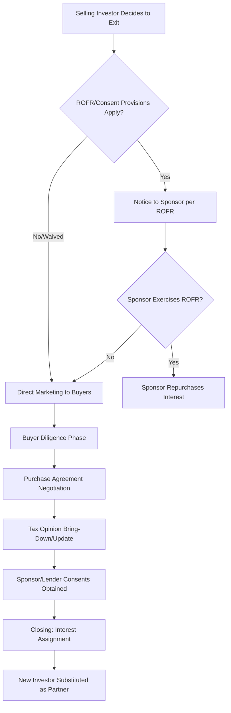

## Secondary Sales of Tax Equity Interests

### Overview

Secondary sales of tax equity interests involve the transfer of an existing investor's partnership interest in a tax equity structure to a new investor after initial closing, rather than at original syndication. This market has grown substantially as the tax equity investor base has diversified and as original investors seek liquidity, portfolio rebalancing, or an exit before natural flip-date timelines. Secondary transactions differ materially from primary syndication in diligence scope, pricing dynamics, and tax structuring risk, since the buyer is stepping into an existing, already-operating structure rather than negotiating one from inception.

- **Primary syndication**: The original tax equity investor's admission to the partnership at or near project closing, typically before or shortly after commercial operation.
- **Secondary sale**: A subsequent transfer of that investor's partnership interest to a new investor at some point during the pre-flip or post-flip period, substituting the new investor into the existing structure.

### Motivations for Secondary Sales

**Key Points**

- **Portfolio rebalancing**: Institutional tax equity investors (banks, insurance companies) periodically rebalance exposure across asset classes, technologies, or vintage years, prompting sales of individual positions.
- **Capital redeployment**: An investor seeking to redeploy capital into new primary tax equity commitments (often at more attractive current pricing or with fresh tax credit generation) may sell a maturing position with declining remaining tax benefits.
- **Regulatory or capital treatment changes**: Bank-affiliated investors subject to evolving capital or concentration requirements may need to reduce tax equity exposure in specific structures.
- **M&A-driven transfers**: Mergers, acquisitions, or corporate reorganizations involving the original investor's parent entity can necessitate divestiture of tax equity positions as part of broader portfolio integration.
- **Yield curve position**: An investor holding a position where most of the tax benefits (front-loaded ITC or early-year PTC/depreciation) have already been realized may prefer to sell the residual, lower-yielding tail position to a buyer with a different return profile appetite.

### Secondary Transaction Structure and Process

The process typically unfolds in phases:

1. **Pre-marketing review**: The selling investor (often with advisor assistance) reviews the partnership agreement for transfer restrictions, ROFR/ROFO provisions (as covered separately), and required consents before approaching prospective buyers.
2. **Buyer diligence**: The prospective buyer conducts diligence on the underlying project (technical, operational, and financial performance to date), the partnership agreement's allocation and governance provisions, the remaining tax attribute schedule, and the original tax opinion's continued applicability.
3. **Purchase and assignment agreement**: A purchase agreement specific to the secondary transfer is negotiated, addressing purchase price, representations regarding the seller's clean title to the interest, indemnification for pre-closing liabilities, and allocation of tax attributes for the year of transfer.
4. **Consent and closing mechanics**: Sponsor consent (if required under the partnership agreement), any necessary lender consents (if project debt remains outstanding), and formal assignment documentation are completed at closing, with the buyer substituted as a partner of record.

### Diligence Focus Areas Distinct from Primary Syndication

**Key Points**

- **Historical performance track record**: Unlike primary syndication (which relies on projected performance), secondary buyers can diligence actual operating history — capacity factor, availability, curtailment, and O&M cost experience — providing a stronger empirical basis for underwriting.
- **Remaining tax attribute schedule**: The buyer must precisely determine what tax benefits remain to be allocated — remaining MACRS depreciation schedule, any unused PTC production years, and the partnership's position relative to the flip date — since these directly determine the economics of the position being acquired.
- **Capital account and basis history**: The buyer inherits the selling investor's capital account and outside basis position (subject to any step-up or carryover rules applicable to the specific transfer structure), requiring careful review of the partnership's historical capital account maintenance and prior tax return positions.
- **Original tax opinion continued reliance**: Buyers typically require confirmation (via updated opinion, opinion bring-down letter, or at minimum counsel review) that the original structuring opinion's conclusions remain valid and that the secondary transfer itself does not create structuring risk (e.g., under partner continuity or anti-abuse principles).
- **Litigation, compliance, and recapture history**: Any prior recapture events, compliance issues (e.g., PTC production certification disputes, ITC placed-in-service disputes), or ongoing litigation involving the project company must be surfaced, since the buyer inherits exposure to the extent not addressed by indemnification.
- **Change of ownership and recapture risk from the transfer itself**: Depending on structuring, the transfer of the interest itself must be analyzed to confirm it does not independently trigger a recapture event under IRC §50(a) if within the five-year ITC recapture period, or otherwise disrupt partner continuity assumptions.

### Pricing Dynamics in Secondary Transactions

$$P_{secondary} = \sum_{t=1}^{n} \frac{CF_t + TB_t}{(1+d_{sec})^t}$$

Where:

- $CF_t$ = projected remaining cash distributions to the interest in period $t$
- $TB_t$ = value of remaining tax benefits (depreciation, PTC, residual ITC-related benefits) allocable in period $t$
- $d_{sec}$ = secondary market discount rate, which typically reflects a different risk profile than primary syndication pricing

**Example**

An investor's position has substantially front-loaded its ITC and early bonus depreciation benefits, leaving primarily operating cash distributions and residual straight-line MACRS deductions over the remaining term. A secondary buyer might price this residual position using a lower discount rate than the original primary investor used (since operational risk has been de-risked by actual performance history) but must also account for the diminished remaining tax benefit relative to the position's original economics — these two effects can move pricing in opposite directions and must be reconciled deal-by-deal. [Inference: general pricing dynamic; actual discount rates and resulting pricing are deal- and market-specific and fluctuate with broader tax equity market supply/demand conditions.]

### Interaction with Governing Deal Documents

- **ROFR and sponsor consent provisions**: As addressed in related material, most partnership agreements grant the sponsor either a right of first refusal, an outright consent right, or both over any proposed secondary transfer, directly shaping process and achievable pricing.
- **Assignment and assumption mechanics**: The buyer typically executes a formal assignment and assumption agreement, becoming bound by all existing partnership agreement terms (including any remaining FMV buyout rights, consent rights, and reporting obligations) as if it were the original investor.
- **Lender intercreditor considerations**: Where the project company has outstanding construction or term debt, loan documents frequently include restrictions on equity transfers or require lender consent, adding a parallel approval track to the transaction timeline.
- **State and local transfer considerations**: Depending on jurisdiction and how the underlying project's title/PILOT arrangements (as covered in prior material) are structured, a change in the beneficial ownership of the project company could implicate state PILOT agreement assignability provisions, requiring separate review and potentially separate consent.

### Tax Treatment of the Selling Investor

- **Gain/loss recognition**: The selling investor generally recognizes gain or loss under IRC §741 based on the difference between amount realized and adjusted outside basis in the partnership interest at the time of sale, with potential ordinary income recharacterization under IRC §751 to the extent the sale is attributable to "hot assets" (e.g., unrealized depreciation recapture).
- **Allocation of income for the year of transfer**: The partnership agreement's provisions (often incorporating an interim closing of the books or proration method under IRC §706) govern how income, loss, and credits are allocated between the seller and buyer for the tax year in which the transfer occurs.
- **Recapture exposure disclosure**: Selling investors typically provide representations regarding any known recapture triggers or compliance issues, with corresponding indemnification for pre-closing recapture exposure attributable to the seller's period of ownership.

### Common Pitfalls

- **Underestimating the complexity of tax opinion bring-down**: Buyers sometimes assume the original tax opinion automatically covers the secondary transfer; in practice, updated analysis or a fresh opinion addressing the transfer itself is typically required.
- **Overlooking mid-year allocation mechanics**: Failing to properly address interim-period income/credit allocation between buyer and seller can create disputes or return-filing inconsistencies after closing.
- **Assuming historical performance eliminates all diligence needs**: While actual operating history reduces some primary-syndication-style projection risk, secondary buyers must still diligence remaining useful life, major maintenance/repowering needs, and residual contract terms (PPA remaining term, O&M contract status).
- **Missing PILOT or state incentive assignability review**: Where the project benefits from a PILOT agreement or transferable state credits, failing to confirm those arrangements survive the ownership change can create unexpected value erosion post-closing.
- **Inadequate indemnification scoping for pre-closing recapture risk**: Because recapture liability can attach based on events during the seller's ownership period but be assessed against the partnership post-transfer, clear indemnification allocation is essential.

### Related Topics

- Rights of First Refusal and Sponsor Repurchase Rights
- Flip-Date Buyouts and Fair Market Value Purchase Options
- IRC §741 and §751 Gain Characterization on Partnership Interest Sales
- ITC Recapture under IRC §50(a) and Five-Year Vesting
- Partnership Interim Closing of the Books under IRC §706
- Property Tax Abatements and Payment-in-Lieu-of-Tax Agreements (Assignability)
- Tax Equity Investor Underwriting and Return Modeling
- Capital Account Maintenance and Basis Tracking in Tax Equity Partnerships