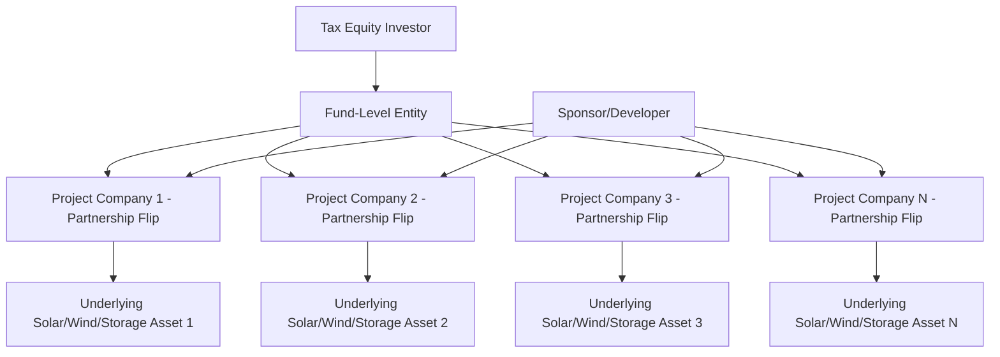
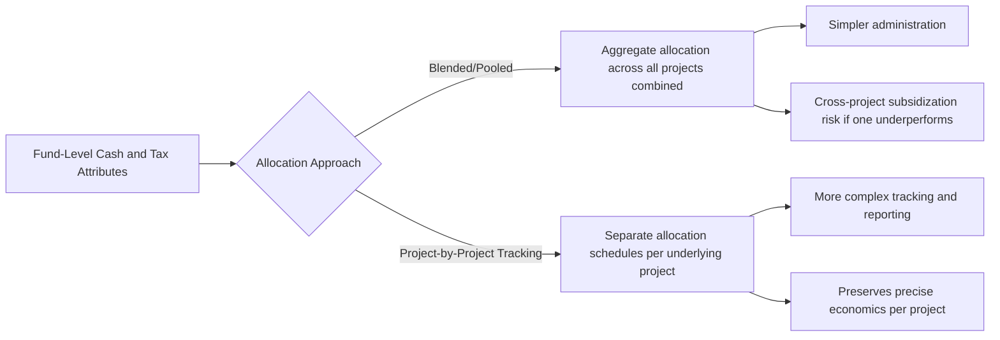
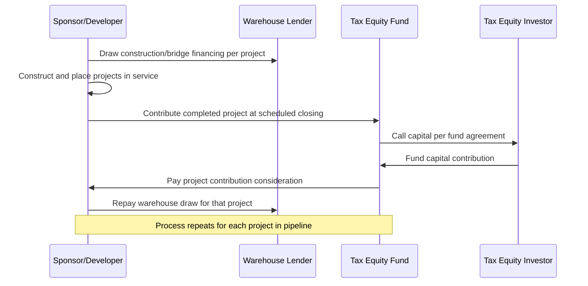

## Fund Syndication and Multi-Project Portfolios

### Overview

Fund syndication and multi-project portfolios refer to tax equity structures in which a single investor (or a small club of investors) commits capital across multiple underlying projects through a fund-level vehicle, rather than investing project-by-project through separate single-asset partnerships. This approach allows sponsors to aggregate smaller or mid-sized projects into a diversified investment vehicle attractive to tax equity investors seeking scale efficiency, diversification, and reduced per-transaction execution cost, while giving investors exposure to a blended pool of tax credits and cash flows rather than single-project concentration risk.

- **Single-asset partnership flip**: The traditional structure covered elsewhere in this material, where one tax equity investor partners with one sponsor in one project company for one project.
- **Fund syndication**: An investor (or investor group) commits capital to a fund-level entity that in turn holds interests in multiple underlying project companies, each potentially structured as its own partnership flip or similar arrangement at the project level.

### Structural Architecture

Two general architectural approaches are used:

1. **Aggregator fund with tiered partnership structure**: The fund entity itself is a partnership in which the tax equity investor holds an interest; the fund then holds interests in multiple underlying project-level partnerships (a "partnership of partnerships" or tiered structure), with each underlying project potentially maintaining its own flip mechanics.
2. **Single-tier portfolio partnership**: Multiple projects are held directly within one partnership (rather than through separate underlying project-level entities), with the tax equity investor holding a single interest in the aggregate portfolio partnership, and allocations computed on a blended or project-by-project basis within that single partnership agreement.

### Rationale for Fund-Level Aggregation

**Key Points**

- **Transaction cost efficiency**: Legal, tax opinion, and diligence costs for a single-asset partnership flip are largely fixed regardless of project size; aggregating multiple smaller projects (e.g., distributed generation, community solar, or smaller C&I rooftop portfolios) into one fund spreads these fixed costs across a larger capital base, improving smaller-project bankability.
- **Diversification for the investor**: A fund spanning multiple projects, technologies, geographies, or off-takers reduces single-asset concentration risk (e.g., a single project's underperformance, single-offtaker counterparty risk, or single-state regulatory change has a smaller proportional effect on overall fund returns).
- **Investor minimum check size considerations**: Institutional tax equity investors often have minimum commitment sizes that exceed what many individual projects require; fund structures allow investors to deploy larger aggregate capital commitments while sponsors access capital for projects that would be sub-scale for standalone syndication.
- **Standardization and repeatability**: Sponsors with a pipeline of similar projects (e.g., a residential/C&I solar developer or a repeat utility-scale wind/solar platform) benefit from a standardized fund template that can absorb successive projects without renegotiating full deal terms each time.
- **Warehouse-to-fund pipeline management**: Funds are often used in conjunction with warehouse credit facilities, allowing a sponsor to originate and construct projects using short-term financing, then contribute completed or near-completed projects into the tax equity fund at scheduled closing dates.

### Allocation Mechanics in Multi-Project Structures

- **Pooled/blended allocation**: Income, loss, and credits from all underlying projects are aggregated and allocated to the investor according to a single fund-level percentage; simpler to administer but can mask underperformance in individual projects, since strong performers can offset weak ones within the same reporting period.
- **Project-by-project tracking**: Each underlying project's tax attributes and cash flows are tracked and allocated separately, even within a single fund vehicle, preserving asset-level transparency; more common where projects have materially different risk profiles, placed-in-service dates, or technology types within the same fund.
- **Staggered contribution dates**: Because projects within a fund often reach commercial operation and are contributed to the fund at different times, allocation provisions must address how new projects entering the fund affect existing allocation percentages — commonly handled through a "target capital account" or "hypothetical liquidation at book value" (HLBV) methodology applied at the fund level.

### Investor Return Modeling Across a Portfolio

$$IRR_{fund} = f\left(\sum_{i=1}^{N} w_i \times CF_i, \sum_{i=1}^{N} w_i \times TB_i\right)$$

Where:

- $N$ = number of underlying projects in the fund
- $w_i$ = capital weighting of project $i$ within the fund
- $CF_i$ = cash flow contribution of project $i$
- $TB_i$ = tax benefit contribution (credits, depreciation) of project $i$

**Example**

A fund holds three projects with capital weightings of 40%, 35%, and 25%. If Project 1 (40% weight) underperforms its underwritten production by 15% due to unexpected curtailment, the blended fund-level IRR impact is proportionally dampened relative to a single-asset structure where the investor would bear the full 15% shortfall directly:

$$\Delta IRR_{fund} \approx 0.40 \times (-15\%) = -6\% \text{ contribution-weighted impact (illustrative only)}$$

[Inference: this is a simplified illustrative approximation; actual fund-level IRR sensitivity depends on the specific allocation waterfall, whether tracking is pooled or project-by-project, and non-linear interactions between cash flow and tax benefit timing that a simple weighted average does not fully capture.]

### Diligence Considerations Specific to Fund Structures

**Key Points**

- **Cross-collateralization and cross-default risk**: Some fund structures include cross-default provisions where a default or compliance failure at one underlying project can trigger consequences at the fund level; diligence must identify whether project-level risk is contained or can cascade.
- **Placed-in-service date staggering**: Since projects often enter the fund on a rolling basis, diligence must confirm the fund agreement properly handles differing tax attribute timing, recapture period tracking (each project runs its own independent five-year ITC recapture clock), and allocation adjustments as new projects are added.
- **Sponsor concentration and platform risk**: Where all underlying projects share a common sponsor/developer, diligence on the sponsor's overall platform financial health, construction track record, and O&M capability across the full pipeline becomes more significant than in a single-asset deal, since sponsor-level issues can affect multiple projects simultaneously.
- **Technology and geographic diversification verification**: Investors seeking diversification benefits should confirm the actual composition of the fund matches diversification assumptions (e.g., a fund marketed as "diversified" that is in practice concentrated in one state or one technology type does not deliver the intended risk reduction).
- **Exit and buyout mechanics at fund vs. project level**: FMV purchase options and ROFR provisions (as covered in related material) must be clearly specified as applying at the fund level, the project level, or both — ambiguity here can create significant complexity at exit.

### Warehouse Facility Interaction

Fund vehicles frequently interact with warehouse credit facilities that allow sponsors to finance construction ahead of a scheduled fund closing date, with the fund's capital contribution used to take out (repay) the warehouse facility upon each project's contribution — this bridges the timing gap between individual project completion and periodic or milestone-based fund funding events.

### Common Pitfalls

- **Underestimating governance complexity relative to single-asset deals**: Multi-project funds require more complex approval mechanics (e.g., what constitutes a fund-level versus project-level decision requiring investor consent), which can slow decision-making if not clearly delineated upfront.
- **Ambiguous recapture tracking across staggered placed-in-service dates**: Each project's independent five-year recapture clock must be tracked separately; conflating fund-level and project-level recapture exposure can lead to miscalculated indemnification or reserve requirements.
- **Overreliance on pooled reporting masking underperformance**: Where allocation is pooled rather than tracked project-by-project, underperformance in one asset may not be visible to the investor in aggregate reporting until it becomes material at the fund level.
- **Sponsor platform risk underweighted relative to project-level diligence**: Investors sometimes focus diligence heavily on individual project technical merits while underweighting the aggregate risk that a single sponsor's platform-level financial distress could affect the entire fund's pipeline.
- **Inconsistent exit mechanics across projects within the same fund**: Failing to standardize FMV buyout and ROFR terms consistently across all underlying projects within a fund can create fragmented, inefficient exit processes at the end of the investment period.

### Related Topics

- Flip-Date Buyouts and Fair Market Value Purchase Options
- Rights of First Refusal and Sponsor Repurchase Rights
- Secondary Sales of Tax Equity Interests
- Warehouse Credit Facilities in Renewable Energy Development
- Hypothetical Liquidation at Book Value (HLBV) Accounting Methodology
- ITC Recapture under IRC §50(a) and Five-Year Vesting
- Sponsor Platform Risk and Developer Financial Health Diligence
- Cross-Default and Cross-Collateralization Risk in Portfolio Financings