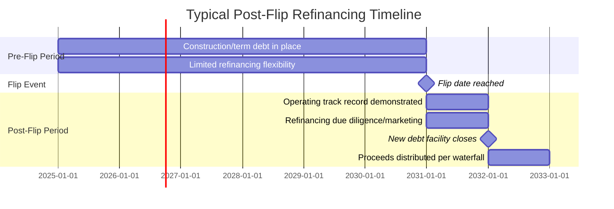
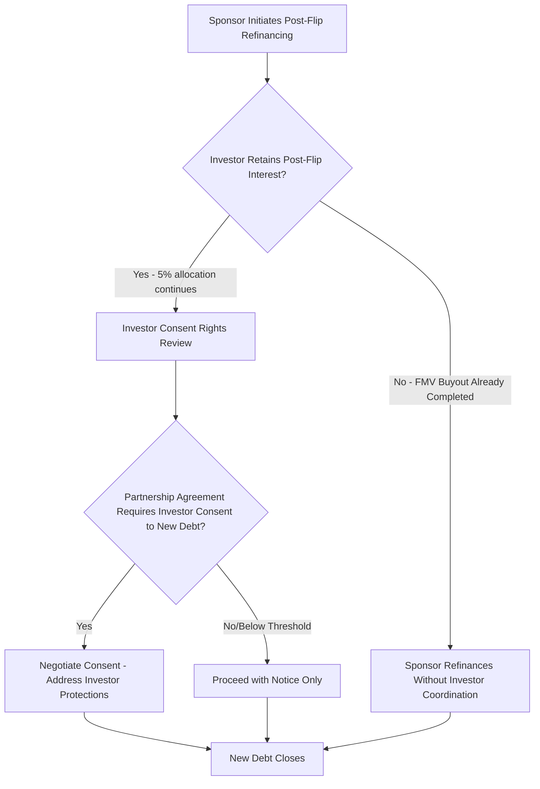

## Portfolio Refinancing After Flip

### Overview

Portfolio refinancing after flip refers to the process of raising or restructuring debt financing at the project or portfolio level following the occurrence of the partnership-flip event, at which point the sponsor's economic and governance position in the project company has shifted materially (typically to a 95%+ allocation share) and the capital structure often permits refinancing on more favorable terms than were available during the pre-flip, construction, or early-operating period. This is a common value-creation and liquidity event for sponsors, distinct from the tax equity investor's own exit mechanisms (FMV buyouts, ROFR, secondary sales) covered elsewhere in this material, though the two are frequently coordinated.

- **Pre-flip debt**: Financing in place during construction and the early operating period, typically sized conservatively to account for tax equity investor priority distributions and merchant/construction risk, often at wider credit spreads reflecting limited operating history.
- **Post-flip refinancing**: New or restructured debt raised after the flip date, benefiting from a demonstrated operating track record, reduced technology/construction risk, and often a simplified cash flow waterfall now that the tax equity investor's priority return has been substantially achieved.

### Why Refinancing Timing Clusters Around the Flip Date

Several factors drive the concentration of refinancing activity around and after the flip date:

1. **De-risked operating profile**: By the flip date, the project typically has several years of demonstrated production/performance data, reducing technology and construction risk premiums that lenders priced into original debt.
2. **Simplified capital structure**: Pre-flip cash flow waterfalls are often complex, reflecting the tax equity investor's priority allocations and target return mechanics; post-flip, with the sponsor holding the large majority allocation, the waterfall simplifies, making the credit easier for new lenders to underwrite.
3. **Original debt covenant/prepayment windows**: Original financing documents often include call protection or prepayment penalty schedules (e.g., declining prepayment premiums, yield maintenance provisions) that make refinancing economically attractive only after certain periods have elapsed — periods often designed to loosely track anticipated flip timing.
4. **Rate and market environment considerations**: Sponsors opportunistically time refinancing to prevailing credit market conditions, independent of the flip date itself, meaning actual refinancing timing is a function of both structural readiness and market opportunity.

### Refinancing Structure Options

**Key Points**

- **Term loan B or institutional term debt**: Longer-dated, often amortizing or partially amortizing debt placed with institutional lenders (insurance companies, credit funds), commonly used for stabilized, post-flip renewable energy assets with long-term contracted revenue (PPAs).
- **Portfolio-level financing (aggregation across multiple flipped projects)**: Where a sponsor holds several post-flip projects (potentially originally financed and tax-equity-syndicated separately or through a fund structure as covered in related material), a portfolio refinancing can aggregate multiple assets into a single credit facility, achieving scale-driven pricing and diversification benefits for lenders.
- **Securitization**: Post-flip, contracted renewable energy cash flows are sometimes securitized (asset-backed securities backed by PPA revenue streams across a portfolio of projects), a structure that generally requires a stable, seasoned cash flow history and standardized documentation across the underlying assets.
- **Holdco vs. project-level debt**: Refinancing can occur at the individual project-company level (opco debt) or at a holding company level above multiple project companies (holdco debt), with holdco structures offering the sponsor more flexibility but potentially structural subordination considerations for opco-level tax equity investors still holding residual post-flip interests.

### Interaction with the Tax Equity Investor's Continuing Interest

Because the tax equity investor commonly retains a residual post-flip allocation (as covered in the FMV buyout material) until an eventual buyout, refinancing that occurs in the window between the flip date and the investor's ultimate exit requires careful coordination:

- **Consent rights over new indebtedness**: Many partnership agreements require tax equity investor consent (or at minimum notice) for the project company to incur new debt above a specified threshold, since new leverage affects the residual value of the investor's continuing interest and any eventual FMV buyout valuation.
- **Impact on FMV buyout valuation**: Refinancing proceeds distributed to the sponsor (and, per the post-flip allocation, in small part to the investor) can affect the residual cash flow projections used in a subsequent FMV appraisal — new debt service obligations reduce future distributable cash, which must be reflected in any buyout valuation performed after the refinancing.
- **Tax opinion and structuring integrity considerations**: A material recapitalization could, in some circumstances, raise questions about whether the transaction affects the substance of the investor's continuing partnership interest; counsel typically reviews planned refinancings for any structuring implications, particularly where refinancing proceeds are distributed disproportionately relative to the standard post-flip allocation percentages.
- **Coordination with an eventual buyout**: Sponsors sometimes sequence a refinancing to occur shortly before exercising an FMV buyout option, using refinancing proceeds partially to fund the buyout price itself — though this sequencing requires careful analysis to avoid any appearance that the refinancing and buyout were pre-arranged in a manner inconsistent with genuine FMV determination.

### Use of Refinancing Proceeds

**Key Points**

- **Sponsor capital return/dividend recapitalization**: A primary motivation for post-flip refinancing is extracting equity value for the sponsor, effectively monetizing the appreciation in the de-risked, operating asset without a full sale.
- **Funding an FMV buyout of the tax equity investor**: As noted above, proceeds are commonly earmarked in whole or part to fund the purchase price for the investor's residual interest.
- **Reinvestment in new development pipeline**: Sponsors with active development platforms often recycle refinancing proceeds into new project construction, effectively using stabilized assets to fund continued growth.
- **Debt paydown/covenant compliance**: In some cases, refinancing is defensive rather than value-extractive, addressing upcoming maturities or covenant compliance issues on existing debt rather than extracting new proceeds.

### Diligence and Structuring Considerations for New Lenders

- **Historical operating performance**: New lenders will scrutinize actual production/availability history against original underwriting projections, weighting real performance data more heavily than the construction-era lender's projections-based underwriting.
- **Remaining contract term and counterparty credit**: Remaining PPA term (relative to new debt tenor), offtaker creditworthiness, and any contract renewal/repowering risk at the tail of the debt term are central to refinancing sizing.
- **Post-flip cash flow waterfall clarity**: Lenders require a clear understanding of the now-simplified (but not eliminated) waterfall, including the residual tax equity investor allocation and any continuing consent rights that could affect lender remedies in a default scenario.
- **Continuing PILOT/property tax and state incentive status**: As covered in prior material, lenders will confirm the continuing validity and remaining term of any property tax abatement, PILOT agreement, or state incentive that was factored into original project economics, since these directly affect projected free cash flow available for debt service.
- **Intercreditor and existing lender payoff mechanics**: Where existing debt remains outstanding, refinancing closing mechanics must address payoff of prior debt, release of existing liens, and any make-whole or prepayment premium calculations.

### Common Pitfalls

- **Failing to obtain required investor consent before finalizing refinancing terms**: Partnership agreements with debt-incurrence consent thresholds can create closing delays or renegotiation risk if investor consent is sought only after terms are substantially finalized with the new lender.
- **Mispricing FMV buyout valuation timing relative to refinancing**: Performing an FMV appraisal without properly reflecting new post-refinancing debt service obligations can produce a valuation inconsistent with the project's actual post-refinancing cash flow profile.
- **Underestimating prepayment premium/make-whole costs on existing debt**: Failing to fully account for yield maintenance or prepayment premiums on the debt being refinanced can erode the expected net proceeds from a refinancing transaction.
- **Overlooking continuing state incentive assignability or recertification requirements**: A refinancing that involves a change in project-level entity structure (e.g., holdco insertion) could trigger assignability review requirements under existing PILOT or state grant/credit agreements if not properly checked in advance.
- **Sequencing refinancing and buyout too closely without documentation support**: Structuring a refinancing and an FMV buyout as an integrated, pre-arranged transaction without maintaining genuine independence in the FMV determination can create tax structuring risk regarding the buyout's characterization.

### Related Topics

- Flip-Date Buyouts and Fair Market Value Purchase Options
- Fund Syndication and Multi-Project Portfolios
- Property Tax Abatements and Payment-in-Lieu-of-Tax Agreements
- Rights of First Refusal and Sponsor Repurchase Rights
- Cash Flow Waterfall Structuring in Partnership Flip Transactions
- Securitization of Contracted Renewable Energy Cash Flows
- Intercreditor Agreements in Multi-Tranche Project Finance
- Dividend Recapitalization Strategies in Infrastructure Assets