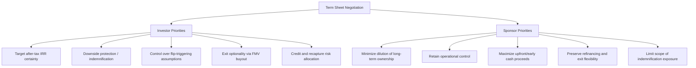
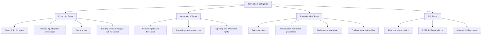

## Term Sheet Priorities for Sponsors and Investors

### Overview

Term sheet negotiation is the phase in a tax equity transaction where the sponsor and investor establish the core economic and structural parameters before committing to full legal documentation. Because tax equity deals involve a genuine misalignment of priorities between the two parties — the investor is principally purchasing a tax benefit stream with a target after-tax yield, while the sponsor is principally seeking capital, long-term project control, and upside retention — the term sheet stage is where these competing objectives are surfaced and reconciled before expensive legal drafting begins.

- **Term sheet**: A non-binding (typically, aside from limited exclusivity/confidentiality provisions) document summarizing the principal economic and governance terms of the proposed tax equity investment, used as the negotiation framework for definitive documents.
- **Priority misalignment**: The structural reality that investor and sponsor objectives are not identical — investor priorities center on yield certainty and downside protection, sponsor priorities center on retained control, upside participation, and capital efficiency.

### Competing Priority Framework

### Investor Term Sheet Priorities

**Key Points**

- **Target yield and flip mechanics**: The investor's target after-tax IRR (commonly negotiated in a range depending on technology, structure, and prevailing market conditions) and the precise flip trigger definition (fixed-date flip vs. IRR-target flip, or the greater/lesser of the two) are typically the first and most heavily negotiated economic terms.
- **Pre-flip allocation percentage**: The investor's pre-flip share of income, loss, and credits (commonly around 99% in traditional structures, subject to partnership tax allocation rules requiring the allocation to have a reasonable relationship to the investor's actual economic interest) directly drives the tax benefit pass-through the investor is purchasing.
- **Guarantees and indemnification scope**: Investors typically seek sponsor guarantees or indemnities addressing specific structuring and performance risks — including environmental indemnities, tax indemnities for structuring/recapture risk attributable to sponsor actions, and construction completion guarantees where the investment funds during construction.
- **Base case assumptions and true-up mechanics**: The term sheet establishes the base case financial model assumptions (production estimates, cost assumptions, tax attribute assumptions) and whether/how those assumptions can be adjusted (true-up provisions) if actual performance or law changes diverge from the base case.
- **Consent rights and major decision thresholds**: Investors negotiate consent or notice rights over major project decisions (material contract amendments, additional indebtedness, sale of the project, changes to O&M arrangements) proportional to their capital at risk and the duration of their expected involvement.
- **Exit mechanics**: As covered in related material, the FMV buyout option structure, timing, and any ROFR/ROFO provisions are typically outlined at the term sheet stage, even though detailed mechanics are elaborated in definitive documents.

### Sponsor Term Sheet Priorities

**Key Points**

- **Minimizing effective cost of capital**: The sponsor evaluates the tax equity structure's implied cost of capital (a function of the investor's target yield, fees, and the value of tax benefits transferred) against alternative financing sources, seeking to optimize overall project capital cost.
- **Preserving post-flip upside**: Sponsors negotiate for the flip to occur as early as reasonably achievable (favoring a lower target IRR or more aggressive base case assumptions, within reason) since the sponsor's allocation share increases substantially post-flip.
- **Limiting guarantee and indemnification scope**: Sponsors seek to cap or narrow indemnification obligations (particularly open-ended tax indemnities), often negotiating baskets, caps, and survival periods analogous to M&A-style representation and warranty structures.
- **Retaining operational control**: Sponsors typically seek to retain day-to-day operational decision-making authority (subject to investor consent only on major/structural decisions), since excessive investor control rights can affect the substance of the sponsor's retained managing-member role and complicate routine operations.
- **Buyout price certainty vs. FMV requirement**: While sponsors would generally prefer more valuation certainty regarding an eventual buyout, the FMV requirement (as covered in related material) is generally non-negotiable from a structuring integrity standpoint; sponsors instead focus negotiation on the *methodology* for determining FMV (appraisal process, dispute resolution) rather than the FMV standard itself.
- **Development and management fee structuring**: Sponsors negotiate for market-standard development fees, asset management fees, and other fee income streams payable by the project company, which represent sponsor economics independent of the residual equity allocation.

### Key Negotiated Term Categories

### Funding Schedule and Capital Call Mechanics

A frequently contested term sheet item concerns the timing and conditions of the investor's capital contributions:

- **Funding at commercial operation vs. during construction**: Investors funding only at or after commercial operation bear less construction risk but provide less immediate liquidity benefit to the sponsor; investors funding during construction typically demand additional protections (completion guarantees, construction budget contingency requirements, delay liquidated damages).
- **Conditions precedent to funding**: Term sheets specify conditions (permits obtained, interconnection agreement executed, offtake agreement signed, independent engineer certification) that must be satisfied before capital is funded, allocating development-stage risk between the parties.
- **Holdback/escrow mechanics**: A portion of the investor's commitment may be held back pending achievement of specific post-funding milestones (e.g., final cost certification, satisfactory completion testing), protecting the investor against underperformance discovered shortly after closing.

### Tax Indemnity Scope — A Frequently Contested Area

**Key Points**

- **Structuring risk indemnities**: Address the risk that the IRS successfully challenges the fundamental tax structuring (e.g., recharacterizing the investor's interest as debt rather than equity); sponsors typically bear primary responsibility for structuring risk since they design and propose the structure, subject to the investor's own diligence and reliance on tax opinions.
- **Recapture risk allocation**: Addresses which party bears the economic cost if ITC recapture occurs due to a disqualifying event (e.g., a change in ownership, cessation of qualified use) — commonly allocated based on which party's actions caused the triggering event.
- **Change-in-law provisions**: Address how the parties share risk if federal or state tax law changes materially affect the value of anticipated tax benefits after the term sheet is signed but before deal closing or before benefits are fully realized (e.g., legislative changes to ITC/PTC rates, bonus depreciation phase-outs, or new basis-reduction rules of the type discussed in prior material).
- **Basket and cap negotiation**: Similar to M&A representation and warranty insurance-style structures, indemnity obligations are often subject to negotiated minimum thresholds (baskets) before claims can be made and maximum caps limiting aggregate exposure, though tax structuring indemnities are sometimes carved out from general caps given their outsized importance to the investor's return.

### Common Term Sheet Structuring Tensions

| Issue | Investor Preference | Sponsor Preference |
| --- | --- | --- |
| Flip trigger definition | IRR-target flip (protects against underperformance) | Fixed-date flip (more predictable timing, easier planning) |
| Base case production estimate | Conservative (P90/P99 confidence levels) | Aggressive (P50) to support earlier flip |
| Consent right thresholds | Broad, low-dollar thresholds | Narrow, high-dollar thresholds |
| Tax indemnity caps | Uncapped or high cap for structuring risk | Capped, time-limited survival periods |
| FMV buyout minimum holding period | Longer (supports structuring integrity, more appraisal data) | Shorter (earlier full economic control) |
| Funding timing | At/after commercial operation | During construction (earlier capital access) |

### Negotiation Process Considerations

- **Exclusivity and deposit mechanics**: Term sheets often include a negotiated exclusivity period during which the sponsor agrees not to shop the deal to competing investors, sometimes coupled with a good-faith deposit that may be forfeited if the sponsor breaches exclusivity.
- **Binding vs. non-binding provisions**: While most economic terms are explicitly non-binding pending definitive documentation, confidentiality, exclusivity, and expense reimbursement provisions are commonly drafted as binding obligations that survive even if the deal does not close.
- **Role of financial and legal advisors**: Both parties typically engage specialized tax equity counsel and financial advisors at the term sheet stage, since the technical complexity of flip mechanics and tax indemnity structuring benefits from early expert involvement rather than discovering structuring issues during definitive document drafting.
- **Market benchmarking**: Both sponsors and investors typically reference recent comparable transaction terms (to the extent known through advisor market intelligence, since most deal terms are not publicly disclosed) to calibrate what is achievable in current market conditions.

### Common Pitfalls

- **Treating the term sheet as fully binding without clear non-binding language**: Ambiguity about which provisions are binding can create unintended contractual exposure if the deal does not proceed to closing.
- **Deferring tax indemnity scope negotiation to definitive documents**: Because tax indemnity terms can be deal-determinative for investor return models, deferring detailed negotiation of caps/baskets to the definitive document stage risks late-stage renegotiation or deal failure after significant diligence costs have been incurred.
- **Underspecifying the flip trigger definition**: Ambiguous language (e.g., failing to specify whether the flip is the earlier or later of a fixed date and an IRR target) can create disputes well into the operating period of the project.
- **Ignoring change-in-law risk allocation**: Given the history of legislative changes affecting federal energy tax incentives, failing to address change-in-law provisions at the term sheet stage can leave a significant risk category unallocated until a dispute arises.
- **Misaligning consent right thresholds with actual capital at risk**: Overly broad sponsor concessions on consent rights can effectively cede operational control inconsistent with the sponsor's intended managing-member role, while overly narrow investor consent rights can leave material risks uncontrolled from the investor's perspective.

### Related Topics

- Flip-Date Buyouts and Fair Market Value Purchase Options
- Interaction Between State Incentives and Federal Basis
- Tax Indemnity Structuring in Partnership Flip Transactions
- Base Case Model Assumptions and True-Up Mechanics
- Construction Completion Guarantees in Tax Equity Financing
- ITC Recapture under IRC §50(a) and Five-Year Vesting
- Change-in-Law Risk Allocation in Energy Tax Equity Deals
- Rights of First Refusal and Sponsor Repurchase Rights