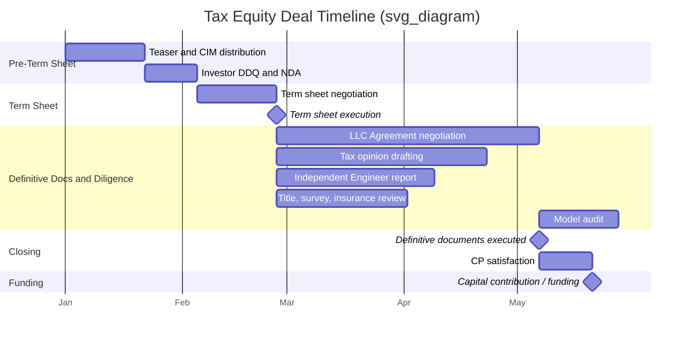

## Deal Timeline from Term Sheet to Funding

### Overview

The deal timeline in a tax equity transaction spans the period from execution of a non-binding term sheet (or letter of intent) through the achievement of "funding" — the date on which the tax equity investor contributes capital in exchange for its membership interest. This period typically spans **90 to 270 days** depending on deal complexity, transaction structure (partnership flip, sale-leaseback, inverted lease), asset class (solar, wind, storage), and whether the transaction is a forward commitment (pre-construction) or a back-leverage/contribution at or near commercial operation date (COD). Understanding this timeline is essential for sponsors managing multiple counterparties, construction schedules, and tax credit qualification deadlines (e.g., beginning-of-construction safe harbors, placed-in-service deadlines).

### Key Points

- The timeline is not linear; multiple workstreams (legal documentation, tax structuring, engineering/independent engineer review, title, insurance, interconnection) run in parallel.
- **Funding** is distinct from **closing**: closing refers to execution of definitive documents, while funding is the actual capital contribution, which may be conditioned on satisfaction of conditions precedent (CPs).
- Timelines compress for repeat counterparties with standardized documents (programmatic deals) and lengthen for first-time sponsor/investor pairings or novel technology.
- Placed-in-service (PIS) deadlines and Investment Tax Credit (ITC)/Production Tax Credit (PTC) qualification windows under IRC §45, §45Y, §48, and §48E often drive hard funding deadlines, particularly given the accelerated phase-down schedules introduced by the One Big Beautiful Bill Act (OBBBA) of 2025.

### Phase 1: Pre-Term Sheet Preparation

**Duration:** 4-12 weeks (often overlapping with sponsor's broader capital raise process)

Before a term sheet is even issued, sponsors typically complete:

- **Teaser and CIM (Confidential Information Memorandum) distribution** to a shortlist of prospective tax equity investors
- **Preliminary financial model** showing projected ITC/PTC value, depreciation (MACRS), and cash flow waterfall
- **Technology and offtake summary**: PPA or hedge structure, interconnection agreement status, EPC contract status
- **Investor due diligence questionnaire (DDQ) responses**
- **NDA execution** with each prospective investor

Sponsors often run a competitive process with 2-4 investors submitting indicative term sheets simultaneously to establish pricing tension.

### Phase 2: Term Sheet Negotiation and Execution

**Duration:** 2-6 weeks

The term sheet (sometimes called a Letter of Intent or Indicative Proposal) establishes the economic and structural framework:

- **Structure selection**: partnership flip (fixed or PAYGO flip), sale-leaseback, or inverted lease
- **Pricing**: dollars per ITC dollar (e.g., $0.95-$1.05 per $1.00 of ITC) or dollars per MWh for PTC deals, and investor's target after-tax Internal Rate of Return (IRR)
- **Sizing**: total tax equity commitment, capital contribution schedule (pre-COD "construction contributions" vs. post-COD "funding contribution")
- **Flip mechanics**: target flip date, target flip yield, and minimum sponsor call option pricing
- **Exclusivity period**: sponsor typically grants 30-60 days exclusivity to the selected investor
- **Key conditions precedent** listed at a high level, to be elaborated in definitive documents
- **Fee provisions**: expense reimbursement caps, break-up fee (if any), deposit requirements

**[Inference]** Term sheets are typically non-binding on economics but contain binding provisions regarding exclusivity, confidentiality, and expense reimbursement.

### Phase 3: Definitive Documentation and Diligence (Longest Phase)

**Duration:** 8-20 weeks; the critical path of the entire timeline

This phase runs several parallel workstreams:

**3.1 Legal Documentation**

- **LLC Agreement (Operating Agreement)** negotiation — the core document governing the partnership flip, allocations, distributions, and investor consent rights
- **Purchase and Sale Agreement (PSA)** or **Contribution Agreement** for asset transfer into the tax equity partnership
- **Guaranty agreements** (sponsor guaranty of EPC completion, indemnity obligations)
- **Consent and estoppel documents** from EPC contractor, offtaker, lender (if back-levered), and landlord/easement holders
- **Tax equity investor's counsel** typically drives redlines on step-transaction risk, partnership allocations under §704(b), and recapture protections

**3.2 Tax Structuring and Opinion**

- **Tax opinion** (typically "should" level) from sponsor's or investor's tax counsel addressing:
  - Partnership classification (avoiding "disguised sale" treatment under §707)
  - Allocation of tax items complying with substantial economic effect rules
  - ITC eligibility and basis (fair market value vs. cost basis, particularly for related-party or sale-leaseback structures)
  - Passive activity loss considerations for the investor
- **Cost segregation / FMV appraisal** (for ITC deals) to establish eligible basis, especially critical post-OBBBA given increased IRS scrutiny on inflated FMV claims
- **Model audit**: independent verification of the financial model's IRR, flip date, and tax allocations, often by a third-party model auditor

**3.3 Technical and Independent Engineering Diligence**

- **Independent Engineer (IE) report** covering technology performance, resource assessment (P50/P90/P99 energy yield for wind/solar), and EPC contractor bankability
- **Title review and survey** of the project site, including leasehold or easement analysis
- **Insurance review**: builder's risk, property, and liability coverage adequacy
- **Interconnection agreement** status and any curtailment risk
- **Permitting review**: confirmation all permits are obtained or on track

**3.4 Construction and Safe Harbor Documentation (if applicable)**

- Evidence supporting **beginning-of-construction** (BOC) qualification — either the "physical work" test or the "5% safe harbor" test under IRS Notice 2013-29 and successor guidance, now heightened in importance given OBBBA's accelerated phase-out timeline for wind and solar
- Equipment procurement contracts and invoices supporting safe harbor spend

### Timeline Diagram





```
### Phase 4: Closing

**Duration:** 1-2 weeks (immediately following documentation finalization)

Closing occurs when all parties execute the definitive documents. Closing does **not** equal funding — it establishes the legal framework and triggers the CP satisfaction period.

**Typical closing deliverables:**

- Fully executed LLC Agreement, PSA/Contribution Agreement, and ancillary guaranties
- Delivery of legal opinions (tax opinion, corporate authority opinion, enforceability opinion)
- UCC lien searches and releases
- Officer's certificates and secretary's certificates confirming corporate authority

### Phase 5: Conditions Precedent (CP) Satisfaction and Funding

**Duration:** 1-6 weeks post-closing (can be same-day for well-prepared deals)

Standard CPs that must be satisfied before capital is released include:

- **Mechanical completion** or **substantial completion** certificate from EPC contractor (for construction-stage funding)
- **Placed-in-service** confirmation for ITC-qualifying deals funding at COD
- **Title policy** issuance (title insurance in effect)
- **UCC-1 filings** perfected in favor of any back-leverage lender
- **Consents** from all required third parties (offtaker, interconnection utility, ground lessor)
- **Bring-down certificates**: sponsor reaffirms representations and warranties are true as of the funding date
- **No material adverse change (MAC)** certification
- **Final invoice reconciliation** and confirmation of construction budget compliance

Upon satisfaction of all CPs, the investor wires its capital contribution — this is the **funding date**, and it starts the clock on the partnership flip structure's pre-flip period.

### Structure-Specific Timeline Variations

| Structure | Typical Total Timeline | Funding Trigger | Key Driver |
|---|---|---|---|
| Partnership Flip (Fixed) | 12-20 weeks post-term sheet | COD or safe-harbored construction start | EPC completion certainty |
| Partnership Flip (PAYGO) | 12-20 weeks post-term sheet | COD | Similar to fixed flip; investor funds over time |
| Sale-Leaseback | 8-14 weeks post-term sheet | PIS date | FMV appraisal timing |
| Inverted Lease (Pass-Through) | 10-16 weeks post-term sheet | PIS date | Master tenant sub-lease documentation |

**[Inference]** Sale-leaseback timelines tend to be shorter because the LLC Agreement negotiation is replaced by a lease agreement, which is often more standardized.

### Example: Illustrative 16-Week Solar Partnership Flip Timeline

- **Week 0**: Term sheet executed with exclusivity
- **Weeks 1-3**: Investor's counsel issues initial LLC Agreement mark-up; IE engaged
- **Weeks 4-8**: Parallel negotiation of LLC Agreement, tax opinion drafting, title/survey ordered
- **Weeks 9-11**: Model audit completed; IE report finalized; EPC consent negotiated
- **Weeks 12-14**: Documents finalized; signature pages circulated
- **Week 15**: Closing (definitive documents executed)
- **Week 16**: CPs satisfied (mechanical completion certificate received); funding occurs

### Common Bottlenecks

- **EPC contract consent and step-in rights** negotiation, since investor counsel typically requires direct step-in rights that EPC contractors resist
- **FMV appraisal disputes**, especially under heightened IRS scrutiny of related-party or inflated basis claims post-OBBBA
- **Interconnection delays** cascading into COD slippage, which delays funding for flip structures tied to PIS
- **Model audit discrepancies** requiring re-negotiation of pricing or flip mechanics
- **Title defects** requiring curative work before title policy issuance

### Next Steps

- **Partnership Flip Structures: Fixed Flip vs. PAYGO Flip**
- **Beginning-of-Construction Safe Harbor Rules (Physical Work Test vs. 5% Safe Harbor)**
- **Independent Engineer Reports and Technical Due Diligence Standards**
- **Tax Opinion Standards: "Should," "Will," and "More Likely Than Not"**
- **Conditions Precedent Checklists by Structure Type**
- **FMV Appraisals and Cost Segregation for ITC Basis**
- **Back-Leverage Debt Coordination with Tax Equity Closing**
- **Impact of OBBBA Phase-Down Schedules on Deal Timing Pressure**


```