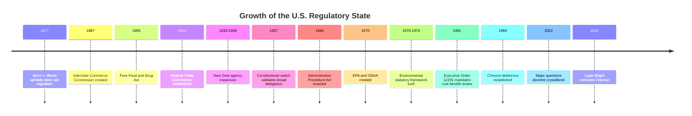

## Origins and Growth of the Modern Regulatory State

### Overview

The modern regulatory state refers to the constellation of administrative agencies, statutory delegations, and rulemaking/enforcement apparatuses through which contemporary governments manage economic and social life. Its emergence marks a fundamental shift from the classical liberal "night-watchman state" — limited to defense, property protection, and contract enforcement — toward a state that actively supervises markets, allocates resources, manages risk, and redistributes wealth through specialized bureaucratic institutions. Administrative and environmental law both operate as subsets of this larger regulatory architecture, so understanding its origins is foundational to both fields.

### Theoretical Preconditions

**Classical Liberalism and Its Limits**

The 18th and 19th century liberal state, grounded in the political theory of Locke, Smith, and the framers of the U.S. Constitution, assumed that legislatures would make general laws, courts would adjudicate disputes under those laws, and executives would enforce them narrowly. This tripartite separation of powers left little room for specialized agencies exercising combined legislative, executive, and judicial functions. Regulation, where it existed, was minimal — largely confined to common-law doctrines like nuisance, negligence, and public health ordinances administered by local governments.

**Market Failure Theory**

The intellectual justification for regulatory intervention rests substantially on market failure theory, which identifies conditions under which unregulated markets fail to produce socially optimal outcomes:

- **Externalities**: Costs or benefits of a transaction borne by third parties (e.g., pollution imposed on downwind communities)
- **Information asymmetry**: One party to a transaction possesses materially superior knowledge (e.g., food safety, financial products)
- **Public goods**: Non-excludable, non-rivalrous goods that private markets underprovide (e.g., clean air, basic research)
- **Natural monopoly**: Industries with declining average costs where competition is inefficient (e.g., utilities, railroads)
- **Collective action problems**: Coordination failures among dispersed actors (e.g., overfishing, groundwater depletion)

**Public Interest vs. Public Choice Theory**

Two competing theoretical lenses frame why regulation emerges and how it should be evaluated:

- **Public interest theory** holds that regulation arises as a corrective response to genuine market failures, implemented by disinterested experts acting in the public good.
- **Public choice theory** (associated with George Stigler's "capture theory" and James Buchanan) argues that regulation is frequently the product of interest-group competition, where concentrated industry interests capture regulatory processes to extract rents, while diffuse public interests are underrepresented. [Inference: Which theory better explains any specific regulatory episode remains contested among historians and economists, and most serious accounts treat the two as complementary rather than mutually exclusive.]

### Historical Development in the United States

**Phase One: The Gilded Age and the Birth of the Independent Agency (1870s–1900)**

The formal regulatory state is conventionally dated to the creation of the **Interstate Commerce Commission (ICC)** in 1887, established by the Interstate Commerce Act to address abusive railroad pricing practices (rate discrimination, pooling arrangements, short-haul/long-haul disparities). The ICC was novel because it combined rulemaking, investigatory, and adjudicatory functions in a single body insulated from direct presidential control — the template for the modern "independent agency." State-level precursors existed earlier, including Granger Laws and state railroad commissions in Illinois, Wisconsin, and Iowa during the 1870s, which were substantially upheld in *Munn v. Illinois*, 94 U.S. 113 (1877), establishing that property "affected with a public interest" could be subject to rate regulation.

**Phase Two: Progressive Era Expansion (1900–1920)**

The Progressive movement, animated by reaction against trust consolidation, urban squalor, and food/drug adulteration scandals (notably Upton Sinclair's *The Jungle*), produced a wave of federal regulatory institutions:

- **Federal Trade Commission (1914)** — antitrust and unfair competition enforcement
- **Federal Reserve System (1913)** — monetary policy and banking supervision
- **Pure Food and Drug Act (1906)**, precursor to the FDA
- **Meat Inspection Act (1906)**

This period established the core justification of administrative expertise: that technically complex, fast-moving economic problems exceeded the institutional competence of generalist courts and part-time legislatures, requiring permanent, specialized bodies staffed by experts.

**Phase Three: The New Deal and the Constitutional Settlement (1933–1938)**

The New Deal represents the decisive expansion of the regulatory state, driven by the Great Depression's demonstration of systemic market failure. Roosevelt's administration created an alphabet of agencies:

- **Securities and Exchange Commission (1934)** — securities markets
- **National Labor Relations Board (1935)** — labor relations
- **Federal Communications Commission (1934)** — broadcasting and telecommunications
- **Federal Deposit Insurance Corporation (1933)** — bank deposit insurance
- **Social Security Administration (1935)** — social insurance

This expansion triggered a constitutional crisis. The Supreme Court initially struck down key New Deal statutes on nondelegation grounds in *Panama Refining Co. v. Ryan*, 293 U.S. 388 (1935), and *A.L.A. Schechter Poultry Corp. v. United States*, 295 U.S. 495 (1935), holding that Congress had delegated legislative power to the executive without an "intelligible principle" to constrain it. Following Roosevelt's 1937 court-packing threat and subsequent personnel changes, the Court reversed course — the so-called "switch in time that saved nine" — and from that point forward has upheld essentially every congressional delegation to agencies under an increasingly permissive nondelegation standard. This settlement is the constitutional bedrock permitting the modern administrative state's broad grants of rulemaking authority.

**Phase Four: The Administrative Procedure Act and Procedural Constitutionalism (1946)**

As agencies proliferated, concerns grew about arbitrary and unaccountable exercise of combined legislative-executive-judicial power. The **Administrative Procedure Act (APA)**, 5 U.S.C. §§ 551 et seq., represented a "constitutional settlement" (in the words of scholars like George Shepherd) between New Deal reformers and their critics, imposing minimum procedural safeguards — notice-and-comment rulemaking, formal adjudication requirements, and judicial review standards — on the exercise of delegated power. The APA remains the foundational procedural statute governing federal agency action today.

**Phase Five: The "New Social Regulation" Era (1960s–1970s)**

A second major regulatory wave, distinct from the New Deal's economic focus, addressed environmental, health, safety, and consumer protection concerns:

- **Environmental Protection Agency (1970)** — consolidated pollution control authority
- **Occupational Safety and Health Administration (1970)**
- **National Highway Traffic Safety Administration (1970)**
- **Consumer Product Safety Commission (1972)**

Landmark statutes of this era — the **Clean Air Act (1970, amended 1977, 1990)**, **Clean Water Act (1972)**, **National Environmental Policy Act (1970)**, **Endangered Species Act (1973)**, and **Resource Conservation and Recovery Act (1976)** — form the statutory core of modern environmental law and reflect a shift from economic regulation of specific industries toward cross-cutting social regulation affecting all sectors of the economy simultaneously.

**Phase Six: Deregulation and Regulatory Reform (1970s–1990s)**

Beginning under Carter and accelerating under Reagan, a deregulatory countermovement emerged in sectors deemed amenable to competitive markets (airlines, trucking, telecommunications), alongside the introduction of **cost-benefit analysis** as a check on regulatory expansion. **Executive Order 12291 (1981)** and its successor **Executive Order 12866 (1993)** required agencies to submit significant rules to **OMB's Office of Information and Regulatory Affairs (OIRA)** for centralized cost-benefit review, institutionalizing economic analysis as a constraint on agency discretion.

**Phase Seven: Contemporary Contestation (2000s–Present)**

Recent decades have seen renewed judicial and political scrutiny of agency power:

- The **major questions doctrine**, crystallized in *West Virginia v. EPA*, 597 U.S. 697 (2022), holds that agencies must point to clear congressional authorization for actions of vast "economic and political significance."
- *Loper Bright Enterprises v. Raimondo*, 603 U.S. 369 (2024), overruled the *Chevron* deference framework (*Chevron U.S.A., Inc. v. Natural Resources Defense Council, Inc.*, 467 U.S. 837 (1984)), eliminating the requirement that courts defer to reasonable agency interpretations of ambiguous statutes, instead directing courts to exercise independent judgment.
- These developments signal a judicial rebalancing away from the deference-heavy model that characterized administrative law from the New Deal through the early 2000s. [Inference: The long-term practical effects of *Loper Bright* on agency rulemaking and litigation outcomes are still developing and empirically unsettled as of this writing.]

### Comparative Perspective

Outside the U.S., regulatory state development followed different institutional paths:

- **United Kingdom**: Traditionally relied on ministerial responsibility and parliamentary sovereignty rather than independent agencies; the shift toward arm's-length regulators (e.g., Ofcom, Ofgem) accelerated significantly after 1980s privatization.
- **European Union**: Developed a distinctive "regulatory state" model (per Giandomenico Majone) emphasizing supranational agencies and harmonized technical standards, since the EU's limited fiscal powers pushed integration toward regulation rather than taxation/spending.
- **Civil law jurisdictions** (France, Germany): Historically embedded administrative law within a separate *droit administratif* tradition, adjudicated by specialized administrative courts (e.g., France's *Conseil d'État*) rather than integrated into ordinary judicial review as in common law systems.

### Core Theoretical Debates

**Key Points**

- **Delegation legitimacy**: How can legislative power be delegated to unelected agency officials without violating separation-of-powers principles? The "intelligible principle" test from *J.W. Hampton, Jr. & Co. v. United States*, 276 U.S. 394 (1928), remains the nominal standard, though its practical toothlessness is widely debated.
- **Democratic accountability**: Agencies are insulated from direct electoral accountability, raising questions about how legitimacy is secured — through presidential oversight, congressional appropriations control, judicial review, or public participation in rulemaking.
- **Expertise vs. capture**: The premise that specialized agencies produce better outcomes than generalist institutions is challenged by empirical evidence of regulatory capture, revolving-door employment patterns, and industry-dominated rulemaking records.
- **Growth drivers**: Historical institutionalists point to crises (depressions, disasters, scandals) as primary drivers of regulatory expansion, since routine legislative politics rarely generates sufficient momentum for institutional creation absent a triggering event.

### Diagram: Timeline of Regulatory State Development

### Illustration: Structural Model of the Regulatory State

<svg xmlns="http://www.w3.org/2000/svg" viewBox="0 0 760 420" font-family="Helvetica, Arial, sans-serif">
<text x="380" y="28" text-anchor="middle" font-size="18" font-weight="bold" fill="#1a1a1a">Structural Model of the Modern Regulatory State (svg_diagram)</text>
<rect x="40" y="60" width="200" height="90" rx="8" fill="#dbe9f7" stroke="#2c5d8a" stroke-width="2" />
<text x="140" y="90" text-anchor="middle" font-size="14" font-weight="bold" fill="#123a5c">Legislature</text>
<text x="140" y="112" text-anchor="middle" font-size="11" fill="#123a5c">Enabling statutes</text>
<text x="140" y="128" text-anchor="middle" font-size="11" fill="#123a5c">Delegated authority</text>
<rect x="280" y="60" width="200" height="90" rx="8" fill="#f7e8db" stroke="#8a5d2c" stroke-width="2" />
<text x="380" y="90" text-anchor="middle" font-size="14" font-weight="bold" fill="#5c3a12">Executive Agency</text>
<text x="380" y="112" text-anchor="middle" font-size="11" fill="#5c3a12">Rulemaking (quasi-legislative)</text>
<text x="380" y="128" text-anchor="middle" font-size="11" fill="#5c3a12">Adjudication (quasi-judicial)</text>
<rect x="520" y="60" width="200" height="90" rx="8" fill="#e3f7db" stroke="#3a7a2c" stroke-width="2" />
<text x="620" y="90" text-anchor="middle" font-size="14" font-weight="bold" fill="#1e4a12">Judiciary</text>
<text x="620" y="112" text-anchor="middle" font-size="11" fill="#1e4a12">Judicial review</text>
<text x="620" y="128" text-anchor="middle" font-size="11" fill="#1e4a12">Loper Bright standard</text>
<line x1="240" y1="105" x2="280" y2="105" stroke="#333" stroke-width="2" marker-end="url(#arrow)" />
<line x1="480" y1="105" x2="520" y2="105" stroke="#333" stroke-width="2" marker-end="url(#arrow)" />
<line x1="620" y1="150" x2="620" y2="190" stroke="#333" stroke-width="2" />
<line x1="620" y1="190" x2="140" y2="190" stroke="#333" stroke-width="2" />
<line x1="140" y1="190" x2="140" y2="150" stroke="#333" stroke-width="2" marker-end="url(#arrow)" />
<text x="380" y="205" text-anchor="middle" font-size="10" fill="#555">Judicial invalidation prompts new legislation</text>
<rect x="130" y="240" width="500" height="140" rx="8" fill="#f5f5f5" stroke="#666" stroke-width="1.5" />
<text x="380" y="265" text-anchor="middle" font-size="13" font-weight="bold" fill="#222">Accountability &amp; Constraint Mechanisms</text>
<circle cx="200" cy="300" r="6" fill="#2c5d8a" />
<text x="215" y="305" font-size="11" fill="#222">OIRA cost-benefit review (E.O. 12866)</text>
<circle cx="200" cy="325" r="6" fill="#2c5d8a" />
<text x="215" y="330" font-size="11" fill="#222">Notice-and-comment rulemaking (APA §553)</text>
<circle cx="200" cy="350" r="6" fill="#2c5d8a" />
<text x="215" y="355" font-size="11" fill="#222">Congressional oversight &amp; appropriations</text>
<circle cx="440" cy="300" r="6" fill="#8a5d2c" />
<text x="455" y="305" font-size="11" fill="#222">Major questions doctrine</text>
<circle cx="440" cy="325" r="6" fill="#8a5d2c" />
<text x="455" y="330" font-size="11" fill="#222">Nondelegation principle (intelligible principle)</text>
<circle cx="440" cy="350" r="6" fill="#8a5d2c" />
<text x="455" y="355" font-size="11" fill="#222">Presidential removal power</text>
</svg>

### Relevance to Environmental Law

The regulatory state's historical trajectory directly explains the structure of environmental law: EPA's creation via **Reorganization Plan No. 3 of 1970** consolidated pollution-control functions previously scattered across the Department of the Interior, HEW, and USDA into a single mission-oriented agency — reflecting the "new social regulation" model's emphasis on cross-industry, harm-based jurisdiction rather than industry-specific economic regulation (the ICC/FTC model). Environmental statutes' heavy reliance on technical standard-setting (e.g., National Ambient Air Quality Standards under the Clean Air Act) exemplifies the expertise-delegation rationale central to the regulatory state's theoretical justification, while ongoing litigation over EPA's greenhouse gas authority (*West Virginia v. EPA*) shows the major questions doctrine's direct application to environmental rulemaking.

### Related Topics

- The nondelegation doctrine and the "intelligible principle" test
- *Chevron* deference and its abolition in *Loper Bright*
- The Administrative Procedure Act: rulemaking and adjudication procedures
- Regulatory capture theory and public choice economics
- Executive Order 12866 and cost-benefit analysis in rulemaking
- Independent agencies and presidential removal power (*Humphrey's Executor*, *Seila Law*)
- Comparative administrative law: EU regulatory state and French *droit administratif*
- The major questions doctrine post-*West Virginia v. EPA*
- History of NEPA and the environmental statutory framework of the 1970s