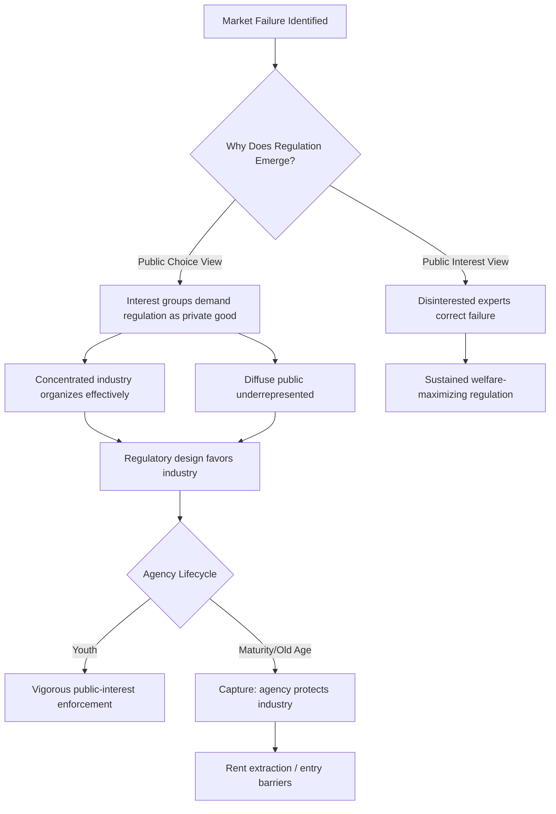

## Theories of Regulation: Public Interest, Capture, and Public Choice

### Overview

Theories of regulation attempt to explain why regulatory institutions arise, whom they benefit, and how their behavior can be predicted and evaluated. Three principal analytical frameworks dominate the literature — **public interest theory**, **capture theory**, and **public choice theory** (including its economic-theory-of-regulation variant) — each offering a distinct account of regulatory origins and a distinct normative lens for evaluating administrative and environmental law. These frameworks are not merely academic; they underpin judicial doctrines of deference, legislative design choices (agency structure, funding, appointment mechanisms), and empirical critiques of specific regulatory programs.

### Public Interest Theory

**Core Claim**

Public interest theory holds that regulation is a corrective response to market failure, supplied by government to serve the welfare of the public at large rather than any narrow faction. Regulators are modeled as benevolent, technically competent agents acting to maximize aggregate social welfare.

**Theoretical Foundations**

- Rooted in **welfare economics**, drawing on Pigouvian analysis of externalities (Arthur Pigou, *The Economics of Welfare*, 1920) and the identification of market failure categories: externalities, public goods, information asymmetry, natural monopoly, and collective action problems.
- Assumes government intervention is costless or low-cost relative to the market failure being corrected — an assumption later challenged by public choice theorists' emphasis on "government failure."
- Historically associated with Progressive Era and New Deal administrative design, where agencies were conceived as repositories of neutral expertise insulated from partisan politics (the "fourth branch" ideal).

**Illustrative Application**

Environmental regulation is frequently defended in public interest terms: air pollution imposes negative externalities on third parties who bear health costs without compensation; absent regulation, polluters lack incentive to internalize these costs. The Clean Air Act's technology-forcing standards and NAAQS-setting process are typically justified as public-interest correctives to this externality problem.

**Critiques**

- Assumes regulators have both the information and the incentive to identify and correctly remedy market failures — an empirical claim not a given.
- Fails to explain persistent regulatory outcomes that clearly benefit regulated industries at consumer expense (e.g., historical trucking and airline rate regulation that entrenched incumbent carriers).
- Does not account for regulatory persistence after the underlying market failure has been resolved or was never significant.

### Capture Theory

**Core Claim**

Capture theory, most closely associated with political scientist **Marver Bernstein** (*Regulating Business by Independent Commission*, 1955) and later formalized economically by **George Stigler** (*"The Theory of Economic Regulation,"* Bell Journal of Economics, 1971), holds that regulatory agencies tend over time to be "captured" by the industries they regulate, such that regulation is administered primarily for the benefit of the regulated industry rather than the public.

**Mechanisms of Capture**

- **Information asymmetry**: Regulated firms possess superior technical and operational information, which agencies depend on for rulemaking and enforcement, creating structural dependence.
- **Revolving door employment**: Agency officials often move between industry and government positions, creating career incentives aligned with industry interests rather than public welfare. [Inference: The causal magnitude of revolving-door effects on regulatory outcomes is empirically contested and varies significantly by agency and era.]
- **Resource asymmetry in political engagement**: Concentrated industry interests can organize and lobby more effectively than diffuse, disorganized public interests (a dynamic later formalized by Mancur Olson's collective action theory).
- **Agency lifecycle theory** (Bernstein): Agencies pass through a lifecycle — gestation (crisis-driven creation), youth (vigorous public-interest enforcement), maturity (routinization and industry accommodation), and old age (essential industry protection) — with capture as the terminal stage.

**Illustrative Application**

The Interstate Commerce Commission is the canonical historical case study: created in 1887 to curb railroad rate discrimination, the ICC by the mid-20th century was widely regarded as protecting incumbent railroads from competition (including trucking) rather than protecting shippers and consumers, contributing to the deregulatory movement of the 1970s–1980s (Staggers Rail Act 1980, Motor Carrier Act 1980).

**Critiques**

- Treats capture as an inevitable, near-deterministic endpoint rather than a variable outcome dependent on institutional design, media scrutiny, and interest-group configuration.
- Underspecifies observable predictions — critics note that capture theory is sometimes invoked post hoc to explain any regulatory outcome favoring industry, reducing its falsifiability.
- Newer scholarship (e.g., Daniel Carpenter's work on FDA reputation-building) shows agencies can resist capture through reputational and professional-expertise mechanisms.

### Public Choice Theory and the Economic Theory of Regulation

**Core Claim**

Public choice theory extends rational-choice economic analysis to political and bureaucratic behavior, treating legislators, regulators, and interest groups as self-interested rational actors rather than disinterested public servants. Its central regulatory application — Stigler's **economic theory of regulation**, refined by **Sam Peltzman** ("Toward a More General Theory of Regulation," Journal of Law and Economics, 1976) — models regulation as a good "supplied" by legislators/regulators and "demanded" by interest groups competing for wealth transfers.

**Key Theoretical Contributions**

- **Stigler-Peltzman model**: Regulation is modeled as a market where regulatory agencies allocate benefits (entry barriers, price floors, subsidies) among competing constituencies, with legislators/regulators maximizing political support rather than social welfare.
- **Mancur Olson's collective action theory** (*The Logic of Collective Action*, 1965): Small, concentrated groups (e.g., a single industry) overcome free-rider problems more easily than large, diffuse groups (e.g., consumers or taxpayers), giving concentrated interests disproportionate influence over regulatory design — the theoretical mechanism underlying capture.
- **Rent-seeking** (Gordon Tullock, Anne Krueger): Firms and interest groups expend real resources lobbying for regulatory advantages (entry barriers, tariffs, licensing restrictions) that transfer wealth rather than create it, representing a social welfare loss beyond the transfer itself.
- **Niskanen's budget-maximizing bureaucrat model** (William Niskanen, *Bureaucracy and Representative Government*, 1971): Bureaucrats are modeled as maximizing agency budget and staff size rather than social welfare, predicting agency over-expansion relative to efficient service levels. [Inference: Niskanen's strict budget-maximization assumption has been refined by subsequent bureaucratic-politics scholarship, which finds bureaucrats pursue more varied goals including mission fidelity, professional reputation, and risk avoidance.]

**Illustrative Application**

Occupational licensing regimes are frequently cited as public-choice-consistent outcomes: incumbent practitioners (a concentrated, well-organized interest) lobby for licensing barriers ostensibly justified by consumer protection, but which also restrict entry and raise incumbent incomes — a pattern documented extensively in the licensing economics literature (e.g., work by Morris Kleiner).

**Critiques**

- Assumes uniformly self-interested behavior by regulators and legislators, potentially understating genuine public-service motivation and professional norms documented in public administration scholarship.
- Struggles to explain regulation that demonstrably harms concentrated industry interests (e.g., stringent environmental standards imposed over sustained, well-funded industry opposition), which is common in environmental law.
- Critics argue the theory better explains distributive/economic regulation (rate-setting, licensing) than social regulation (environmental, health, safety), where diffuse public interests (environmental groups, public health advocates) have sometimes successfully countered concentrated industry opposition.

### Comparative Summary

| Theory | Regulator Motivation | Regulatory Outcome | Canonical Scholars |
| --- | --- | --- | --- |
| Public Interest | Maximize social welfare | Corrects market failure | Pigou |
| Capture | Serve industry post-formation | Industry-protective over time | Bernstein, Stigler |
| Public Choice / Economic Theory | Maximize political support / self-interest | Wealth transfer to organized interests | Stigler, Peltzman, Olson, Niskanen |

**Key Points**

- The three theories are not mutually exclusive; contemporary regulatory scholarship (e.g., Croley, *Regulation and Public Interests*, 2008) treats them as complementary lenses applicable with varying explanatory force depending on the regulatory context.
- Public interest theory dominates *justificatory* rhetoric in statutory preambles and agency mission statements, while capture and public choice theories dominate *positive* (explanatory/predictive) analysis of observed regulatory behavior.
- Environmental law is a frequently cited counterexample to pure public choice predictions, since diffuse environmental interests have at times prevailed against concentrated industry opposition — though critics note environmental NGOs themselves function as organized interest groups subject to similar public-choice dynamics (donor interests, institutional self-preservation).

### Diagram: Theoretical Relationships

### Diagram: Structural Model of Capture Dynamics

<svg xmlns="http://www.w3.org/2000/svg" viewBox="0 0 760 380" font-family="Helvetica, Arial, sans-serif">
<text x="380" y="28" text-anchor="middle" font-size="18" font-weight="bold" fill="#1a1a1a">Structural Model of Regulatory Capture (svg_diagram)</text>
<rect x="40" y="70" width="200" height="80" rx="8" fill="#f7e8db" stroke="#8a5d2c" stroke-width="2" />
<text x="140" y="100" text-anchor="middle" font-size="13" font-weight="bold" fill="#5c3a12">Regulated Industry</text>
<text x="140" y="120" text-anchor="middle" font-size="11" fill="#5c3a12">Concentrated, organized</text>
<text x="140" y="135" text-anchor="middle" font-size="11" fill="#5c3a12">High-value information</text>
<rect x="280" y="70" width="200" height="80" rx="8" fill="#dbe9f7" stroke="#2c5d8a" stroke-width="2" />
<text x="380" y="100" text-anchor="middle" font-size="13" font-weight="bold" fill="#123a5c">Regulatory Agency</text>
<text x="380" y="120" text-anchor="middle" font-size="11" fill="#123a5c">Depends on industry data</text>
<text x="380" y="135" text-anchor="middle" font-size="11" fill="#123a5c">Revolving-door staffing</text>
<rect x="520" y="70" width="200" height="80" rx="8" fill="#e3f7db" stroke="#3a7a2c" stroke-width="2" />
<text x="620" y="100" text-anchor="middle" font-size="13" font-weight="bold" fill="#1e4a12">Diffuse Public</text>
<text x="620" y="120" text-anchor="middle" font-size="11" fill="#1e4a12">Dispersed, high free-rider cost</text>
<text x="620" y="135" text-anchor="middle" font-size="11" fill="#1e4a12">Low organizational capacity</text>
<line x1="240" y1="110" x2="280" y2="110" stroke="#333" stroke-width="2" marker-end="url(#arrow2)" />
<text x="255" y="102" font-size="9" fill="#333">Lobbying, data, jobs</text>
<line x1="520" y1="110" x2="480" y2="110" stroke="#333" stroke-width="2" marker-end="url(#arrow2)" />
<text x="500" y="102" font-size="9" fill="#333" text-anchor="middle" />
<rect x="150" y="200" width="460" height="130" rx="8" fill="#f5f5f5" stroke="#666" stroke-width="1.5" />
<text x="380" y="225" text-anchor="middle" font-size="13" font-weight="bold" fill="#222">Predicted Outcome Divergence</text>

<text x="180" y="255" font-size="11" fill="#222">Public Interest Model →</text>

<text x="380" y="255" font-size="11" fill="#222" font-weight="bold">Welfare-maximizing rule</text>

<text x="180" y="280" font-size="11" fill="#222">Capture Model →</text>

<text x="380" y="280" font-size="11" fill="#222" font-weight="bold">Entry barrier / incumbent protection</text>

<text x="180" y="305" font-size="11" fill="#222">Public Choice Model →</text>

<text x="380" y="305" font-size="11" fill="#222" font-weight="bold">Rent transfer to organized group</text>

</svg>

### Application to Administrative and Environmental Law

**Doctrinal Relevance**

- **Judicial deference doctrines** implicitly encode assumptions about regulator motivation: pre-*Loper Bright* *Chevron* deference rested partly on a public-interest-style assumption that agencies possess superior expertise and legitimate delegated authority, while critics of broad deference frequently invoke capture-theory concerns about unchecked agency discretion.
- **Standing doctrine and citizen suit provisions** in environmental statutes (e.g., Clean Water Act § 505, Clean Air Act § 304) can be understood as institutional responses to the public choice prediction that diffuse environmental interests will be underrepresented in agency enforcement absent a private right of action.
- **Sunset provisions, independent inspectors general, and public comment requirements** under the APA are frequently justified as anti-capture institutional design mechanisms, increasing transparency and lowering the relative advantage of concentrated interests in agency proceedings.

**Environmental Law Specific Considerations**

Environmental regulation presents an interesting test case across all three theories: it is often defended in explicitly public-interest terms (correcting pollution externalities), while critics on both the left (invoking capture by regulated industries through weak enforcement or industry-friendly standard-setting) and from public-choice perspectives (environmental compliance costs sometimes protecting large incumbent firms able to absorb fixed compliance costs while excluding smaller competitors — a phenomenon termed "regulatory moat" effects) find explanatory traction. [Inference: The relative weight of each theoretical mechanism in explaining any specific environmental rule is an empirical question requiring case-specific analysis rather than a matter resolvable by theory alone.]

### Next Steps

- Agency design and structural independence (single-head vs. multi-member commissions)
- The nondelegation doctrine as a constraint on public-choice-driven delegation
- Citizen suit provisions as anti-capture mechanisms in environmental statutes
- Cost-benefit analysis and OIRA review as check on interest-group-driven rulemaking
- Daniel Carpenter's reputational theory of agency behavior as counter-capture framework
- Empirical methods for detecting regulatory capture (revolving-door studies, voting pattern analysis)
- Deregulation movements of the 1970s–1990s as capture-theory-driven policy responses