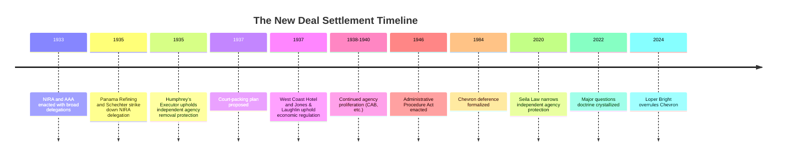

## The New Deal Settlement and Its Administrative Law Legacy

### Overview

The "New Deal settlement" refers to the constitutional and institutional resolution — reached between 1935 and 1946 — that legitimated broad congressional delegation of lawmaking authority to executive branch agencies, thereby establishing the doctrinal foundation upon which the modern administrative state rests. This settlement was neither immediate nor uncontested: it emerged from a direct confrontation between Franklin D. Roosevelt's administration and a Supreme Court initially hostile to expansive delegation, resolved through personnel change, doctrinal reversal, and ultimately codified through the Administrative Procedure Act of 1946. Its legacy defines nearly every major structural feature of contemporary administrative and environmental law: the scope of permissible delegation, the procedural requirements for rulemaking, the standard for judicial review of agency action, and the constitutional status of independent agencies.

### Historical Background: Crisis and Institutional Response

**The Depression as Triggering Event**

The Great Depression, beginning with the 1929 stock market crash, produced unemployment rates exceeding 25% by 1933 and a collapse in industrial production, banking stability, and agricultural prices. The scale of economic dislocation exceeded what existing common-law and limited-government institutions could plausibly address, creating political demand for direct federal intervention in economic life at a scope previously unprecedented in peacetime.

**Roosevelt's Legislative Program (1933–1935): The "First New Deal"**

Roosevelt's first hundred days produced an extraordinary volume of delegating legislation, including:

- **National Industrial Recovery Act (NIRA) (1933)** — authorized industry-drafted "codes of fair competition" covering prices, wages, and production quotas, enforced with the force of law
- **Agricultural Adjustment Act (1933)** — authorized the Secretary of Agriculture to set production quotas and prices for agricultural commodities
- **Securities Act (1933)** and **Securities Exchange Act (1934)** — created federal securities disclosure regulation and the SEC
- **National Labor Relations Act (Wagner Act) (1935)** — created the NLRB and federal labor relations framework

These statutes shared a common structural feature: broad, often vaguely worded delegations of authority to executive agencies or officials to establish binding legal rules — precisely the kind of delegation that raised nondelegation concerns under existing doctrine.

### The Constitutional Crisis: Nondelegation Confrontation

**Pre-New Deal Nondelegation Doctrine**

Prior to the New Deal, the Supreme Court had articulated the **"intelligible principle" test** in *J.W. Hampton, Jr. & Co. v. United States*, 276 U.S. 394 (1928), holding that Congress may delegate authority to the executive so long as it lays down an intelligible principle to guide the exercise of that authority. Until 1935, however, the Court had never actually invalidated a federal statute on nondelegation grounds — the test remained largely theoretical.

**The Two Nondelegation Invalidations of 1935**

*Panama Refining Co. v. Ryan*, 293 U.S. 388 (1935) — The Court struck down § 9(c) of the NIRA, which authorized the President to prohibit interstate shipment of "hot oil" (petroleum produced in excess of state quotas), holding that the statute contained no standard to guide or constrain presidential discretion.

*A.L.A. Schechter Poultry Corp. v. United States*, 295 U.S. 495 (1935) — The Court unanimously struck down the NIRA's code-making authority in its entirety, finding the delegation of power to industry groups (subject only to presidential approval) to establish binding "codes of fair competition" lacked any meaningful standard — the Court characterized this as delegation "run riot." This remains, along with *Panama Refining*, one of only two occasions the Supreme Court has invalidated a federal statute purely on nondelegation grounds.

**The Court-Packing Crisis and the "Switch in Time"**

Following *Schechter* and related decisions invalidating other New Deal programs (e.g., *Carter v. Carter Coal Co.*, 298 U.S. 238 (1936), striking down the Bituminous Coal Conservation Act), Roosevelt in February 1937 proposed the **Judicial Procedures Reform Bill**, which would have allowed the President to appoint an additional justice for each sitting justice over age 70, potentially expanding the Court to fifteen members — widely understood as a court-packing scheme designed to dilute opposition to New Deal legislation.

The plan itself failed in Congress, but shortly after its introduction, the Court's jurisprudence shifted decisively. In *West Coast Hotel Co. v. Parrish*, 300 U.S. 379 (1937), the Court upheld a state minimum wage law, reversing the *Lochner*-era substantive due process line of cases restricting economic regulation. In *NLRB v. Jones & Laughlin Steel Corp.*, 301 U.S. 1 (1937), the Court upheld the Wagner Act's labor relations framework under an expansively construed Commerce Clause. This shift — popularly termed **"the switch in time that saved nine"** — is historically debated as to its precise causal relationship to the court-packing threat, but its practical effect was to end serious judicial obstruction of New Deal delegation and economic regulation. [Inference: Historians continue to debate whether Justice Owen Roberts's vote shift was primarily a response to the court-packing plan or reflected doctrinal evolution already underway; both explanations have significant scholarly support.]

**Post-1937 Nondelegation Permissiveness**

After 1937, the Supreme Court never again invalidated a federal statute on nondelegation grounds for the remainder of the 20th century, upholding delegations under increasingly capacious "intelligible principles" — including standards as broad as regulating in the "public interest, convenience, or necessity" (*NBC v. United States*, 319 U.S. 190 (1943)) and setting air quality standards "requisite to protect public health" (*Whitman v. American Trucking Associations*, 531 U.S. 457 (2001), upholding the Clean Air Act's NAAQS delegation against a nondelegation challenge). This functional abandonment of meaningful nondelegation review is the central doctrinal legacy enabling the modern regulatory state's broad grants of agency rulemaking authority.

### Institutional Legacy: The Proliferation of New Deal Agencies

The post-1937 constitutional settlement permitted continued and expanded agency creation:

| Agency | Year | Function |
| --- | --- | --- |
| Securities and Exchange Commission | 1934 | Securities market regulation |
| Federal Communications Commission | 1934 | Broadcasting/telecommunications |
| National Labor Relations Board | 1935 | Labor relations adjudication |
| Federal Deposit Insurance Corporation | 1933 | Bank deposit insurance |
| Social Security Administration | 1935 | Social insurance administration |
| Civil Aeronautics Board | 1938 | Airline route/rate regulation |

These agencies combined rulemaking, investigatory, and adjudicatory functions within single institutions — a structural departure from strict separation of powers that required independent constitutional justification, addressed by the Court in *Humphrey's Executor v. United States*, 295 U.S. 602 (1935) (upholding for-cause removal protections for FTC commissioners against presidential removal power, distinguishing *Myers v. United States*, 272 U.S. 52 (1926)).

### The Administrative Procedure Act: Codifying the Settlement

**Political Context**

By the mid-1940s, concern had grown — from business interests, the organized bar, and some New Deal critics — that the proliferation of agencies exercising combined legislative-executive-judicial power lacked adequate procedural safeguards against arbitrary action. The **Walter-Logan Bill (1940)**, which would have imposed substantial judicial review requirements on agencies, passed Congress but was vetoed by Roosevelt as excessively restrictive of agency function.

**The APA as Constitutional Compromise**

The **Administrative Procedure Act (APA)**, enacted in 1946 (5 U.S.C. §§ 551 et seq.), represented what administrative law scholars (notably George Shepherd, in *"Fierce Compromise: The Administrative Procedure Act Emerges from New Deal Politics,"* Northwestern University Law Review, 1996) describe as a negotiated constitutional settlement between pro-New Deal forces (seeking to preserve agency flexibility and expertise-based decision-making) and critics (seeking procedural constraints on arbitrary agency power). Its core provisions established:

- **§ 553 — Notice-and-comment (informal) rulemaking**: Requiring publication of proposed rules in the Federal Register, opportunity for public comment, and a statement of basis and purpose for final rules
- **§§ 556–557 — Formal adjudication and rulemaking**: Trial-type procedures with evidentiary hearings where required by organic statute
- **§ 706 — Standards of judicial review**: Establishing the "arbitrary and capricious" standard for informal agency action and "substantial evidence" standard for formal proceedings
- **§ 551(4) — Definition of "rule"**: Broadly encompassing agency statements of general applicability designed to implement, interpret, or prescribe law or policy

**Doctrinal Significance**

The APA's "arbitrary and capricious" standard became the primary vehicle for judicial oversight of agency rulemaking in the absence of meaningful nondelegation review, effectively substituting *procedural* constraint (requiring reasoned decision-making, adequate explanation, and responsiveness to significant comments) for the *substantive* constraint abandoned by post-1937 nondelegation doctrine. This substitution is central to understanding modern administrative law's structure: courts largely do not ask whether Congress delegated too much power, but instead ask whether the agency exercised delegated power reasonably and through proper procedure.

### Doctrinal Legacy Through the Late 20th Century

**Chevron Deference (1984–2024)**

*Chevron U.S.A., Inc. v. Natural Resources Defense Council, Inc.*, 467 U.S. 837 (1984), extended the New Deal settlement's logic by requiring courts to defer to reasonable agency interpretations of ambiguous statutes — a doctrine widely understood as consistent with the New Deal premise that agencies possess superior technical expertise and legitimate delegated authority to fill statutory gaps. *Chevron* dominated administrative law for forty years before being overruled by *Loper Bright Enterprises v. Raimondo*, 603 U.S. 369 (2024), which held courts must exercise independent judgment interpreting statutes rather than deferring to agency interpretations — a significant retrenchment from the deference-heavy model built atop the New Deal settlement.

**Contemporary Challenges to the Settlement**

Recent jurisprudence has revived scrutiny of the New Deal settlement's premises:

- The **major questions doctrine** (*West Virginia v. EPA*, 597 U.S. 697 (2022)) requires clear congressional authorization for agency actions of vast economic/political significance, functioning as a quasi-nondelegation check without formally reviving the nondelegation doctrine itself.
- *Gundy v. United States*, 588 U.S. 128 (2019), produced a fractured plurality in which several justices signaled openness to reviving more robust nondelegation review, though no majority coalesced.
- Debates over the constitutionality of independent agency structures continue, with *Seila Law LLC v. CFPB*, 591 U.S. 197 (2020), narrowing *Humphrey's Executor* by holding that single-director independent agencies with for-cause removal protection violate separation of powers, while preserving multimember commission structures.

**Key Points**

- The New Deal settlement's core legacy is the functional replacement of substantive nondelegation limits with procedural (APA-based) and, more recently, quasi-substantive (major questions doctrine) constraints on agency power.
- The settlement did not resolve — but rather displaced — the underlying constitutional tension between broad delegation and separation-of-powers principles, which continues to resurface in contemporary doctrine.
- Environmental law is structurally a direct product of this settlement: statutes like the Clean Air Act's NAAQS provisions and the Clean Water Act's effluent limitation authority rely on exactly the kind of broad, expertise-based delegation validated by the post-1937 nondelegation permissiveness.

### Diagram: Timeline of the New Deal Settlement

### Diagram: Structural Logic of the Settlement

<svg viewBox="0 0 760 400" xmlns="http://www.w3.org/2000/svg" font-family="Helvetica, Arial, sans-serif">
<text x="380" y="28" text-anchor="middle" font-size="17" font-weight="bold" fill="#1a1a1a">Logic of the New Deal Settlement (svg_diagram)</text>
<rect x="40" y="60" width="220" height="90" rx="8" fill="#f7dbdb" stroke="#8a2c2c" stroke-width="2"/>
<text x="150" y="90" text-anchor="middle" font-size="13" font-weight="bold" fill="#5c1212">Pre-1937 Doctrine</text>
<text x="150" y="112" text-anchor="middle" font-size="11" fill="#5c1212">Nondelegation as real limit</text>
<text x="150" y="128" text-anchor="middle" font-size="11" fill="#5c1212">Schechter, Panama Refining</text>
<rect x="290" y="60" width="220" height="90" rx="8" fill="#f7e8db" stroke="#8a5d2c" stroke-width="2"/>
<text x="400" y="90" text-anchor="middle" font-size="13" font-weight="bold" fill="#5c3a12">1937 Rupture</text>
<text x="400" y="112" text-anchor="middle" font-size="11" fill="#5c3a12">Court-packing threat</text>
<text x="400" y="128" text-anchor="middle" font-size="11" fill="#5c3a12">Doctrinal reversal</text>
<rect x="540" y="60" width="200" height="90" rx="8" fill="#dbe9f7" stroke="#2c5d8a" stroke-width="2"/>
<text x="640" y="90" text-anchor="middle" font-size="13" font-weight="bold" fill="#123a5c">Post-1937 Settlement</text>
<text x="640" y="112" text-anchor="middle" font-size="11" fill="#123a5c">Broad delegation upheld</text>
<text x="640" y="128" text-anchor="middle" font-size="11" fill="#123a5c">Intelligible principle toothless</text>
<line x1="260" y1="105" x2="290" y2="105" stroke="#333" stroke-width="2" marker-end="url(#arrow3)"/>
<line x1="510" y1="105" x2="540" y2="105" stroke="#333" stroke-width="2" marker-end="url(#arrow3)"/>
<rect x="150" y="200" width="460" height="150" rx="8" fill="#e3f7db" stroke="#3a7a2c" stroke-width="2"/>
<text x="380" y="225" text-anchor="middle" font-size="13" font-weight="bold" fill="#1e4a12">Substituted Constraint: The APA (1946)</text>
<text x="380" y="250" text-anchor="middle" font-size="11" fill="#1e4a12">Procedural limits replace substantive nondelegation review</text>

<text x="180" y="280" font-size="11" fill="`#1e4a12`">• Notice-and-comment rulemaking (§553)</text>

<text x="180" y="300" font-size="11" fill="`#1e4a12`">• Arbitrary & capricious review (§706)</text>

<text x="180" y="320" font-size="11" fill="`#1e4a12`">• Formal adjudication procedures (§§556-557)</text>

<line x1="640" y1="150" x2="640" y2="180" stroke="#333" stroke-width="2"/>
<line x1="640" y1="180" x2="380" y2="180" stroke="#333" stroke-width="2"/>
<line x1="380" y1="180" x2="380" y2="200" stroke="#333" stroke-width="2" marker-end="url(#arrow3)"/>
<defs>
<marker id="arrow3" markerWidth="10" markerHeight="10" refX="8" refY="3" orient="auto" markerUnits="strokeWidth">
<path d="M0,0 L0,6 L9,3 z" fill="#333"/>
</marker>
</defs>
</svg>

### Relevance to Environmental Law

Environmental law is arguably the fullest downstream expression of the New Deal settlement's logic. Statutes enacted during the "new social regulation" era of the 1970s — the Clean Air Act, Clean Water Act, and Resource Conservation and Recovery Act — rely on exactly the kind of broad, standard-based delegation (e.g., setting standards "requisite to protect the public health," "ample margin of safety," "best available technology") that would have been constitutionally vulnerable under pre-1937 nondelegation doctrine but was routinely upheld post-settlement, as confirmed in *Whitman v. American Trucking Associations*. Simultaneously, environmental rulemaking is procedurally governed by the APA's notice-and-comment framework, and environmental agency action is reviewed under the APA's arbitrary-and-capricious standard (e.g., *Motor Vehicle Mfrs. Ass'n v. State Farm Mutual*, 463 U.S. 29 (1983)) — making the APA's procedural architecture, rather than substantive nondelegation limits, the primary judicial check on EPA rulemaking discretion. The contemporary major questions doctrine, applied directly to EPA in *West Virginia v. EPA*, represents the most significant modern challenge to this settlement's permissiveness as applied to environmental agencies specifically.

### Related Topics

- The nondelegation doctrine: from *Schechter* to *Gundy* and beyond
- *Humphrey's Executor* and the constitutional status of independent agencies
- The Administrative Procedure Act: structure and key provisions
- *Chevron* deference and its abolition in *Loper Bright*
- The major questions doctrine and its application to EPA rulemaking
- Formal vs. informal rulemaking under APA §§ 553, 556–557
- *State Farm* and the "hard look" arbitrary and capricious standard
- Presidential removal power post-*Seila Law*