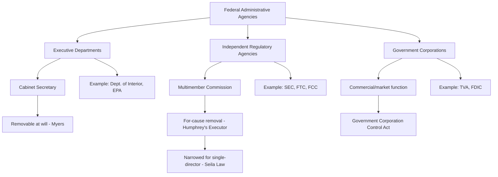

## Types of Agencies: Executive Departments, Independent Agencies, and Government Corporations

### Overview

Federal administrative agencies are organized into distinct structural categories, each carrying different constitutional and functional implications for presidential control, accountability, and operational design. The tripartite taxonomy — **executive departments**, **independent regulatory agencies (commissions)**, and **government corporations** — reflects varying institutional answers to a core constitutional tension: how much insulation from direct presidential control is permissible or desirable for bodies exercising delegated governmental power. This classification is not merely descriptive; it carries direct doctrinal consequences for removal power litigation, appointments clause analysis, and OMB/OIRA regulatory review applicability.

### Executive Departments

**Definition and Structure**

Executive departments are the traditional cabinet-level units of the federal government, headed by a Secretary who serves at the pleasure of the President and sits in the Cabinet. There are currently 15 executive departments, including the Department of the Interior, Department of Agriculture, Department of Energy, and Department of Justice — several of which house significant environmental and administrative regulatory functions.

**Presidential Control**

Department heads are removable by the President at will, without cause, consistent with the unitary executive theory articulated in *Myers v. United States*, 272 U.S. 52 (1926), which held that the President possesses inherent constitutional authority to remove purely executive officers. This structure ensures direct political accountability: department policy is understood to reflect, at least formally, the President's electoral mandate, transmitted through Senate-confirmed political appointees down through career civil service staff.

**Sub-Agencies Within Departments**

Many significant regulatory bodies are technically sub-agencies within executive departments rather than free-standing entities:

- **Bureau of Land Management, Fish and Wildlife Service, National Park Service** — housed within the Department of the Interior
- **Forest Service** — housed within the Department of Agriculture
- **Occupational Safety and Health Administration** — housed within the Department of Labor

These sub-agencies generally lack independent litigating authority and operate under the department head's policy direction, distinguishing them structurally from free-standing independent agencies even when they exercise substantial delegated rulemaking authority.

**Rulemaking and Review**

Executive department rulemaking is subject to centralized White House review through **OMB's Office of Information and Regulatory Affairs (OIRA)** under Executive Order 12866, requiring significant rules to undergo interagency review and cost-benefit analysis before publication — a control mechanism generally understood to apply to executive departments but historically treated as inapplicable, by practice though not by clear statutory mandate, to independent regulatory commissions. [Inference: The precise scope of OIRA's practical authority over independent agencies has been a matter of ongoing executive order revision and political contestation rather than settled statutory law.]

### Independent Regulatory Agencies

**Definition and Structure**

Independent agencies are typically structured as multimember commissions whose members serve fixed, staggered terms and are protected from at-will presidential removal by statutory "for cause" removal provisions (e.g., removal only for "inefficiency, neglect of duty, or malfeasance in office"). Prominent examples include:

- **Securities and Exchange Commission (SEC)**
- **Federal Trade Commission (FTC)**
- **Federal Communications Commission (FCC)**
- **Federal Energy Regulatory Commission (FERC)**
- **National Labor Relations Board (NLRB)**
- **Nuclear Regulatory Commission (NRC)**

The Environmental Protection Agency, notably, is **not** structured as an independent commission — it is headed by a single Administrator removable at will by the President, making it structurally an executive agency despite its significant regulatory autonomy in practice, a point sometimes misunderstood in casual usage. [Inference: EPA's classification as an executive agency rather than an independent commission is a settled structural fact, though the degree of *de facto* insulation EPA enjoys through professional norms and scientific-integrity practices is a matter of institutional practice rather than formal legal structure.]

**Constitutional Basis for Insulation**

*Humphrey's Executor v. United States*, 295 U.S. 602 (1935), upheld Congress's authority to protect FTC commissioners from at-will presidential removal, distinguishing *Myers* on the ground that the FTC exercised quasi-legislative and quasi-judicial functions rather than purely executive power — establishing that multimember, expert regulatory commissions performing adjudicatory and rulemaking functions may constitutionally be insulated from direct presidential control.

**Narrowing of Independent Agency Protections**

*Seila Law LLC v. CFPB*, 591 U.S. 197 (2020), significantly narrowed this framework, holding that a **single-director** independent agency (the Consumer Financial Protection Bureau) with for-cause removal protection violates separation of powers, because a lone unaccountable official wielding substantial executive power lacks the multimember, deliberative structure that justified *Humphrey's Executor*'s exception. The Court left *Humphrey's Executor* itself formally intact for traditional multimember commissions but signaled skepticism about extending removal protection further. *Collins v. Yellen*, 594 U.S. 22 (2021), applied similar reasoning to the Federal Housing Finance Agency's single director. [Inference: Whether the Supreme Court will further narrow or overturn *Humphrey's Executor* for traditional multimember commissions remains an open, actively litigated question as of this writing.]

**Rationale for Independence**

Independence is typically justified on grounds that:

- Regulatory functions requiring technical expertise and consistency benefit from insulation from short-term electoral/political pressure
- Quasi-judicial adjudicatory functions require neutrality inconsistent with direct political control
- Staggered terms promote continuity and reduce policy volatility across presidential administrations

**Critiques**

- Reduces direct democratic accountability, since independent commissioners are not directly answerable to the elected President for policy choices
- Creates potential for the very capture dynamics discussed in public choice/capture theory, since insulation from presidential oversight does not equate to insulation from industry influence
- Complicates coordinated executive branch policy-making when independent agencies pursue divergent priorities from the President's agenda

### Government Corporations

**Definition and Structure**

Government corporations are entities created by Congress to perform market-oriented or commercial-type functions using business-like operational methods (revenue generation, proprietary funding, corporate governance structures), while remaining publicly owned or controlled. They are governed primarily by the **Government Corporation Control Act**, 31 U.S.C. §§ 9101–9110.

**Prominent Examples**

- **Federal Deposit Insurance Corporation (FDIC)** — bank deposit insurance
- **Tennessee Valley Authority (TVA)** — regional power generation and resource development, directly relevant to environmental and natural resources law
- **U.S. Postal Service** — mail delivery, restructured to greater independence under the Postal Reorganization Act of 1970
- **Pension Benefit Guaranty Corporation (PBGC)** — pension insurance
- **Export-Import Bank** — export financing

**Functional Distinctions**

Government corporations differ from both executive departments and independent commissions in several respects:

- **Revenue model**: Often self-funded through fees, premiums, or commercial operations rather than relying solely on congressional appropriations
- **Operational flexibility**: Generally subject to fewer procurement and personnel constraints than traditional agencies, permitting more business-like operational agility
- **Governance**: May be headed by a single administrator or a board, with varying removal protections depending on enabling statute
- **Litigation capacity**: Often possess "sue and be sued" clauses granting broader litigation authority than typical agencies

**Environmental Relevance**

The TVA is a particularly significant government corporation for environmental and natural resources law: it operates as both a regulated utility and, in some contexts, a regulator of its own environmental impacts, generating recurring litigation over its status under NEPA and the Clean Water Act, and serving as a case study in the tension between commercial mission and environmental compliance obligations.

### Comparative Structural Summary

| Feature | Executive Department | Independent Agency | Government Corporation |
| --- | --- | --- | --- |
| Removal of head | At will | For cause (multimember) | Varies by statute |
| Governance | Single Secretary | Multimember commission | Single admin. or board |
| OIRA review (E.O. 12866) | Applies | Historically excluded in practice | Varies |
| Funding | Congressional appropriation | Congressional appropriation (mostly) | Often self-funded/commercial |
| Example | Dept. of Interior | SEC, FTC, FCC | TVA, FDIC |
| Constitutional basis | *Myers* | *Humphrey's Executor* (narrowed by *Seila Law*) | Government Corporation Control Act |

**Key Points**

- The core constitutional variable distinguishing these categories is the degree of presidential removal control, which correlates with — but does not perfectly determine — the degree of political insulation an agency enjoys in practice.
- EPA's classification as a single-administrator executive agency (not an independent commission) is a frequently tested distinction, since EPA nonetheless exercises substantial independent technical and scientific judgment in practice despite lacking formal removal protection.
- Government corporations occupy a distinct third category defined more by *funding and operational model* than by *removal protection*, and the category is somewhat heterogeneous compared to the more doctrinally coherent independent-agency category.

### Diagram: Agency Structural Taxonomy

### Diagram: Removal Power Spectrum

<svg xmlns="http://www.w3.org/2000/svg" viewBox="0 0 760 320" font-family="Helvetica, Arial, sans-serif">
<text x="380" y="28" text-anchor="middle" font-size="17" font-weight="bold" fill="#1a1a1a">Spectrum of Presidential Control Over Agencies (svg_diagram)</text>
<line x1="60" y1="180" x2="700" y2="180" stroke="#444" stroke-width="3" />
<polygon points="700,180 690,174 690,186" fill="#444" />

<text x="60" y="200" font-size="11" fill="#333">Full Presidential Control</text>

<text x="640" y="200" font-size="11" fill="#333">Maximum Insulation</text>

<circle cx="130" cy="180" r="8" fill="#8a2c2c" />
<text x="130" y="150" text-anchor="middle" font-size="11" fill="#5c1212" font-weight="bold">Executive Dept.</text>
<text x="130" y="165" text-anchor="middle" font-size="10" fill="#5c1212">(Secretary, at-will)</text>
<circle cx="330" cy="180" r="8" fill="#8a5d2c" />
<text x="330" y="150" text-anchor="middle" font-size="11" fill="#5c3a12" font-weight="bold">EPA</text>
<text x="330" y="165" text-anchor="middle" font-size="10" fill="#5c3a12">(Single admin., at-will)</text>
<circle cx="480" cy="180" r="8" fill="#2c5d8a" />
<text x="480" y="150" text-anchor="middle" font-size="11" fill="#123a5c" font-weight="bold">Gov't Corporation</text>
<text x="480" y="165" text-anchor="middle" font-size="10" fill="#123a5c">(Varies by statute)</text>
<circle cx="630" cy="180" r="8" fill="#3a7a2c" />
<text x="630" y="150" text-anchor="middle" font-size="11" fill="#1e4a12" font-weight="bold">SEC / FTC / FCC</text>
<text x="630" y="165" text-anchor="middle" font-size="10" fill="#1e4a12">(Multimember, for-cause)</text>
<rect x="60" y="230" width="640" height="70" rx="6" fill="#f5f5f5" stroke="#666" stroke-width="1" />
<text x="380" y="252" text-anchor="middle" font-size="11" font-weight="bold" fill="#222">Governing Cases</text>
<text x="380" y="272" text-anchor="middle" font-size="10" fill="#333">Myers (1926) — full removal power | Humphrey's Executor (1935) — commission exception</text>
<text x="380" y="288" text-anchor="middle" font-size="10" fill="#333">Seila Law (2020) — single-director exception narrowed | Collins v. Yellen (2021)</text>
</svg>

### Application to Administrative and Environmental Law

Agency classification carries direct practical consequences in environmental law practice. Because EPA is an executive agency headed by a removable Administrator, its rulemaking is subject to OIRA cost-benefit review under Executive Order 12866 in a manner that independent commissions have historically avoided in practice, and its policy direction shifts more directly and immediately with presidential transitions than would be true of an independent commission — a dynamic clearly visible in the sharp reversals of EPA climate and Clean Water Act rules across recent administrations. By contrast, agencies like FERC (an independent commission with significant environmental review authority over energy infrastructure, including natural gas pipelines under the Natural Gas Act) exhibit greater policy continuity across administrations due to staggered commissioner terms and for-cause removal protection. Government corporations like the TVA present unique environmental compliance questions, including litigation over whether TVA's hybrid commercial-regulatory status affects its obligations under NEPA and the Clean Water Act's point-source discharge permitting framework.

### Related Topics

- *Humphrey's Executor*, *Seila Law*, and the evolving removal power doctrine
- EPA's structural status as a single-administrator executive agency
- FERC's independent commission structure and environmental review authority
- OIRA/OMB review under Executive Order 12866 and its application across agency types
- The Government Corporation Control Act and TVA's hybrid regulatory status
- Appointments Clause analysis for principal vs. inferior officers
- Agency accountability mechanisms: congressional oversight, GAO, inspectors general