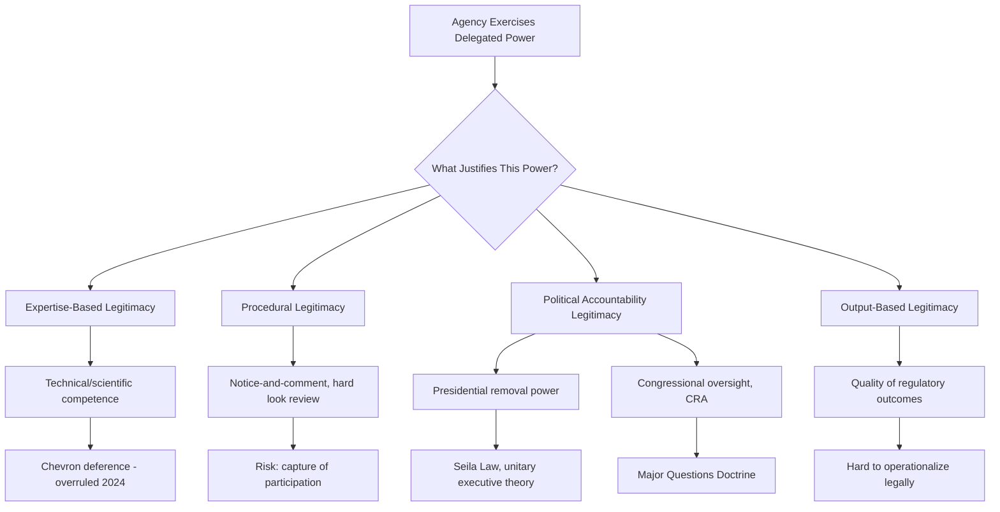

## Legitimacy Debates: Expertise, Technocracy, and Democratic Accountability

### Overview

The legitimacy of the administrative state rests on a persistent and unresolved tension: agencies exercise substantial lawmaking, enforcement, and adjudicatory power despite being staffed largely by unelected officials, raising the question of how such power can be reconciled with foundational democratic and constitutional commitments to accountable, representative government. This tension has generated a rich theoretical literature examining competing legitimacy claims — **expertise-based legitimacy**, **procedural legitimacy**, **political accountability legitimacy**, and **output/results-based legitimacy** — each offering a different account of what makes agency power acceptable in a constitutional democracy. These debates are not merely academic; they directly shape doctrines governing delegation, judicial review intensity, and the design of administrative procedure.

### The Core Legitimacy Problem

**The Democratic Deficit**

Unlike legislators and the President, agency officials — from career civil servants to many politically appointed agency heads — are not directly elected and face no direct electoral accountability for their policy choices. Yet agencies routinely exercise all three classical governmental functions within a single institution: **quasi-legislative** rulemaking (issuing binding regulations with the force of law), **quasi-executive** enforcement (investigating and prosecuting violations), and **quasi-judicial** adjudication (resolving individual disputes through formal or informal hearings). This combination — anathema to Montesquieu's separation-of-powers theory that directly informed the U.S. constitutional structure — is the structural source of the legitimacy problem.

**Historical Framing: The "Headless Fourth Branch"**

The phrase "headless fourth branch of government," popularized in the 1937 **President's Committee on Administrative Management (Brownlow Committee) report**, captured early concern that independent agencies constituted a form of governmental power unaccounted for by the traditional three-branch constitutional design — answerable neither clearly to the President, Congress, nor the judiciary in the way those branches are answerable to voters or to each other.

### Expertise-Based Legitimacy

**Core Claim**

The dominant historical justification for agency power holds that legitimacy derives from technical expertise: agencies are staffed by scientists, economists, engineers, and specialized attorneys possessing knowledge and analytical capacity that generalist legislators and courts lack, and this superior competence justifies delegating authority to resolve complex technical and scientific questions.

**Theoretical Foundations**

- Rooted in Progressive Era faith in scientific management and professional administration (associated with Woodrow Wilson's academic writings on public administration and Frederick Taylor's scientific management theory)
- Reinforced by New Deal-era conceptions of agencies as repositories of neutral, apolitical technical competence, distinct from the overtly partisan legislative process
- Judicially operationalized through deference doctrines: *Chevron* deference (1984–2024) rested substantially on the premise that agencies possess superior technical expertise justifying deference to reasonable statutory interpretations in their area of specialized competence

**Critiques**

- **The fact/value conflation problem**: Many agency decisions nominally framed as "technical" (e.g., setting an acceptable pollution risk level, or a "safe" exposure threshold) necessarily embed contestable value judgments about acceptable risk, distributional fairness, and competing priorities that are not resolvable by technical expertise alone.
- **Expertise heterogeneity**: Modern regulatory questions frequently span multiple expert domains (economics, toxicology, engineering, law) with contested and evolving scientific consensus, undermining the premise of a single, neutral expert answer.
- **Politicization of expertise**: Empirical evidence of politically motivated agency science (documented across administrations in areas including climate science, chemical risk assessment, and endangered species listings) challenges the assumption that agency technical output is insulated from political pressure. [Inference: The extent to which any specific agency's scientific output has been politically influenced in a given episode is typically a contested empirical and historical question rather than a settled fact.]

### Procedural (Deliberative) Legitimacy

**Core Claim**

An alternative account, associated with administrative law scholars including Jerry Mashaw and drawing on deliberative democracy theory (Habermas), locates agency legitimacy not in expertise but in the *procedures* through which agency decisions are made — notice-and-comment rulemaking, public hearings, reasoned decision-making requirements, and judicial review for arbitrariness collectively substitute procedural fairness and transparency for direct electoral accountability.

**Institutional Mechanisms**

- **APA § 553 notice-and-comment rulemaking**: Requires public notice of proposed rules and a meaningful opportunity for public participation, theoretically allowing affected and interested parties (not merely the entity being regulated) a voice in rule formation
- **"Hard look" judicial review**: Under *Motor Vehicle Mfrs. Ass'n v. State Farm Mutual*, 463 U.S. 29 (1983), courts require agencies to engage with significant comments and provide reasoned explanations for their choices, theoretically ensuring public input meaningfully influences outcomes rather than serving as mere formality
- **Government in the Sunshine Act (1976)** and **Federal Advisory Committee Act (1972)**: Transparency mandates intended to open agency decision-making processes to public scrutiny

**Critiques**

- Notice-and-comment participation is empirically dominated by well-resourced, organized interests (regulated industry, trade associations) capable of producing sophisticated technical comments, raising public-choice-style concerns that procedural openness does not translate into genuinely representative input (echoing the capture-theory critique).
- Procedural legitimacy addresses the *manner* of decision-making but does not resolve the underlying question of whether unelected officials *should* be making the substantive policy choice in the first place.
- "Notice-and-comment" rulemaking can function more as a legitimating ritual than genuine co-determination, since agencies retain substantial discretion in how (or whether) to incorporate public comments into final rules.

### Political Accountability Legitimacy

**Core Claim**

A third account locates legitimacy in the *political* chain of accountability connecting agencies back to elected officials: agencies derive legitimacy because they are ultimately controlled by, and answerable to, the President (through appointment and removal power) and Congress (through appropriations, oversight, and organic statute amendment), even if individual agency officials are not themselves elected.

**Presidential Control Mechanisms**

- **Appointment and removal power**: Senate-confirmed agency heads serve at the President's pleasure (for executive agencies) or for fixed terms subject to for-cause removal (for independent commissions)
- **OIRA/OMB centralized review**: Executive Order 12866 requires significant rules to undergo White House cost-benefit review, providing a mechanism for presidential policy control over the regulatory agenda
- **Unified executive theory**: A constitutional theory, influential in contemporary separation-of-powers jurisprudence (e.g., *Seila Law*, *Collins v. Yellen*), holding that vesting executive power in the President necessarily requires robust presidential control over subordinate officials exercising that power, as a structural guarantee of accountability

**Congressional Control Mechanisms**

- **Appropriations power**: Congress's control over agency funding provides ongoing leverage independent of the initial enabling statute
- **Oversight hearings and GAO/Inspector General review**: Institutionalized mechanisms for retrospective scrutiny of agency performance
- **Congressional Review Act (1996)**: Permits Congress to overturn agency rules through expedited joint resolution, providing a direct legislative check on specific regulatory outputs

**Critiques**

- Both mechanisms are attenuated in practice: presidential attention across hundreds of agency actions is inevitably selective, and congressional oversight is frequently under-resourced relative to the scale of the modern regulatory state.
- Independent agency structures (protected by *Humphrey's Executor*, though narrowed by *Seila Law*) deliberately weaken the presidential accountability chain for a substantial category of agencies, creating tension between this legitimacy theory and existing institutional design.
- The Congressional Review Act's practical utility is limited by presidential veto power over CRA resolutions, meaning it functions robustly only when Congress and the presidency are unified.

### Output/Results-Based Legitimacy

**Core Claim**

A more pragmatic, less procedurally focused account holds that agency legitimacy derives substantially from the substantive quality and public benefit of regulatory outcomes — clean air, safe food, functioning financial markets — regardless of the precise accountability chain producing those outcomes, an approach associated with functionalist and pragmatist strands of administrative law scholarship.

**Critiques**

- Difficult to operationalize as a legal or constitutional standard, since it requires ex post evaluation of policy success rather than ex ante constraints on process or authority
- Vulnerable to circularity: good outcomes are often contested along the same political and value lines that generated disagreement over the underlying regulation in the first place
- Does not address the independent constitutional concern that unaccountable power is problematic regardless of whether it produces good outcomes in any particular instance

### Contemporary Judicial Responses to the Legitimacy Debate

**Key Points**

- The **major questions doctrine** (*West Virginia v. EPA*, 597 U.S. 697 (2022)) can be understood as a judicial response to political-accountability legitimacy concerns, requiring clear congressional authorization for agency actions of vast economic or political significance on the theory that major policy choices should be made by Congress, the most directly accountable branch, rather than inferred from ambiguous delegations.
- *Loper Bright Enterprises v. Raimondo*, 603 U.S. 369 (2024), overruling *Chevron* deference, reflects explicit judicial skepticism of expertise-based legitimacy as sufficient justification for interpretive deference, instead reasserting the judiciary's own constitutional role in statutory interpretation under Article III.
- *Seila Law LLC v. CFPB*, 591 U.S. 197 (2020), reflects the unitary-executive strand of political-accountability legitimacy, narrowing independent agency insulation on the theory that unaccountable single-director agencies lack adequate presidential accountability.
- These developments collectively signal a doctrinal shift away from expertise-based and procedural legitimacy justifications (which dominated from the New Deal through the early 2000s) toward political-accountability-based legitimacy justifications privileging clearer lines of electoral responsibility. [Inference: Whether this doctrinal shift reflects a durable jurisprudential realignment or a more contingent, composition-dependent trend in the current Supreme Court is a matter of ongoing scholarly and political debate.]

### Comparative Summary of Legitimacy Theories

| Theory | Source of Legitimacy | Key Institutional Mechanism | Principal Critique |
| --- | --- | --- | --- |
| Expertise-based | Technical competence | Agency scientific/economic staff | Fact/value conflation; politicized science |
| Procedural | Fair, transparent process | Notice-and-comment, hard look review | Capture of participation by organized interests |
| Political accountability | Electoral chain of control | Removal power, OIRA review, CRA | Attenuated oversight in practice |
| Output-based | Substantive quality of results | N/A (ex post evaluation) | Difficult to operationalize; circular |

### Diagram: Competing Legitimacy Frameworks

### Diagram: The Accountability Chain Problem

<svg xmlns="http://www.w3.org/2000/svg" viewBox="0 0 760 380" font-family="Helvetica, Arial, sans-serif">
<text x="380" y="28" text-anchor="middle" font-size="17" font-weight="bold" fill="#1a1a1a">The Agency Accountability Chain (svg_diagram)</text>
<rect x="40" y="60" width="150" height="70" rx="8" fill="#dbe9f7" stroke="#2c5d8a" stroke-width="2" />
<text x="115" y="90" text-anchor="middle" font-size="12" font-weight="bold" fill="#123a5c">Voters</text>
<text x="115" y="108" text-anchor="middle" font-size="10" fill="#123a5c">Direct electoral link</text>
<rect x="230" y="60" width="150" height="70" rx="8" fill="#dbe9f7" stroke="#2c5d8a" stroke-width="2" />
<text x="305" y="90" text-anchor="middle" font-size="12" font-weight="bold" fill="#123a5c">President / Congress</text>
<text x="305" y="108" text-anchor="middle" font-size="10" fill="#123a5c">Elected officials</text>
<rect x="420" y="60" width="150" height="70" rx="8" fill="#f7e8db" stroke="#8a5d2c" stroke-width="2" />
<text x="495" y="90" text-anchor="middle" font-size="12" font-weight="bold" fill="#5c3a12">Agency Head</text>
<text x="495" y="108" text-anchor="middle" font-size="10" fill="#5c3a12">Appointed / removable</text>
<rect x="610" y="60" width="130" height="70" rx="8" fill="#f7dbdb" stroke="#8a2c2c" stroke-width="2" />
<text x="675" y="85" text-anchor="middle" font-size="11" font-weight="bold" fill="#5c1212">Career Staff</text>
<text x="675" y="103" text-anchor="middle" font-size="10" fill="#5c1212">Unelected, non-removable</text>
<line x1="190" y1="95" x2="230" y2="95" stroke="#333" stroke-width="2" marker-end="url(#arrow4)" />
<line x1="380" y1="95" x2="420" y2="95" stroke="#333" stroke-width="2" marker-end="url(#arrow4)" />
<line x1="570" y1="95" x2="610" y2="95" stroke="#333" stroke-width="2" marker-end="url(#arrow4)" />

<text x="115" y="145" text-anchor="middle" font-size="9" fill="#555">Strong</text>

<text x="305" y="145" text-anchor="middle" font-size="9" fill="#555">Strong</text>

<text x="495" y="145" text-anchor="middle" font-size="9" fill="#555">Attenuated</text>

<text x="675" y="145" text-anchor="middle" font-size="9" fill="#555">Very weak</text>

<rect x="60" y="200" width="640" height="150" rx="8" fill="#f5f5f5" stroke="#666" stroke-width="1.5" />
<text x="380" y="225" text-anchor="middle" font-size="13" font-weight="bold" fill="#222">Where the Chain Weakens</text>
<text x="90" y="255" font-size="11" fill="#222">• For-cause removal (independent commissions) severs direct presidential link</text>
<text x="90" y="280" font-size="11" fill="#222">• Career civil service protections insulate day-to-day rule drafting from political turnover</text>
<text x="90" y="305" font-size="11" fill="#222">• Technical/scientific determinations are often delegated further to sub-agency specialists</text>
<text x="90" y="330" font-size="11" fill="#222">• Result: substantive policy choices may be several steps removed from electoral accountability</text>
</svg>

### Application to Administrative and Environmental Law

Environmental law is a particularly rich site for legitimacy debates because environmental standard-setting routinely blends genuinely technical scientific questions (toxicological dose-response relationships, atmospheric chemistry) with contestable value judgments (acceptable residual risk, distributional impacts of pollution burdens on particular communities, intergenerational equity in climate policy) — precisely the fact/value conflation problem central to critiques of expertise-based legitimacy. EPA's NAAQS-setting process under the Clean Air Act, for example, is formally structured as a technical exercise (setting standards "requisite to protect the public health" based on the latest scientific evidence, per *Whitman v. American Trucking Associations*, 531 U.S. 457 (2001)), yet the underlying question of what margin of safety is "requisite" necessarily embeds value judgments about acceptable risk that scientific expertise alone cannot resolve. The application of the major questions doctrine to EPA's greenhouse gas regulations in *West Virginia v. EPA* directly reflects the political-accountability legitimacy framework's skepticism of expertise-based delegation for decisions of major economic and political significance, reasoning that climate policy of that magnitude should be made by Congress rather than inferred from a general Clean Air Act provision.

### Related Topics

- The major questions doctrine as a legitimacy-driven judicial doctrine
- *Loper Bright* and the rejection of expertise-based interpretive deference
- Notice-and-comment rulemaking and the "ossification" critique of administrative procedure
- The unitary executive theory and presidential control of agencies
- Scientific integrity policies and politicization of agency science
- Environmental justice and distributional critiques of technocratic standard-setting
- The Congressional Review Act as a political-accountability mechanism