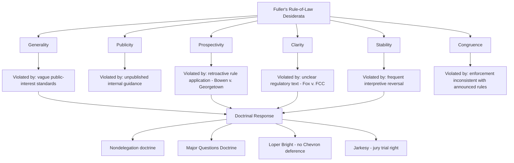

## The Rule-of-Law Critique of Broad Administrative Discretion

### Overview

The rule-of-law critique challenges the modern administrative state on the ground that broad, discretionary delegations of power to agencies are fundamentally incompatible with core rule-of-law values: generality, prospectivity, clarity, stability, and the equal application of law through independent adjudication. Where earlier legitimacy debates focus on *democratic* accountability (who controls the agency), the rule-of-law critique focuses on a distinct dimension — whether agency power is exercised in a manner consistent with law's basic formal characteristics, regardless of who controls it. This critique has a long intellectual lineage, from Dicey's classical formulation through Hayek's mid-century warnings to contemporary formalist and originalist scholarship, and it underlies several significant doctrinal developments in current administrative law.

### Classical Formulations of the Rule of Law

**Dicey's Formulation**

A.V. Dicey, in *Introduction to the Study of the Law of the Constitution* (1885), articulated an influential conception of the rule of law resting on three elements: (1) the absolute supremacy of regular law over arbitrary government power, (2) equality before the law, including for government officials, and (3) the derivation of individual rights from ordinary legal processes and judicial precedent rather than from constitutional grants that could be suspended. Dicey was explicitly skeptical of French-style *droit administratif* (separate administrative courts and specialized administrative law), viewing it as inconsistent with the rule of law's demand that government officials be subject to the same ordinary courts and legal standards as private citizens. [Inference: Dicey's specific hostility to administrative law as a category has been substantially revised by subsequent scholarship, including within the UK itself, which developed extensive judicial review of administrative action without abandoning rule-of-law commitments.]

**Hayek's Critique**

Friedrich Hayek, in *The Road to Serfdom* (1944) and *The Constitution of Liberty* (1960), extended rule-of-law concerns specifically to economic regulation, arguing that discretionary administrative power — as opposed to general, prospective rules known in advance — inherently threatens individual liberty because it substitutes the arbitrary judgment of officials for predictable legal constraint. Hayek's formulation emphasized that rule-of-law-compliant law must be **general** (applying to categories of persons, not targeting specific individuals), **known in advance** (enabling individuals to plan their affairs), and **certain** (not subject to unpredictable administrative reinterpretation).

**Fuller's Internal Morality of Law**

Lon Fuller, in *The Morality of Law* (1964), articulated eight formal desiderata that law must satisfy to function as law at all: generality, publicity, prospectivity (non-retroactivity), clarity, non-contradiction, possibility of compliance, stability over time, and congruence between announced rules and actual official conduct. Fuller's framework is frequently invoked to critique specific administrative practices — for example, agency enforcement actions based on unpublished internal guidance, or frequent unexplained shifts in agency interpretive position, which violate publicity, stability, and congruence values respectively.

### The Core Rule-of-Law Objections to Administrative Discretion

**Vagueness and the Delegation Problem**

Broad statutory delegations (e.g., authorizing agencies to regulate "in the public interest," or to set standards providing an "ample margin of safety") fail the generality and clarity desiderata because they do not themselves constitute determinate legal rules; the actual binding legal content is produced later, by unelected officials, often with limited advance notice to regulated parties. Critics argue this inverts the traditional rule-of-law sequence in which legislatures announce clear rules that officials then apply, rather than legislatures announcing vague standards that officials must first convert into rules.

**Retroactivity and Interpretive Instability**

Agencies frequently change interpretive positions on existing regulations — through new guidance documents, adjudicatory precedent, or rule amendments — in ways that can functionally apply new legal standards to past conduct, implicating Fuller's prospectivity and stability principles. The Supreme Court has periodically constrained this practice: *Bowen v. Georgetown University Hospital*, 488 U.S. 204 (1988), held that agencies may not issue retroactive rules absent express statutory authorization to do so.

**Combination of Functions**

The combination of rulemaking, investigation, prosecution, and adjudication within a single agency is frequently criticized as inconsistent with rule-of-law demands for independent, impartial adjudication separate from the party bringing an enforcement action — a structural concern distinct from, though related to, separation-of-powers analysis. This concern gained renewed doctrinal traction in *SEC v. Jarkesy*, 603 U.S. 109 (2024), where the Supreme Court held that SEC in-house administrative adjudication of securities fraud claims seeking civil penalties violates the Seventh Amendment jury trial right, reflecting rule-of-law-adjacent concerns about agencies acting as prosecutor, judge, and enforcer within a single internal proceeding.

**Vague Enforcement Discretion and Fair Notice**

Rule-of-law critics emphasize that broad agency enforcement discretion — deciding which violations to pursue, against whom, and with what severity — can function as a form of arbitrary power inconsistent with equal application of law, particularly where enforcement priorities shift substantially and unpredictably across administrations without formal rule change. The **fair notice doctrine** in administrative law, requiring that regulated parties have adequate notice of the conduct a regulation actually prohibits before being subject to enforcement penalties, operationalizes this concern (e.g., *General Electric Co. v. EPA*, 53 F.3d 1324 (D.C. Cir. 1995)).

### Doctrinal Responses to the Rule-of-Law Critique

**The Nondelegation Doctrine (Dormant but Persistent)**

The nondelegation doctrine, requiring Congress to supply an "intelligible principle" (*J.W. Hampton, Jr. & Co. v. United States*, 276 U.S. 394 (1928)), is the most direct doctrinal instantiation of the rule-of-law critique — it demands that Congress itself make the core generality/clarity determinations rather than delegating them wholesale to agencies. Though functionally dormant since 1935 (see *Panama Refining* and *Schechter*), *Gundy v. United States*, 588 U.S. 128 (2019), produced a fractured plurality with several justices expressing interest in reviving more robust nondelegation review, reflecting continued judicial sympathy for the underlying rule-of-law concern even absent a majority holding.

**The Major Questions Doctrine**

*West Virginia v. EPA*, 597 U.S. 697 (2022), articulated the major questions doctrine, requiring clear congressional authorization for agency actions of vast economic and political significance. This doctrine functions as a quasi-rule-of-law check by refusing to treat vague or ancillary statutory language as authorizing transformative new regulatory programs, thereby preserving the generality/clarity principle that major legal obligations should trace to clear legislative text rather than agency reinterpretation of old statutes.

**The Void-for-Vagueness Doctrine**

Applied to administrative regulations as well as criminal statutes, the void-for-vagueness doctrine requires that regulations provide sufficient clarity for regulated parties to understand what conduct is prohibited. *FCC v. Fox Television Stations, Inc.*, 567 U.S. 239 (2012), applied fair-notice/vagueness principles to invalidate FCC indecency enforcement based on standards that had not provided broadcasters adequate advance notice, directly reflecting Fuller-style clarity and congruence concerns.

**Loper Bright and the Rejection of Interpretive Deference**

*Loper Bright Enterprises v. Raimondo*, 603 U.S. 369 (2024), overruling *Chevron* deference, can be read partly through a rule-of-law lens: requiring courts to exercise independent judgment in statutory interpretation, rather than deferring to potentially shifting agency interpretations of ambiguous statutes, promotes greater interpretive stability and reduces the risk that the same statutory text produces different binding legal obligations depending on which administration is in office.

**The Chevron-Era Counter-Critique**

Defenders of *Chevron*-style deference and broad delegation historically responded to rule-of-law critiques by arguing that (1) modern regulatory complexity makes fully determinate legislative rules practically impossible, (2) agencies operating under APA procedural constraints (notice-and-comment, arbitrary-and-capricious review) provide adequate substitute rule-of-law safeguards even without fully determinate statutory text, and (3) some interpretive flexibility is a feature, not a bug, allowing regulatory frameworks to adapt to changed circumstances and new information without requiring constant legislative amendment.

### Comparative Perspective: Rule of Law in Administrative Systems

Civil law jurisdictions with well-developed administrative law traditions (notably France's *droit administratif*, adjudicated by the *Conseil d'État*) demonstrate that extensive administrative discretion can coexist with robust rule-of-law protections through specialized administrative courts applying general principles of legality, proportionality, and legitimate expectations — suggesting the rule-of-law critique is not inherently an argument against administrative agencies as such, but rather an argument for particular institutional safeguards (independent review, clear standards, procedural regularity) regardless of institutional form. [Inference: Comparative assessments of which system — common law judicial review or specialized administrative courts — better satisfies rule-of-law values are contested and depend significantly on the specific evaluative criteria applied.]

### Key Points

**Key Points**

- The rule-of-law critique is analytically distinct from the democratic-accountability critique: an agency could be perfectly accountable to the President and Congress while still violating rule-of-law values through vague, retroactive, or unpredictable exercises of discretion, and vice versa.
- The critique has gained significant doctrinal traction in the current judicial era through the major questions doctrine, the *Loper Bright* rejection of *Chevron*, and *Jarkesy*'s restriction on in-house adjudication, representing a coordinated (though not unified) doctrinal response to long-standing rule-of-law concerns.
- Defenders of administrative discretion do not typically reject rule-of-law values outright but argue that modern regulatory complexity requires some trade-off between full ex ante determinacy and the practical capacity to regulate technically complex, fast-evolving problems — a trade-off rule-of-law critics view as having tilted too far toward discretion.

### Diagram: Rule-of-Law Desiderata Applied to Agency Action

### Diagram: The Rule-of-Law Tension in Administrative Governance

<svg xmlns="http://www.w3.org/2000/svg" viewBox="0 0 760 360" font-family="Helvetica, Arial, sans-serif">
<text x="380" y="28" text-anchor="middle" font-size="17" font-weight="bold" fill="#1a1a1a">Rule-of-Law Tension in Administrative Governance (svg_diagram)</text>
<rect x="50" y="60" width="280" height="110" rx="8" fill="#dbe9f7" stroke="#2c5d8a" stroke-width="2" />
<text x="190" y="85" text-anchor="middle" font-size="13" font-weight="bold" fill="#123a5c">Rule-of-Law Values</text>
<text x="190" y="108" text-anchor="middle" font-size="11" fill="#123a5c">Generality · Clarity · Prospectivity</text>
<text x="190" y="126" text-anchor="middle" font-size="11" fill="#123a5c">Stability · Congruence · Publicity</text>
<text x="190" y="150" text-anchor="middle" font-size="10" fill="#123a5c">(Dicey, Hayek, Fuller)</text>
<rect x="430" y="60" width="280" height="110" rx="8" fill="#f7e8db" stroke="#8a5d2c" stroke-width="2" />
<text x="570" y="85" text-anchor="middle" font-size="13" font-weight="bold" fill="#5c3a12">Regulatory Complexity Demands</text>
<text x="570" y="108" text-anchor="middle" font-size="11" fill="#5c3a12">Technical adaptability</text>
<text x="570" y="126" text-anchor="middle" font-size="11" fill="#5c3a12">Responsiveness to new information</text>
<text x="570" y="150" text-anchor="middle" font-size="10" fill="#5c3a12">(Landis, functionalist scholars)</text>
<line x1="330" y1="115" x2="430" y2="115" stroke="#333" stroke-width="2" />
<text x="380" y="105" text-anchor="middle" font-size="20" fill="#8a2c2c">⚡</text>
<rect x="140" y="220" width="480" height="120" rx="8" fill="#f5f5f5" stroke="#666" stroke-width="1.5" />
<text x="380" y="245" text-anchor="middle" font-size="13" font-weight="bold" fill="#222">Doctrinal Mediation Points</text>
<text x="170" y="270" font-size="11" fill="#222">• Nondelegation doctrine (dormant, latent)</text>
<text x="170" y="290" font-size="11" fill="#222">• Major Questions Doctrine (West Virginia v. EPA)</text>
<text x="170" y="310" font-size="11" fill="#222">• Loper Bright (independent judicial interpretation)</text>
<text x="170" y="328" font-size="11" fill="#222">• Jarkesy (adjudicatory independence, jury trial)</text>
</svg>

### Application to Administrative and Environmental Law

Environmental law provides some of the clearest examples of rule-of-law tension in practice. Statutory standards like the Clean Air Act's requirement that NAAQS provide an "ample margin of safety" or the Clean Water Act's "best available technology" standard are, from a rule-of-law perspective, paradigmatic instances of vague delegation requiring agencies to supply the actual determinate legal content through subsequent rulemaking — precisely the pattern Hayek and Fuller identified as problematic, even though such standards are widely defended as necessary given the technical complexity and evolving scientific basis of environmental regulation. Retroactivity concerns arise acutely in environmental enforcement contexts, such as EPA's shifting interpretations of "waters of the United States" under the Clean Water Api across administrations, which regulated parties have repeatedly challenged as producing unpredictable compliance obligations inconsistent with Fuller's stability and congruence principles. The major questions doctrine's application in *West Virginia v. EPA* — rejecting EPA's use of Clean Air Act § 111 to mandate generation-shifting for the power sector — is a direct, high-profile instantiation of the rule-of-law critique's insistence that transformative regulatory programs require clear, specific congressional authorization rather than expansive agency reinterpretation of older, more general statutory language.

### Related Topics

- The nondelegation doctrine and the "intelligible principle" test
- The major questions doctrine post-*West Virginia v. EPA*
- *SEC v. Jarkesy* and the future of in-house administrative adjudication
- Fair notice and void-for-vagueness challenges to agency regulations
- Retroactivity limits on agency rulemaking (*Bowen v. Georgetown University Hospital*)
- Comparative administrative law: French *droit administratif* and the *Conseil d'État*
- James Landis's functionalist defense of administrative discretion (*The Administrative Process*, 1938)