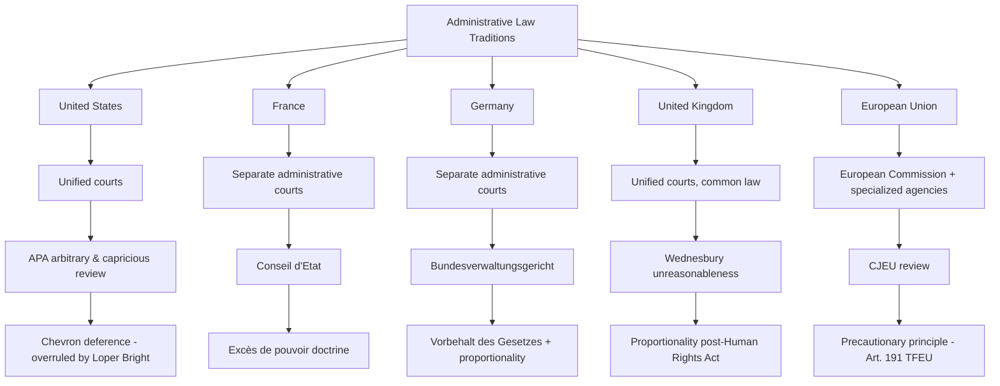

## Administrative Law Traditions in Comparative Perspective

### Overview

Administrative law systems worldwide reflect divergent historical, constitutional, and institutional paths for reconciling delegated governmental power with legal accountability. While U.S. administrative law developed within a common-law constitutional framework emphasizing unified courts, separation of powers, and the New Deal settlement's deference-based judicial review, other major legal traditions — French *droit administratif*, German administrative law, British administrative law, and European Union regulatory governance — developed distinct institutional solutions to the same underlying problem: how to permit specialized administrative expertise and discretion while maintaining legal accountability and rights protection. Comparative study illuminates which features of U.S. administrative law are contingent historical choices rather than functional necessities, and clarifies recurring cross-jurisdictional themes in administrative and environmental regulatory governance.

### The French Tradition: Droit Administratif

**Historical Origins**

French administrative law originated in the post-Revolutionary settlement, rooted in a strict interpretation of separation of powers that prohibited ordinary judicial courts from reviewing executive action — reflecting revolutionary-era distrust of the *parlements* (pre-revolutionary courts) that had obstructed royal and later revolutionary reforms. The Law of 16–24 August 1790 barred ordinary courts from adjudicating disputes involving public administration, creating the institutional space for a wholly separate body of administrative law and administrative courts.

**The Conseil d'État**

The **Conseil d'État**, established by Napoleon in 1799, evolved from an advisory body to the executive into France's supreme administrative court, developing an extensive body of judge-made administrative law principles largely independent of the ordinary civil code. Key doctrines developed through Conseil d'État jurisprudence include:

- **Excès de pouvoir** (abuse of power) — the primary vehicle for challenging administrative decisions as exceeding legal authority
- **Principes généraux du droit** (general principles of law) — judge-created substantive principles (equality, proportionality, legitimate expectations) applied to constrain administrative discretion even absent explicit statutory text
- **Détournement de pouvoir** (misuse of power) — invalidating administrative action taken for improper purposes even when formally within granted authority

**Structural Distinctiveness**

Unlike the U.S. system, France maintains a fully separate administrative court hierarchy (tribunaux administratifs, cours administratives d'appel, and the Conseil d'État at the apex) parallel to, and independent from, the ordinary civil/criminal court system, with disputes over which system has jurisdiction resolved by the **Tribunal des Conflits**. This structural separation directly contradicts Dicey's rule-of-law critique of administrative courts as inconsistent with equality before the law, yet the French system is widely regarded as providing robust, sophisticated rights protection against administrative overreach — demonstrating that specialized administrative adjudication and strong rule-of-law protection are not inherently incompatible. [Inference: Comparative legal scholarship continues to debate whether specialized administrative courts or generalist judicial review better protects individual rights against administrative action; empirical and normative assessments vary by scholar and evaluative criteria.]

**Environmental Application**

French environmental law operates substantially through this administrative court framework, with the Conseil d'État issuing significant climate-related rulings, including *Commune de Grande-Synthe* (2021), ordering the French government to take additional measures to meet its greenhouse gas reduction commitments — illustrating how specialized administrative courts can serve as vehicles for climate accountability litigation distinct from the ordinary tort or constitutional litigation models more common in U.S. environmental law.

### The German Tradition: Verwaltungsrecht

**Historical and Constitutional Foundations**

German administrative law developed within a civil law tradition emphasizing codification, doctrinal systematization, and strong constitutional rights protection under the post-war **Basic Law (Grundgesetz)** of 1949, itself substantially shaped by reaction against the administrative excesses of the Nazi period.

**Key Structural Features**

- **Separate administrative court system**: Germany maintains specialized administrative courts (*Verwaltungsgerichte*) at multiple levels, culminating in the **Federal Administrative Court** (*Bundesverwaltungsgericht*), structurally similar to but institutionally distinct from the French model
- **The Rechtsstaat principle**: A constitutionally entrenched rule-of-law concept requiring that all administrative action have a clear legal basis (*Vorbehalt des Gesetzes* — the principle of legal reservation), reflecting a formalist commitment to legislative authorization stronger than the U.S. post-1937 nondelegation permissiveness
- **Proportionality analysis** (*Verhältnismäßigkeit*): A structured four-part analytical framework (legitimate purpose, suitability, necessity, proportionality *stricto sensu*) that German courts apply extensively to review administrative action, and which has substantially influenced EU law and, to a lesser extent, comparative constitutional discourse globally
- **The Federal Constitutional Court** (*Bundesverfassungsgericht*): Provides an additional layer of constitutional review over administrative and legislative action, including significant environmental rulings — notably the **Klimaschutzgesetz** decision (2021), holding that Germany's climate legislation's insufficiently specified post-2030 emissions reduction pathway violated the constitutional rights of younger generations, an intergenerational-equity ruling with few close U.S. analogues.

**Comparative Significance**

Germany's stronger formal legal-reservation requirement and searching proportionality review represent a notably more rule-of-law-oriented approach than the U.S. post-*Chevron* (pre-*Loper Bright*) deference model, though German administrative law scholars have also engaged extensively with functionalist arguments for administrative flexibility similar to U.S. debates.

### The British Tradition: Administrative Law Without Droit Administratif

**Diceyan Legacy and Its Evolution**

Britain historically rejected the French model, following Dicey's insistence that administrative officials should be subject to ordinary courts applying ordinary law rather than a specialized administrative jurisdiction. This produced, for much of the 20th century, a comparatively underdeveloped body of formal administrative law relative to France and Germany, with judicial review of administrative action grounded in the common-law prerogative writs (certiorari, mandamus, prohibition) rather than a codified administrative law framework.

**Post-War Expansion of Judicial Review**

The mid-to-late 20th century saw substantial judicial development of UK administrative law principles, including:

- **Wednesbury unreasonableness**: From *Associated Provincial Picture Houses v. Wednesbury Corporation* [1948] 1 KB 223, establishing that administrative decisions may be quashed if "so unreasonable that no reasonable authority could ever have come to it" — a highly deferential standard compared to U.S. "hard look" arbitrary-and-capricious review, though subsequently supplemented by proportionality analysis in human-rights contexts following the **Human Rights Act 1998**
- **The Human Rights Act 1998**: Incorporated the European Convention on Human Rights into domestic law, introducing proportionality review for administrative actions implicating Convention rights, substantially converging UK practice with continental proportionality analysis in that domain
- **Independent regulatory bodies**: Post-1980s privatization produced a wave of arm's-length regulators (Ofcom for telecommunications, Ofgem for energy, the Environment Agency for environmental protection) structurally resembling U.S. independent agencies, representing a significant institutional convergence despite differing constitutional starting points

**Brexit and Retained EU Law**

The UK's exit from the European Union required extensive domestic legislation (the European Union (Withdrawal) Act 2018 and subsequent Retained EU Law Act 2023) to determine which EU-derived environmental and administrative regulatory standards would continue in UK law, creating an ongoing, actively evolving body of post-Brexit UK environmental and administrative regulatory law. [Unverified: The precise current status of specific retained EU environmental regulations is subject to ongoing legislative and regulatory change; readers should verify current UK statutory text for any specific regulatory question.]

### The European Union: A Distinctive Supranational Regulatory State

**Majone's "Regulatory State" Thesis**

Political scientist Giandomenico Majone's influential analysis characterizes the EU as a paradigmatic **"regulatory state"**: because EU institutions possess limited fiscal capacity relative to member states (no significant EU-level taxation or spending authority comparable to member-state welfare states), European integration has proceeded primarily through **regulatory harmonization** — setting common technical standards, environmental limits, and market rules — rather than through fiscal redistribution, making regulation the EU's primary governing instrument.

**Institutional Structure**

- **European Commission**: Functions as the EU's primary regulatory and executive body, proposing legislation and issuing implementing regulations, combining functions that would be separated across Congress and agencies in the U.S. system
- **Specialized EU agencies**: Including the **European Chemicals Agency (ECHA)** (administering the REACH chemical regulation framework), the **European Environment Agency (EEA)**, and the **European Medicines Agency (EMA)**, generally possessing more limited direct enforcement authority than U.S. counterparts, with primary enforcement typically delegated to member-state authorities under EU framework directives
- **Court of Justice of the European Union (CJEU)**: Provides centralized judicial review of EU regulatory action and preliminary rulings on the interpretation of EU law referred by national courts, functioning as a supranational analogue to U.S. judicial review of agency action

**Precautionary Principle**

EU environmental and administrative law prominently incorporates the **precautionary principle**, codified in Article 191 of the Treaty on the Functioning of the European Union, permitting regulatory action to address potential environmental or health risks even absent full scientific certainty — a notably more risk-averse regulatory posture than the U.S. approach, which more heavily emphasizes cost-benefit analysis and quantified risk assessment (per Executive Order 12866) before regulatory action. This divergence has generated substantial transatlantic regulatory friction in areas including chemical regulation (EU's REACH framework versus the U.S. Toxic Substances Control Act) and genetically modified organism regulation.

### Comparative Summary Table

| Feature | United States | France | Germany | United Kingdom | European Union |
| --- | --- | --- | --- | --- | --- |
| Court structure | Unified (ordinary courts) | Separate administrative courts | Separate administrative courts | Unified (ordinary courts) | CJEU + national courts |
| Review standard | Arbitrary & capricious (APA §706) | Excès de pouvoir | Proportionality (Verhältnismäßigkeit) | Wednesbury / proportionality (HRA) | Proportionality |
| Delegation formalism | Intelligible principle (weak, post-1937) | Constrained by general principles | Strong (Vorbehalt des Gesetzes) | Parliamentary sovereignty-based | Treaty-conferred competences |
| Regulatory risk posture | Cost-benefit analysis (E.O. 12866) | Mixed | Mixed, strong constitutional rights review | Mixed, HRA-influenced | Precautionary principle (Art. 191 TFEU) |
| Key environmental institution | EPA (executive agency) | Ministry + Conseil d'État review | UBA + administrative courts | Environment Agency | EEA, ECHA + national implementation |

**Key Points**

- The presence or absence of a separate administrative court system is historically contingent rather than functionally necessary for effective administrative law; both the unified (U.S., historically UK) and separated (French, German) models have developed sophisticated accountability mechanisms.
- The EU's precautionary principle and the U.S.'s cost-benefit-analysis-centered approach represent genuinely divergent regulatory philosophies with material real-world consequences for environmental and public health regulation, rather than merely differing procedural mechanisms.
- Proportionality analysis, though absent from formal U.S. administrative law doctrine, functions analogously in some respects to U.S. "hard look" arbitrary-and-capricious review, though the two are not doctrinally equivalent and proportionality review is generally understood as more structured and substantively searching.

### Diagram: Comparative Institutional Architecture

### Diagram: Judicial Review Intensity Spectrum

<svg xmlns="http://www.w3.org/2000/svg" viewBox="0 0 760 320" font-family="Helvetica, Arial, sans-serif">
<text x="380" y="28" text-anchor="middle" font-size="17" font-weight="bold" fill="#1a1a1a">Comparative Judicial Review Intensity (svg_diagram)</text>
<line x1="60" y1="170" x2="700" y2="170" stroke="#444" stroke-width="3" />
<polygon points="700,170 690,164 690,176" fill="#444" />

<text x="60" y="195" font-size="11" fill="#333">More Deferential</text>

<text x="640" y="195" font-size="11" fill="#333">More Searching</text>

<circle cx="130" cy="170" r="8" fill="#8a2c2c" />
<text x="130" y="140" text-anchor="middle" font-size="11" fill="#5c1212" font-weight="bold">UK (pre-HRA)</text>
<text x="130" y="155" text-anchor="middle" font-size="10" fill="#5c1212">Wednesbury</text>
<circle cx="290" cy="170" r="8" fill="#8a5d2c" />
<text x="290" y="140" text-anchor="middle" font-size="11" fill="#5c3a12" font-weight="bold">US (post-Loper Bright)</text>
<text x="290" y="155" text-anchor="middle" font-size="10" fill="#5c3a12">Independent interpretation</text>
<circle cx="450" cy="170" r="8" fill="#2c5d8a" />
<text x="450" y="140" text-anchor="middle" font-size="11" fill="#123a5c" font-weight="bold">France</text>
<text x="450" y="155" text-anchor="middle" font-size="10" fill="#123a5c">Excès de pouvoir</text>
<circle cx="610" cy="170" r="8" fill="#3a7a2c" />
<text x="610" y="140" text-anchor="middle" font-size="11" fill="#1e4a12" font-weight="bold">Germany</text>
<text x="610" y="155" text-anchor="middle" font-size="10" fill="#1e4a12">Proportionality + Rechtsstaat</text>
<rect x="60" y="220" width="640" height="70" rx="6" fill="#f5f5f5" stroke="#666" stroke-width="1" />
<text x="380" y="245" text-anchor="middle" font-size="11" font-weight="bold" fill="#222">Note on Comparability</text>
<text x="380" y="265" text-anchor="middle" font-size="10" fill="#333">Positioning is illustrative; review intensity varies by legal domain,</text>
<text x="380" y="280" text-anchor="middle" font-size="10" fill="#333">rights implicated, and specific statutory/constitutional context</text>
</svg>

### Application to Administrative and Environmental Law

Comparative analysis is directly useful for environmental law practice and scholarship because environmental regulation is among the most internationally harmonized and cross-referenced areas of administrative law. The EU's REACH chemical regulation and precautionary-principle-based approach frequently sets a de facto global standard that influences U.S. and other jurisdictions' regulatory design even without formal legal harmonization, given the practical necessity for multinational firms to comply with the most stringent applicable jurisdiction's requirements. Climate litigation has become a particularly active site of comparative convergence and divergence: the German Constitutional Court's *Klimaschutzgesetz* decision and France's *Commune de Grande-Synthe* ruling represent judicially enforced intergenerational climate accountability mechanisms with no close U.S. federal analogue (given *Juliana v. United States*, 947 F.3d 1159 (9th Cir. 2020), which rejected a similar U.S. constitutional climate claim for lack of judicially cognizable standing/redressability), illustrating how differing constitutional structures and administrative law traditions produce materially different climate governance outcomes across otherwise comparable liberal democracies.

### Related Topics

- The precautionary principle versus cost-benefit analysis in environmental regulatory design
- Comparative climate litigation: *Klimaschutzgesetz*, *Commune de Grande-Synthe*, and *Juliana v. United States*
- The EU's REACH framework and its influence on global chemical regulation
- Proportionality review as a comparative alternative to U.S. arbitrary-and-capricious review
- The Conseil d'État and specialized administrative court systems
- Post-Brexit retained EU environmental law in the United Kingdom
- Majone's regulatory state thesis and EU governance theory