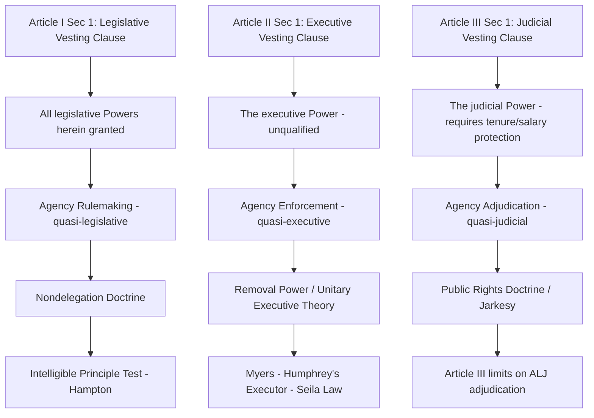

## The Three Vesting Clauses and the Separation of Powers Framework

### Overview

The U.S. Constitution allocates the federal government's power among three branches through the **Vesting Clauses** opening Articles I, II, and III — provisions that assign "legislative Powers," "the executive Power," and "the judicial Power" to Congress, the President, and the federal courts respectively. These clauses are the constitutional bedrock of separation-of-powers analysis and the essential starting point for understanding why administrative agencies, which routinely exercise functions resembling all three types of power within single institutions, present persistent constitutional difficulty. Nearly every major doctrine in administrative law — nondelegation, removal power, the major questions doctrine, and adjudicatory structure challenges like *Jarkesy* — traces back to the interpretive question of what the Vesting Clauses actually require.

### Textual Foundations

**Article I, Section 1 — The Legislative Vesting Clause**

> "All legislative Powers herein granted shall be vested in a Congress of the United States, which shall consist of a Senate and House of Representatives."

Two textual features are doctrinally significant: the phrase **"All legislative Powers"** suggests a comprehensive, non-shareable grant to Congress, and the qualifying phrase **"herein granted"** signals that Congress possesses only the specific powers enumerated elsewhere in Article I (chiefly § 8), rather than a general plenary lawmaking authority — reflecting the Constitution's foundational commitment to a national government of enumerated, limited powers.

**Article II, Section 1 — The Executive Vesting Clause**

> "The executive Power shall be vested in a President of the United States of America."

Unlike Article I's qualified grant, Article II's Executive Vesting Clause contains no "herein granted" limitation, a textual asymmetry that has generated substantial debate over whether it confers a broader, more open-ended grant of inherent executive authority beyond the specific powers subsequently enumerated in Article II §§ 2–3 (appointments, commander-in-chief, pardons, treaty-making with Senate advice and consent, and the Take Care Clause). This textual asymmetry is central to the **unitary executive theory**.

**Article III, Section 1 — The Judicial Vesting Clause**

> "The judicial Power of the United States, shall be vested in one supreme Court, and in such inferior Courts as the Congress may from time to time ordain and establish."

Article III's grant is likewise unqualified with respect to the scope of "the judicial Power," but is structurally distinctive in requiring Article III judges to possess life tenure during good behavior and salary protection against diminution (Article III, § 1) — protections designed to ensure judicial independence from political pressure, and protections that agency administrative law judges (ALJs) conspicuously lack, a tension central to ongoing adjudicatory-structure litigation.

### The Theoretical Function of Separation of Powers

**Montesquieu's Influence**

The tripartite structure directly reflects Montesquieu's analysis in *The Spirit of the Laws* (1748), which the framers read closely and cited extensively during ratification debates. Montesquieu argued that liberty requires preventing the concentration of legislative, executive, and judicial power in the same hands, since such concentration — regardless of who wields it — creates the structural conditions for tyranny, independent of whether any specific officeholder intends to abuse that combined power.

**The Federalist's Elaboration**

James Madison, in **Federalist No. 47**, defended the separation-of-powers structure against Anti-Federalist objections that the proposed Constitution insufficiently separated the branches, famously writing that "the accumulation of all powers, legislative, executive, and judiciary, in the same hands ... may justly be pronounced the very definition of tyranny." Madison in **Federalist No. 51** further elaborated the "checks and balances" complement to separation of powers, arguing that mere textual separation is insufficient without each branch possessing the institutional means and motive to resist encroachment by the others — the famous formulation that "ambition must be made to counteract ambition."

### The Administrative State's Challenge to the Tripartite Model

**The Combination-of-Functions Problem**

Modern administrative agencies routinely exercise functions resembling all three vested powers within a single institution:

- **Quasi-legislative function**: Agency rulemaking under APA § 553 creates binding legal rules of general applicability — functionally resembling Article I legislative power, despite residing in the executive branch
- **Quasi-executive function**: Agency investigation and enforcement of regulatory violations resembles Article II executive power
- **Quasi-judicial function**: Agency formal adjudication (APA §§ 556–557), often before administrative law judges, resembles Article III judicial power in resolving individual disputes and imposing penalties, yet without Article III tenure or salary protections

This combination is the structural source of the "headless fourth branch" critique and the doctrinal tension animating nondelegation, removal power, and adjudicatory-structure litigation.

**Two Interpretive Approaches: Formalism and Functionalism**

- **Formalism** holds that the Vesting Clauses require rigid categorical separation: a given governmental act is either legislative, executive, or judicial in nature, and must be exercised only by the correspondingly vested branch (subject to explicit constitutional exceptions like the veto or impeachment). Formalist analysis tends to be skeptical of broad delegation and combined-function agencies. *INS v. Chadha*, 462 U.S. 919 (1983) (invalidating the legislative veto as violating bicameralism and presentment), is frequently cited as a formalist landmark.
- **Functionalism** holds that the separation-of-powers inquiry should focus on whether a given arrangement meaningfully threatens the core purposes of separation of powers — preventing tyrannical concentration of power and preserving each branch's essential functions — rather than demanding rigid categorical purity. Functionalist analysis is more tolerant of blended-function agencies so long as adequate checks (political accountability, procedural safeguards, judicial review) remain in place. *Morrison v. Olson*, 487 U.S. 654 (1988) (upholding the independent counsel statute under a functionalist "impermissible interference" standard rather than a formalist categorical test), exemplifies this approach.

### Key Doctrinal Applications

**Nondelegation Doctrine (Article I Vesting Clause)**

The nondelegation doctrine derives directly from the Legislative Vesting Clause: because "All legislative Powers" are vested in Congress, Congress cannot, in a purely formalist reading, transfer that legislative power to the executive branch. The "intelligible principle" test from *J.W. Hampton, Jr. & Co. v. United States*, 276 U.S. 394 (1928), represents the Court's practical accommodation between this formalist textual command and the functional necessity of administrative rulemaking, permitting delegation so long as Congress supplies a guiding standard rather than unconstrained discretion. *Gundy v. United States*, 588 U.S. 128 (2019), reflects ongoing tension between formalist justices seeking a more robust nondelegation standard and functionalist justices content with the traditional permissive approach.

**Removal Power (Article II Vesting Clause)**

The Executive Vesting Clause is the textual basis for removal-power litigation: if "the executive Power" is vested in the President, and administrative enforcement is executive in character, the President arguably must possess the power to remove officers exercising that power to maintain accountability — the core logic of the **unitary executive theory**. *Myers v. United States*, 272 U.S. 52 (1926), applied a formalist reading requiring at-will removal of purely executive officers. *Humphrey's Executor v. United States*, 295 U.S. 602 (1935), took a more functionalist approach, permitting for-cause removal protection for multimember commissions exercising quasi-legislative/quasi-judicial functions on the theory that such functions are not "purely executive." *Seila Law LLC v. CFPB*, 591 U.S. 197 (2020), and *Collins v. Yellen*, 594 U.S. 22 (2021), reflect a renewed formalist turn, narrowing *Humphrey's Executor* to preserve robust presidential removal power for single-director agencies.

**Adjudicatory Structure (Article III Vesting Clause)**

The Judicial Vesting Clause underlies the "public rights" doctrine, distinguishing matters that may be adjudicated by non-Article III administrative tribunals (traditionally, disputes involving the government's own regulatory prerogatives, such as immigration or benefits determinations) from matters requiring Article III adjudication (traditionally, disputes resembling common-law claims involving private rights). *SEC v. Jarkesy*, 603 U.S. 109 (2024), applied this framework to hold that SEC administrative adjudication of securities fraud penalties — resembling a common-law fraud action rather than a public-rights matter — violates the Seventh Amendment jury trial right and, by extension, raises Article III vesting concerns about agency adjudication of claims closely resembling traditional judicial business.

### Comparative Summary

| Vesting Clause | Branch | Core Power | Key Textual Feature | Administrative Law Tension |
| --- | --- | --- | --- | --- |
| Article I, § 1 | Congress | "All legislative Powers ... herein granted" | Qualified/enumerated grant | Nondelegation doctrine |
| Article II, § 1 | President | "the executive Power" | Unqualified grant | Removal power, unitary executive theory |
| Article III, § 1 | Federal Courts | "The judicial Power" | Requires life tenure/salary protection | Public rights doctrine, ALJ adjudication (*Jarkesy*) |

**Key Points**

- All three vesting clauses use different textual formulations (particularly the presence or absence of "herein granted" and the presence or absence of tenure/salary protections), and these textual differences are central to ongoing formalist arguments about the differential scope of each branch's constitutional authority.
- Formalist and functionalist interpretive approaches produce materially different administrative law outcomes across nondelegation, removal power, and adjudicatory structure doctrine, and the current Supreme Court has shown increasing sympathy for formalist analysis relative to the mid-20th-century functionalist consensus. [Inference: Whether this reflects a durable jurisprudential shift or a more contingent, composition-dependent trend is debated among scholars.]
- The administrative state's combination of quasi-legislative, quasi-executive, and quasi-judicial functions within single agencies is not addressed by explicit constitutional text and has instead been managed through a body of judicially developed doctrine attempting to reconcile Madisonian separation-of-powers theory with modern regulatory governance needs.

### Diagram: The Three Vesting Clauses and Administrative Function Overlap

### Diagram: Formalism vs. Functionalism in Separation-of-Powers Analysis

<svg xmlns="http://www.w3.org/2000/svg" viewBox="0 0 760 340" font-family="Helvetica, Arial, sans-serif">
<text x="380" y="28" text-anchor="middle" font-size="17" font-weight="bold" fill="#1a1a1a">Formalism vs. Functionalism (svg_diagram)</text>
<rect x="50" y="60" width="300" height="130" rx="8" fill="#f7dbdb" stroke="#8a2c2c" stroke-width="2" />
<text x="200" y="85" text-anchor="middle" font-size="13" font-weight="bold" fill="#5c1212">Formalism</text>
<text x="200" y="108" text-anchor="middle" font-size="11" fill="#5c1212">Rigid categorical separation</text>
<text x="200" y="126" text-anchor="middle" font-size="11" fill="#5c1212">Power is either legislative,</text>
<text x="200" y="142" text-anchor="middle" font-size="11" fill="#5c1212">executive, or judicial</text>
<text x="200" y="165" text-anchor="middle" font-size="10" fill="#5c1212">Ex: Chadha, Myers, Seila Law</text>
<rect x="410" y="60" width="300" height="130" rx="8" fill="#dbe9f7" stroke="#2c5d8a" stroke-width="2" />
<text x="560" y="85" text-anchor="middle" font-size="13" font-weight="bold" fill="#123a5c">Functionalism</text>
<text x="560" y="108" text-anchor="middle" font-size="11" fill="#123a5c">Focus on core purposes:</text>
<text x="560" y="126" text-anchor="middle" font-size="11" fill="#123a5c">preventing tyranny, preserving</text>
<text x="560" y="142" text-anchor="middle" font-size="11" fill="#123a5c">essential branch functions</text>
<text x="560" y="165" text-anchor="middle" font-size="10" fill="#123a5c">Ex: Humphrey's Executor, Morrison v. Olson</text>
<rect x="180" y="230" width="400" height="90" rx="8" fill="#f5f5f5" stroke="#666" stroke-width="1.5" />
<text x="380" y="255" text-anchor="middle" font-size="12" font-weight="bold" fill="#222">Current Doctrinal Trend</text>
<text x="380" y="278" text-anchor="middle" font-size="10" fill="#333">Renewed formalist emphasis: Seila Law, Loper Bright,</text>
<text x="380" y="295" text-anchor="middle" font-size="10" fill="#333">Jarkesy, West Virginia v. EPA (major questions)</text>
</svg>

### Application to Administrative and Environmental Law

The Vesting Clauses framework directly structures environmental agency litigation. EPA's exercise of combined rulemaking (NAAQS standard-setting), enforcement (Clean Water Act discharge violations), and adjudicatory (Environmental Appeals Board permit disputes) functions is a textbook illustration of the combination-of-functions problem the three vesting clauses were designed to prevent, defended primarily on functionalist grounds emphasizing technical necessity and APA procedural safeguards. The major questions doctrine's application in *West Virginia v. EPA* reflects a formalist-inflected concern that EPA's use of Clean Air Api § 111 authority for generation-shifting exceeded the kind of technical implementation authority properly assignable to the executive branch, requiring instead clear legislative — Article I — authorization for transformative policy choices. Similarly, *Jarkesy*'s Article III/Seventh Amendment analysis, while an SEC case, has direct implications for environmental agencies that impose civil penalties through in-house administrative proceedings (e.g., EPA's use of administrative penalty authority under various environmental statutes), raising open questions about whether such proceedings must migrate to Article III courts when they resemble traditional common-law claims for monetary penalties. [Inference: The full scope of *Jarkesy*'s application beyond the SEC securities-fraud context to other agencies' administrative penalty regimes, including environmental enforcement, remains an actively litigated and unsettled question.]

### Related Topics

- The nondelegation doctrine and the intelligible principle test
- The unitary executive theory and presidential removal power
- *SEC v. Jarkesy* and the public rights doctrine
- Formalism versus functionalism in separation-of-powers jurisprudence
- The major questions doctrine as a Vesting-Clause-adjacent formalist check
- *INS v. Chadha* and the legislative veto
- Administrative law judges and Article III tenure/salary protections