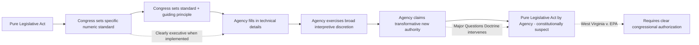

## Legislative Versus Executive Lawmaking Distinguished

### Overview

Distinguishing legislative from executive lawmaking is the conceptual crux of nondelegation analysis: if agency rulemaking is genuinely "legislative" in character, then Article I's vesting of "All legislative Powers" in Congress raises serious constitutional difficulty when that power is exercised by executive branch officials; if agency rulemaking is instead properly understood as "executing" or "filling up the details" of legislative policy already made by Congress, no separation-of-powers problem arises. This distinction — easy to state in the abstract, notoriously difficult to apply in practice — has occupied constitutional theorists and courts since the earliest years of the Republic and remains the doctrinal fault line running through modern nondelegation and major-questions-doctrine litigation.

### The Conceptual Distinction

**Classical Formulation: Policy-Making versus Policy-Implementation**

The traditional distinction holds that **legislative power** involves making fundamental policy choices — determining what conduct should be regulated, prohibited, or subsidized, and establishing the basic normative framework governing private conduct — while **executive power** involves implementing and applying policy choices already made by the legislature, exercising judgment about factual circumstances and administrative details rather than making the underlying normative choice.

**Locke's Foundational Framing**

John Locke, in the *Second Treatise of Government* (1689), articulated an early version of this distinction, arguing that the legislative power, once delegated by the people to their representatives, cannot itself be further delegated ("the legislative cannot transfer the power of making laws to any other hands") — a principle frequently cited as the philosophical ancestor of the American nondelegation doctrine, though Locke's own framework did not anticipate the modern administrative state's technical complexity.

**The "Filling Up the Details" Metaphor**

Chief Justice John Marshall, in *Wayman v. Southard*, 23 U.S. (10 Wheat.) 1 (1825), articulated an early and enduring formulation: Congress may make "important subjects" the object of legislation while delegating to "other hands" (including the executive) the power to "fill up the details" of statutory implementation. This metaphor — distinguishing the legislature's core policy choice from executive-branch detail-filling — remains a foundational, if imprecise, touchstone in nondelegation analysis, cited approvingly in modern cases including *Whitman v. American Trucking Associations*, 531 U.S. 457 (2001).

### The Intelligible Principle Test as Operationalization

**Doctrinal Standard**

*J.W. Hampton, Jr. & Co. v. United States*, 276 U.S. 394 (1928), formalized the modern test: Congress may delegate authority to the executive branch so long as it supplies an **"intelligible principle"** to guide and constrain the exercise of that authority. The test is explicitly designed to operationalize the legislative/executive distinction — an intelligible principle theoretically ensures that Congress, not the executive, has made the core policy choice, leaving the executive branch to exercise only the bounded, principle-guided judgment characteristic of implementation rather than independent lawmaking.

**The Test's Practical Permissiveness**

In practice, the intelligible principle standard has proven highly permissive. The Supreme Court has upheld delegations authorizing agencies to regulate in the "public interest, convenience, or necessity" (*NBC v. United States*, 319 U.S. 190 (1943)), to set air quality standards "requisite to protect the public health" with an "adequate margin of safety" (*Whitman*), and to establish "fair and equitable" wartime price controls (*Yakus v. United States*, 321 U.S. 414 (1944)) — standards that, read literally, provide agencies with substantial normative latitude to make what appear to be genuine policy judgments rather than merely technical implementation choices.

**The Doctrinal Puzzle**

This gap between the theoretical legislative/executive distinction and the practical permissiveness of the intelligible principle test is the central puzzle of modern nondelegation scholarship: if an agency setting an "ample margin of safety" for air pollutants is genuinely just filling in details of a policy Congress already made, why does that determination look, functionally, like the kind of value-laden, high-stakes policy choice legislative power is supposed to comprise? Justice Neil Gorsuch's dissent in *Gundy v. United States*, 588 U.S. 128 (2019), pressed exactly this critique, arguing the intelligible principle test as applied has become "the abuse of one word to defeat the plain understanding of a whole clause."

### Alternative Analytical Frameworks

**The Delegation-of-Power vs. Delegation-of-Discretion Distinction**

Some scholars (e.g., analysis by Gary Lawson) distinguish between impermissibly delegating the *legislative power itself* (making Congress's basic policy choice for it) versus permissibly delegating *discretionary authority to apply Congress's own already-made policy choice* to particular facts and circumstances — a reformulation of the classical distinction that attempts to sharpen its application without abandoning the underlying framework.

**The "Major Questions" Reformulation**

The contemporary **major questions doctrine**, articulated in *West Virginia v. EPA*, 597 U.S. 697 (2022), can be understood as a functional substitute for a more robust legislative/executive distinction: rather than asking in the abstract whether a delegation supplies an "intelligible principle," the doctrine asks whether the specific agency action at issue involves a decision of such vast "economic and political significance" that it should be presumed to require clear, specific congressional authorization — effectively treating major, transformative regulatory decisions as inherently legislative in character regardless of whether the underlying statutory delegation nominally satisfies the intelligible principle standard.

**Formalist Revival Proposals**

Some formalist scholars and jurists (echoed in various *Gundy* concurrences/dissents) have proposed reviving a more robust distinction requiring Congress to make all "important" policy choices itself, permitting delegation only for genuinely technical, non-value-laden implementation matters — a standard that, if adopted, would represent a significant departure from 20th-century nondelegation permissiveness and would call into question the constitutionality of numerous existing broad regulatory delegations, including significant portions of environmental law. [Inference: No such formalist revival has commanded a majority of the Supreme Court as of this writing, though several justices have expressed sympathy for elements of this approach in separate writings.]

### Rulemaking as a Site of the Distinction

**Legislative Rules versus Interpretive Rules and Policy Statements**

The Administrative Procedure Act itself implicitly reflects the legislative/executive distinction by distinguishing categories of agency pronouncements:

- **Legislative rules** (issued under APA § 553's notice-and-comment procedures) — carry the "force of law," bind regulated parties and courts, and are treated as the closest administrative analogue to legislative action, hence requiring the APA's most robust procedural safeguards
- **Interpretive rules** — merely clarify an agency's understanding of existing statutory or regulatory requirements without creating new binding obligations, treated as closer to executive interpretation/application than to lawmaking, and exempt from notice-and-comment requirements under APA § 553(b)(A)
- **General statements of policy** — announce an agency's tentative intentions regarding future exercise of discretionary enforcement or adjudicatory authority without binding the agency or regulated parties, also exempt from notice-and-comment

Courts frequently struggle to classify specific agency pronouncements within this taxonomy (the "legislative rule versus interpretive rule/policy statement" line-drawing problem), reflecting at a procedural level the same underlying conceptual difficulty present in nondelegation doctrine at the constitutional level.

### Comparative Illustration: Applying the Distinction

| Agency Action | Characterization | Rationale |
| --- | --- | --- |
| Congress sets a numeric speed limit | Legislative | Direct, specific policy choice made by Congress itself |
| Congress directs DOT to set speed limits "reasonable for safety," DOT sets 65 mph | Arguably executive (per *Hampton*/*Whitman* line) | Congress supplied a guiding principle; DOT applies it to facts |
| EPA sets NAAQS "requisite to protect public health" based on scientific risk assessment | Formally executive; substantively contested | Traditional doctrine treats as permissible detail-filling; critics argue it embeds unreviewed value judgments about acceptable risk |
| EPA claims authority to mandate industry-wide generation-shifting under a general Clean Air Act provision (*West Virginia v. EPA*) | Treated as impermissibly legislative absent clear authorization | Major questions doctrine: transformative economic/political significance requires clear congressional text |

**Key Points**

- The legislative/executive lawmaking distinction is conceptually clear in the abstract (policy choice versus policy implementation) but has proven extremely difficult to operationalize as a workable, predictable legal test, generating persistent doctrinal instability from *Wayman v. Southard* through *Gundy*.
- The intelligible principle test's practical permissiveness means the formal nondelegation doctrine does relatively little independent work in constraining agency rulemaking; the major questions doctrine has emerged as the more operative contemporary mechanism for identifying agency action that crosses from executive implementation into effectively legislative policy-making.
- The distinction recurs at the sub-constitutional, procedural level within the APA's taxonomy of legislative rules, interpretive rules, and policy statements, meaning the underlying conceptual difficulty appears both in constitutional nondelegation analysis and in ordinary administrative procedure litigation over which APA procedures apply to a given agency pronouncement.

### Diagram: The Legislative-Executive Lawmaking Spectrum

### Diagram: Structural Comparison of Legislative and Executive Lawmaking

<svg xmlns="http://www.w3.org/2000/svg" viewBox="0 0 760 360" font-family="Helvetica, Arial, sans-serif">
<text x="380" y="28" text-anchor="middle" font-size="17" font-weight="bold" fill="#1a1a1a">Legislative vs. Executive Lawmaking (svg_diagram)</text>
<rect x="50" y="60" width="300" height="150" rx="8" fill="#dbe9f7" stroke="#2c5d8a" stroke-width="2" />
<text x="200" y="85" text-anchor="middle" font-size="13" font-weight="bold" fill="#123a5c">Legislative Lawmaking</text>
<text x="200" y="108" text-anchor="middle" font-size="11" fill="#123a5c">Makes fundamental policy choice</text>
<text x="200" y="126" text-anchor="middle" font-size="11" fill="#123a5c">Determines what conduct is</text>
<text x="200" y="142" text-anchor="middle" font-size="11" fill="#123a5c">regulated/prohibited</text>
<text x="200" y="165" text-anchor="middle" font-size="10" fill="#123a5c">Vested exclusively in Congress</text>
<text x="200" y="182" text-anchor="middle" font-size="10" fill="#123a5c">(Article I, Sec 1)</text>
<rect x="410" y="60" width="300" height="150" rx="8" fill="#f7e8db" stroke="#8a5d2c" stroke-width="2" />
<text x="560" y="85" text-anchor="middle" font-size="13" font-weight="bold" fill="#5c3a12">Executive Lawmaking</text>
<text x="560" y="108" text-anchor="middle" font-size="11" fill="#5c3a12">Applies existing policy to facts</text>
<text x="560" y="126" text-anchor="middle" font-size="11" fill="#5c3a12">"Fills up the details"</text>
<text x="560" y="142" text-anchor="middle" font-size="11" fill="#5c3a12">(Marshall, Wayman v. Southard)</text>
<text x="560" y="165" text-anchor="middle" font-size="10" fill="#5c3a12">Permissible if guided by</text>
<text x="560" y="182" text-anchor="middle" font-size="10" fill="#5c3a12">intelligible principle</text>
<line x1="350" y1="135" x2="410" y2="135" stroke="#333" stroke-width="2" stroke-dasharray="4" />
<text x="380" y="125" text-anchor="middle" font-size="18" fill="#8a2c2c">?</text>
<rect x="150" y="240" width="460" height="100" rx="8" fill="#f5f5f5" stroke="#666" stroke-width="1.5" />
<text x="380" y="262" text-anchor="middle" font-size="12" font-weight="bold" fill="#222">Operative Tests</text>
<text x="380" y="285" text-anchor="middle" font-size="10" fill="#333">Intelligible Principle Test (Hampton, 1928) — weak in practice</text>
<text x="380" y="305" text-anchor="middle" font-size="10" fill="#333">Major Questions Doctrine (West Virginia v. EPA, 2022) — stronger in practice</text>
<text x="380" y="325" text-anchor="middle" font-size="10" fill="#333">for economically/politically significant agency action</text>
</svg>

### Application to Administrative and Environmental Law

The legislative/executive distinction is directly tested by environmental agency standard-setting, which routinely requires balancing scientific risk assessment (arguably executive/technical) against normative judgments about acceptable residual risk, cost, and distributional impact (arguably legislative/policy-making). EPA's NAAQS-setting process under Clean Air Act § 109, upheld against nondelegation challenge in *Whitman v. American Trucking Associations*, exemplifies the doctrine's practical resolution of this tension: the Court held that "requisite to protect the public health" with "an adequate margin of safety" supplies a sufficiently intelligible principle, treating EPA's risk-based judgment as executive implementation rather than independent legislative policy-making, even though critics have long argued that determining an "adequate margin of safety" necessarily embeds contestable value judgments indistinguishable in kind from legislative policy choices. *West Virginia v. EPA*'s major questions holding represents the clearest instance of the Court treating a specific instance of EPA rulemaking (industry-wide generation-shifting under Clean Air Act § 111) as having crossed the line from permissible detail-filling into impermissibly legislative policy-making absent clear congressional authorization, illustrating how the major questions doctrine now functions as the operative doctrinal tool for policing the legislative/executive boundary in high-stakes environmental rulemaking, even as the formal intelligible principle test remains nominally undisturbed and generally permissive for less transformative agency action.

### Related Topics

- The intelligible principle test and its origins in *J.W. Hampton, Jr. & Co. v. United States*
- The major questions doctrine as a functional nondelegation substitute
- *Gundy v. United States* and calls to revive robust nondelegation review
- Legislative rules versus interpretive rules and policy statements under APA § 553
- *Whitman v. American Trucking Associations* and NAAQS nondelegation analysis
- John Locke's *Second Treatise* and the philosophical origins of nondelegation
- Justice Gorsuch's *Gundy* dissent and formalist nondelegation revival proposals