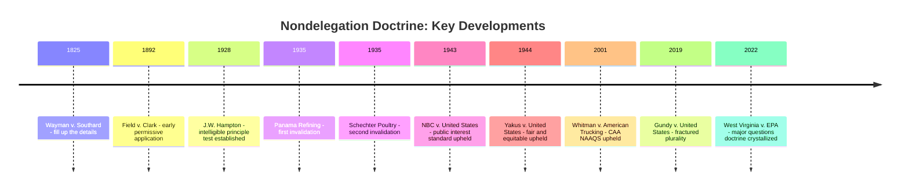

## The Nondelegation Doctrine and the Intelligible Principle Test

### Overview

The nondelegation doctrine holds that Congress, as the exclusive repository of "All legislative Powers" under Article I, § 1, cannot transfer that legislative power to another branch of government, including the executive branch and its administrative agencies. The **intelligible principle test**, first articulated in 1928, has served for nearly a century as the doctrine's primary operational standard, permitting delegation so long as Congress supplies a guiding principle constraining executive discretion. This entry traces the doctrine's origins, its practical near-abandonment after 1935, its role as the theoretical foundation for essentially all broad regulatory delegations — including virtually the entirety of modern environmental law — and its contested contemporary status following *Gundy v. United States* and the rise of the major questions doctrine as a functional alternative constraint.

### Constitutional and Historical Foundations

**Textual Basis**

The doctrine derives from Article I, § 1's vesting clause: "All legislative Powers herein granted shall be vested in a Congress of the United States." Because the grant is textually exclusive to Congress, a purely formalist reading suggests Congress cannot redelegate that power to the executive branch, judiciary, or private parties — the foundational premise from which all nondelegation analysis proceeds.

**Early Formulations**

Chief Justice John Marshall's opinion in *Wayman v. Southard*, 23 U.S. (10 Wheat.) 1 (1825), provided the earliest significant judicial treatment, distinguishing between "important subjects" that Congress must decide itself and matters of lesser importance that may be delegated to "fill up the details." *Field v. Clark*, 143 U.S. 649 (1892), upheld a tariff statute authorizing the President to suspend trade concessions upon finding that foreign countries imposed "reciprocally unequal and unreasonable" duties, articulating the maxim that "Congress cannot delegate legislative power" while simultaneously upholding a delegation that, in substance, granted the President considerable factual and policy discretion — an early instance of the doctrine's practical gap between rhetoric and application.

### The Intelligible Principle Test

**Origin: J.W. Hampton, Jr. & Co. v. United States**

*J.W. Hampton, Jr. & Co. v. United States*, 276 U.S. 394 (1928), formally established the modern test. The case involved a tariff statute authorizing the President to adjust duty rates to equalize the costs of production between domestic and foreign competitors. Chief Justice Taft's opinion articulated the now-canonical standard: Congress may delegate authority to the executive branch "if Congress shall lay down by legislative act an intelligible principle to which the person or body authorized to [act] is directed to conform, such legislative action is not a forbidden delegation of legislative power."

**Doctrinal Function**

The intelligible principle test is designed to distinguish permissible delegation of *discretion to implement* congressional policy from impermissible delegation of the *legislative power itself* — operationalizing the legislative/executive lawmaking distinction discussed elsewhere in this chapter. In theory, so long as Congress articulates a standard capable of guiding and constraining executive action (and against which courts can later measure whether the executive has acted within its delegated authority), the core policy choice remains legislative even though its detailed application is executive.

### The Only Two Successful Nondelegation Challenges

**Panama Refining Co. v. Ryan (1935)**

*Panama Refining Co. v. Ryan*, 293 U.S. 388 (1935), struck down § 9(c) of the National Industrial Recovery Act, which authorized the President to prohibit interstate shipment of "hot oil" — petroleum produced in excess of state-imposed quotas — without any statutory standard guiding when or how that authority should be exercised. The Court found the provision supplied no intelligible principle whatsoever, leaving the President's discretion effectively unconstrained.

**A.L.A. Schechter Poultry Corp. v. United States (1935)**

*A.L.A. Schechter Poultry Corp. v. United States*, 295 U.S. 495 (1935), unanimously struck down the NIRA's "codes of fair competition" provisions, which authorized private industry groups (subject to presidential approval) to establish binding rules governing wages, hours, prices, and competitive practices across entire industries. The Court characterized this as delegation "run riot," lacking any meaningful legislative standard and additionally delegating quasi-legislative authority to private industry actors rather than even to the executive branch itself — a distinct and independently problematic feature.

**Historical Significance**

*Panama Refining* and *Schechter* remain, to this day, the only two occasions on which the Supreme Court has invalidated a federal statute purely on nondelegation grounds. Every subsequent nondelegation challenge — spanning nearly nine decades — has failed.

### The Post-1937 Permissive Era

**The Doctrinal Shift**

Following the 1937 constitutional crisis (see the New Deal settlement discussion elsewhere in this chapter), the Supreme Court adopted a markedly more permissive posture toward broad delegation, upholding standards of increasing vagueness:

- *NBC v. United States*, 319 U.S. 190 (1943) — upheld FCC authority to regulate broadcast licensing in the "public interest, convenience, or necessity"
- *Yakus v. United States*, 321 U.S. 414 (1944) — upheld wartime price control authority to set "fair and equitable" maximum prices
- *American Power & Light Co. v. SEC*, 329 U.S. 90 (1946) — upheld SEC authority to prevent corporate structures that "unduly or unnecessarily complicate" utility holding companies
- *Mistretta v. United States*, 488 U.S. 361 (1989) — upheld the delegation of federal sentencing guideline authority to the U.S. Sentencing Commission, reaffirming that Congress may leave "reasonable discretion" to the delegate

**Whitman v. American Trucking Associations (2001)**

*Whitman v. American Trucking Associations*, 531 U.S. 457 (2001), is the most significant modern nondelegation case directly applicable to environmental law. The D.C. Circuit had held that EPA's interpretation of Clean Air Act § 109 — authorizing NAAQS "requisite to protect the public health" — violated nondelegation principles by failing to provide EPA an intelligible principle for determining how much regulation was too much. The Supreme Court unanimously reversed, holding that "requisite to protect the public health" was easily as clear as previously upheld standards like "public interest" and "fair and equitable," and that EPA's inability to itself supply a more determinate numerical standard through interpretation did not resurrect a nondelegation problem the statutory text itself did not present. Justice Scalia's majority opinion firmly rejected the D.C. Circuit's novel theory that agencies could cure an otherwise-permissible delegation's vagueness through self-imposed limiting constructions, or conversely that an agency's failure to self-limit could retroactively render an otherwise sufficient statutory standard unconstitutional.

### Contemporary Contestation: Gundy and Beyond

**Gundy v. United States (2019)**

*Gundy v. United States*, 588 U.S. 128 (2019), involved a nondelegation challenge to the Sex Offender Registration and Notification Act's delegation to the Attorney General of authority to determine the Act's applicability to pre-Act offenders. A four-justice plurality (Kagan, writing, joined by Ginsburg, Breyer, and Sotomayor) upheld the delegation under traditional intelligible principle analysis. Justice Alito concurred in the judgment but stated he would support reconsidering the doctrine in an appropriate future case. Justice Gorsuch, joined by Chief Justice Roberts and Justice Thomas, dissented, arguing for a significantly more robust nondelegation standard requiring Congress to make the fundamental policy determinations itself, criticizing the intelligible principle test's practical toothlessness. Justice Kavanaugh did not participate but later signaled in a subsequent case (*Paul v. United States*, cert. denied, 2019) interest in reconsidering the doctrine, aligning himself with Justice Gorsuch's position. This produced an unusual doctrinal landscape: a functional 4-1-3 split (with one justice not participating) in which the traditional permissive standard survived only because a majority did not coalesce around a replacement, not because a majority affirmatively reaffirmed *Hampton*'s permissiveness. [Inference: Whether a future case with full Court participation would produce a majority for a more robust nondelegation standard remains genuinely uncertain and is a matter of active speculation among administrative law scholars.]

**The Major Questions Doctrine as Functional Alternative**

Rather than reviving the formal nondelegation doctrine directly, the Court has instead developed the **major questions doctrine**, most fully articulated in *West Virginia v. EPA*, 597 U.S. 697 (2022), which achieves similar practical effect through statutory interpretation rather than constitutional invalidation: rather than asking whether a delegation is constitutionally permissible, the doctrine asks whether Congress clearly authorized a specific exercise of agency authority of vast economic and political significance, applying a interpretive presumption against finding such authorization in ambiguous or long-unused statutory provisions. This approach allows the Court to police the same underlying concern — agencies making transformative policy choices without clear congressional authorization — without formally overturning the intelligible principle test or invalidating the underlying delegating statute itself. Some scholars characterize the major questions doctrine as a "nondelegation canon," a clear-statement interpretive rule motivated by nondelegation concerns but operating at the level of statutory construction rather than constitutional holding.

### Comparative Summary Table

| Case | Year | Outcome | Standard at Issue | Significance |
| --- | --- | --- | --- | --- |
| *J.W. Hampton* | 1928 | Upheld | Tariff equalization authority | Established intelligible principle test |
| *Panama Refining* | 1935 | Struck down | "Hot oil" shipment prohibition | First successful nondelegation challenge |
| *Schechter Poultry* | 1935 | Struck down | Industry "codes of fair competition" | Second and last successful challenge |
| *NBC v. United States* | 1943 | Upheld | "Public interest, convenience, necessity" | Post-1937 permissiveness begins |
| *Whitman v. American Trucking* | 2001 | Upheld | "Requisite to protect public health" | Key environmental law nondelegation precedent |
| *Gundy v. United States* | 2019 | Upheld (plurality) | AG's SORNA applicability authority | Fractured Court signals doctrinal instability |
| *West Virginia v. EPA* | 2022 | Rule invalidated | Generation-shifting under CAA §111 | Major questions doctrine as functional substitute |

**Key Points**

- The intelligible principle test has invalidated a federal statute only twice in nearly a century, making it, in practical operation, one of the most permissive constitutional standards in American law despite its formally demanding textual premise.
- *Whitman v. American Trucking Associations* is the single most important nondelegation precedent for environmental law, confirming that Clean Air Act-style "requisite to protect public health" delegations satisfy the intelligible principle standard even without agency-supplied numerical precision.
- The major questions doctrine has emerged as the Court's preferred mechanism for addressing nondelegation-adjacent concerns about major agency policy-making, allowing the Court to constrain transformative agency action through statutory interpretation without formally reviving the dormant constitutional doctrine itself — a development environmental law practitioners must track closely given EPA's frequent reliance on broad, decades-old statutory authority for contemporary regulatory initiatives.

### Diagram: Nondelegation Doctrine Timeline

### Diagram: The Intelligible Principle Test in Application

<svg xmlns="http://www.w3.org/2000/svg" viewBox="0 0 760 380" font-family="Helvetica, Arial, sans-serif">
<text x="380" y="28" text-anchor="middle" font-size="17" font-weight="bold" fill="#1a1a1a">Applying the Intelligible Principle Test (svg_diagram)</text>
<rect x="60" y="60" width="640" height="60" rx="8" fill="#dbe9f7" stroke="#2c5d8a" stroke-width="2" />
<text x="380" y="85" text-anchor="middle" font-size="13" font-weight="bold" fill="#123a5c">Question: Does the delegating statute supply an intelligible principle?</text>
<text x="380" y="105" text-anchor="middle" font-size="10" fill="#123a5c">i.e., a standard capable of guiding and constraining executive discretion</text>
<line x1="250" y1="120" x2="150" y2="160" stroke="#333" stroke-width="2" />
<line x1="510" y1="120" x2="610" y2="160" stroke="#333" stroke-width="2" />
<rect x="40" y="160" width="220" height="90" rx="8" fill="#f7dbdb" stroke="#8a2c2c" stroke-width="2" />
<text x="150" y="185" text-anchor="middle" font-size="12" font-weight="bold" fill="#5c1212">No Principle Supplied</text>
<text x="150" y="205" text-anchor="middle" font-size="10" fill="#5c1212">e.g., unconstrained "hot oil"</text>
<text x="150" y="220" text-anchor="middle" font-size="10" fill="#5c1212">shipment authority</text>
<text x="150" y="238" text-anchor="middle" font-size="10" fill="#5c1212" font-weight="bold">STRUCK DOWN</text>
<rect x="500" y="160" width="220" height="90" rx="8" fill="#e3f7db" stroke="#3a7a2c" stroke-width="2" />
<text x="610" y="185" text-anchor="middle" font-size="12" font-weight="bold" fill="#1e4a12">Principle Supplied</text>
<text x="610" y="205" text-anchor="middle" font-size="10" fill="#1e4a12">e.g., "requisite to protect</text>
<text x="610" y="220" text-anchor="middle" font-size="10" fill="#1e4a12">public health"</text>
<text x="610" y="238" text-anchor="middle" font-size="10" fill="#1e4a12" font-weight="bold">UPHELD</text>
<rect x="180" y="290" width="400" height="70" rx="8" fill="#f5f5f5" stroke="#666" stroke-width="1.5" />
<text x="380" y="312" text-anchor="middle" font-size="11" font-weight="bold" fill="#222">Practical Reality (post-1937)</text>
<text x="380" y="332" text-anchor="middle" font-size="10" fill="#333">Nearly all delegations found to supply a sufficient principle;</text>
<text x="380" y="348" text-anchor="middle" font-size="10" fill="#333">only Panama Refining and Schechter have failed the test</text>
</svg>

### Application to Administrative and Environmental Law

Environmental law rests more heavily on broad, standard-based delegation than perhaps any other major regulatory field, making the nondelegation doctrine's permissiveness a structural precondition for the entire modern environmental regulatory framework. The Clean Air Act's NAAQS provisions, the Clean Water Act's "best available technology" and water quality standards, the Endangered Species Act's "jeopardy" standard, and RCRA's hazardous waste characterization authority all rely on statutory language considerably less determinate than ordinary legislation, and all have survived nondelegation scrutiny under the *Hampton*/*Whitman* framework. This reliance makes environmental law particularly exposed to any future doctrinal shift toward a more robust nondelegation standard of the kind advocated in Justice Gorsuch's *Gundy* dissent — a shift that, if it materialized, could call into question statutory delegations that have been settled law for half a century. In the interim, the major questions doctrine's application in *West Virginia v. EPA* demonstrates that even without formally reviving nondelegation doctrine, the Court is willing to substantially constrain EPA's exercise of broad delegated authority when a specific regulatory initiative is judged to be of sufficiently transformative economic and political significance — meaning environmental practitioners must now navigate both the traditional (highly permissive) nondelegation framework and the newer, more substantively constraining major questions doctrine when assessing the durability of ambitious agency rulemaking.

### Related Topics

- The major questions doctrine and *West Virginia v. EPA*
- Legislative versus executive lawmaking distinguished
- *Whitman v. American Trucking Associations* and NAAQS standard-setting
- Justice Gorsuch's *Gundy* dissent and formalist nondelegation revival
- The New Deal settlement and the 1937 constitutional crisis
- Private nondelegation doctrine (*Carter v. Carter Coal Co.*)
- *Mistretta v. United States* and delegation to independent commissions