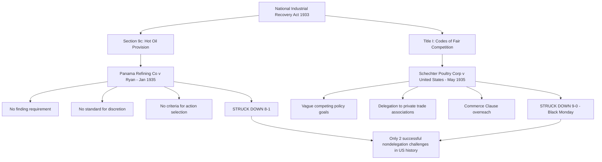

## Historical Nondelegation Cases: Panama Refining and Schechter Poultry

### Overview

*Panama Refining Co. v. Ryan* and *A.L.A. Schechter Poultry Corp. v. United States*, both decided in 1935, remain — to this day — the only two occasions on which the U.S. Supreme Court has invalidated a federal statute purely on nondelegation grounds. Decided within four months of one another, both cases struck down provisions of the National Industrial Recovery Act (NIRA), Roosevelt's centerpiece early New Deal economic recovery statute, and together they precipitated the constitutional confrontation that ultimately produced the modern administrative state's doctrinal settlement. Understanding these cases in detail is essential because they define, by negative example, the outer boundary of what constitutes an unconstitutionally standardless delegation — a boundary that, remarkably, has not been crossed by any federal statute in the nearly nine decades since.

### Background: The National Industrial Recovery Act

**Statutory Context**

The NIRA, enacted June 16, 1933, was Roosevelt's principal legislative response to industrial collapse during the Depression, designed to stabilize prices, wages, and production through government-sanctioned industry coordination that would, under ordinary circumstances, have violated antitrust law. The statute contained two operative provisions central to the subsequent nondelegation litigation:

- **§ 9(c)** — authorized the President to prohibit interstate and foreign shipment of petroleum and petroleum products produced or withdrawn in excess of state-imposed production quotas (the "hot oil" provision, addressing the collapse of oil prices caused by uncontrolled East Texas oil field production)
- **Title I, § 3** — authorized the President to approve "codes of fair competition" for particular industries, submitted by trade associations or industry groups, which upon presidential approval carried the force of law and were enforceable through criminal penalties

### Panama Refining Co. v. Ryan (1935)

**Facts**

Panama Refining Company and Amazon Petroleum Corporation, Texas oil producers and refiners, challenged the validity of regulations issued under NIRA § 9(c) prohibiting interstate shipment of "hot oil" — petroleum produced in excess of state production quotas set under state conservation laws. The companies argued that Congress had unconstitutionally delegated legislative power to the President without providing any standard to guide the decision whether, when, or how to exercise the prohibition authority.

**The Court's Analysis**

Chief Justice Charles Evans Hughes, writing for an 8-1 majority (Justice Cardozo alone dissenting), held § 9(c) unconstitutional. The Court's analysis emphasized several critical deficiencies:

- The statute contained **no finding requirement**: the President was not required to make any factual determination (e.g., that interstate shipment of excess petroleum was causing specific harm) before exercising the prohibition power
- The statute contained **no standard governing the President's discretion**: nothing in the text indicated when the prohibition power should be exercised, for how long, or under what circumstances it should be lifted
- The statute provided **no criteria for selecting among the range of possible presidential actions**: the President could prohibit shipment entirely, partially, or not at all, with the statute offering no guidance on how that choice should be made

Chief Justice Hughes emphasized that Congress had, in other NIRA provisions and elsewhere, been capable of supplying meaningful standards, making § 9(c)'s complete absence of any guiding principle particularly stark by comparison. The Court characterized the provision as leaving the President's authority "canalized within banks" of no defined boundary — effectively unconstrained legislative discretion masquerading as executive implementation.

**Cardozo's Dissent**

Justice Cardozo's lone dissent argued that the statute's broader context — including its stated purposes of eliminating "unfair competitive practices" and conserving natural resources — supplied sufficient contextual standards to guide presidential action, even absent an explicit textual formula, foreshadowing the more permissive contextual approach the Court would adopt in later delegation cases.

### A.L.A. Schechter Poultry Corp. v. United States (1935)

**Facts**

The Schechter brothers operated a kosher poultry slaughterhouse and wholesale business in Brooklyn, New York. They were prosecuted for violations of the "Live Poultry Code" — a code of fair competition for the live poultry industry in the New York metropolitan area, approved by the President under NIRA Title I authority — including violations of minimum wage and maximum hour provisions, prohibitions on "straight killing" (allowing customers to select individual birds rather than requiring purchase of an entire coop), and record-keeping requirements.

**The Court's Analysis**

Chief Justice Hughes again wrote for a unanimous Court (9-0), striking down the NIRA's code-making authority in its entirety on multiple independent grounds, with the nondelegation holding as the most doctrinally significant:

- **Absence of any intelligible principle**: The statute authorized codes to be approved so long as they were not designed to "permit monopolies" and would "effectuate the policy" of the Act — policy objectives the Court found so broad and multifaceted (including promoting industrial cooperation, eliminating unfair competition, increasing purchasing power, and reducing unemployment simultaneously) as to provide no meaningful constraint on what any particular code might contain
- **Delegation to private parties**: Unlike *Panama Refining*, which involved delegation to the President, *Schechter* involved the additional, independently significant problem that the actual code content was drafted by private industry trade associations, with the President's role limited to approval or disapproval — meaning Congress had delegated lawmaking authority not merely to the executive branch but effectively to private industry actors with obvious self-interested incentives, a delegation the Court found categorically more troubling than delegation to a politically accountable executive
- **Commerce Clause overreach**: The Court separately held that the "Live Poultry Code" as applied to Schechter's intrastate slaughterhouse operations exceeded Congress's Commerce Clause authority, since Schechter's poultry had come to permanent rest in New York before slaughter and sale, making the wage/hour/business-practice regulations at issue too attenuated from interstate commerce to fall within federal authority under then-prevailing Commerce Clause doctrine (a holding since substantially superseded by later, more expansive Commerce Clause jurisprudence, but historically significant as an independent basis for the decision)

**The "Delegation Run Riot" Characterization**

The Court's opinion famously characterized the NIRA's code-making scheme as delegation "run riot," emphasizing that virtually the entire task of defining binding legal standards for American industry had been handed to trade associations and the President with essentially no legislative guidance beyond aspirational, mutually competing policy goals incapable of resolving concrete cases.

### Political and Historical Aftermath

**"Black Monday"**

*Schechter Poultry* was decided on May 27, 1935 — a date historically remembered as **"Black Monday"** because the Court simultaneously issued several other decisions invalidating New Deal legislation, including *Louisville Joint Stock Land Bank v. Radford* (striking down the Frazier-Lemke Farm Bankruptcy Act) and *Humphrey's Executor v. United States* (limiting presidential removal power over independent agency commissioners). The convergence of these rulings on a single day crystallized the sense of direct constitutional confrontation between the Roosevelt administration and the Court.

**Roosevelt's Reaction**

Roosevelt publicly criticized the *Schechter* decision at a press conference, characterizing the Court's Commerce Clause reasoning as reflecting a "horse-and-buggy" understanding of interstate commerce inadequate to modern economic integration — rhetoric that presaged the escalating conflict culminating in the 1937 court-packing plan.

**Congressional Response**

Congress did not attempt to re-enact NIRA-style industry code authority after *Schechter*; instead, subsequent New Deal legislation (the Wagner Act, Social Security Act, and later statutes) was drafted with more carefully articulated statutory standards, reflecting at least partial legislative accommodation of the nondelegation concerns *Panama Refining* and *Schechter* had identified, even as the Court's own jurisprudence became dramatically more permissive toward delegation generally after 1937.

### Why These Cases Remain Unique

**Key Points**

- No federal statute has been invalidated purely on nondelegation grounds in the nearly nine decades since *Schechter*, despite numerous subsequent challenges to delegations containing standards considerably vaguer than anything the Court has since struck down (see *Whitman v. American Trucking Associations*, 531 U.S. 457 (2001), upholding "requisite to protect the public health").
- Modern scholars and jurists debate whether *Panama Refining* and *Schechter* represent a defensible outer limit correctly identifying genuinely standardless delegation, or whether they reflect a now-repudiated judicial hostility to New Deal economic regulation that happened to be doctrinally justified through nondelegation reasoning rather than through the *Lochner*-era substantive due process reasoning the Court was simultaneously abandoning in other contexts.
- Justice Gorsuch's dissent in *Gundy v. United States*, 588 U.S. 128 (2019), explicitly invoked both cases as models of the kind of rigorous nondelegation scrutiny he argued the Court should revive, suggesting these cases retain doctrinal relevance as templates for a potential future nondelegation revival rather than functioning merely as historical curiosities. [Inference: Whether either case would provide a workable template for a broader revival of nondelegation review, given how few modern statutes resemble the NIRA's uniquely standardless structure, is a matter of ongoing scholarly debate.]

### Comparative Case Summary

| Feature | *Panama Refining* | *Schechter Poultry* |
| --- | --- | --- |
| Provision struck down | NIRA § 9(c) ("hot oil") | NIRA Title I ("codes of fair competition") |
| Delegate | President | President + private trade associations |
| Vote | 8-1 (Cardozo dissenting) | 9-0 (unanimous) |
| Core defect | No standard for exercising prohibition power | No standard + private-party delegation + Commerce Clause overreach |
| Date decided | January 7, 1935 | May 27, 1935 ("Black Monday") |
| Subsequent status | Never overruled; distinguished in later cases | Never overruled; distinguished in later cases |

### Diagram: The Two Successful Nondelegation Challenges

### Diagram: Structural Anatomy of an Impermissible Delegation

<svg xmlns="http://www.w3.org/2000/svg" viewBox="0 0 760 340" font-family="Helvetica, Arial, sans-serif">
<text x="380" y="28" text-anchor="middle" font-size="16" font-weight="bold" fill="#1a1a1a">Why Panama Refining and Schechter Failed (svg_diagram)</text>
<rect x="40" y="60" width="330" height="230" rx="8" fill="#f7dbdb" stroke="#8a2c2c" stroke-width="2" />
<text x="205" y="85" text-anchor="middle" font-size="13" font-weight="bold" fill="#5c1212">Panama Refining (Sec 9c)</text>
<text x="70" y="115" font-size="11" fill="#5c1212">✗ No factual finding required</text>
<text x="70" y="140" font-size="11" fill="#5c1212">✗ No standard for when to act</text>
<text x="70" y="165" font-size="11" fill="#5c1212">✗ No criteria for scope of action</text>
<text x="70" y="190" font-size="11" fill="#5c1212">✗ No time limitation</text>
<text x="70" y="225" font-size="10" fill="#5c1212" font-weight="bold">Result: Unconstrained</text>
<text x="70" y="242" font-size="10" fill="#5c1212" font-weight="bold">presidential discretion</text>
<text x="70" y="265" font-size="10" fill="#5c1212">8-1, Cardozo dissenting</text>
<rect x="390" y="60" width="330" height="230" rx="8" fill="#f7e8db" stroke="#8a5d2c" stroke-width="2" />
<text x="555" y="85" text-anchor="middle" font-size="13" font-weight="bold" fill="#5c3a12">Schechter Poultry (Title I)</text>
<text x="420" y="115" font-size="11" fill="#5c3a12">✗ Vague, competing policy goals</text>
<text x="420" y="140" font-size="11" fill="#5c3a12">✗ Code content set by private industry</text>
<text x="420" y="165" font-size="11" fill="#5c3a12">✗ President's role limited to approval</text>
<text x="420" y="190" font-size="11" fill="#5c3a12">✗ Also exceeded Commerce Clause power</text>
<text x="420" y="225" font-size="10" fill="#5c3a12" font-weight="bold">Result: "Delegation run riot"</text>
<text x="420" y="248" font-size="10" fill="#5c3a12">9-0 unanimous, "Black Monday"</text>
</svg>

### Application to Administrative and Environmental Law

*Panama Refining* and *Schechter* remain useful negative benchmarks for evaluating environmental statutory delegations, even though no environmental statute has come close to replicating their standardless structure. The contrast is instructive: where NIRA § 9(c) provided no finding requirement, no standard, and no criteria for presidential action, the Clean Air Act's NAAQS provisions require EPA to base standards on "criteria" documents synthesizing the latest scientific evidence, articulate an explicit protective purpose ("requisite to protect the public health"), and undergo periodic mandatory review — structural features that, per *Whitman v. American Trucking Associations*, comfortably distinguish environmental delegations from the NIRA's defects. Similarly, unlike *Schechter*'s delegation of code-drafting authority to private trade associations, EPA's rulemaking authority remains vested in a politically accountable executive agency subject to APA notice-and-comment procedures and judicial review — addressing the private-delegation concern that formed an independent basis for the *Schechter* holding. These structural distinctions explain why, despite persistent academic and some judicial interest in reviving more robust nondelegation review (as in Justice Gorsuch's *Gundy* dissent), even a meaningfully revived nondelegation doctrine would likely leave most existing environmental statutory delegations intact, since they possess the kind of guiding standards *Panama Refining* and *Schechter* found entirely absent. [Inference: This assessment depends on the specific contours any revived nondelegation standard might take, which remains speculative absent a controlling majority opinion adopting such a standard.]

### Related Topics

- The intelligible principle test and *J.W. Hampton, Jr. & Co. v. United States*
- The 1937 constitutional crisis and the "switch in time that saved nine"
- *Whitman v. American Trucking Associations* and environmental nondelegation analysis
- Private nondelegation doctrine and delegation to non-governmental actors
- Justice Gorsuch's *Gundy v. United States* dissent
- Commerce Clause doctrine before and after the New Deal
- *Humphrey's Executor v. United States* and "Black Monday"