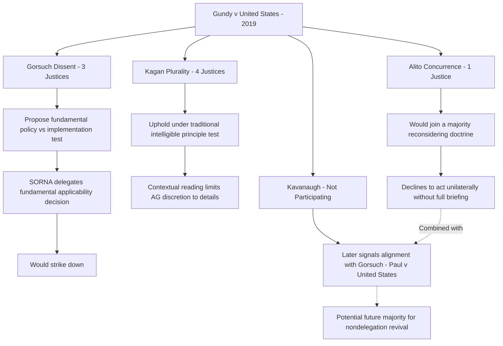

## The Modern Nondelegation Revival and Gundy v. United States

### Overview

*Gundy v. United States*, 588 U.S. 128 (2019), is the pivotal modern case testing whether the Supreme Court will revive a more robust version of the nondelegation doctrine after eight decades of near-total permissiveness following *Panama Refining* and *Schechter Poultry*. Though the challenged delegation was ultimately upheld, the case produced an unusually fractured set of opinions revealing significant judicial appetite — falling one vote short of a majority — for fundamentally reworking the intelligible principle test. *Gundy* has since become the central reference point for assessing whether, and how, the Court might constrain administrative agencies through a genuinely revived constitutional nondelegation doctrine rather than through the statutory-interpretation-based major questions doctrine that has instead become the Court's primary vehicle for delegation-related concerns.

### Factual and Statutory Background

**The Sex Offender Registration and Notification Act (SORNA)**

SORNA, enacted in 2006, established a comprehensive federal sex offender registration scheme and made it a federal crime for a covered sex offender to travel in interstate commerce and knowingly fail to register or update a registration. The statute's application to offenders convicted **before** SORNA's enactment presented an implementation challenge: applying registration requirements to the entire pre-existing population of sex offenders immediately upon enactment raised significant practical and notice concerns.

**The Delegation at Issue**

Congress addressed this problem through 34 U.S.C. § 20913(d), which delegated to the **Attorney General** the authority to "specify the applicability" of SORNA's registration requirements to offenders convicted before the Act's enactment, and to prescribe rules for their registration. The Attorney General subsequently issued an interim rule applying SORNA's registration requirements retroactively to all pre-Act offenders.

**Gundy's Prosecution**

Herman Gundy, convicted of a pre-SORNA sex offense, was subsequently prosecuted for failing to register after relocating between jurisdictions. He challenged his prosecution on the ground that § 20913(d)'s delegation to the Attorney General — determining whether, and under what conditions, SORNA would apply retroactively to the entire existing population of past offenders — violated the nondelegation doctrine by giving the Attorney General essentially unconstrained authority over the statute's most significant practical scope question.

### The Court's Fractured Decision

**The Plurality Opinion (Kagan, writing, joined by Ginsburg, Breyer, Sotomayor)**

Justice Kagan's four-justice plurality upheld the delegation under conventional intelligible principle analysis, reasoning that:

- SORNA's text, structure, and legislative history, read as a whole, indicated Congress intended the Act to apply to pre-Act offenders "as soon as feasible," with the Attorney General's delegated authority limited to resolving implementation *details* (such as scheduling and notice mechanics) rather than making the fundamental policy choice of *whether* pre-Act offenders would be covered at all
- This contextual reading brought the delegation within the traditional intelligible principle framework, since the Attorney General was not, properly understood, given open-ended discretion over the statute's basic scope, but rather narrow implementation authority to manage a practically complex transition
- The plurality emphasized that upholding this delegation was consistent with decades of precedent upholding considerably vaguer standards, and that accepting Gundy's argument would call into question a substantial swath of existing delegated authority across the federal regulatory system

**Alito's Concurrence in the Judgment**

Justice Alito provided the fifth vote to uphold the delegation but wrote separately to signal significant reservations, stating that if a majority of the Court were willing to reconsider the Court's approach to nondelegation, he would support that reconsideration — but that he was not willing to adopt a new standard unilaterally in a case where the government had reasonably relied on existing precedent. This positioning made Alito's vote contingent on institutional considerations (reliance interests, the absence of full briefing on an alternative standard) rather than a substantive endorsement of the plurality's reasoning.

**Gorsuch's Dissent (joined by Roberts and Thomas)**

Justice Gorsuch's dissent, widely regarded as the most significant and influential nondelegation opinion in decades, argued for fundamentally reworking the doctrine:

- **Critique of the intelligible principle test**: Gorsuch argued the test, as applied since 1935, had become "the abuse of one word to defeat the plain understanding of a whole clause," permitting delegations so broad that the "intelligible principle" requirement did essentially no independent constraining work
- **Proposed replacement framework**: Gorsuch proposed a reformulated test distinguishing (1) Congress's ability to delegate authority to "fill up the details" of a statutory scheme, (2) Congress's ability to make the applicability of a law contingent on executive branch fact-finding, and (3) Congress's ability to assign non-legislative responsibilities to the executive branch or courts — while insisting that Congress itself must make the "fundamental policy decisions" governing any regulatory scheme, with only implementation of that already-made policy properly delegable
- **Application to SORNA**: Under this framework, Gorsuch argued § 20913(d) impermissibly delegated to the Attorney General the fundamental policy decision of whether SORNA's registration requirements would apply retroactively at all — not merely how such an already-decided policy should be implemented — making the statute's delegation of "applicability" itself the core constitutional defect

**Kavanaugh's Non-Participation and Subsequent Signal**

Justice Kavanaugh did not participate in *Gundy* because he joined the Court after oral argument. However, in a subsequent case, *Paul v. United States* (cert. denied, 2019), Justice Kavanaugh issued a statement respecting the denial of certiorari explicitly aligning himself with Justice Gorsuch's *Gundy* dissent, stating that "Justice Gorsuch's scholarly opinion" raised important questions "that should be considered in an appropriate case." This statement effectively signaled a fifth vote for reconsidering the nondelegation doctrine, though not in a case that squarely presented the question with full participation.

### The Doctrinal Arithmetic

**Key Points**

- *Gundy* produced a 4 (uphold, Kagan plurality) – 1 (uphold but skeptical, Alito) – 3 (revive robust nondelegation, Gorsuch dissent) – 1 (not participating, Kavanaugh) split, meaning the traditional permissive standard survived only because a majority did not coalesce around a specific alternative in that particular case, not because a majority affirmatively reaffirmed the *Hampton* framework's continued vitality.
- Justice Kavanaugh's subsequent *Paul v. United States* statement suggests that, with full Court participation, a majority may exist for reconsidering nondelegation doctrine in an appropriate future case — though what specific replacement standard such a majority might adopt remains genuinely unclear, since Alito's concurrence did not commit to Gorsuch's specific framework. [Inference: The composition of the Court has changed further since 2019 (with Justices Barrett and Jackson replacing Justices Ginsburg and Breyer respectively), meaning any updated assessment of the Court's nondelegation appetite requires accounting for these subsequent changes rather than relying solely on the 2019 lineup.]
- No case squarely testing a revived nondelegation standard with full Court participation has yet produced a majority opinion adopting Gorsuch's framework, meaning *Gundy*'s ultimate practical significance to date lies primarily in its signal of latent judicial interest rather than in any binding doctrinal change.

### Why the Court Has Not (Yet) Formally Revived Nondelegation

**The Major Questions Doctrine as a Preferred Alternative**

Rather than reviving the constitutional nondelegation doctrine directly, the Court has instead developed the **major questions doctrine**, most fully articulated in *West Virginia v. EPA*, 597 U.S. 697 (2022), decided three years after *Gundy*. This doctrine achieves a functionally similar constraining effect — requiring clear congressional authorization for agency actions of vast economic and political significance — through statutory interpretation rather than constitutional invalidation, allowing the Court to address the same underlying separation-of-powers concern (agencies making transformative policy choices without clear congressional direction) without the more disruptive step of declaring delegating statutes unconstitutional. This approach offers several institutional advantages the Court may find attractive: it operates case-by-case and statute-by-statute rather than announcing a categorical constitutional rule, it avoids directly overruling the *Hampton* line of precedent, and it preserves greater judicial flexibility to calibrate the doctrine's application across different regulatory contexts. [Inference: Whether the major questions doctrine represents a durable substitute for constitutional nondelegation revival, or merely a preliminary step toward eventual more direct nondelegation doctrine revival, is a matter of ongoing scholarly speculation rather than settled understanding.]

**Institutional and Practical Considerations**

Several factors likely counsel continued judicial caution about formally reviving robust nondelegation review: the sheer breadth of existing federal regulatory authority resting on delegations at least as broad as the SORNA provision at issue in *Gundy* means a genuinely searching nondelegation standard could destabilize enormous swaths of existing law across environmental, financial, health, and safety regulation; the practical difficulty of formulating a judicially administrable standard distinguishing permissible "detail-filling" from impermissible "fundamental policy" delegation (a line Gorsuch's dissent attempts but which critics argue remains as indeterminate as the existing intelligible principle test); and the availability of the major questions doctrine as a lower-disruption alternative mechanism for addressing the specific cases of greatest concern.

### Comparative Analysis: Gorsuch's Framework Applied Hypothetically to Environmental Statutes

| Statutory Provision | Gorsuch Framework Analysis | Likely Outcome |
| --- | --- | --- |
| CAA § 109 — NAAQS "requisite to protect public health" | Congress has made the fundamental policy choice (protect public health); EPA implements via scientific/technical determination | Likely upheld even under Gorsuch's framework |
| CAA § 111 — general "best system of emission reduction" authority applied to generation-shifting (*West Virginia v. EPA* facts) | Arguably delegates the fundamental policy choice of restructuring the power sector itself | Contested; major questions doctrine already addressed this without nondelegation analysis |
| SORNA § 20913(d) — Attorney General's "applicability" authority (*Gundy* facts) | Delegates the fundamental policy choice of whether the law applies at all to a large population | Struck down under Gorsuch's framework (dissent) |

[Inference: This table represents an illustrative application of Gorsuch's proposed framework to hypothetical and actual environmental statutory provisions; it does not reflect any actual holding, since no majority opinion has adopted this framework, and actual application would depend on specific statutory text and context not fully addressed here.]

### Diagram: The Gundy Vote Breakdown

### Diagram: Gorsuch's Proposed Nondelegation Framework

<svg xmlns="http://www.w3.org/2000/svg" viewBox="0 0 760 360" font-family="Helvetica, Arial, sans-serif">
<text x="380" y="28" text-anchor="middle" font-size="16" font-weight="bold" fill="#1a1a1a">Gorsuch's Proposed Nondelegation Framework (svg_diagram)</text>
<rect x="40" y="60" width="220" height="110" rx="8" fill="#dbe9f7" stroke="#2c5d8a" stroke-width="2" />
<text x="150" y="85" text-anchor="middle" font-size="12" font-weight="bold" fill="#123a5c">1. Fill Up the Details</text>
<text x="150" y="108" text-anchor="middle" font-size="10" fill="#123a5c">Executive implements</text>
<text x="150" y="123" text-anchor="middle" font-size="10" fill="#123a5c">already-made policy</text>
<text x="150" y="145" text-anchor="middle" font-size="10" fill="#123a5c" font-weight="bold">Permissible</text>
<rect x="280" y="60" width="220" height="110" rx="8" fill="#f7e8db" stroke="#8a5d2c" stroke-width="2" />
<text x="390" y="85" text-anchor="middle" font-size="12" font-weight="bold" fill="#5c3a12">2. Contingent Fact-Finding</text>
<text x="390" y="108" text-anchor="middle" font-size="10" fill="#5c3a12">Law's applicability depends</text>
<text x="390" y="123" text-anchor="middle" font-size="10" fill="#5c3a12">on executive factual finding</text>
<text x="390" y="145" text-anchor="middle" font-size="10" fill="#5c3a12" font-weight="bold">Permissible</text>
<rect x="520" y="60" width="220" height="110" rx="8" fill="#e3f7db" stroke="#3a7a2c" stroke-width="2" />
<text x="630" y="85" text-anchor="middle" font-size="12" font-weight="bold" fill="#1e4a12">3. Non-Legislative Duties</text>
<text x="630" y="108" text-anchor="middle" font-size="10" fill="#1e4a12">Assign executive/judicial</text>
<text x="630" y="123" text-anchor="middle" font-size="10" fill="#1e4a12">tasks unrelated to lawmaking</text>
<text x="630" y="145" text-anchor="middle" font-size="10" fill="#1e4a12" font-weight="bold">Permissible</text>
<rect x="180" y="210" width="400" height="120" rx="8" fill="#f7dbdb" stroke="#8a2c2c" stroke-width="2" />
<text x="380" y="235" text-anchor="middle" font-size="12" font-weight="bold" fill="#5c1212">4. Fundamental Policy Decision</text>
<text x="380" y="258" text-anchor="middle" font-size="10" fill="#5c1212">Whether/what conduct is regulated,</text>
<text x="380" y="275" text-anchor="middle" font-size="10" fill="#5c1212">not merely how it is implemented</text>
<text x="380" y="298" text-anchor="middle" font-size="11" fill="#5c1212" font-weight="bold">Impermissible — must be made by Congress</text>
<text x="380" y="315" text-anchor="middle" font-size="10" fill="#5c1212">(SORNA's applicability delegation, per Gorsuch)</text>
</svg>

### Application to Administrative and Environmental Law

*Gundy*'s significance for environmental law lies primarily in its signal value rather than any immediate doctrinal change: because no environmental statute has yet been directly tested under Gorsuch's proposed framework, EPA and other environmental agencies continue to operate under the traditional, highly permissive intelligible principle standard confirmed for environmental delegations specifically in *Whitman v. American Trucking Associations*. However, *Gundy*'s revelation of latent judicial appetite for a more robust standard — combined with Justice Kavanaugh's subsequent alignment with Gorsuch's position — means environmental practitioners must treat the current permissive nondelegation landscape as potentially less stable than its eight-decade track record might suggest. In practice, the Court's subsequent development of the major questions doctrine in *West Virginia v. EPA* suggests the Court has, at least for now, chosen to address nondelegation-adjacent concerns about major environmental rulemaking through statutory interpretation rather than through a *Gundy*-style constitutional nondelegation revival — meaning environmental statutes with genuinely narrow or well-specified delegations (like the Clean Air Act's NAAQS provisions) likely remain secure, while agency reliance on older, more general statutory provisions to support novel, economically transformative regulatory initiatives faces the more immediate and currently operative risk of major-questions-doctrine invalidation rather than nondelegation invalidation. [Inference: This assessment reflects the doctrinal landscape as of the current knowledge cutoff and could shift with future Supreme Court decisions squarely addressing nondelegation doctrine.]

### Related Topics

- The intelligible principle test and its historical development
- The major questions doctrine and *West Virginia v. EPA*
- Justice Gorsuch's judicial philosophy and formalist administrative law jurisprudence
- *Panama Refining* and *Schechter Poultry* as historical nondelegation templates
- *Whitman v. American Trucking Associations* and environmental nondelegation analysis
- Changes in Supreme Court composition and their effect on administrative law doctrine
- The private nondelegation doctrine and delegation to non-governmental actors