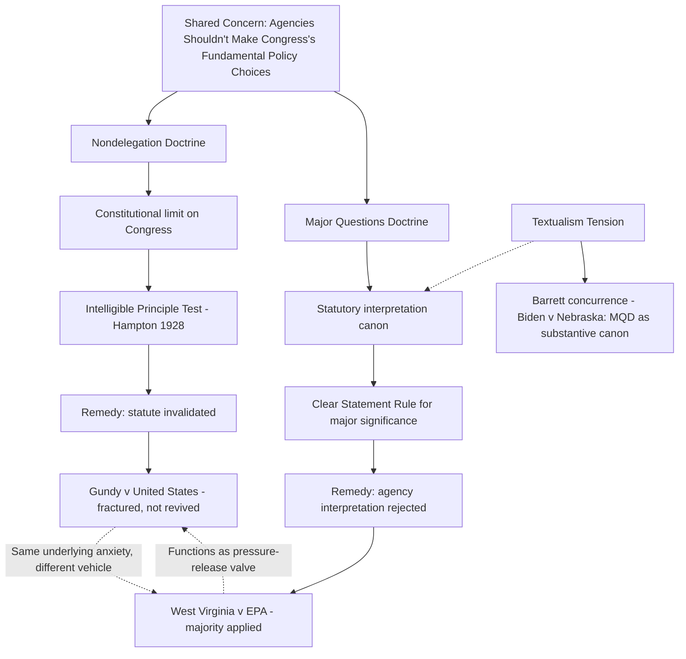

## Overlap Between Nondelegation and the Major Questions Doctrine

### Overview

The relationship between the constitutional nondelegation doctrine and the major questions doctrine (MQD) is one of the most analytically contested topics in contemporary administrative law. Both doctrines address a common underlying concern — that agencies should not exercise transformative lawmaking authority without clear congressional authorization — yet they operate through entirely different legal mechanisms: nondelegation is a *constitutional* doctrine invalidating statutes that fail to supply an intelligible principle, while the major questions doctrine is a *statutory interpretation* canon that narrows the reading of otherwise valid statutes without declaring them unconstitutional. Understanding precisely how these doctrines overlap, diverge, and interact is essential for predicting how courts will treat ambitious agency rulemaking, particularly in environmental law, where both doctrines have been invoked in the same high-profile litigation.

### The Nondelegation Doctrine: A Brief Recap

The nondelegation doctrine derives from Article I, § 1's vesting of "All legislative Powers" exclusively in Congress, and asks whether a given statutory delegation supplies an **"intelligible principle"** sufficient to constrain executive discretion (*J.W. Hampton, Jr. & Co. v. United States*, 276 U.S. 394 (1928)). A successful nondelegation challenge results in the delegating statute being declared **unconstitutional** — the most severe remedy available, and one the Court has applied only twice, in *Panama Refining Co. v. Ryan*, 293 U.S. 388 (1935), and *A.L.A. Schechter Poultry Corp. v. United States*, 295 U.S. 495 (1935).

### The Major Questions Doctrine: A Brief Recap

The major questions doctrine, most fully crystallized in *West Virginia v. EPA*, 597 U.S. 697 (2022), holds that courts should not defer to or uphold an agency's assertion of regulatory authority over a matter of **vast economic and political significance** unless Congress has **clearly authorized** that specific exercise of authority. A successful MQD challenge results in the agency's **interpretation of the statute** being rejected as impermissible — the underlying statute itself remains valid and constitutional; the agency has simply been held to have misread its own authority under that statute.

### Points of Convergence

**Shared Underlying Concern**

Both doctrines are animated by the same foundational separation-of-powers anxiety: that Congress, as the constitutionally designated policy-making body, should make the fundamental, high-stakes choices governing American economic and social life, rather than leaving those choices to unelected agency officials interpreting ambiguous or general statutory text. Justice Gorsuch's concurrence in *West Virginia v. EPA* explicitly framed the major questions doctrine in nondelegation-adjacent terms, describing it as one of several doctrines that "help courts identify these cases and ensure that we do not defer to a delegation of legislative power that hasn't happened."

**The "Nondelegation Canon" Characterization**

A substantial body of scholarship (including analysis by Cass Sunstein and others) characterizes the major questions doctrine as a **"nondelegation canon"** — an interpretive presumption motivated by nondelegation values but operating at the sub-constitutional level of statutory construction. On this view, the MQD achieves much of the practical work a revived constitutional nondelegation doctrine might accomplish (preventing agencies from claiming transformative authority based on thin textual hooks) while avoiding the more disruptive step of declaring the underlying statute unconstitutional, thereby preserving greater institutional flexibility and avoiding wholesale invalidation of long-standing regulatory frameworks.

**Same Triggering Fact Patterns**

Cases invoking either doctrine frequently share a common structural fact pattern: an agency asserts authority to regulate a matter of significant economic or political consequence based on a general, decades-old, or previously little-used statutory provision, where the specific regulatory action at issue was not clearly contemplated by Congress at the time of enactment. Both *Gundy v. United States*, 588 U.S. 128 (2019) (nondelegation), and *West Virginia v. EPA* (major questions) involve exactly this pattern — an agency relying on broadly worded delegated authority to resolve a question of substantial practical consequence.

### Points of Divergence

**Constitutional versus Statutory Nature**

The most fundamental distinction is remedial and doctrinal in character: nondelegation is a constitutional limit on **Congress's power to delegate**, while the major questions doctrine is an interpretive canon constraining **how courts read what Congress delegated**. This distinction has significant practical consequences — a successful nondelegation challenge permanently invalidates the statutory provision (absent constitutional amendment), while a successful MQD challenge leaves Congress free to simply legislate more clearly and reauthorize the same agency action through express statutory language, without any constitutional obstacle.

**Object of Analysis**

Nondelegation analysis focuses on the **statute as written** — does the delegating provision itself supply an intelligible principle, evaluated largely without regard to how the agency has actually used the delegated authority in a specific case. Major questions doctrine analysis focuses on the **agency's specific assertion of authority** in a particular case — even a statute containing a perfectly adequate intelligible principle for ordinary applications might fail the major questions doctrine as applied to a specific, unusually transformative exercise of that same authority.

**Threshold Triggering Standard**

Nondelegation doctrine, as traditionally applied, evaluates *any* delegation against the intelligible principle standard, regardless of the delegation's practical stakes — even a low-stakes regulatory matter could theoretically raise nondelegation concerns if the statute supplies no guiding standard whatsoever. The major questions doctrine, by contrast, is explicitly and self-consciously reserved for cases of **"vast economic and political significance"** — the doctrine does not apply to ordinary, low-stakes agency rulemaking even under ambiguous statutory authority, making it narrower in scope of application even as it may be more readily triggered within its applicable domain.

**Judicial Comfort Level**

Courts have shown far greater willingness to apply the major questions doctrine than to revive nondelegation doctrine directly. *West Virginia v. EPA* commanded a six-justice majority applying the MQD to invalidate EPA's Clean Power Plan-style generation-shifting authority, while *Gundy*'s nondelegation challenge fell one vote short of a majority even with a comparably sympathetic fact pattern — suggesting the Court currently finds the statutory-interpretation-based MQD a more institutionally comfortable vehicle than constitutional nondelegation invalidation for addressing similar underlying separation-of-powers concerns.

### The Textualism Tension

**An Internal Doctrinal Puzzle**

A notable analytical tension exists between the major questions doctrine and textualist statutory interpretation methodology, which several justices in the MQD's majority coalition (including Justice Gorsuch) otherwise champion. Ordinary textualism asks what a statute's text means according to its ordinary public meaning at enactment, without regard to the "significance" of the resulting interpretation. The major questions doctrine, by contrast, explicitly directs courts to interpret statutory text more narrowly *because* the resulting agency action would be economically or politically significant — an approach in some tension with strict textualist methodology, since it makes the "correct" interpretation of identical statutory text contingent on the real-world stakes of its application rather than solely on textual meaning. Justice Barrett's concurrence in *Biden v. Nebraska*, 600 U.S. 477 (2023) (a student loan forgiveness case applying MQD-adjacent reasoning), explicitly grappled with this tension, characterizing the major questions doctrine as a **substantive canon** justified by nondelegation-adjacent constitutional values that legitimately supplements ordinary textual analysis rather than displacing it. [Inference: Whether this reconciliation of the major questions doctrine with textualist methodology is fully persuasive remains a matter of active scholarly debate, including criticism from justices and scholars who view the doctrine as insufficiently grounded in either pure textualism or a clearly articulated constitutional principle.]

### Practical Sequencing in Litigation

**Key Points**

- Litigants challenging ambitious agency action frequently raise **both** doctrines in the same case, presenting the major questions doctrine as the primary, more readily available argument and nondelegation as a secondary or fallback constitutional argument, reflecting the courts' demonstrated greater comfort with the former.
- Because a successful major questions doctrine challenge is narrower in remedial consequence (rejecting only the agency's interpretation, not the statute itself) and requires no revision of existing nondelegation precedent, courts have strong institutional incentives to resolve cases on MQD grounds where possible, leaving the harder constitutional nondelegation question unaddressed — a pattern visible in *West Virginia v. EPA* itself, which was resolved entirely on MQD/statutory grounds without reaching Justice Gorsuch's separate nondelegation-focused concurrence.
- This sequencing pattern means the major questions doctrine may be functioning, in practice, as a doctrinal "pressure release valve" that reduces the felt necessity for the Court to formally revive constitutional nondelegation doctrine, potentially explaining why *Gundy*'s momentum toward nondelegation revival has not, as of this writing, been followed up with a squarely presented case forcing full resolution of that question.

### Comparative Summary Table

| Feature | Nondelegation Doctrine | Major Questions Doctrine |
| --- | --- | --- |
| Legal nature | Constitutional | Statutory interpretation canon |
| What is invalidated | The delegating statute | The agency's interpretation |
| Congress's remedy after loss | None (absent constitutional amendment) | Legislate more clearly |
| Trigger | Any delegation lacking intelligible principle | Only "vast economic/political significance" matters |
| Focus of analysis | The statute as written | The specific agency action asserted |
| Leading modern case | *Gundy v. United States* (2019) | *West Virginia v. EPA* (2022) |
| Current judicial traction | Fractured, not (yet) revived | Actively and repeatedly applied |

### Diagram: Doctrinal Relationship Map

### Diagram: The Two-Track Judicial Response

<svg xmlns="http://www.w3.org/2000/svg" viewBox="0 0 760 360" font-family="Helvetica, Arial, sans-serif">
<text x="380" y="28" text-anchor="middle" font-size="16" font-weight="bold" fill="#1a1a1a">Two Tracks for the Same Underlying Concern (svg_diagram)</text>

<text x="380" y="55" text-anchor="middle" font-size="12" fill="#444">Agency claims transformative authority under ambiguous/old statute</text>

<line x1="380" y1="65" x2="200" y2="100" stroke="#333" stroke-width="2" />
<line x1="380" y1="65" x2="560" y2="100" stroke="#333" stroke-width="2" />
<rect x="60" y="100" width="280" height="160" rx="8" fill="#f7dbdb" stroke="#8a2c2c" stroke-width="2" />
<text x="200" y="125" text-anchor="middle" font-size="13" font-weight="bold" fill="#5c1212">Track 1: Nondelegation</text>
<text x="200" y="148" text-anchor="middle" font-size="10" fill="#5c1212">Challenge the statute itself</text>
<text x="200" y="165" text-anchor="middle" font-size="10" fill="#5c1212">as lacking intelligible principle</text>
<text x="200" y="190" text-anchor="middle" font-size="10" fill="#5c1212" font-weight="bold">Outcome if successful:</text>
<text x="200" y="208" text-anchor="middle" font-size="10" fill="#5c1212">Statute unconstitutional</text>
<text x="200" y="225" text-anchor="middle" font-size="10" fill="#5c1212">(permanent, absent amendment)</text>
<text x="200" y="245" text-anchor="middle" font-size="10" fill="#5c1212" font-weight="bold">Rarely successful (2 cases ever)</text>
<rect x="420" y="100" width="280" height="160" rx="8" fill="#e3f7db" stroke="#3a7a2c" stroke-width="2" />
<text x="560" y="125" text-anchor="middle" font-size="13" font-weight="bold" fill="#1e4a12">Track 2: Major Questions</text>
<text x="560" y="148" text-anchor="middle" font-size="10" fill="#1e4a12">Challenge the agency's reading</text>
<text x="560" y="165" text-anchor="middle" font-size="10" fill="#1e4a12">of an otherwise-valid statute</text>
<text x="560" y="190" text-anchor="middle" font-size="10" fill="#1e4a12" font-weight="bold">Outcome if successful:</text>
<text x="560" y="208" text-anchor="middle" font-size="10" fill="#1e4a12">Agency interpretation rejected</text>
<text x="560" y="225" text-anchor="middle" font-size="10" fill="#1e4a12">(Congress can legislate more clearly)</text>
<text x="560" y="245" text-anchor="middle" font-size="10" fill="#1e4a12" font-weight="bold">Currently the preferred vehicle</text>
</svg>

### Application to Administrative and Environmental Law

*West Virginia v. EPA* is the paradigmatic case illustrating this doctrinal overlap in the environmental context. EPA's Clean Power Plan relied on Clean Air Act § 111(d) — a provision with a long history of narrow, source-specific application — to require system-wide "generation-shifting" away from coal-fired power toward renewable and natural gas generation, a regulatory approach with sweeping economic consequences for the entire power sector. Litigants and several justices could plausibly have framed this as either a nondelegation problem (§ 111(d)'s "best system of emission reduction" language arguably supplies no meaningful principle constraining EPA's authority to restructure an entire industry) or a major questions problem (even if § 111(d) supplies an adequate intelligible principle for ordinary source-specific regulation, its application to generation-shifting exceeds what Congress clearly authorized). The majority opinion resolved the case entirely on major questions grounds, while Justice Gorsuch's separate concurrence (joined by Justice Alito) explicitly grounded the outcome more directly in nondelegation-adjacent constitutional values, reflecting exactly the sequencing pattern described above — the Court reached the narrower, less disruptive holding while leaving the harder constitutional question latent. This pattern strongly suggests that future ambitious EPA rulemaking relying on general or long-dormant statutory authority (for example, expansive use of Clean Water Act "waters of the United States" authority, or novel applications of Toxic Substances Control Act authority to emerging chemical classes) will likely face major questions doctrine challenges as the primary litigation vehicle, with nondelegation arguments available as a secondary, more constitutionally ambitious fallback argument that courts are less likely to reach or resolve.

### Related Topics

- The major questions doctrine and *West Virginia v. EPA*
- The intelligible principle test and its post-1937 permissiveness
- *Gundy v. United States* and the modern nondelegation revival
- Textualism and substantive canons of statutory interpretation
- *Biden v. Nebraska* and Justice Barrett's concurrence on the MQD's doctrinal status
- Clean Air Act § 111(d) and the Clean Power Plan litigation history
- Justice Gorsuch's separate writings connecting nondelegation and major questions analysis