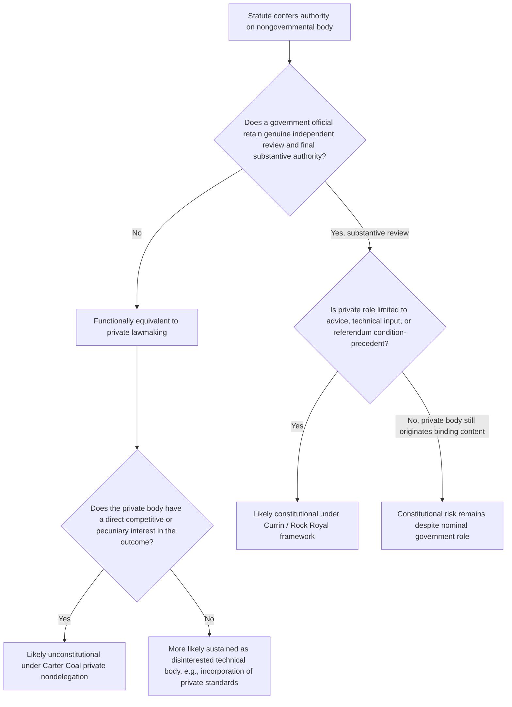

## Private Nondelegation and Delegation to Nongovernmental Bodies

### Overview

The private nondelegation doctrine restricts Congress's ability to confer regulatory or lawmaking authority upon private, nongovernmental entities. It is a distinct constitutional limitation from the traditional nondelegation doctrine, which governs delegations from Congress to executive agencies. While the traditional nondelegation doctrine is analyzed under the "intelligible principle" standard, private delegations trigger heightened scrutiny because private actors are not politically accountable, are not bound by constitutional structural safeguards (such as the Appointments Clause or presidential oversight), and often have direct pecuniary or competitive interests in the rules they would be empowered to make.

### Constitutional Basis

**Key Points**

- Rooted in Article I, Section 1's vesting of "all legislative Powers" in Congress, and derivatively in Article II's vesting of executive power in the President.
- Private nondelegation is sometimes described as a structural due process concern, implicating the Fifth Amendment when private parties with a competitive stake are given regulatory power over their rivals.
- Distinguished from the *Schechter Poultry* / *Panama Refining* line of cases, which addressed delegations to the President without adequate standards; private nondelegation cases ask whether the delegate is even a permissible recipient of power, independent of how much standard-setting guidance accompanies it.

### Foundational Case Law

#### Carter v. Carter Coal Co. (1936)

The seminal private nondelegation case. The Bituminous Coal Conservation Act authorized a majority of coal producers and miners in a district to set maximum hours and minimum wages binding on the entire district, including nonconsenting producers.

**Key Points**

- The Supreme Court held this delegation unconstitutional because it permitted private parties with a direct economic interest to impose regulations on competitors.
- Justice Sutherland's majority opinion characterized this as "legislative delegation in its most obnoxious form," since it was not even delegation to an official or an agency but to private persons whose interests were often adverse to those regulated.
- The opinion drew a sharp distinction: delegation to a *disinterested* administrative body applying expertise is categorically different from delegation to a self-interested private faction.

#### A.L.A. Schechter Poultry Corp. v. United States (1935)

Though primarily a traditional nondelegation case, *Schechter* is often read alongside *Carter Coal* because the "codes of fair competition" under the National Industrial Recovery Act were substantially drafted by trade and industry associations before presidential approval, blending private-drafting concerns with intelligible-principle concerns.

#### Currin v. Wallace (1939) and United States v. Rock Royal Co-Operative (1939)

These cases narrowed *Carter Coal* by upholding schemes in which private producer approval (via referendum) was required as a *condition* for a government-set regulation to take effect, rather than the private parties themselves setting the substantive rule.

**Key Points**

- The Court distinguished "conditioning the operation of law" on a private group's assent (permissible) from vesting the private group with the power to *make* the law's content (impermissible under *Carter Coal*).
- This condition-precedent theory remains the primary doctrinal tool for reconciling private involvement in regulation with the nondelegation limits.

#### Association of American Railroads v. Department of Transportation (Amtrak Case) (D.C. Cir. 2013; vacated and remanded, 2015)

Arose from the Passenger Rail Investment and Improvement Act (PRIIA), which directed Amtrak and the Federal Railroad Administration (FRA) to jointly develop performance standards for freight railroads, enforceable against Amtrak's competitors and business partners.

**Key Points**

- The D.C. Circuit (2013) initially held that Amtrak, though nominally a corporation, was effectively a private entity with a competitive interest, and that joint rulemaking authority over its competitors violated private nondelegation principles under *Carter Coal*.
- The Supreme Court (2015, *Department of Transportation v. Association of American Railroads*) unanimously reversed on statutory grounds, holding Amtrak is a governmental entity for purposes of the statute (not a private corporation) given its structure, government funding, and public mission — sidestepping the constitutional private nondelegation question.
- On remand, the D.C. Circuit invalidated the standards on a *different* constitutional ground: Amtrak's role in drafting binding standards, combined with an arbitration mechanism in which a private arbitrator resolved disputes between Amtrak and FRA, violated due process and separation-of-powers principles because Amtrak (a competitor) exercised regulatory power without adequate presidential control, distinguishing this from a pure private-delegation holding.
- Justice Alito's concurrence in the Supreme Court decision is frequently cited for a broader theoretical framework: that entities exercising governmental power must be subject to Appointments Clause and presidential removal-power constraints regardless of formal labels like "corporation" versus "agency," and that Congress cannot evade constitutional structure through creative institutional labeling. [Inference: lower courts and commentators treat this concurrence as influential, though it is not binding majority doctrine.]

### Doctrinal Framework: When Is Delegation to a Nongovernmental Body Permissible?

**Key Points**

1. **Advisory/Consultative Role** — A private body may recommend, study, or advise without directly binding regulated parties; final legal authority must rest with a public official or agency exercising independent judgment.
2. **Condition-Precedent (Referendum) Model** — A private group's approval or disapproval can trigger or withhold the *operation* of a pre-set governmental rule (as in *Currin* and *Rock Royal*), but the private group cannot originate the substantive content of the rule.
3. **Government Ratification/Independent Review** — If a government official retains genuine, non-perfunctory authority to review, modify, reject, or approve private recommendations, the delegation is more likely sustained. Mere rubber-stamping is treated as functionally equivalent to unconditional private lawmaking.
4. **Disinterestedness** — Even where private parties are involved, if they lack a direct competitive or pecuniary stake in the outcome (e.g., a genuinely neutral standard-setting body), courts are more permissive, echoing *Carter Coal*'s emphasis on self-interest as the constitutional vice.
5. **Self-Regulatory Organizations (SROs)** — Entities like FINRA (financial industry) operate under a hybrid model: they promulgate rules, but SEC approval, oversight, and enforcement power are required, and SRO rules are treated as subject to full agency-like review; courts have generally upheld this structure by emphasizing pervasive federal oversight.

### Related Doctrines and Distinctions

#### Traditional (Public) Nondelegation Doctrine

- Governs delegations *to executive agencies or the President*.
- Analyzed under the intelligible principle test from *J.W. Hampton, Jr. & Co. v. United States* (1928): a delegation is valid if Congress lays down "an intelligible principle to which the person or body authorized to act is directed to conform."
- Virtually all modern delegations to agencies survive this test (only *Panama Refining* and *Schechter Poultry* have ever been struck down on it), making private nondelegation the doctrinally "sharper" tool where private actors are involved.

#### Major Questions Doctrine

- A separate, textually and functionally distinct canon requiring clear congressional authorization for agency actions of vast economic and political significance.
- Applies to *agency* action, not private delegation, but is often discussed alongside private nondelegation in broader debates about administrative state accountability. [Inference: some scholars argue the major questions doctrine has functionally displaced nondelegation as the Court's primary tool for policing delegations, but this is a contested characterization rather than settled doctrine.]

#### Appointments Clause and Removal Power

- Private nondelegation overlaps with Appointments Clause concerns when a nongovernmental actor exercises "significant authority pursuant to the laws of the United States" (the *Buckley v. Valeo* test for who must be an "Officer of the United States").
- If a private party's role is deemed to constitute exercise of significant federal authority, that party may need to be appointed consistent with Article II, Section 2 — an independent constitutional defect apart from private nondelegation itself.

### Environmental and Administrative Law Applications

**Key Points**

- **Incorporation by reference of private standards**: Agencies routinely incorporate technical standards developed by private standard-setting organizations (e.g., ASTM International, NFPA, ANSI) into binding regulations under EPA, OSHA, and similar statutes. This is generally upheld because:
  - The agency, not the private body, exercises final judgment to adopt, amend, or reject the standard through notice-and-comment rulemaking.
  - The private body does not directly enforce the standard against regulated parties; the agency does.
  - Courts distinguish "borrowing" technical expertise (permissible) from "delegating" lawmaking power (impermissible).
- **Renewable Fuel Standard / industry-set benchmarks**: Statutory schemes that rely on industry-reported data or industry consensus figures (e.g., certain agricultural marketing order mechanisms) are analyzed under the *Currin*/*Rock Royal* condition-precedent framework.
- **Utility ratemaking and interstate compacts**: Some rate-setting bodies blend private stakeholder input with public utility commission final authority; challenges typically focus on whether the commission's review is substantive or merely formal.
- **Climate and cap-and-trade verification bodies**: Third-party verifiers (e.g., for carbon offset credits under state or federal programs) generally perform technical verification rather than binding legal determinations, keeping them outside the core private-delegation concern, though this remains an area of live litigation and scholarly attention. [Unverified: the constitutional status of private carbon-credit verifiers has not been squarely adjudicated by federal appellate courts as of this writing.]

### Illustrative Hypothetical Analysis

**Example**

*Statute*: A federal environmental statute authorizes an industry trade association of chemical manufacturers to set binding maximum emission thresholds for all manufacturers in the sector, with EPA authority limited to publishing the association's determination in the Federal Register.

*Analysis*:

- This resembles *Carter Coal* precisely: a self-interested private trade association (competitors of the regulated parties) sets binding substantive standards.
- EPA's role (mere publication) is not genuine independent review — it is perfunctory, similar to the invalid scheme in *Carter Coal* and distinguishable from the valid referendum model in *Currin*.
- **Conclusion**: This delegation would likely be held unconstitutional under the private nondelegation doctrine because (1) the delegate is a private, non-accountable body; (2) the delegate has a direct competitive/economic interest; and (3) the agency retains no substantive check on the delegate's determination.

*Contrast*: If the statute instead required EPA to independently review, and have authority to reject or modify, any association-proposed threshold before it takes legal effect — with EPA bearing ultimate responsibility for the substantive judgment — the scheme would likely survive, as EPA (not the private association) would be exercising the actual regulatory judgment.

### Diagram: Private Delegation Analysis Flow

### Structural Diagram: Actors and Accountability

<svg xmlns="http://www.w3.org/2000/svg" viewBox="0 0 760 420">
<text x="380" y="28" font-size="16" font-weight="bold" text-anchor="middle" fill="#1a1a1a">Private Nondelegation: Accountability Structure (svg_diagram)</text>
<rect x="30" y="60" width="220" height="90" rx="8" fill="#dbeafe" stroke="#1e40af" stroke-width="1.5" />
<text x="140" y="90" font-size="13" font-weight="bold" text-anchor="middle" fill="#1e3a8a">Congress</text>
<text x="140" y="110" font-size="11" text-anchor="middle" fill="#1e3a8a">Article I, Sec. 1</text>
<text x="140" y="126" font-size="11" text-anchor="middle" fill="#1e3a8a">Vests legislative power</text>
<rect x="290" y="60" width="220" height="90" rx="8" fill="#dcfce7" stroke="#166534" stroke-width="1.5" />
<text x="400" y="90" font-size="13" font-weight="bold" text-anchor="middle" fill="#14532d">Executive Agency</text>
<text x="400" y="110" font-size="11" text-anchor="middle" fill="#14532d">Appointed, removable</text>
<text x="400" y="126" font-size="11" text-anchor="middle" fill="#14532d">Politically accountable</text>
<rect x="550" y="60" width="180" height="90" rx="8" fill="#fee2e2" stroke="#991b1b" stroke-width="1.5" />
<text x="640" y="90" font-size="13" font-weight="bold" text-anchor="middle" fill="#7f1d1d">Private Body</text>
<text x="640" y="110" font-size="11" text-anchor="middle" fill="#7f1d1d">Unelected, unappointed</text>
<text x="640" y="126" font-size="11" text-anchor="middle" fill="#7f1d1d">Often self-interested</text>
<line x1="140" y1="150" x2="140" y2="200" stroke="#1e40af" stroke-width="2" marker-end="url(#arrow1)" />
<line x1="250" y1="105" x2="290" y2="105" stroke="#1a1a1a" stroke-width="2" marker-end="url(#arrow1)" />
<text x="270" y="95" font-size="10" text-anchor="middle">valid</text>
<line x1="250" y1="130" x2="550" y2="130" stroke="#991b1b" stroke-width="2" stroke-dasharray="6,4" marker-end="url(#arrow2)" />
<text x="400" y="150" font-size="10" text-anchor="middle" fill="#991b1b">direct delegation: suspect (Carter Coal)</text>
<rect x="30" y="220" width="700" height="150" rx="8" fill="#f9fafb" stroke="#6b7280" stroke-width="1" />
<text x="380" y="245" font-size="13" font-weight="bold" text-anchor="middle" fill="#1a1a1a">Permissible Pathway</text>
<text x="60" y="270" font-size="11" fill="#1a1a1a">1. Private body advises or proposes (technical input, industry data, referendum)</text>
<text x="60" y="295" font-size="11" fill="#1a1a1a">2. Agency exercises independent, substantive review — not perfunctory ratification</text>
<text x="60" y="320" font-size="11" fill="#1a1a1a">3. Agency, not private body, issues final binding rule and bears enforcement authority</text>
<text x="60" y="345" font-size="11" fill="#1a1a1a">4. Private body lacks unchecked authority over disinterested or competing parties</text>
</svg>

### Contemporary Significance and Scholarly Debate

**Key Points**

- Private nondelegation has experienced renewed academic and judicial interest as part of a broader revival of nondelegation-adjacent doctrines (major questions doctrine, *Gundy v. United States* (2019) dissents by Justices Gorsuch, Thomas, and Alito calling for reinvigorated nondelegation review).
- [Speculation] Some commentators anticipate that a reinvigorated general nondelegation doctrine could extend or merge with private nondelegation principles, particularly in cases involving public-private partnerships in environmental certification, standard-setting, and market-based regulatory mechanisms (e.g., cap-and-trade registries, ESG disclosure frameworks). This remains an area of doctrinal uncertainty rather than settled law.
- The doctrine remains narrow in practical application: *Carter Coal* has rarely been the sole basis for invalidating a federal statute since 1936, and most disputes are resolved either through statutory interpretation (as in the Amtrak case) or through Appointments Clause/removal-power analysis rather than pure private nondelegation holdings.

### Practice Pointers for Analysis

**Next Steps**

- Identify whether the challenged actor is truly "private" or functionally governmental (examine funding source, control structure, and statutory characterization, as in the Amtrak litigation).
- Determine whether the private actor's role is advisory, condition-precedent, or directly rule-making.
- Assess whether the private actor has a competitive or pecuniary stake in the substantive outcome.
- Examine whether a government official retains genuine, non-perfunctory final authority.
- Consider whether Appointments Clause or removal-power theories provide an alternative or additional basis for challenge.
- Review the specific enabling statute's incorporation-by-reference provisions for technical standards, and confirm the agency's independent notice-and-comment adoption process.

**Related Topics**

- Traditional nondelegation doctrine and the intelligible principle standard (*J.W. Hampton*, *Whitman v. American Trucking Associations*)
- Major questions doctrine (*West Virginia v. EPA*, *Biden v. Nebraska*)
- Appointments Clause and "Officer of the United States" analysis (*Buckley v. Valeo*, *Lucia v. SEC*)
- Removal power and independent agency accountability (*Free Enterprise Fund v. PCAOB*, *Seila Law v. CFPB*)
- Self-regulatory organizations and SEC oversight of FINRA
- Incorporation by reference of private technical standards under the Administrative Procedure Act and OMB Circular A-119
- Public-private partnerships in environmental certification and carbon markets
- Due process limits on economically self-interested decisionmakers (*Gibson v. Berryhill*)