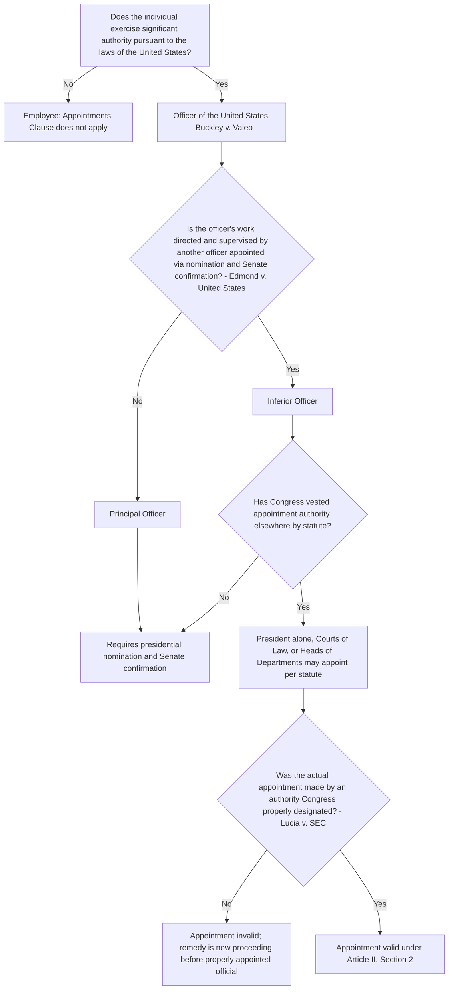

## The Appointments Clause: Principal Officers, Inferior Officers, and Employees

### Overview

The Appointments Clause, Article II, Section 2, Clause 2, governs how individuals who exercise significant federal governmental authority may be selected. It establishes a tiered structure: principal officers must be nominated by the President and confirmed by the Senate; inferior officers may be appointed by the President alone, courts of law, or heads of departments if Congress so provides by statute; and mere employees fall outside the Clause entirely. The doctrine is central to separation-of-powers analysis because it ensures accountability runs through the President (and, for principal officers, the Senate) for anyone wielding "significant authority pursuant to the laws of the United States."

### Constitutional Text

> "[The President] shall nominate, and by and with the Advice and Consent of the Senate, shall appoint Ambassadors, other public Ministers and Consuls, Judges of the supreme Court, and all other Officers of the United States, whose Appointments are not herein otherwise provided for, and which shall be established by Law: but the Congress may by Law vest the Appointment of such inferior Officers, as they think proper, in the President alone, in the Courts of Law, or in the Heads of Departments."

**Key Points**

- Creates a default rule (principal officer appointment via nomination and Senate confirmation) and a congressionally-electable exception (inferior officer appointment via one of three alternative methods).
- The "Excepting Clause" (vesting inferior officer appointment power elsewhere) operates only if Congress affirmatively legislates it; absent such a statute, inferior officers default to the standard nomination-and-confirmation process.
- Applies only to "Officers of the United States" — a term of art excluding mere employees.

### The Three-Tier Framework

#### Tier 1: Principal Officers

- Must be appointed through presidential nomination and Senate confirmation (advice and consent).
- Examples: Cabinet secretaries, agency heads such as the EPA Administrator, heads of independent agencies, federal appellate and district judges, U.S. Attorneys, ambassadors.
- Defining characteristic: not subordinate to (i.e., not directed and supervised by) another executive branch official other than the President himself.

#### Tier 2: Inferior Officers

- May be appointed by the President alone, by courts of law, or by heads of departments, if Congress vests that appointment power by statute.
- Defining characteristics (from *Edmond v. United States*, 1997): an inferior officer's work is directed and supervised at some level by an officer below the President who was appointed by presidential nomination and Senate confirmation.
- Examples: administrative law judges (subject to *Lucia* analysis below), members of the Public Company Accounting Oversight Board (subject to Free Enterprise Fund's removal analysis), military judges, independent counsel under the (lapsed) Ethics in Government Act as analyzed in *Morrison v. Olson*.

#### Tier 3: Employees

- Individuals who exercise no "significant authority pursuant to the laws of the United States" fall outside the Appointments Clause altogether.
- Their hiring is not constitutionally regulated by Article II, Section 2, and is instead governed by ordinary statutory personnel authority (e.g., civil service laws).
- Examples: staff attorneys without final decision-making authority, clerical personnel, most career civil servants performing non-discretionary functions.

### Defining "Officer of the United States": Buckley v. Valeo (1976)

Arose from a challenge to the Federal Election Commission's structure, where some commissioners were appointed by congressional leadership rather than the President.

**Key Points**

- The Court held that any person exercising "significant authority pursuant to the laws of the United States" is an "Officer of the United States" and must be appointed consistent with the Appointments Clause.
- FEC commissioners exercising rulemaking, enforcement, and adjudicatory power were officers; because some were appointed by the Speaker of the House and President pro tempore of the Senate rather than through Article II appointment, that structure was held unconstitutional.
- Established the foundational "significant authority" test that persists today, though the Court has never articulated a fully determinate line for what quantum of authority is "significant."

### Distinguishing Principal from Inferior Officers: Edmond v. United States (1997)

Concerned whether Coast Guard Court of Criminal Appeals judges, appointed by the Secretary of Transportation, were inferior officers (permitting that appointment method) or principal officers (requiring Senate confirmation).

**Key Points**

- The Court held the touchstone for "inferior" status is whether the officer's work is directed and supervised by another officer appointed by presidential nomination and Senate confirmation (other than the President).
- Judges were inferior officers because their decisions were reviewable and their work was supervised within the department hierarchy, notwithstanding a degree of independent judgment in individual cases.
- This "supervision and direction" test replaced earlier, less precise factors from *Morrison v. Olson* (duration, jurisdiction, removability) as the operative test, though *Morrison*'s factors remain cited as relevant considerations. [Inference: courts continue to treat *Morrison*'s multi-factor discussion as persuasive background even though *Edmond* supplies the controlling test.]

### Morrison v. Olson (1988): Independent Counsel

Predates *Edmond* but remains foundational for inferior-officer analysis and separation-of-powers review generally.

**Key Points**

- Upheld the independent counsel provisions of the Ethics in Government Act, holding that an independent counsel (appointed by a special court, removable only by the Attorney General for cause) was an inferior officer.
- Factors considered: subject to removal by a higher executive official, limited to investigative and prosecutorial duties without broad policy-making authority, limited jurisdiction, and limited tenure (not intended to have a continuing, permanent office).
- The independent counsel provisions later lapsed by their own sunset terms and were not renewed by Congress; *Morrison* remains binding precedent on its facts but is often read in tension with *Edmond*'s tighter supervision-based test. Justice Scalia's lone dissent, arguing the removal restriction unconstitutionally infringed the President's exclusive control of executive power, has substantially informed later removal-power jurisprudence (see *Free Enterprise Fund*, *Seila Law*).

### Modern Application: Lucia v. SEC (2018)

Addressed whether SEC administrative law judges (ALJs) were "Officers of the United States" subject to the Appointments Clause, or mere employees.

**Key Points**

- The Court held SEC ALJs are inferior officers because they hold a continuing office established by law, and they exercise significant discretion in conducting adversarial hearings: taking testimony, ruling on evidence, enforcing discovery, and issuing decisions that (absent further review) become final agency action.
- Applying *Freytag v. Commissioner* (1991) (which held Tax Court special trial judges were officers under similar reasoning), the Court found that the SEC ALJs at issue had previously been appointed by SEC staff rather than the Commission itself (a "Head of Department" for these purposes), violating the Appointments Clause.
- Remedy: the case must be reheard by a different, properly appointed ALJ or by the Commission itself — a "new hearing before a properly appointed official" remedy, not mere retroactive validation.
- Practical effect: the SEC (and by extension other agencies with similarly structured ALJs) ratified the appointments of existing ALJs directly through the Commission to cure the defect prospectively.

### Head of Department and Courts of Law as Appointing Authorities

**Key Points**

- **"Heads of Departments"**: Cabinet secretaries and, per *Free Enterprise Fund v. PCAOB* (2010), heads of freestanding agencies that are not textually part of the traditional Cabinet-style departmental structure may qualify (there, the SEC was treated as able to appoint PCAOB members as a "Department" head equivalent, though the Court's reasoning on this point was assumed rather than deeply litigated in that case).
- **"Courts of Law"**: Article III courts may appoint certain inferior officers whose functions relate to the judicial process (e.g., independent counsel in *Morrison*, court clerks, federal public defenders in some contexts), subject to Incompatibility and separation-of-powers limits preventing courts from appointing officers whose functions are inherently executive or would create conflicts with judicial independence.
- **Multi-member body appointment problem**: Where an agency is headed by a multi-member commission or board rather than a single secretary, courts have generally treated the collective body as capable of exercising "Head of Department" appointment power (as clarified for the SEC in *Lucia*), though the doctrinal basis for treating a multi-member commission as a unitary "Head" has drawn scholarly critique. [Inference: this remains a functionally settled but theoretically under-examined area of the doctrine.]

### Relationship to Removal Power

**Key Points**

- The Appointments Clause governs how officers enter office; the removal power (not textually specified in the Constitution but inferred from Article II's vesting of executive power) governs how they may be removed, and the two doctrines are analytically distinct but frequently litigated together because appointment structure often correlates with removal protections.
- *Free Enterprise Fund v. PCAOB* (2010) held that dual for-cause removal protection (SEC could remove PCAOB members only for cause, and the President could remove SEC commissioners only for cause) was unconstitutional because it excessively insulated PCAOB members from presidential accountability, even though PCAOB members were validly appointed as inferior officers.
- *Seila Law v. CFPB* (2020) and *Collins v. Yellen* (2021) extended removal-power scrutiny to single-director independent agencies, holding that a single agency head removable only for cause (rather than a multi-member commission) unconstitutionally insulates significant executive power from presidential control.
- Appointment validity and removal protection are severable issues: an officer can be validly appointed under the Appointments Clause while the statute governing their removal is separately unconstitutional (as in *Free Enterprise Fund*, where the remedy was to sever the offending removal restriction rather than invalidate the appointment).

### Environmental and Administrative Law Applications

**Key Points**

- **EPA ALJs and Environmental Appeals Board (EAB) judges**: Following *Lucia*, agencies including EPA have reviewed and, where necessary, ratified the appointment of ALJs and EAB members to ensure compliance, since these adjudicators exercise significant discretion analogous to the SEC ALJs in *Lucia*.
- **Multi-member environmental commissions**: State and federal environmental adjudicatory bodies structured as multi-member boards (e.g., certain state environmental hearing boards, the EAB) implicate the same "Head of Department" analysis for how their members are appointed and who may appoint subordinate adjudicators within them.
- **Enforcement officials with significant authority**: Regional EPA enforcement officials who make binding enforcement determinations (e.g., issuing administrative compliance orders that carry legal consequences) may raise significant-authority questions if the appointment chain is unclear, though this has drawn far less litigation than SEC/PCAOB-style adjudicatory bodies. [Unverified: no landmark case has directly applied *Lucia*'s framework to invalidate an EPA enforcement official's appointment as of this writing.]
- **Interstate and interagency environmental bodies**: Compact-based or multi-agency environmental commissions (e.g., certain river basin commissions) raise layered questions combining Appointments Clause analysis with the private nondelegation concerns discussed in delegation doctrine, particularly where state or private stakeholders participate in a body that also exercises federal regulatory authority.

### Illustrative Hypothetical Analysis

**Example**

*Scenario*: A federal environmental statute creates a five-member "Wetlands Mitigation Board" within the Army Corps of Engineers, empowered to issue final, binding permit denials that are not subject to further agency review. Board members are currently selected by the Chief of the Army Corps of Engineers (a subordinate official within the Department of Defense) without Senate confirmation.

*Analysis*:

1. **Is a Board member an "Officer of the United States"?** Yes — under *Buckley*, issuing final, binding permit denials constitutes exercising "significant authority pursuant to the laws of the United States," since the decision is not merely advisory and directly affects regulated parties' legal rights.
2. **Principal or inferior officer?** Applying *Edmond*, the key question is whether Board members' work is directed and supervised by another Senate-confirmed officer. If Board decisions are truly final with no review by the Secretary of Defense or other confirmed official, the members function more like principal officers requiring Senate confirmation. If, however, a Senate-confirmed official retains genuine supervisory authority (e.g., authority to reverse Board decisions, set policy the Board must follow, or remove members at will), the inferior-officer characterization is more defensible.
3. **Was the appointment method proper?** Even if members are inferior officers, the Chief of the Army Corps of Engineers is not a "Head of Department" (that would be the Secretary of Defense or, if functionally delegated appropriately, the Secretary of the Army) unless Congress has specifically vested appointment power in that subordinate official by statute. Absent such express statutory vesting, appointment by the Chief alone would likely violate the Appointments Clause.
4. **Conclusion**: This structure presents substantial Appointments Clause risk on two independent grounds — potential principal-officer status requiring Senate confirmation, and, even if inferior, appointment by an official not authorized as a statutory "Head of Department."

### Diagram: Appointments Clause Decision Tree

### Structural Diagram: The Three Tiers

<svg xmlns="http://www.w3.org/2000/svg" viewBox="0 0 760 480">
<text x="380" y="28" font-size="16" font-weight="bold" text-anchor="middle" fill="#1a1a1a">Appointments Clause Tiers (svg_diagram)</text>
<rect x="230" y="55" width="300" height="80" rx="8" fill="#fef3c7" stroke="#92400e" stroke-width="1.5" />
<text x="380" y="82" font-size="13" font-weight="bold" text-anchor="middle" fill="#78350f">President</text>
<text x="380" y="100" font-size="11" text-anchor="middle" fill="#78350f">Nominates principal officers</text>
<text x="380" y="118" font-size="11" text-anchor="middle" fill="#78350f">May appoint inferior officers if authorized</text>
<line x1="380" y1="135" x2="380" y2="170" stroke="#1a1a1a" stroke-width="2" marker-end="url(#arrowA)" />
<rect x="60" y="170" width="220" height="90" rx="8" fill="#dbeafe" stroke="#1e40af" stroke-width="1.5" />
<text x="170" y="195" font-size="13" font-weight="bold" text-anchor="middle" fill="#1e3a8a">Tier 1: Principal Officers</text>
<text x="170" y="215" font-size="10" text-anchor="middle" fill="#1e3a8a">Nomination + Senate</text>
<text x="170" y="230" font-size="10" text-anchor="middle" fill="#1e3a8a">confirmation required</text>
<text x="170" y="248" font-size="10" text-anchor="middle" fill="#1e3a8a">e.g., Cabinet secretaries</text>
<rect x="300" y="170" width="220" height="90" rx="8" fill="#dcfce7" stroke="#166534" stroke-width="1.5" />
<text x="410" y="195" font-size="13" font-weight="bold" text-anchor="middle" fill="#14532d">Tier 2: Inferior Officers</text>
<text x="410" y="215" font-size="10" text-anchor="middle" fill="#14532d">President alone, Courts, or</text>
<text x="410" y="230" font-size="10" text-anchor="middle" fill="#14532d">Dept. Heads (if by statute)</text>
<text x="410" y="248" font-size="10" text-anchor="middle" fill="#14532d">e.g., ALJs (Lucia)</text>
<rect x="540" y="170" width="200" height="90" rx="8" fill="#f3f4f6" stroke="#4b5563" stroke-width="1.5" />
<text x="640" y="195" font-size="13" font-weight="bold" text-anchor="middle" fill="#1f2937">Tier 3: Employees</text>
<text x="640" y="215" font-size="10" text-anchor="middle" fill="#1f2937">No significant authority</text>
<text x="640" y="230" font-size="10" text-anchor="middle" fill="#1f2937">Outside Appointments Clause</text>
<text x="640" y="248" font-size="10" text-anchor="middle" fill="#1f2937">e.g., staff, clerical roles</text>
<rect x="30" y="300" width="700" height="150" rx="8" fill="#f9fafb" stroke="#6b7280" stroke-width="1" />
<text x="380" y="325" font-size="13" font-weight="bold" text-anchor="middle" fill="#1a1a1a">Edmond Test for Inferior Status</text>
<text x="60" y="350" font-size="11" fill="#1a1a1a">Directed and supervised by a Senate-confirmed officer other than the President</text>
<text x="60" y="372" font-size="11" fill="#1a1a1a">Work is reviewable; decisions can be reversed or set aside by a superior officer</text>
<text x="60" y="394" font-size="11" fill="#1a1a1a">Contrast: Morrison v. Olson factors (duration, jurisdiction, removability) as supplementary considerations</text>
<text x="60" y="416" font-size="11" fill="#1a1a1a">Lucia v. SEC: appointment must be made by the statutorily authorized appointing authority itself</text>
</svg>

### Remedial Considerations

**Key Points**

- **"New hearing" remedy**: Under *Lucia*, the remedy for an Appointments Clause violation in adjudication is typically a new hearing before a different, properly appointed official — not automatic vacatur of the underlying statute or automatic victory for the challenging party.
- **Timely challenge requirement**: Litigants generally must raise Appointments Clause challenges during the administrative proceeding itself (or on direct review) rather than collaterally; forfeiture doctrines apply, though the Supreme Court has sometimes exercised discretion to hear forfeited challenges (as in *Lucia* itself, where the challenge was preserved).
- **Ratification as a cure**: Agencies have used explicit ratification (a properly authorized official formally readopting or re-appointing the individual) to cure a defective initial appointment prospectively.

### Related Topics

- Removal power doctrine and the unitary executive theory (*Free Enterprise Fund*, *Seila Law*, *Collins v. Yellen*, *Trump v. United States* removal-adjacent dicta)
- Private nondelegation and the significant-authority overlap with private standard-setting bodies
- *Freytag v. Commissioner* and special trial judges
- Administrative law judge structure and Article II compliance post-*Lucia* across federal agencies
- The Vacancies Reform Act and acting-officer appointments
- Multi-member independent agency structure and "Head of Department" status
- Due Process Clause limits on adjudicator bias and self-interest (*Gibson v. Berryhill*), as distinct from Appointments Clause compliance
- Article III limits on appointment by "Courts of Law"